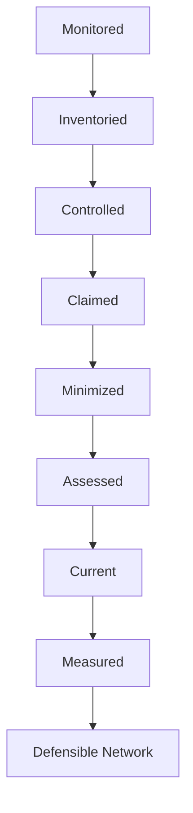
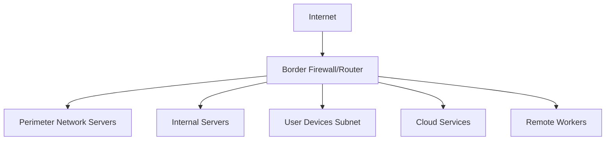
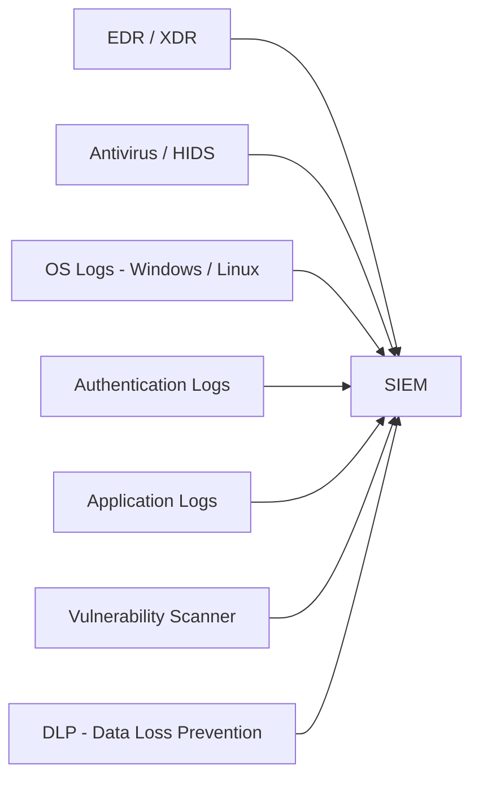
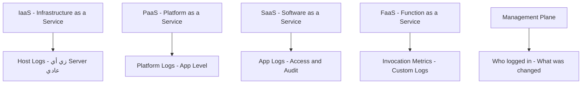
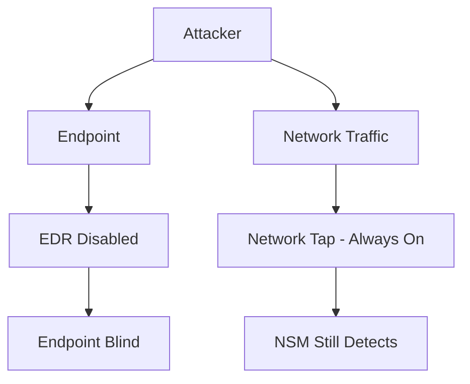
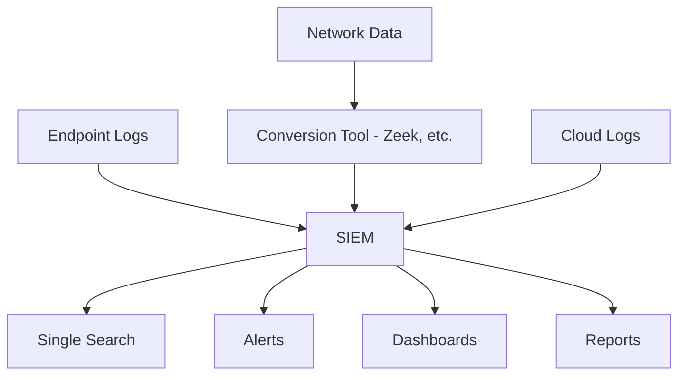
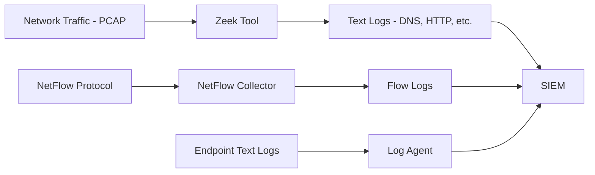

> **الهدف من الـ Section ده:**  
> هنتعلم إيه اللي بيخلي الـ Network قابلة للدفاع عنها، وإزاي نراقب كل حاجة بتحصل فيها — سواء على مستوى الـ Network نفسها أو على مستوى الـ Endpoints والـ Cloud. في الآخر هتعرف إيه البيانات اللي محتاج تجمعها وإزاي توصّلها لمكان واحد في الـ SIEM.

---

## Table of Contents
- [Introduction](#introduction)
- [What is a Defensible Network](#what-is-a-defensible-network)
- [The 8 Properties of a Defensible Network](#the-8-properties-of-a-defensible-network)
- [Two Sides of Monitoring](#two-sides-of-monitoring)
- [Network Security Monitoring NSM](#network-security-monitoring-nsm)
- [Where Are We Monitoring](#where-are-we-monitoring)
- [Endpoint and Application Monitoring CSM](#endpoint-and-application-monitoring-csm)
- [Cloud Monitoring](#cloud-monitoring)
- [Network vs Endpoint Data - Do You Need Both](#network-vs-endpoint-data---do-you-need-both)
- [Monitoring Data Sources Overview](#monitoring-data-sources-overview)
- [Data Centralization and the SIEM](#data-centralization-and-the-siem)
- [How Data Gets to the SIEM](#how-data-gets-to-the-siem)
- [Summary](#summary)

---

## Introduction

لما بنتكلم عن الـ Cybersecurity، أول سؤال بيتطرح دايمًا هو: **"هل نتورك الشركة دي قابلة للدفاع عنها أصلًا؟"**

مش كل الـ Networks زي بعض. في Networks بتخلي المهاجم يعمل اللي هو عايزه من غير ما حد يحس بيه. وفي Networks مبنية بشكل صح، ممكن نكتشف أي هجوم بسرعة ونتصرف.

الـ Section ده بيجاوب على سؤال مهم جدًا:
> **"إيه اللي محتاج يبقى موجود في الـ Network عشان أقدر أدافع عنها فعلًا؟"**

---

## What is a Defensible Network

الـ **Defensible Network** هي الـ Network اللي بتتيح لفريق الأمان إنه يشوف اللي بيحصل، يفهمه، ويتصرف عليه في الوقت المناسب.

المفهوم ده اتعرّفه الـ Expert **Richard Bejtlich** في مقاله الشهير عام 2008، وللعجب المحتوى لسه شغال تمامًا لحد دلوقتي.

الفكرة الأساسية هي إن الـ Network اللي ملهاش **Visibility** ملهاش **Defense**.

> [!IMPORTANT]
> لو مش شايف اللي بيحصل في الـ Network، مش هتقدر تدافع عنها. الـ Visibility هي الأساس.

---

## The 8 Properties of a Defensible Network

Richard Bejtlich حدد **8 خصائص** لازم تكون موجودة في أي Network عشان تبقى Defensible. خليني أشرحهم بالترتيب:

### 1. Monitored (المراقبة)

الخاصية الأولى والأهم. لازم تبقى شايف الـ Traffic اللي بيعدي في الـ Network، وتجمع اللوجز من كل حتة.

- ابدأ بأبسط حاجة: **Session Data** (مين اتكلم مع مين)
- لو عندك إمكانية: اجمع **Full Content Data**
- كمان: **Statistical Data** زي الـ NetFlow

### 2. Inventoried (الجرد)

لازم تعرف كل device موجودة في الـ Network:

- إيه أسماء الأجهزة؟
- إيه الـ Software اللي عليها؟
- إيه الـ Services اللي بتشتغل؟

مش هتقدر تحمي حاجة مش عارفها.

### 3. Controlled (التحكم)

بعد ما عرفت الـ Network، تبدأ تحكم في الـ Traffic:

- **Ingress Filtering**: التحكم في اللي بيدخل
- **Egress Filtering**: التحكم في اللي بيطلع
- **Network Access Control**: مين يقدر يوصل لإيه

### 4. Claimed (الملكية)

كل Asset لازم يكون ليه صاحب. لازم تعرف:

- مين المسؤول عن كل Server؟
- مين بيدير كل Service؟
- ده ضروري جدًا وقت الـ Incident Response

### 5. Minimized (التقليل)

قلل الـ Attack Surface قدر الإمكان:

- وقف الـ Services اللي مش محتاجها
- امسح الـ Software الزيادة
- اقفل الـ Ports اللي مش بتستخدمها

### 6. Assessed (التقييم)

اعمل **Vulnerability Assessment** بانتظام:

- اكتشف الضعف قبل المهاجم
- اعمل **Adversary Simulation** (Pen Testing)
- قيّم الـ Defenses بشكل مستمر

### 7. Current (التحديث)

خلي كل حاجة محدّثة:

- الـ Operating Systems
- الـ Applications
- الـ Firmware للأجهزة

### 8. Measured (القياس)

قيس تقدمك:

- هل الـ Security بتتحسن؟
- هل الـ Controls بتشتغل؟
- عمل Feedback Loop مستمر

---

### Diagram: خصائص الـ Defensible Network

---

## Two Sides of Monitoring

الـ Monitoring بتتقسم لقسمين رئيسيين:

| النوع | الاسم | المعنى |
|-------|-------|---------|
| الأول | Network Monitoring (NSM) | مراقبة الـ Traffic اللي بيعدي على الـ Network |
| الثاني | Endpoint/App Monitoring (CSM) | مراقبة اللي بيحصل جوه الأجهزة والتطبيقات |

> [!NOTE]
> الفرق مش دايمًا واضح 100%. مثلًا الـ DNS اللي شغال على السحابة هو Application ولكن بيعمل Network Protocol. المهم إنك تجمع اللوج مش إنك تصنّفه صح.

---

## Network Security Monitoring NSM

الـ **NSM** هو مراقبة وتحليل الـ Network Traffic عشان تكتشف أي نشاط مشبوه.

### إيه اللي بنراقبه؟

- **Data in Motion**: البيانات اللي بتتنقل على الـ Network
- الـ Services زي: DNS, HTTP/HTTPS, SMB, RDP, FTP, SSH
- سلوك المهاجمين زي:
  - **Exploit Delivery**: إرسال استغلالات
  - **Suspicious File Transfers**: ملفات مشبوهة
  - **Internal Recon and Pivoting**: استكشاف داخلي
  - **C2 Traffic**: اتصالات Command and Control
  - **Data Exfiltration**: سرقة البيانات

### ليه الـ NSM مهم؟

لو مش شايف الـ Network Traffic، المهاجم ممكن يعمل كل ده من غير ما حد يحس بيه.

> [!WARNING]
> بدون الـ NSM، الـ Attacker ممكن يكون موجود في الـ Network لأشهر قبل ما حد يلاقيه.

---

## Where Are We Monitoring

### الصورة الكاملة للـ Network

### نراقب فين بالظبط؟

| المنطقة | كيفية المراقبة |
|---------|----------------|
| Perimeter Network | Firewall Logs, IDS/IPS |
| Internal Servers | Host Logs, EDR, Application Logs |
| User Subnets | Network Taps, Mirror Ports, Host Firewalls |
| Cloud Services | VPC Flow Logs, Cloud Provider Logs |
| Remote Workers | VPN Logs, EDR Agents, Cloud Proxies |

> [!TIP]
> الـ EDR زي Sysmon مجاني وبيسجل معلومات شبكية على الـ Endpoint نفسه — ده مفيد جدًا للـ Remote Workers.

---

## Endpoint and Application Monitoring CSM

الـ **CSM** (Continuous Security Monitoring) هو مراقبة الـ Endpoints والتطبيقات بشكل مستمر.

### إيه اللي بنراقبه في الـ Endpoint؟

- **Running Processes**: إيه البروسيسات الشغالة؟
- **Command Line Arguments**: إيه الأوامر اللي اتنفذت؟
- **Autorun Items**: إيه اللي بيشتغل تلقائيًا؟
- **Installed Programs**: إيه البرامج المثبتة؟
- **File/Registry Changes**: هل في تعديلات غير متوقعة؟
- **Login Activity**: مين دخل إمتى وإزاي؟
- **Running Scripts**: إيه السكريبتات اللي اتشغّلت؟

### مصادر بيانات الـ Endpoint

### CSM vs NSM

| | NSM | CSM |
|-|-----|-----|
| البيانات | Data in Motion | Data at Rest |
| مين بيجمعها | Network Sensors | Host Agents |
| الأمثلة | Zeek, NetFlow, PCAP | EDR, Sysmon, Windows Logs |
| الميزة | شايف الـ Traffic | شايف تفاصيل أعمق |

---

## Cloud Monitoring

الـ Cloud جزء مهم من الـ Network الحديثة، ومراقبته بتختلف حسب نوع الخدمة.

### أنواع الـ Cloud Services وطريقة مراقبتها

### تفاصيل كل نوع

#### IaaS (مثال: AWS EC2, Azure VM)
- زي ما عندك Server عادي
- تقدر تثبت EDR Agent عليه
- AWS بتقدم **CloudWatch** لجمع اللوجز تلقائيًا

#### PaaS (مثال: AWS RDS, Azure SQL)
- مش بتقدر توصل للـ OS
- بتراقب على مستوى الـ Application فقط
- جمع Database Logs و Access Logs

#### SaaS (مثال: Microsoft 365, Salesforce)
- مش بتتحكم في الـ Infrastructure خالص
- بتراقب: مين بيدخل؟ بيعمل إيه؟
- **المشكلة**: الـ Vendor هو اللي بيقرر يديك اللوجز دي ولا لأ

#### FaaS (مثال: AWS Lambda)
- **Serverless** — مش عندك Server أصلًا
- بتراقب: عدد الاستدعاءات (Invocations) والـ Output

#### Management Plane
- دايمًا راقب مين بيعمل Login على حساب الـ Cloud
- مين بيعمل New Instances؟
- مين بيعمل Delete؟

> [!WARNING]
> لو Credentials اتسرقت وحد دخل على حسابك في الـ Cloud من غير ما تراقب الـ Management Plane، ممكن يعمل GPU Instances غالية للـ Crypto Mining وأنت مش عارف!

---

## Network vs Endpoint Data - Do You Need Both

### السؤال الشائع

> "لو عندي NSM كويس، محتاج CSM؟ والعكس؟"

الإجابة القصيرة: **محتاج الاتنين**.

### سيناريو 1 — اتاجهت بـ Malware File

- عندك Network Data بس
- شفت إن الجهاز نزّل ملف اسمه `calc.exe`
- مش عارف إيه اللي الملف ده عمله
- محتاج تعمل Sandbox Analysis — بياخد وقت!

لو عندك **Endpoint Data**:
- تشوف الـ Process Creation Logs على طول
- تشوف `calc.exe` عمل Service جديد، عدّل Registry، اتصل بـ IP معين
- **أسرع بكتير**

### سيناريو 2 — الـ EDR اتعطّل

- المهاجم عمل Phishing ووصل للجهاز
- عطّل الـ EDR و Logging
- **الـ Endpoint Data مش موثوق فيها بعد كده!**

لو عندك **Network Data من Network Tap**:
- الـ Tap ده hardware لا يمكن إطفاؤه بـ Software
- لسه شايف الـ Traffic اللي بيدخل ويطلع من الجهاز
- **Backup Method للكشف**

> [!IMPORTANT]
> الـ Endpoints مش موثوق فيها دايمًا لأنها ممكن تتاخد. الـ Network Tap جهاز Hardware مش ممكن يتعطّل بـ Software.

---

## Monitoring Data Sources Overview

### مصادر الـ NSM Data

| المصدر | إيه بيقدمه |
|--------|-----------|
| Network Extraction (Zeek) | Application Layer Metadata |
| NetFlow (من Routers/Switches) | Session Data, IP, Port, Volume |
| Firewall Logs | Allow/Block Actions, Layer 7 Info |
| IDS/IPS/NDR Logs | Alert Names, Matched Rules |
| Proxy Logs | URLs, HTTP Methods, User |
| Service Logs (DNS, DHCP, SMTP) | Application Specific Data |

### مصادر الـ Endpoint Data

| المصدر | إيه بيقدمه |
|--------|-----------|
| Authentication Logs | Login Success/Fail, User, Source IP |
| Antivirus / EDR | Malware Detection, Process Trees |
| Process Creation Logs | Command Lines, Parent Process |
| Host Firewall Logs | Per-Process Network Connections |
| Application Logs | Access, Errors, Audit Trails |
| DLP Logs | File Movement, Data Access |
| Vulnerability Scanner | Known CVEs per Host |

---

## Data Centralization and the SIEM

### المشكلة بدون مركزة البيانات

تخيل إن عندك Alert على IP مشبوه. محتاج تفتح:
- IDS Console
- Firewall Console
- DNS Logs
- EDR Dashboard
- Proxy Logs
- ...

ده بياخد وقت ومجهود وممكن تفوت حاجة مهمة.

### الحل: الـ SIEM

الـ **SIEM** بيجمع كل البيانات دي في مكان واحد وبيديك:
- **Single Search Interface**: دور في كل البيانات بـ Query واحدة
- **Correlation Rules**: لو IP ظهر في الـ IDS والـ DNS مع بعض، عمل Alert
- **Visualizations**: Dashboards ومخططات

> [!TIP]
> الـ SIEM مش بيجمع بس — بيعمل **Correlation** يعني لو شاف نفس الـ IP في 3 مصادر مختلفة بيربطهم مع بعض ويطلع Alert أقوى.

---

## How Data Gets to the SIEM

### المشكلة

الـ SIEM بياخد **Logs** فقط (نصوص).  
لكن في أنواع بيانات مش نصية:
- **NetFlow**: بروتوكول شبكي ليه صيغته الخاصة
- **PCAP**: ملفات Packet Capture ثنائية (Binary)

### الحل

### طريقة وصول كل نوع بيانات للـ SIEM

| النوع | الطريقة |
|-------|---------|
| Windows Event Logs | Log Agent (Winlogbeat, NXLog, etc.) |
| Linux Syslog | Rsyslog/Syslog-ng يبعت للـ SIEM |
| Network Traffic | Zeek يحوّله لـ Logs |
| NetFlow | NetFlow Collector يحوّله |
| Cloud Logs | API Integration |

> [!NOTE]
> الـ Zeek هو "مفك" الـ Network Traffic — بياخد الـ PCAP الخام ويطلع لك Logs منظمة لكل Protocol زي DNS.log, HTTP.log, SSL.log إلخ.

---

## Summary

### أهم النقط

- الـ **Defensible Network** محتاجة 8 خصائص: Monitored, Inventoried, Controlled, Claimed, Minimized, Assessed, Current, Measured
- الـ **Monitoring** بتتقسم لـ NSM (Network) و CSM (Endpoint)
- الـ **NSM** بيراقب البيانات "في الحركة" — Data in Motion
- الـ **CSM** بيراقب البيانات "في السكون" — Data at Rest
- الـ **Cloud** عندها أنواع مختلفة: IaaS, PaaS, SaaS, FaaS, Management Plane
- محتاج **الاتنين** NSM و CSM — كل واحد بيكمّل التاني
- الـ **SIEM** هو مكان التجميع المركزي لكل البيانات
- الـ **Network Tap** أوثق من الـ Endpoint لأنه Hardware مش ممكن يتعطّل بـ Software

