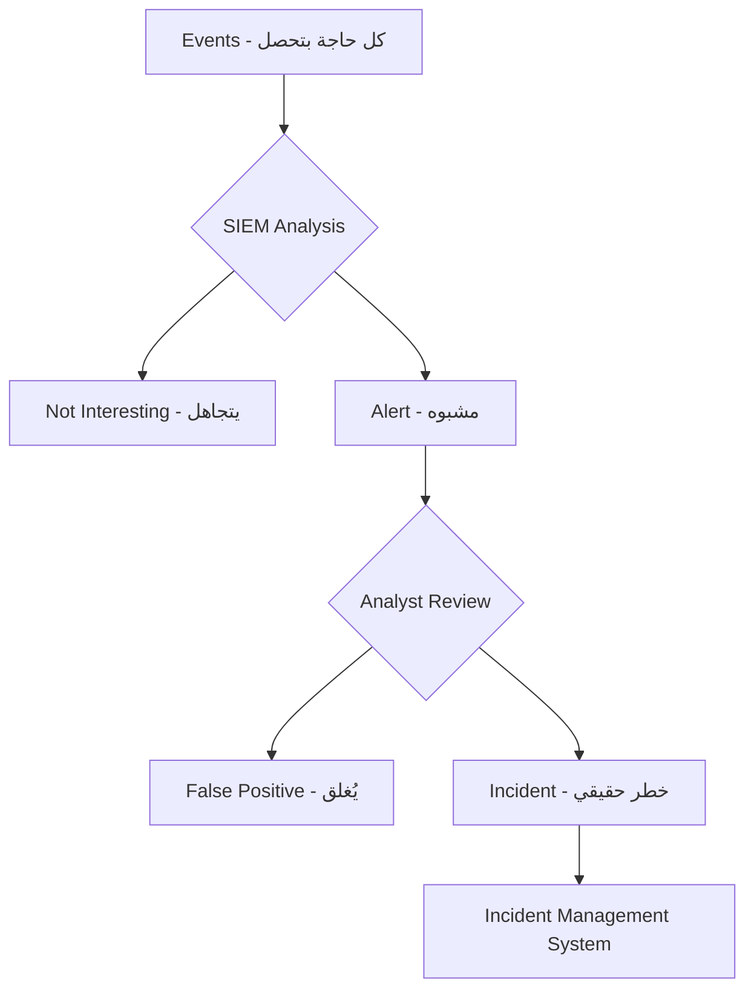
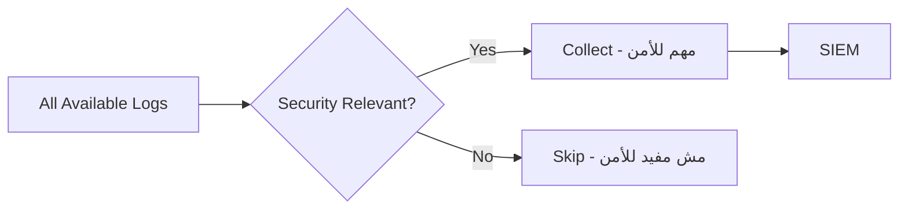
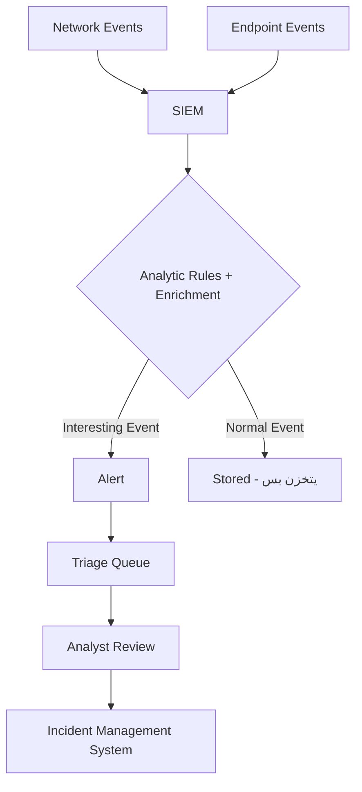
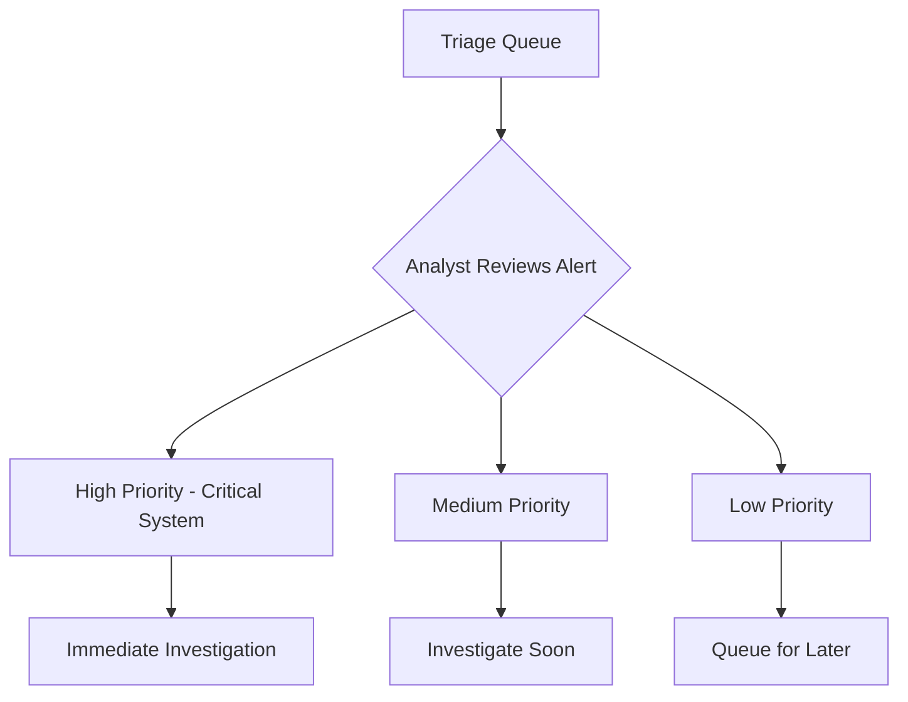
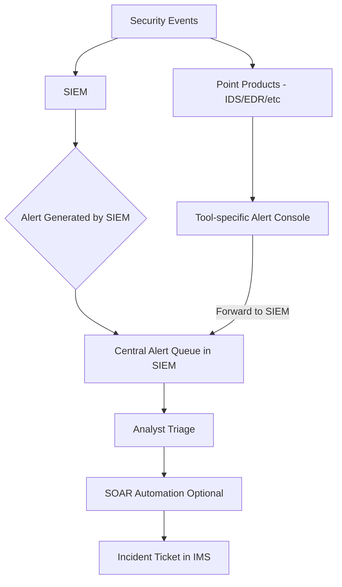
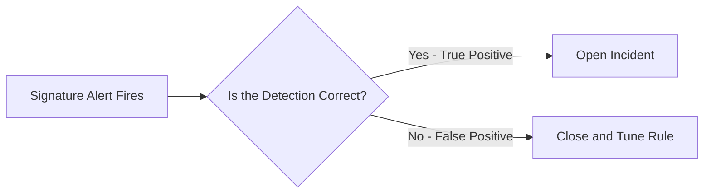
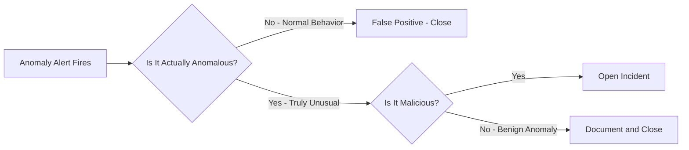
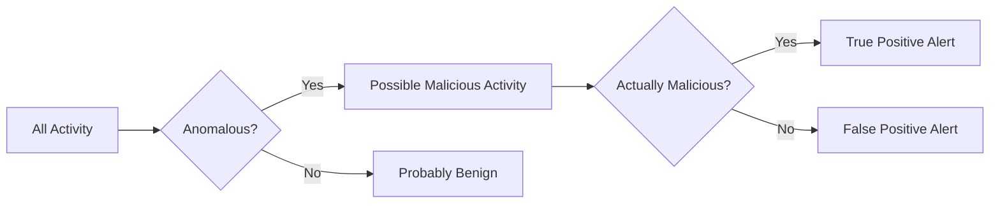
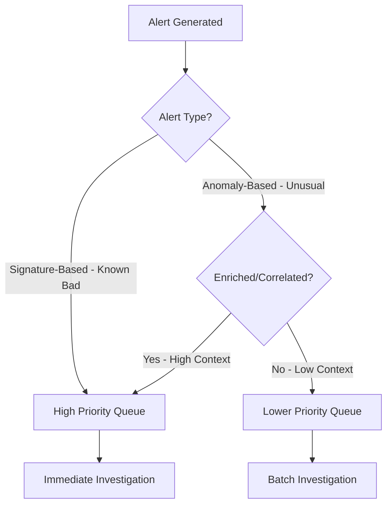

> **الهدف من الـ Section ده:**  
> هنتعلم الفرق بين الـ Event والـ Alert والـ Incident، وإزاي الـ Logs بتتحرك في الـ SOC من لحظة ما بتتسجل لحين ما تبقى Incident كاملة بنتعامل معها. هنفهم كمان الفرق الجوهري بين الـ Signature-based Alerts والـ Anomaly-based Alerts، وإزاي كل نوع بيأثر على شغل الـ Analyst.

---

## Table of Contents
- [Introduction](#introduction)
- [Events vs Alerts vs Incidents](#events-vs-alerts-vs-incidents)
- [Event Collection](#event-collection)
- [كام Log نجمع؟](#كام-log-نجمع)
- [Event Log Flow](#event-log-flow)
- [Alert Collection](#alert-collection)
- [Alert Triage](#alert-triage)
- [Alert Log Flow Options](#alert-log-flow-options)
- [Two Types of Alerts](#two-types-of-alerts)
- [Anomalies vs Signatures](#anomalies-vs-signatures)
- [Workflow Design](#workflow-design)
- [مثال عملي: IDS Rules](#مثال-عملي-ids-rules)
- [Summary](#summary)

---

## Introduction

في الـ SOC، الـ Analyst بيغرق في بحر من البيانات كل يوم. السؤال الأهم مش "هل في بيانات؟" — الإجابة دايماً أيوه. السؤال الحقيقي هو:

> **"من بين كل البيانات دي، إيه اللي يستاهل إن أنا أفتح فيه تحقيق؟"**

عشان تجاوب على السؤال ده صح، لازم تفهم التسلسل الهرمي الأساسي في الـ Security Operations:

```
Events  →  Alerts  →  Incidents
```

كل حاجة بتبدأ بـ **Event** عادي، وبعض الـ Events بتتحول لـ **Alert**، وبعض الـ Alerts اللي بيتأكد إنها خطيرة بتبقى **Incident**.

---

## Events vs Alerts vs Incidents

### ما هو الـ Event؟

الـ **Event** هو أي حاجة بتحصل في الـ Network أو الـ System ويتم تسجيلها. التعريف ده مفيهوش حكم — مش لازم تكون حاجة خطيرة.

**أمثلة على Events:**
- User عمل Login
- Browser فتح Website
- Service اتشغل على Server
- DNS Query اتبعت
- File اتفتح

> [!NOTE]
> الـ Event في حد ذاته مش بيقول إن فيه هجوم. هو بس بيقول "الحاجة دي حصلت." معظم الـ Events اللي بتتجمع في الـ SIEM هي حوادث عادية تماماً.

---

### ما هو الـ Alert؟

الـ **Alert** هو Event اتحدد إنه قد يكون مشبوه أو غير مرخص. لما الـ SIEM يلاقي Event بيطابق Rule معينة، بيرفعه لـ Alert.

**أمثلة على Alerts:**
- IDS اكتشف Malware Command and Control Traffic
- User حاول يتلوج من دولة مختلفة
- Port Scan اتعمل على Internal Server
- Firewall Blocked Connection على Port غريب

> [!IMPORTANT]
> الـ Alert مش بيعني أكيد في هجوم — ممكن يكون False Positive. دور الـ Analyst هو يحدد ده.

---

### ما هو الـ Incident؟

الـ **Incident** هو انتهاك فعلي أو تهديد وشيك لـ Security Policies. ده بيعني إن الـ Alert اتأكد وبقى في خطر حقيقي على الـ Confidentiality أو الـ Integrity أو الـ Availability.

**المصدر:** NIST SP800-61

**أمثلة على Incidents:**
- Malware اتثبت على Machine
- Data Breach حصلت
- Ransomware بدأ يشفر ملفات
- Attacker عنده Access على Domain Controller

---

### الفرق بين الثلاثة في جملة واحدة

| المصطلح | التعريف | مثال |
|---------|---------|------|
| **Event** | أي حاجة بتحصل وبتتسجل | User عمل Login |
| **Alert** | Event مشبوه بيحتاج تحقيق | Login من IP غريب |
| **Incident** | Alert اتأكد إنه هجوم حقيقي | Attacker داخل على الـ System |

---

### التسلسل من Event لـ Incident



---

## Event Collection

### الـ Logs هي سجلات الـ Events

معظم الـ Logs اللي بنجمعها هي Records لـ Events عادية. مثلاً:

**من Windows Sysmon:**
```
UtcTime: 2018-09-23 16:16:16.054
ProcessId: 8012
Image: C:\Users\user1\AppData\Local\slack\app-3.3.1\slack.exe
User: win10\user1
Protocol: tcp
SourceIp: 10.150.159.161
DestinationIp: 52.85.81.133
DestinationPort: 443
```

**من Linux Auth Log:**
```
Sep 23 08:54:56 ubuntu CRON[16355]: pam_unix(cron:session): session opened for user root
```

**من Apache Web Server:**
```
117.201.11.139 - - [02/Jan/2017:02:35:54 -0800] "GET / HTTP/1.1" 200 34374
```

الـ Logs دي في حد ذاتها مش بتقول "في هجوم". هي بس بتقول "حصل كذا."

> [!TIP]
> اللي بيخلي الـ Log مثيراً للاهتمام هو لما نعملها Correlation مع Logs تانية أو نطابقها على Threat Intelligence Lists في الـ SIEM.

---

### أنواع الـ Log Sources

**Network-based Sources:**
- Squid Proxy Logs
- Apache/NGINX Access Logs
- BIND DNS Query Logs
- Firewall Logs

**Endpoint-based Sources:**
- Windows Event Logs
- Sysmon Logs
- Linux Auth Logs
- Application Logs

---

## كام Log نجمع؟

### مشكلة "اجمع كل حاجة"

فيه إغراء إنك تقول "خليني أجمع كل الـ Logs عشان ميفوتنيش حاجة." المشكلة إن ده له تكلفة عالية:

| المشكلة | التأثير |
|---------|---------|
| أكتر Volume في الـ SIEM | أعلى تكلفة |
| أكتر Noise | صعوبة في إيجاد الـ Signal |
| Searches أبطأ | وقت تحقيق أطول |
| More False Positives | إرهاق الـ Analysts |

### الهدف: Security-Relevant Logs فقط



**Security-Relevant Log** هو أي Log ممكن يساعدك تكتشف هجوم.

> [!WARNING]
> معظم الـ Teams بتعمل غلطتين في نفس الوقت:
> - بتجمع **أكتر** مما محتاجة من Logs مش مفيدة للأمن
> - بتفوتها **Logs مهمة** زي Process Creation Logs أو PowerShell Logs

---

## Event Log Flow

### إزاي الـ Logs بتتحرك في الـ SOC؟



### الخطوات بالتفصيل:

**الخطوة 1 - Collection:**
الـ Logs بتتجمع من الـ Network Appliances والـ Endpoints وبتتبعت للـ SIEM.

**الخطوة 2 - SIEM Processing:**
الـ SIEM بيعمل:
- **Parsing:** بيفهم محتوى الـ Log
- **Enrichment:** بيضيف معلومات إضافية (IP Reputation, Domain Age, إلخ)
- **Rule Matching:** بيطابق الـ Log على Analytics Rules

**الخطوة 3 - Alert Generation:**
لو الـ Log طابق Rule، بيتحول لـ Alert ويروح لـ Triage Queue.

**الخطوة 4 - Analyst Triage:**
الـ Analyst بيراجع الـ Alert ويحدد: False Positive ولا Incident حقيقي؟

**الخطوة 5 - Incident Management:**
لو الـ Alert اتأكد، بيتحول لـ Incident ويتحط في الـ IMS زي TheHive.

---

## Alert Collection

### الفرق بين Event Log وAlert Log

مش كل الـ Logs بتمثل Events عادية. بعض الـ Logs اللي بيجوا من Security Tools بيمثلوا Alerts في حد ذاتها.

**مثال: Snort IDS Alert:**
```
12/12-06:22:52 [**] [1:2014126:1] ET CURRENT_EVENTS DRIVEBY
Blackhole Likely Flash Exploit Request /field.swf [**]
[Classification: A Network Trojan was Detected] [Priority: 1]
192.168.45.10:1046 -> 78.46.173.138:80
```

الـ Log ده مش بيقول "حصل Request" — هو بيقول "في Exploit Kit اتكشف!"

**مثال: Palo Alto Firewall Threat Log:**
```
THREAT,url,... 192.168.0.2 ... block-url,"onlinebrandsecuritys.com/install/ws.zip",malware-sites
```

ده بيقول "Blocked URL معروفة إنها Malware Site."

> [!IMPORTANT]
> الـ Alert Logs لازم تتعامل معاها بشكل مختلف في الـ SIEM. هي مش بس بيانات — هي إشارات تحتاج لـ Triage فوري.

---

### سؤال مهم: الـ Alerts تروح فين؟

فيه خيارات متعددة:

| الخيار | المزايا | العيوب |
|--------|---------|---------|
| Triage في الـ IDS Console نفسه | Interface متخصص | قوائم متعددة، صعب تحديد الأولوية |
| كل الـ Alerts في الـ SIEM | Context كامل، Queue واحدة | مفيش Custom Interface لكل Tool |
| SOAR Platform | Automation كامل | تعقيد أكبر |

**الأفضل في معظم الحالات:** جمع كل الـ Alerts في الـ SIEM عشان:
- Context من كل الـ Data Sources متاح في مكان واحد
- Queue واحدة بدل قوائم متعددة
- ممكن تعمل Correlation بين IDS Alert وEndpoint Event
- High-Fidelity Alerts ممكن تتحول لـ SOAR Automation

---

## Alert Triage

### الـ Triage Queue

كل الـ Alerts بتتجمع في قائمة للـ Triage. الـ Triage Queue المثالية بتوضح:
- شدة الـ Alert (Severity)
- المصدر
- كام مرة اتكرر
- أهمية الـ System المتأثر

### مفاتيح نجاح الـ Triage:

**1. Prioritization - تحديد الأولوية:**
الـ Analyst لازم يشتغل على الأخطر أولاً. المعايير:
- مدى تقدم الهجوم
- أهمية الـ System المستهدف
- نوع الـ Account المتأثر
- هل الهجوم يبان Targeted ولا Random؟

**2. Context:**
المعلومات الإضافية (User، IP Reputation، Asset Value) بتساعد في اتخاذ القرار بسرعة.

**3. Speed:**
الهجمات بتتحرك بسرعة. الـ Analyst لازم يتحرك بسرعة مساوية أو أسرع.



---

## Alert Log Flow Options



### المقارنة بين الخيارين:

**Option 1: Triage في كل Tool بشكل منفصل**

المزايا:
- كل Tool عنده Interface متخصص لـ Alert Type معينة
- PCAP Tool بيوريك محتوى الـ Packet مباشرة

العيوب:
- قوائم متعددة = صعوبة في تحديد الأولوية
- Context مفيش بين الـ Tools
- ممكن يفوتك اللي بيجمع Events من مصادر مختلفة

**Option 2: كل الـ Alerts في Queue واحدة في الـ SIEM**

المزايا:
- مكان واحد لكل شيء
- SIEM ممكن يعمل Correlation بين IDS Alert + Endpoint Event + Network Log
- Higher Fidelity Alerts
- تقدر تعمل SOAR Automation على كل حاجة

العيوب:
- الـ SIEM مش عنده نفس الـ Custom Interface زي كل Tool

> [!TIP]
> الحل الهجين: ابعت الـ Alerts للـ SIEM وضيف Links للـ Point Product Console. كده بتاخد أفضل الاتنين.

---

## Two Types of Alerts

### النوع الأول: Signature-Based Alerts (Known-Bad)

الـ **Signature-based Alert** بيتولد لما الـ SIEM أو الـ IDS يلاقي حاجة بتطابق Pattern معروف لهجوم.

**منطق الـ Signature:**
> "الـ Traffic ده شبه ملف Malware معروف / Domain خبيث / IP ظاهر في Threat Intel List"

**أمثلة:**
- Download لـ File بنفس Hash معروف لـ Malware
- Connection لـ Domain موجود في Threat Intel List
- Exploit Attempt معروف زي Log4j CVE-2021-44228

**كيف تتعامل مع Signature Alert:**


---

### النوع الثاني: Anomaly-Based Alerts

الـ **Anomaly-based Alert** مش بناءً على حاجة معروفة إنها خبيثة — هو بناءً على إن الحاجة دي **غير اعتيادية** في البيئة.

**منطق الـ Anomaly:**
> "الـ User ده عمر ما اتلوج من البلد دي قبل كده" أو "الـ Server ده بعت Outbound Traffic أكتر من المعتاد"

**أمثلة:**
- User اتلوج من Location جديدة
- Process شغالة على Port غير معتاد
- Upload Volume أكبر بكتير من المعتاد
- Login في وقت غير عادي (3 AM مثلاً)

**كيف تتعامل مع Anomaly Alert:**


الـ Anomaly Alert بيحتاج خطوتين للتحقق بدل خطوة واحدة!

---

### مقارنة بين النوعين

| الصفة | Signature-Based | Anomaly-Based |
|-------|----------------|---------------|
| **الأساس** | Known-Bad List | Deviation from Normal |
| **Fidelity** | عالي عادةً | منخفض عادةً |
| **False Positives** | أقل | أكتر |
| **يكتشف Zero-Days** | لا | ممكن |
| **خطوات التحقق** | خطوة واحدة | خطوتين |
| **الـ Tuning** | سهل | صعب |

> [!NOTE]
> الـ Anomaly-based Alerts رغم إن Fidelity-ها أقل، لكنها الوحيدة القادرة على كشف Zero-Day Attacks اللي مافيش Signature ليها.

---

## Anomalies vs Signatures

### الحقيقة الرياضية

```
كل الـ Malicious Activity → Anomalous (خروج عن المعتاد)
لكن مش كل Anomaly → Malicious
```

الـ Anomaly Detection بيعتمد على إن الأنشطة الخبيثة غالباً غير اعتيادية. مش دايماً صح، بس كأداة لتقليل الـ Noise هي معقولة.



### إزاي تحسّن الـ Anomaly Alert Fidelity?

**Enrichment:** أضف Context للـ Alert (User Role، Asset Criticality، إلخ)

**Correlation:** اربط الـ Anomaly بـ Events تانية من نفس الـ Host أو الـ User

**مثال:**
```
Anomaly فقط: Login من Paris لأول مرة → منخفض الأهمية
بعد Correlation: Login من Paris + Failed Login 50 مرة + Port Scan → عالي الأهمية جداً
```

---

## Workflow Design

### إزاي تصمم الـ Workflow بناءً على نوع الـ Alert؟



**القاعدة العامة:**
- **Signature Alerts** → أولوية عالية، هتشتغل عليها أول
- **Anomaly Alerts بـ Context عالي** → نفس أولوية الـ Signature
- **Anomaly Alerts بـ Context منخفض** → أولوية أقل، ممكن تتجمع وتتشتغل على دفعات

> [!WARNING]
> لو Anomaly Alerts كتير جداً بتضيع وقت الـ Analysts، ممكن تعمل ليها Queue منفصلة أو Threshold للتجميع. لكن متعطلهاش خالص — ممكن تفوتك Zero-Day Attack.

---

## مثال عملي: IDS Rules

### Snort Rules — أنهي نوع؟

| Rule Name | النوع | السبب |
|-----------|-------|-------|
| `ET EXPLOIT Apache log4j RCE (CVE-2021-44228)` | Signature | Exploit معروف وله CVE |
| `ET MALWARE Cobalt Strike C2 Response` | Signature | Malware معروف |
| `ET PHISHING ACH Transaction Phishing` | Signature | Pattern معروف للـ Phishing |
| `ET JA3 Hash - Suspected Cobalt Strike` | Signature | Hash معروف لـ C2 |
| `ET POLICY ZIPPED EXE in transit` | Anomaly | مش دايماً خبيث |
| `ET POLICY Wget User Agent` | Anomaly | مش دايماً خبيث |
| `ET POLICY TLS on Unusual Port` | Anomaly | Unusual لكن مش بالضرورة خبيث |
| `ET CHAT IRC JOIN command` | Anomaly | IRC مش خبيث في حد ذاته |
| `ET POLICY PDF with JavaScript` | Anomaly | Common في بعض الـ PDFs |

> [!TIP]
> الـ POLICY Alerts هي Anomaly Alerts. لما تيجي تشتغل على واحدة منها، فكر: "هل ده خروج عن المعتاد في بيئتنا؟ ولو أيوه، هل هو خبيث؟"

---

## Summary

### النقاط الأساسية

- **Event:** أي حاجة بتحصل وبتتسجل — بلا حكم
- **Alert:** Event لفت الانتباه لأنه مطابق لـ Rule أو شاذ
- **Incident:** Alert اتأكد إنه هجوم حقيقي بيأثر على الـ CIA Triad

- **الـ SIEM** هو مركز تجميع الـ Events وتحويلها لـ Alerts عبر الـ Analytic Rules والـ Enrichment

- **Signature Alerts:** Fidelity عالية، يشتغل عليها أولاً
- **Anomaly Alerts:** Fidelity أقل، محتاجة خطوتين للتحقق، لكن ضرورية لكشف Zero-Days

- الـ **Alert Queue الواحدة في الـ SIEM** أفضل من قوائم متعددة في كل Tool
