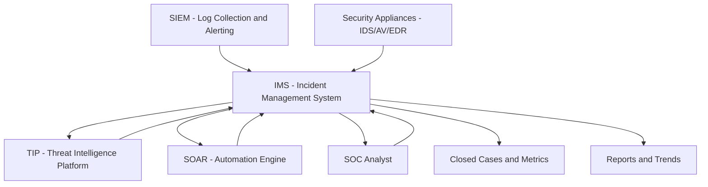
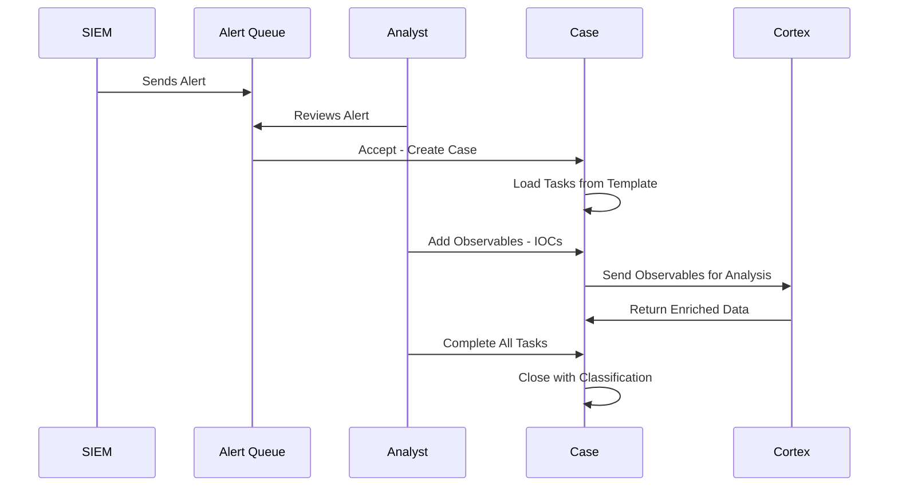
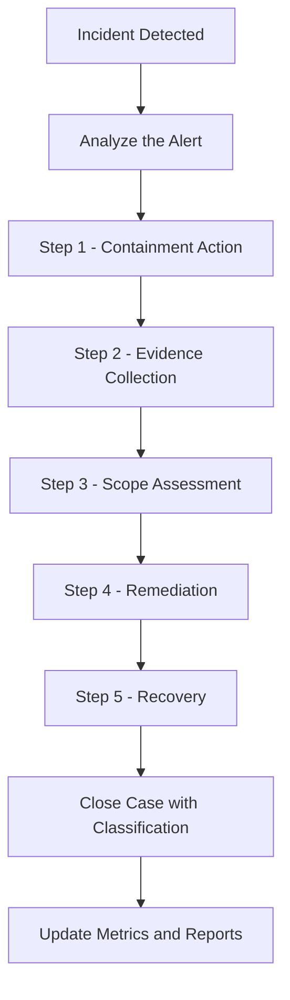
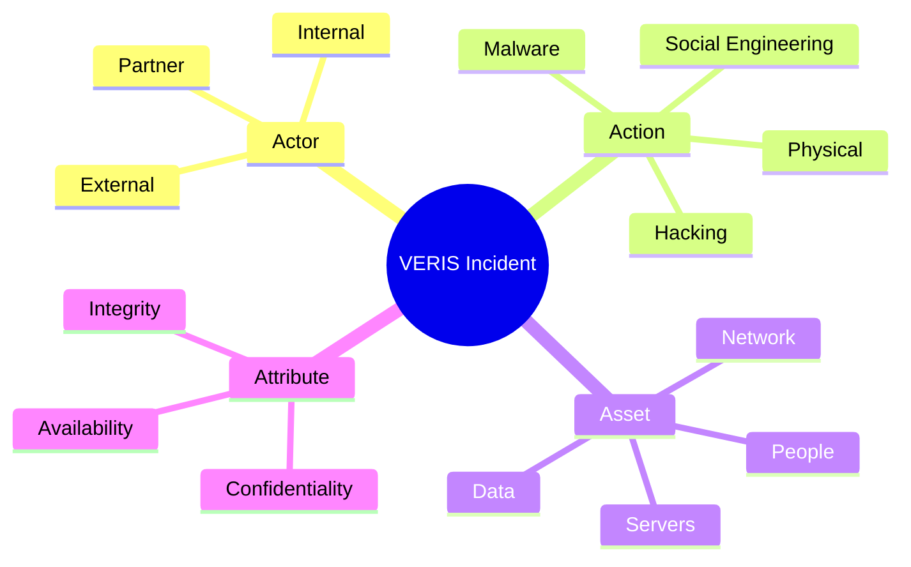

> **الهدف من الـ Section ده:**  
> هتفهم إيه هو الـ Incident Management System وليه هو من أهم الأدوات في الـ SOC، وهتعرف إزاي الـ Playbooks بتشتغل وإزاي تستخدم TheHive كـ IMS عملي.

---

## Table of Contents

- [Introduction](#introduction)
- [SOC Data Organization](#soc-data-organization)
- [Tools for SOC Data Organization](#tools-for-soc-data-organization)
- [Incident Management System IMS](#incident-management-system-ims)
- [IMS Systems View](#ims-systems-view)
- [IMS Features](#ims-features)
- [Playbooks](#playbooks)
- [Creating Successful Playbooks](#creating-successful-playbooks)
- [Incident Categorization Frameworks](#incident-categorization-frameworks)
- [VERIS Framework](#veris-framework)
- [US-CERT Categorization](#us-cert-categorization)
- [Tips for Successful Categorization](#tips-for-successful-categorization)
- [TheHive as IMS](#thehive-as-ims)
- [TheHive Workflow](#thehive-workflow)
- [TheHive Case and Task Assignment](#thehive-case-and-task-assignment)
- [TheHive Observable Entry](#thehive-observable-entry)
- [TheHive Case Closure](#thehive-case-closure)
- [Diagrams](#diagrams)
- [Comparison Tables](#comparison-tables)
- [Key Notes](#key-notes)
- [Summary](#summary)

---

## Introduction

الـ SOC مش بس ناس بيبصوا في Alerts، ده نظام متكامل من الأدوات اللي بتساعد في تنظيم، تتبع، وتحليل الـ Incidents.

في الـ Section ده هنتكلم عن **إزاي الـ SOC بيخزن ويدير البيانات**، وأهم الأدوات اللي بيستخدمها — وعلى رأسهم الـ **Incident Management System (IMS)**.

لو حصل Incident ومفيش نظام لتتبعه، هيضيع في الزحمة. الـ IMS هو الـ "دفتر" اللي بيتسجل فيه كل حاجة.

---

## SOC Data Organization

الـ SOC محتاج يحل **6 مشاكل أساسية** في تنظيم البيانات:

1. **Alert Queueing** — إزاي تصطف الـ Alerts وتتابع الـ Incidents الحالية
2. **Threat Intelligence** — جمع وتنظيم وتحديث معلومات التهديدات
3. **Log Management** — تخزين، عرض، ربط، بحث، وتنبيه على الـ Logs
4. **Automation** — أتمتة إجراءات التحقيق
5. **Code Repositories** — تخزين السكريبتات والـ Playbooks
6. **Unstructured Data Storage** — تخزين الوثائق والمعرفة العامة

> [!IMPORTANT]
> ده مش تقسيم نظري — كل نقطة فيهم بتتعمل بأداة مختلفة. لو أداة مش شغالة صح، الـ SOC كله بيعاني.

---

## Tools for SOC Data Organization

الـ SOC بيحتاج مجموعة أدوات متكاملة مع بعض:

| الأداة | الاسم الكامل | الوظيفة |
|--------|-------------|---------|
| **IMS / SIRP** | Incident Management System | تتبع الـ Incidents وإدارة الـ Cases |
| **TIP** | Threat Intelligence Platform | تخزين الـ IOCs ومعلومات التهديدات |
| **SIEM** | Security Information and Event Management | جمع الـ Logs والبحث فيها والتنبيه |
| **SOAR** | Security Orchestration, Automation and Response | أتمتة التحقيق والاستجابة |
| **Knowledge DB** | Knowledge Database / Repos | الوثائق والسكريبتات والـ Playbooks |

### إزاي الأدوات دي بتتكامل مع بعض؟

- الـ **SIEM** بيجمع الـ Logs ويولّد الـ Alerts
- الـ **IMS** بيستقبل الـ Alerts ويحوّلها لـ Cases
- الـ **TIP** بيخزن الـ IOCs المرتبطة بكل Case
- الـ **SOAR** بيأتمت الإجراءات المتكررة
- الـ **Knowledge DB** بيخزن كيفية الاستجابة لكل نوع من الـ Incidents

> [!NOTE]
> في الواقع كتير من الـ Vendors بيجمعوا أكتر من وظيفة في أداة واحدة. مثلاً Splunk SOAR بيدمج الـ SIEM والـ SOAR مع بعض.

---

## Incident Management System IMS

الـ **IMS** هو النظام اللي بيسجل فيه الـ Blue Team كل تفاصيل التحقيق والإجراءات اللي اتعملت أثناء الـ Incident.

### خيارات الـ IMS

عندك **3 خيارات أساسية**:

1. **Traditional Ticketing Solutions** — زي Help Desk Tickets (مش مثالي لكن بيشتغل)
2. **SIEM Built-in Solutions** — الـ SIEM نفسه بيتيح إدارة الـ Cases
3. **Security-Tailored IMS** — أدوات مصممة خصيصاً للـ Security Teams
   - **Commercial**: كتير متاح لكن اختار بعناية
   - **Open-source**: أقل خيارات لكن فيه حلول ممتازة زي **TheHive**

### ليه الاختيار ده مهم جداً؟

> [!WARNING]
> الـ Analysts هيستخدموا الـ IMS كل يوم ساعات طويلة. لو الـ Interface صعب أو بطيء، ده بيأثر على الـ Morale والكفاءة. اختبر الأداة كويس قبل ما تلتزم بيها!

**Commercial لازم يكون أحسن؟** لأ! في Paid Tools بـ Interface سيء وـ Open-source Tools ممتاز. الـ Interface والـ User Experience أهم من الـ Price Tag.

---

## IMS Systems View

إزاي الـ IMS بيتعامل مع البيانات:

**الـ Input:**
- Alert Logs من الـ SIEM مباشرة
- أو Alerts من Security Appliances

**الـ Process الداخلي:**
- الـ Alert بيتحوّل لـ **Case**
- الـ Case بيتضاف ليه **Tasks** (من الـ Playbook)
- الـ Analyst بيشتغل على الـ Tasks
- **Observables (IOCs)** بتتضاف للـ Case

**الـ Output:**
- **Closed Cases** مع تصنيفها
- **Metrics** عن نوع الـ Attacks والـ Response Time
- **IOCs** ترحل للـ TIP

---

## IMS Features

### الـ Features الأساسية اللي لازم تكون موجودة

**Features واضحة:**
- تتبع الـ Case Status
- إضافة Notes وتعليقات
- ربط الـ Cases بـ IOCs

**Features مش واضحة لكن مهمة جداً:**

| Feature | ليه مهم |
|---------|---------|
| **Playbook-oriented Workflow** | بيضمن ان كل Analyst بيعمل نفس الخطوات |
| **Automation Integration** | بيوفر وقت الـ Analyst في الإجراءات المتكررة |
| **Rich Text Notes** | Screenshots وتنسيق واضح في التقارير |
| **TIP Integration** | ربط الـ IOCs بالـ Case بشكل تلقائي |
| **Keyboard Navigation** | سرعة الكتابة بدون Mouse = وفر وقت كتير |
| **Built-in Knowledge Base** | المعلومات جنب الـ Analyst وهو بيشتغل |
| **Workflow Customization** | الأداة تتكيف مع العمليات مش العكس |
| **Mass Close/Open/Edit** | لو 100 Alert False Positive، تقفلهم بضغطة |

> [!TIP]
> الـ Keyboard Navigation تبدو تافهة لكن لو الـ Analyst بيفتح 50 Case في اليوم، الفرق بين Mouse وـ Keyboard ممكن يوفّر ساعة كاملة يومياً!

---

## Playbooks

### إيه هو الـ Playbook؟

الـ **Playbook** هو **مجموعة خطوات محددة ومرتبة** بيتبعها الـ Analyst لما يواجه نوع معين من الـ Incidents.

**مثال عملي — Playbook لـ Malicious Email Wave:**

```
[استقبال موجة إيميلات خبيثة]
          |
          v
[Block كل الـ URLs الموجودة في الإيميلات]
          |
          v
[فحص الـ Proxy Logs: مين ضغط على الـ Links؟]
          |
          v
[Reset كلمة السر للمتضررين]
          |
          v
[حذف الإيميلات من كل الـ Inboxes]
```

### ليه الـ Playbooks مهمة؟

1. **الاتساق** — كل Analyst بيستجيب بنفس الطريقة
2. **الاكتمال** — مش هتنسى خطوة مهمة
3. **التدريب** — Analyst جديد يقدر يشتغل بكفاءة من أول يوم
4. **القياس** — تقدر تعرف إيه الخطوات اللي بتاخد وقت

> [!NOTE]
> الـ Playbooks مش لازم تكون متطابقة لكل Incident. فيه Steps **إجبارية** وفيه **اختيارية** حسب الموقف.

---

## Creating Successful Playbooks

### الـ 5 خطوات لـ Playbook ناجح

**خطوة 1 — التخطيط الدقيق:**
- إيه اللي بتحاول تحققه؟
- إيه أسرع وأفضل طريقة؟

**خطوة 2 — اختيار وترتيب الخطوات:**
- ابدأ بالـ Containment قبل التحقيق
- مش كتير وكثيف جداً = مش قابل للتطبيق

**خطوة 3 — تصنيف الخطوات:**
- إجبارية (Mandatory) أو اختيارية (Optional)

**خطوة 4 — التنفيذ في الـ IMS أو SOAR:**
- حوّل الخطوات لـ Tasks داخل النظام

**خطوة 5 — المراجعة المستمرة:**
- الـ Playbook مش ثابت — لازم يتحدّث مع كل تعلّم جديد

> [!TIP]
> استخدم أداة زي **ATC RE&CT** من GitHub لتوليد أفكار للـ Response Actions.

---

## Incident Categorization Frameworks

لما بتغلق الـ Case، لازم تصنّفها. الـ **Categorization** بيساعد في:
- فهم أكثر أنواع الـ Attacks شيوعاً
- قياس أداء الـ SOC
- تبرير الميزانية والموارد

### خيارات الـ Frameworks

**Option 1 — VERIS:**
- تفصيلي جداً
- بيستخدمه الـ Verizon DBIR
- مناسب للـ Organizations الكبيرة

**Option 2 — US-CERT:**
- متوسط التفاصيل
- مناسب للـ Government والـ Enterprise
- بيستخدم الـ NCISS Score من 0 لـ 100

**Option 3 — Custom:**
- كتير من الشركات بتعمل Framework خاص بيها
- مرن لكن صعب المقارنة مع غيرك

> [!NOTE]
> مفيش Framework مثالي. الأفضل هو اللي فريقك هيستخدمه بانتظام وبدقة.

---

## VERIS Framework

الـ **VERIS (Vocabulary for Event Recording and Incident Sharing)** بيصنّف الـ Incident على **4 محاور (الـ 4 A's)**:

| المحور | السؤال | الأمثلة |
|--------|--------|---------|
| **Actor** | مين عمل الهجوم؟ | External, Internal, Partner |
| **Action** | إيه اللي عمله؟ | Malware, Hacking, Social, Physical |
| **Asset** | إيه اللي اتأثر؟ | Servers, People, Data, Network |
| **Attribute** | إزاي اتأثر؟ | Confidentiality, Integrity, Availability |

**مثال عملي:**
> موظف من داخل الشركة (Actor = Internal) سرب بيانات عملاء (Action = Misuse) من قاعدة بيانات (Asset = Data) وأثّر على السرية (Attribute = Confidentiality)

---

## US-CERT Categorization

الـ **NCISS (National Cyber Incident Scoring System)** بيديك **Score من 0 لـ 100** على أساس:

| الفئة | الأمثلة |
|-------|---------|
| **Functional Impact** | من "مفيش تأثير" لـ "فقدان التحكم الكامل" |
| **Information Impact** | من "مفيش تسريب" لـ "تدمير أنظمة حيوية" |
| **Recoverability** | من "تعافي عادي" لـ "غير قابل للتعافي" |
| **Attack Vectors** | Web, Phishing, External Media, Impersonation |
| **Actor Characterization** | مين الهاجم ومستواه |

**نتيجة الـ Score:**

| النطاق | المستوى |
|--------|---------|
| عالي جداً | Emergency |
| عالي | Severe / High |
| متوسط | Medium |
| منخفض | Low / Baseline |

---

## Tips for Successful Categorization

**ابدأ بالنهاية في ذهنك:**
- إيه الأسئلة اللي عايز تجاوب عليها بعد 6 شهور؟
- حوّل الأسئلة دي لـ Metrics قابلة للقياس

**أمثلة على Metrics مفيدة:**

| الهدف | الـ Metric |
|-------|-----------|
| معرفة أكثر Attack Vectors شيوعاً | تصنيف كل Case بـ Delivery Vector |
| قياس الضغط على الفريق | متوسط طول الـ Queue |
| تتبع الـ Phishing | عدد الإيميلات المبلّغة + المحجوبة + الـ Incidents |
| قياس سرعة الاستجابة | متوسط الـ Dwell Time |
| قياس تأثير الـ Incidents | عدد الـ Critical Incidents وتأثيرها |

> [!IMPORTANT]
> كل Metric لازم يكون ليه **Threshold للتصرف**. لو مش عارف هتعمل إيه لما الرقم يوصل لحد معين، يبقى الـ Metric ده مش مفيد.

---

## TheHive as IMS

الـ **TheHive** هو أداة IMS مفتوحة المصدر (Open-Source) بنستخدمها في الـ Course ده.

### المكونات الأساسية في TheHive

| المكون | الوصف |
|--------|-------|
| **Alert** | تنبيه قادم من الـ SIEM |
| **Case** | الـ Incident اللي بنشتغل عليه |
| **Case Template** | الـ Playbook المحدد مسبقاً |
| **Task** | خطوة واحدة من الـ Playbook |
| **Worklog** | النوتس والملاحظات على كل Task |
| **Observable** | IOC مرتبط بالـ Case (IP, Domain, Hash) |
| **Cortex** | محرك الأتمتة اللي بيـ Enrich الـ Observables |

> [!NOTE]
> الـ TheHive بيتكامل مع الـ MISP (Threat Intelligence Platform) تلقائياً، فالـ IOCs بتتبادل بين الأداتين.

---

## TheHive Workflow

إزاي الـ TheHive بيشتغل خطوة بخطوة:

1. الـ **SIEM** بيبعت **Alert** للـ TheHive
2. الـ Alert بيظهر في **Alert Queue**
3. الـ Analyst بيقرر:
   - **رفضه** = False Positive
   - **قبوله** = بيتحوّل لـ **Case**
4. الـ Case بيتملى بـ **Tasks** من الـ Case Template (Playbook)
5. الـ Analyst بيشتغل على الـ Tasks الواحدة تلو التانية
6. لكل Task فيه **Worklog** للملاحظات
7. **Observables (IOCs)** بتتضاف للـ Case
8. الـ **Cortex** بيـ Analyze الـ Observables ويضيف Context
9. لما كل الـ Tasks الإجبارية تتعمل، الـ Case بيتقفل

---

## TheHive Case and Task Assignment

### الفرق بين الـ IMS التقليدي والـ TheHive

في معظم الـ IMS Tools، الـ Case كله بيتعمله Assign لشخص واحد. لو الـ Case معقد، الشخص ده هيتعلق.

في الـ **TheHive**، ممكن تعمل Assign لكل Task لشخص مختلف:

```
Case (بتاعت Analyst 1)
├── Task 1 → Analyst 1 (سهل)
├── Task 2 → Analyst 2 (معقد - Malware Analysis)
├── Task 3 → Analyst 1
├── Task 4 → Analyst 1
├── Task 5 → Analyst 1
└── Task 6 → Analyst 2 (Memory Forensics)
```

**الفايدة:**
- الـ Analyst الجديد يقدر يشتغل بكفاءة وييجي الـ Senior للـ Tasks المعقدة
- **Load Balancing** أفضل
- تبديل الشيفتات أسهل
- الـ Analyst الجديد بيتعلم من الـ Worklogs بتاعة الـ Senior

> [!TIP]
> الـ Tierless SOC بيستفيد أكتر من الـ Task-level Assignment لأنه بيخلي الجميع يقدر يتعاون على نفس الـ Incident.

---

## TheHive Observable Entry

الـ **Observable** هو أي IOC أو بيانات متعلقة بالـ Case زي:
- IP Address
- Domain Name
- URL
- File Hash (MD5, SHA256)
- Email Address
- Username

**الـ "is IOC" Flag:**
- لو الـ Observable ده فعلاً تم رؤيته في البيئة = **IOC**
- لو هو بس بيانات مرتبطة بالتحقيق = Observable عادي

**الـ "Has Been Sighted" Checkbox:**
- لو الـ IOC ده اتشاف فعلاً في الـ Organization = نشيّل عليه

الـ **Cortex** بعدين بياخد الـ Observables دي ويـ Enrich بيها من مصادر زي:
- VirusTotal
- Shodan
- Passive DNS
- MaxMind GeoIP

---

## TheHive Case Closure

لما تخلص كل الـ Tasks الإجبارية، بتقفل الـ Case بالمعلومات دي:

1. **True / False Positive** — هل كان هجوم حقيقي؟
2. **Categories** — تصنيف نوع الـ Incident
3. **Summary** — ملخص ما حصل وإزاي اتحل

**معلومات مهمة في الـ Summary:**
- Delivery Vector (إزاي وصل الهجوم؟)
- Detection Method (إزاي اكتشفناه؟)
- Impact (إيه اللي اتأثر؟)
- Systems Affected (إيه الأنظمة اللي اتأثرت؟)

> [!IMPORTANT]
> الـ Case Closure مش مجرد إغلاق Ticket — ده **بيانات** بتتراكم مع الوقت وبتديك فهم عميق لطبيعة الهجمات اللي بيواجهها الـ Organization.

---

## Diagrams

### الـ IMS في سياق الـ SOC Tools



---

### TheHive Workflow



---

### الـ Playbook Flow



---

### الـ VERIS 4 A's



---

## Comparison Tables

### مقارنة بين خيارات الـ IMS

| النوع | المميزات | العيوب | مثال |
|-------|---------|--------|------|
| **Traditional Ticketing** | موجود بالفعل في الشركة | مش مصمم لـ Security | ServiceNow, Jira |
| **SIEM Built-in** | تكامل مباشر مع الـ SIEM | محدود الـ Features | Splunk ES Cases |
| **Security-Tailored IMS** | مصمم للـ SOC تحديداً | تكلفة أو تعقيد في الإعداد | TheHive, XSOAR |

---

### مقارنة VERIS vs US-CERT

| المعيار | VERIS | US-CERT |
|---------|-------|---------|
| **مستوى التفاصيل** | عالي جداً | متوسط |
| **سهولة الاستخدام** | صعب - خيارات كتير | أسهل |
| **المناسب لـ** | Enterprise, Research | Government, Enterprise |
| **النتيجة النهائية** | تصنيف تفصيلي | Score من 0 لـ 100 |
| **المرجع** | Verizon DBIR | NIST SP800-61 |

---

### أنواع الـ Observables في TheHive

| النوع | المثال | الاستخدام |
|-------|--------|-----------|
| **IP Address** | 192.168.1.1 | ربط بـ C2 Server |
| **Domain** | evil-domain.com | تتبع الـ Phishing |
| **URL** | http://evil.com/malware | الـ Delivery Vector |
| **Hash MD5/SHA256** | d41d8cd... | تعريف الـ Malware |
| **Email** | attacker@evil.com | الـ Phishing Source |
| **Filename** | invoice.exe | اسم الـ Malware |
| **Username** | compromised_user | الـ Account المتأثرة |

---

## Key Notes

> [!IMPORTANT]
> اختيار الـ IMS هو **من أهم القرارات** اللي بيأثر على الـ SOC. الـ Analysts هيستخدموه كل يوم. اختار بعناية واختبره كويس قبل الإلتزام.

> [!WARNING]
> لو الـ IMS مفيهوش **TIP Integration**، ربط الـ IOCs بالـ Cases هيبقى عملية يدوية مؤلمة. ده Feature إجباري.

> [!NOTE]
> الـ Playbooks مش ثابتة — لازم تتراجع وتتحدّث بانتظام. Playbook من 2 سنة ممكن يكون Outdated وما بيتعامل مع Tactics جديدة.

> [!TIP]
> لما بتختار Framework للـ Categorization، ابدأ بالأسئلة اللي عايز تجاوب عليها. لو عايز تعرف "إيه أكتر Delivery Vector؟" — يبقى لازم تصنّف الـ Vector في كل Case.

> [!IMPORTANT]
> الـ Cortex في TheHive هو محرك الـ Automation — بيـ Enrich الـ Observables تلقائياً من VirusTotal وغيره. ده بيوفر وقت هائل على الـ Analyst.

---

## Summary 

### النقاط الأساسية

- الـ SOC محتاج **6 أنواع من تنظيم البيانات** — من Alert Queueing لـ Unstructured Storage
- الأدوات الأساسية هي: **IMS, TIP, SIEM, SOAR, Knowledge DB**
- الـ **IMS** هو القلب اللي بيتسجل فيه كل تفاصيل التحقيق
- الـ **Playbook** هو خطوات منظمة للاستجابة لكل نوع من الـ Incidents
- الـ **Categorization** مهم لقياس الأداء وتحسينه
- الـ **TheHive** بيسمح بـ Task-level Assignment مما يسهّل التعاون
- الـ **Observables** هي الـ IOCs المرتبطة بكل Case
- الـ **Cortex** بيـ Enrich الـ Observables تلقائياً
- الـ **Case Closure** بيولّد **Metrics** قيّمة للـ SOC

