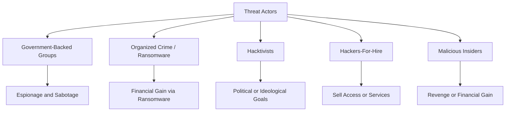
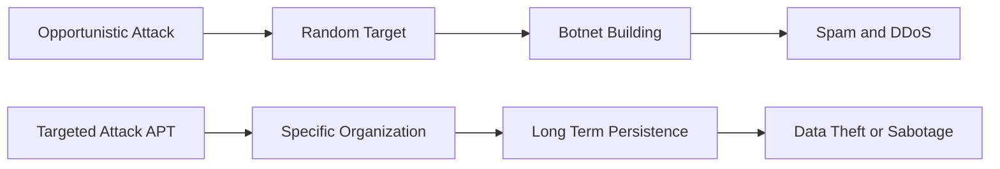
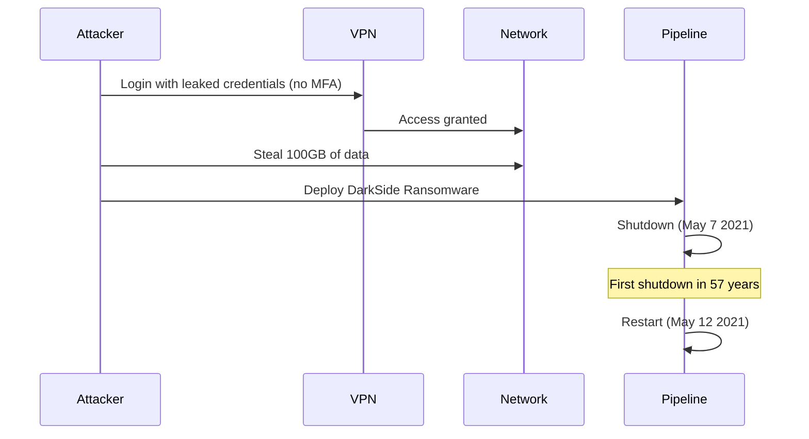
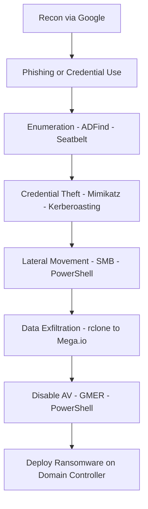

> **الهدف من الـ Section ده:**  
> هنتعلم مين اللي بيهاجمنا، ليه بيهاجمنا، وإزاي — عشان نعرف نبني دفاع صح ضد كل نوع من المهاجمين.
---

## Table of Contents
- [Introduction](#introduction)
- [Who Is Attacking Us](#who-is-attacking-us)
- [Government-Backed Groups](#government-backed-groups)
- [Ransomware and Organized Crime](#ransomware-and-organized-crime)
- [Hacktivism](#hacktivism)
- [Hackers-For-Hire and Malicious Insiders](#hackers-for-hire-and-malicious-insiders)
- [Two Types of Attacks: Targeted vs Opportunistic](#two-types-of-attacks-targeted-vs-opportunistic)
- [Know Your Enemy: Opportunistic Attackers](#know-your-enemy-opportunistic-attackers)
- [Know Your Enemy: Targeted Attackers (APTs)](#know-your-enemy-targeted-attackers-apts)
- [Attack Group Naming Conventions](#attack-group-naming-conventions)
- [Case Study: Mirai Botnet](#case-study-mirai-botnet)
- [Case Study: Colonial Pipeline Attack](#case-study-colonial-pipeline-attack)
- [Case Study: Conti Ransomware Playbook](#case-study-conti-ransomware-playbook)
- [Case Study: SolarWinds 2020](#case-study-solarwinds-2020)
- [Diagrams](#diagrams)
- [Comparison Tables](#comparison-tables)
- [Key Notes](#key-notes)
- [Summary](#summary)

---

## Introduction

زي ما Sun Tzu قال في كتابه "فن الحرب":

> "إذا عرفت عدوك وعرفت نفسك، فلن تخشى نتيجة مئة معركة."

ده الكلام ده مش بس فلسفة — ده أساس الـ Cyber Defense. مش ممكن تدافع عن حاجة من غير ما تعرف مين اللي بيهاجمها وإزاي.

في الـ SOC، الـ Analyst محتاج يفهم:
- **مين** هو الـ Threat Actor
- **ليه** بيهاجم (الـ Motivation)
- **إزاي** بيهاجم (الـ TTPs — Tactics, Techniques, and Procedures)

---

## Who Is Attacking Us

في عالم الـ Cybersecurity، مش في مهاجم واحد — في أنواع مختلفة جداً من الـ Threat Actors، وكل نوع عنده أسلوب وهدف مختلف.

### الأنواع الرئيسية:

1. **Government-Backed Groups** (دول وحكومات)
2. **Ransomware / Organized Crime** (عصابات منظمة)
3. **Hacktivists** (ناشطين سياسيين أو أيديولوجيين)
4. **Hackers-For-Hire** (مأجورين)
5. **Malicious Insiders** (موظفين بداخل الشركة)

---

## Government-Backed Groups

### إيه هم؟

دول زي روسيا، الصين، إيران، كوريا الشمالية، أمريكا، وغيرها بتموّل مجموعات هاكرز متخصصة جداً عشان تنفذ عمليات تجسس أو تخريب.

### خصائصهم:

- **الأكثر تعقيداً وخطورة** من ناحية الـ Capabilities
- بيستخدموا **Zero-Day Exploits** — ثغرات مجهولة حتى للشركات اللي بتصنع البرامج
- بيستخدموا **Rootkits** عشان يخبوا نفسهم
- هدفهم: **تجسس طويل المدى** أو **تعطيل البنية التحتية**

### مثال تاريخي:

- **APT1 Report (2012)**: كان أول تقرير رسمي ربط مجموعة هاكرز صينية (Unit 61398) بعمليات تجسس منظمة ضد شركات أمريكية.

> [!IMPORTANT]
> الـ Government-Backed Groups مش بالضرورة هتشوفها كتير، لكن لما تيجي، بتكون خطيرة جداً وصعبة الاكتشاف.

---

## Ransomware and Organized Crime

### إيه هم؟

عصابات جرائم منظمة هدفها الأساسي **المال**. بتستخدم الـ Ransomware كأداة ابتزاز.

### تكتيك "Double Extortion":

1. بيسرقوا البيانات الأول
2. بعدين بيشفروا الأنظمة
3. بيطلبوا فلوس عشان يفكوا التشفير
4. لو مرفضتش تدفع، بيهددوا إنهم ينشروا البيانات للعموم

### أمثلة على المجموعات:

| المجموعة | ملاحظة |
|----------|---------|
| **REvil** | تم اعتقال بعض أعضائها في روسيا (يناير 2022) |
| **Conti** | سرّب أحد المنتسبين الـ Playbook كامل (2021) |
| **DarkSide** | المسؤول عن هجوم Colonial Pipeline |
| **CLOP** | معروفة بـ Supply Chain Attacks |
| **Magecart** | متخصصة في سرقة بيانات Credit Cards |

---

## Hacktivism

### إيه هم؟

ناشطين بيستخدموا الـ Hacking كوسيلة للتعبير عن موقف سياسي أو أيديولوجي.

### أهدافهم الشائعة:

- **DDoS** — إيقاف خدمة مؤسسة معينة
- **Site Defacement** — تغيير الموقع الرسمي لشركة أو حكومة
- **Data Theft and Release** — سرقة ونشر بيانات سرية للعموم
- **Doxing** — نشر معلومات شخصية عن أفراد
- **Reputation Damage** — الإضرار بسمعة مؤسسة

### أمثلة:

- **Anonymous**: مجموعة مشهورة، نفذت "OpRussia" خلال غزو أوكرانيا 2022
- **LulzSec**: مجموعة قرصنة نشطت في الفترة 2011
- **اختراق Verkada (2021)**: مجموعة اخترقت آلاف الكاميرات في Tesla، المستشفيات، السجون، إلخ

> [!WARNING]
> الـ Hacktivists صعبين التتبع — بيعملوا ضربات مفاجئة من غير إنذار مسبق، وبيلتقوا في الـ Dark Web وChats مشفرة.

---

## Hackers-For-Hire and Malicious Insiders

### Hackers-For-Hire

ناس بتبيع خدمات القرصنة كأنها Business.

**خدماتهم:**
- **Ransomware-as-a-Service (RaaS)**: بيبيعوا كود الـ Ransomware للمشترين
- **Exploit-as-a-Service**: بيبيعوا ثغرات جاهزة
- **Initial Access Brokers**: بيخترقوا شركات ويبيعوا الـ Access لأطراف تانية

### Malicious Insiders

الموظفين داخل الشركة اللي بيسببوا ضرر متعمد.

**دوافعهم:**
- **المال** — بيبيعوا بيانات أو Credentials
- **سرقة الملكية الفكرية** — زي Formulas أو Source Code
- **الانتقام** — موظف زعلان من الشركة

**مثال حقيقي:**
اختراق Punjab National Bank في الهند — موظف استخدم صلاحيته على نظام SWIFT وسرق **1.8 مليار دولار**.

> [!NOTE]
> للتعامل مع الـ Malicious Insiders بيتستخدم أدوات زي **DLP (Data Loss Prevention)** و**UEBA (User and Entity Behavior Analytics)**.

---

## Two Types of Attacks: Targeted vs Opportunistic

الفرق الأهم اللي لازم تفهمه كـ Analyst:

| الخاصية | Opportunistic | Targeted |
|---------|--------------|---------|
| **الهدف** | أي ضحية ممكنة | أنت تحديداً |
| **النطاق** | مستخدم واحد أو جهاز واحد | الشركة كلها |
| **الخطورة** | منخفضة نسبياً | عالية جداً |
| **الأمثلة** | Botnets, Spam, Trojans | Nation-State, APT, Ransomware |
| **الأدوات** | جاهزة ومتاحة للكل | مخصصة ومطوّرة خصيصاً |
| **الاستجابة** | روتينية | عاجلة وإستراتيجية |

> [!IMPORTANT]
> أي هجوم بيبدو إنه ممكن يوقف عمل الشركة كلها — لازم يُعامَل فوراً كـ Targeted Attack وتبدأ الاستجابة العاجلة.

---

## Know Your Enemy: Opportunistic Attackers

### من هم؟

مهاجمين مش محددين الهدف — بيضربوا على مين يقع.

### استراتيجيتهم:

- جمع أكبر عدد ممكن من الأجهزة المخترقة وتحويلها لـ **Botnet**
- استخدام الـ Botnet في:
  - **DDoS Attacks**
  - **Spam Campaigns**
  - **Cryptocurrency Mining**
  - **Credential Stuffing**

### تكتيكاتهم الشائعة:

- **Phishing Waves**: إرسال ملايين إيميلات مشبوهة على أمل إن حد يفتحها
- **Web Drive-By Downloads**: مواقع بتنزّل Malware أوتوماتيكي لما حد يزورها
- **Exploit Kits**: أدوات آلية بتشوف ثغرات في المتصفح وتستغلها
- **FakeAV / Popups**: تحذيرات وهمية بتخلي المستخدم يثبّت برامج خبيثة

---

## Know Your Enemy: Targeted Attackers (APTs)

### إيه معنى APT؟

**APT = Advanced Persistent Threat**

### خصائصهم:

- **Advanced**: بيستخدموا أدوات متطورة جداً، أحياناً Zero-Days
- **Persistent**: بيفضلوا في الشبكة لفترة طويلة (أشهر وأحياناً سنين)
- **Threat**: خطرهم حقيقي وهدفهم واضح

### تكتيكاتهم:

- **Spear-Phishing**: إيميلات مخصصة بالاسم والمنصب الوظيفي
- **Watering Hole Attacks**: بيخترقوا موقع بيزوره الـ Target واللي موظفين الشركة بيزوروه
- **Supply Chain Attacks**: بيهاجموا مورد برمجيات الشركة (زي SolarWinds)
- **Social Engineering**: تلاعب بالموظفين للحصول على معلومات أو Access
- **Zero-Day Exploits**: ثغرات مجهولة ليها ثمن عالي جداً في السوق السوداء

---

## Attack Group Naming Conventions

### المشكلة:

كل شركة أمن معلومات بتسمّي المجموعات بطريقتها الخاصة. نفس المجموعة ممكن يكون لها 5 أسامي مختلفة.

### جدول أسلوب التسمية:

| الشركة | أسلوب التسمية | مثال |
|--------|--------------|-------|
| **Microsoft** | عناصر طبيعية أو كيميائية | NOBELIUM, HAFNIUM |
| **Mandiant** | APT + رقم، FIN + رقم، UNC + رقم | APT28, FIN7 |
| **CrowdStrike** | صفة + حيوان (حيوان = جنسية المجموعة) | FANCY BEAR, COZY BEAR |
| **Kaspersky** | لا يوجد نمط ثابت | يختلف من حالة لحالة |

### مثال عملي:

**APT28** = **Strontium** (Microsoft) = **Fancy Bear** (CrowdStrike) = **Sofacy** (Kaspersky)

كلهم نفس المجموعة الروسية!

> [!TIP]
> الـ Threat Intelligence Platform بتاعك (زي MISP) المفروض يدعمك في ربط الأسامي المختلفة بنفس المجموعة عن طريق الـ Tags والـ Aliases.

---

## Case Study: Mirai Botnet

### إيه هو Mirai؟

Malware مجاني الكود استخدم الـ **IoT Devices** (كاميرات، روترات، NAS) وحوّلها لـ Botnet ضخم.

### كيف اشتغل؟

- استغل الأجهزة اللي عندها **Default Passwords** أو **ثغرات معروفة**
- حوّل ملايين الأجهزة الضعيفة لـ Bots
- استخدمهم في:
  - **DDoS Attacks** ضخمة جداً
  - **Mass Scanning** لثغرات زي Log4Shell
  - **Spam** و**Fraud**

### الدرس المستفاد:

> الـ IoT Devices الضعيفة = Surface Attack ضخم. كل كاميرا بـ Default Password = تهديد محتمل.

---

## Case Study: Colonial Pipeline Attack

### ما هو Colonial Pipeline؟

أكبر خط أنابيب وقود في الولايات المتحدة — بيغذي الساحل الشرقي.

### Timeline الهجوم:

| التاريخ | الحدث |
|--------|-------|
| أبريل 2020 | سرقة بيانات دخول VPN قديم من الـ Dark Web |
| 7 مايو 2021 | تفعيل الـ Ransomware، إيقاف الأنابيب كلها |
| 10 مايو 2021 | FBI يؤكد استخدام **DarkSide Ransomware** |
| 12 مايو 2021 | إعادة تشغيل الخدمة |
| 7 يونيو 2021 | استرداد الحكومة الأمريكية جزء من الفدية |

### كيف حصل الهجوم؟

1. **كلمة سر مسرّبة** على الـ Dark Web لـ VPN Account قديم
2. الـ Account ده **مش عليه MFA** وكان المفروض يُعطّل
3. الهاكرز دخلوا الشبكة وسرقوا **100 GB** من البيانات
4. شغّلوا الـ Ransomware

### الأثر:

- إيقاف خط الأنابيب كامل لأول مرة في 57 سنة
- نقص وقود في الساحل الشرقي
- 87% من محطات بنزين Virginia نفذ منها الوقود
- اضطراب في رحلات طيران

> [!WARNING]
> **الدرس الأهم من Colonial Pipeline:**
> كلمة سر واحدة + عدم وجود MFA + Account غير معطّل = كارثة بمليارات الدولارات.

---

## Case Study: Conti Ransomware Playbook

### إيه اللي حصل؟

في سبتمبر 2021، أحد أعضاء مجموعة **Conti** سرّب الـ **Attack Playbook** كامل.

### إيه اللي اكتشفناه؟

إن المجموعة مش بتستخدم Zero-Days أو تقنيات خارقة — بتستخدم أدوات **مجانية ومتاحة** للعموم!

### خطوات الهجوم حسب الـ Playbook:

1. **Recon**: Google للبحث عن معلومات الشركة والإيرادات
2. **Enumeration**: تعداد الـ Users والـ Groups والـ Domain باستخدام أوامر Windows عادية
3. **Credential Access**: Kerberoasting، Mimikatz، Brute Force
4. **Lateral Movement**: PowerShell، SMB، ADFind
5. **Data Exfiltration**: رفع البيانات على Mega.io باستخدام rclone
6. **Disable AV**: إيقاف برامج الحماية باستخدام GMER وPowerShell
7. **Deploy Ransomware**: نشر الـ Ransomware على الـ Domain Controller

### الأدوات المستخدمة:

| الأداة | الغرض |
|--------|--------|
| **ADFind** | Active Directory Enumeration |
| **Mimikatz** | سرقة Credentials من الذاكرة |
| **Cobalt Strike** | Command & Control |
| **AnyDesk / Atera** | Persistence عن بُعد |
| **GMER** | إيقاف برامج الحماية |
| **rclone** | رفع البيانات المسروقة |
| **SMBAutoBrute** | Brute Force على SMB |

> [!IMPORTANT]
> لو شفت **AnyDesk** أو **Cobalt Strike** أو **ADFind** في بيئتك من غير سبب واضح — ده **Red Flag** كبير جداً.

---

## Case Study: SolarWinds 2020

### إيه اللي حصل؟

في ديسمبر 2020، اكتُشف إن برنامج **SolarWinds Orion** (برنامج مراقبة شبكات بيستخدمه آلاف الشركات والحكومات) كان مخترق من **2019**.

### Timeline:

| التاريخ | الحدث |
|--------|-------|
| سبتمبر 2019 | اختراق SolarWinds الأولي |
| فبراير 2020 | تثبيت الـ Backdoor **SUNBURST** |
| مارس 2020 | بدء الهجمات على الضحايا |
| مايو - ديسمبر 2020 | وصول يدوي للشبكات المستهدفة |
| 13 ديسمبر 2020 | اكتشاف الهجوم وإعلانه |

### ليه هو خطير جداً؟

1. **Supply Chain Attack**: الهاكرز ما هاجموش الضحايا مباشرة — هاجموا الـ Vendor اللي الضحايا بيثقوا فيه
2. **OPSEC متقن**: كل ضحية عندها IOCs مختلفة (Domain مختلف، IP مختلف)
3. **Golden SAML Attack**: سرقوا الـ SAML Signing Keys وعملوا Tokens مزيفة للوصول للـ Cloud

### الضحايا:

Microsoft، Intel، NVIDIA، FireEye، وعشرات الوزارات الأمريكية.

---

## Diagrams

### خريطة أنواع المهاجمين

---

### مقارنة Targeted vs Opportunistic

---

### Timeline هجوم Colonial Pipeline

---

### خطوات Conti Attack Playbook

---

## Comparison Tables

### أنواع الـ Threat Actors ومقارنتها

| النوع | الدافع | الخطورة | الاكتشاف |
|-------|--------|---------|---------|
| Government-Backed | تجسس أو تخريب | عالية جداً | صعب جداً |
| Ransomware Groups | مال | عالية | متوسط |
| Hacktivists | أيديولوجيا | متوسطة | متوسط |
| Hackers-For-Hire | مال | متوسطة إلى عالية | متوسط |
| Malicious Insiders | مال أو انتقام | متوسطة | صعب |

---

### أسلوب التسمية عند الشركات المختلفة

| الشركة | أسلوب التسمية | مثال لـ APT28 |
|--------|--------------|--------------|
| Microsoft | عناصر أو ظواهر طبيعية | STRONTIUM |
| Mandiant | APT + رقم | APT28 |
| CrowdStrike | صفة + حيوان | FANCY BEAR |
| Kaspersky | اسم خاص | Sofacy |

---

### مقارنة Targeted vs Opportunistic

| المعيار | Opportunistic | Targeted (APT) |
|--------|--------------|----------------|
| الهدف | أي ضحية | شركة بعينها |
| الاستعداد | أقل | عالي جداً |
| الأدوات | عامة ومتاحة | مخصصة ومتطورة |
| المدة | قصيرة | أشهر أو سنين |
| النطاق | مستخدم واحد | الشركة كلها |
| المثال | Mirai Botnet | SolarWinds |

---

## Key Notes

> [!NOTE]
> الـ Government-Backed Groups مش هتشوفها كتير في الـ SOC اليومي، لكن لما تظهر بتكون غير متوقعة وصعبة الاكتشاف.

> [!WARNING]
> لو لقيت أي من الأدوات دي في بيئتك بدون سبب: **ADFind، Mimikatz، Cobalt Strike، AnyDesk، rclone** — ده Red Flag فوري.

> [!IMPORTANT]
> Colonial Pipeline اتخترق بسبب كلمة سر واحدة مسرّبة على VPN Account قديم من غير MFA. الـ Account Management الضعيف = كارثة.

> [!TIP]
> استخدم الـ Threat Intelligence Platform بتاعك (MISP مثلاً) عشان تربط أسامي المجموعات المختلفة عند Vendors المختلفين تحت Tag واحد.

> [!IMPORTANT]
> الـ Conti Playbook Leak أثبت إن المهاجمين مش لازم يكونوا خبراء — استخدام أدوات مجانية وخطوات منظمة كفيل بتدمير شركات كاملة.

---

## Summary 

### ملخص النقاط الأساسية:

- الـ Threat Actors خمسة أنواع رئيسية: Government-Backed، Ransomware، Hacktivists، Hackers-For-Hire، Malicious Insiders
- الـ APTs هم الأخطر لأنهم بيفضلوا في الشبكة لفترة طويلة (Persistent)
- الفرق بين Targeted وOpportunistic هو **الهدف** و**النطاق**
- كل Vendor بيسمّي نفس المجموعة بأسماء مختلفة — لازم تتابع الكل
- الـ Conti Playbook كشف إن الهاكرز بيستخدموا أدوات مجانية بس بأسلوب منظم
- Colonial Pipeline = درس في إدارة الـ Accounts والـ MFA
