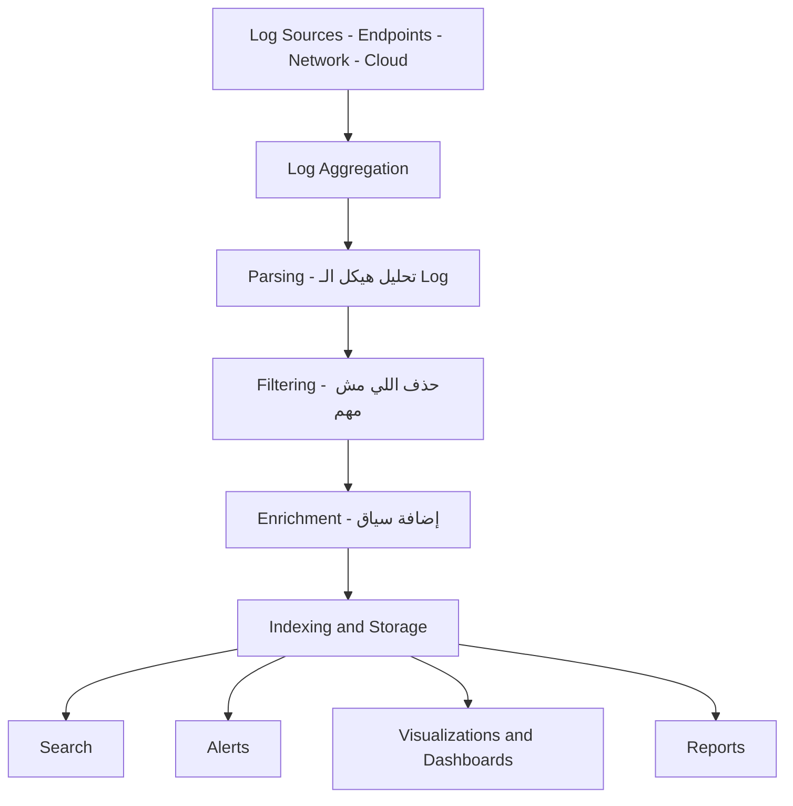
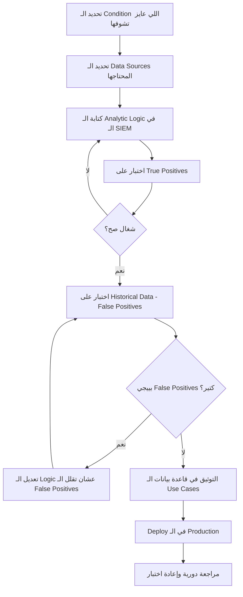
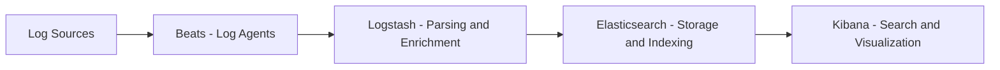
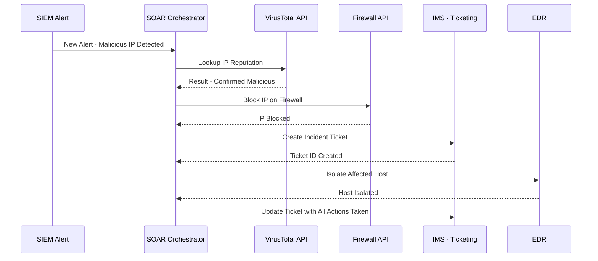
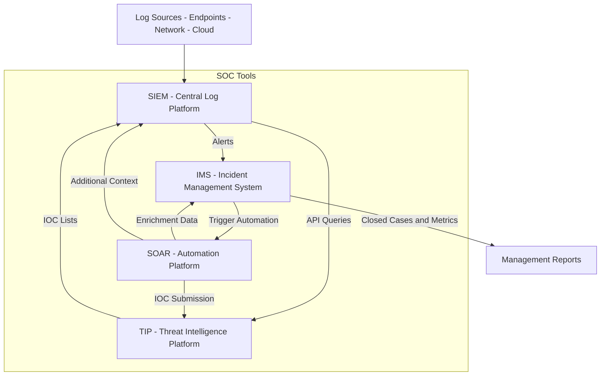

> **الهدف من الـ Section ده:**  
> هنتعلم إزاي الـ SIEM بيشتغل كمركز تجميع الـ Logs في الـ SOC، وإزاي الـ SOAR بيأتمت المهام المتكررة ويريح الـ Analysts، وإزاي كل الأدوات دي بتتكامل مع بعض عشان نبني SOC فعّال.
---

## Table of Contents
- [Introduction](#introduction)
- [ما هو الـ SIEM وليه بنحتاجه](#ما-هو-الـ-siem-وليه-بنحتاجه)
- [وظائف الـ SIEM الأساسية](#وظائف-الـ-siem-الأساسية)
- [مميزات الـ SIEM الجيد](#مميزات-الـ-siem-الجيد)
- [أمثلة على منتجات الـ SIEM](#أمثلة-على-منتجات-الـ-siem)
- [الـ SIEM Use Cases](#الـ-siem-use-cases)
- [إزاي تبني Use Case جديد](#إزاي-تبني-use-case-جديد)
- [توثيق الـ Use Cases](#توثيق-الـ-use-cases)
- [الـ Elastic Stack كـ Lab SIEM](#الـ-elastic-stack-كـ-lab-siem)
- [البحث في Kibana](#البحث-في-kibana)
- [الـ Automation والـ Orchestration](#الـ-automation-والـ-orchestration)
- [منصات الـ SOAR](#منصات-الـ-soar)
- [فوائد الـ SOAR في الـ SOC](#فوائد-الـ-soar-في-الـ-soc)
- [كيف تتكامل كل الأدوات مع بعض](#كيف-تتكامل-كل-الأدوات-مع-بعض)
- [تخزين المعلومات غير المهيكلة](#تخزين-المعلومات-غير-المهيكلة)
-[Summary](#Summary)
---

## Introduction

في الـ SOC الحديث، البيانات بتيجي من كل حتة: الـ Firewalls، الـ Endpoints، الـ Network Sensors، الـ Applications... إلخ. المشكلة مش في إن البيانات مش موجودة، المشكلة إن البيانات دي كتير جداً ومش منظمة.

هنا بييجي دور الـ **SIEM** (Security Information and Event Management)، اللي بيعمل حاجة زي "المركز العصبي" لكل بيانات الـ Security في المنظمة. وجنبه بييجي الـ **SOAR** (Security Orchestration, Automation, and Response) اللي بيأتمت الردود والتحقيقات.

الـ Section ده هيفهمك:
- الـ SIEM بيعمل إيه بالظبط وإيه اللي لازم تدور عليه في الـ SIEM الكويس
- إيه هي الـ Use Cases وإزاي تبنيها
- الفرق بين الـ Automation والـ Orchestration
- إزاي الـ SOAR بيغير طريقة الشغل في الـ SOC

---

## ما هو الـ SIEM وليه بنحتاجه

تخيل إنك شغال في SOC وعندك:
- 500 Server بيرسلوا Logs
- 2000 Desktop بيرسلوا Windows Event Logs
- 10 Firewalls بيرسلوا Traffic Logs
- IDS/IPS بيرسل Alerts

لو مفيش أداة بتجمع كل ده في مكان واحد، هتضطر تفتح 10+ أدوات مختلفة عشان تحقق في أي Alert. ده مستحيل عملياً.

الـ **SIEM** هو الحل: بيجمع كل الـ Logs دي في مكان واحد، بيحللها، وبيعملك Alerts لما يلاقي حاجة مريبة.

> [!IMPORTANT]
> الـ SIEM مش بس أداة لتخزين الـ Logs — ده المركز الأساسي للـ Detection والـ Investigation في أي SOC محترف. بدونه، الـ Analyst بيشتغل أعمى.

---

## وظائف الـ SIEM الأساسية

الـ SIEM بيعمل خطوات متسلسلة مع كل Log بييجيه:



### 1. Log Aggregation (تجميع الـ Logs)

الخطوة الأولى: الـ SIEM بيستلم الـ Logs من كل المصادر المختلفة. دي بتتم عن طريق:
- **Agents** مثبتة على كل جهاز
- **Syslog** لأجهزة الـ Network
- **APIs** لـ Cloud Services

### 2. Parsing (تحليل الـ Logs)

كل Log Source بيكتب بطريقة مختلفة. الـ SIEM لازم يفهم هيكل كل Log ويستخرج منه الـ Fields المهمة زي:
- `source_ip`
- `destination_ip`
- `username`
- `event_type`
- `timestamp`

### 3. Filtering (الفلترة)

مش كل Log مهم للـ Security. الـ SIEM بيتخلص من الـ Noise عشان الـ Analyst ميضيعش وقته في حاجات مش مهمة.

### 4. Enrichment (إثراء البيانات)

ده من أهم خطوات الـ SIEM! بدل ما الـ Log يكون بس:
```
source_ip=1.2.3.4, domain=evil.com
```

بعد الـ Enrichment بيبقى:
```
source_ip=1.2.3.4
domain=evil.com
domain_age=3 days
reputation=malicious
geo_location=Russia
user=ahmed.hassan
user_role=Finance Manager
```

الـ Enrichment بيضيف سياق بيساعد الـ Analyst ياخد قرار أسرع بكتير.

### 5. Indexing and Storage

الـ SIEM بيخزن الـ Logs في Database بطريقة تخليك تقدر تعمل Search سريع عليها. الـ Indexing ده زي فهرس الكتاب — بدله هتقرأ كل صفحة عشان تلاقي المعلومة.

### 6. Search, Alerts, Visualizations, Reports

الـ Output النهائي للـ SIEM:
- **Search**: تقدر تسأله "مين اتلوجن من IP خارجي؟"
- **Alerts**: لما يحصل شرط معين، يبعتلك إشعار
- **Dashboards**: رسوم بيانية تبين الـ Traffic والـ Incidents
- **Reports**: تقارير دورية للـ Management

---

## مميزات الـ SIEM الجيد

لما تيجي تختار SIEM لمنظمتك، دي الحاجات اللي تبص عليها:

| الميزة | ليه مهمة |
|--------|----------|
| Fast Search Capability | الـ Analyst محتاج إجابات سريعة وهو بيحقق |
| Expressive Query Language | عشان تقدر تسأل أسئلة معقدة بسهولة |
| Multiple Visualization Types | تحويل البيانات لـ Charts سهل الفهم |
| Well-Designed UI | الـ Analyst بيقضي يومه في الأداة دي |
| Flexible Alerting Options | تحديد متى وإزاي تتعلم بالـ Incidents |
| Log Enrichment and Correlation | إضافة سياق تلقائي للـ Logs |
| API Integration | ربط الـ SIEM بأدوات تانية زي الـ SOAR |
| High-Performance Ingestion | استقبال ملايين الـ Logs في الثانية |
| Multi-Format Log Compatibility | دعم كل صيغ الـ Logs المختلفة |

> [!TIP]
> عند اختيار الـ SIEM، لازم تجرب المنتج فعلياً قبل الشراء. كتير من المنتجات بتبان كويسة على الورق بس التنفيذ الفعلي بيكون صعب. اسأل عن نقاط الضعف مش بس نقاط القوة!

---

## أمثلة على منتجات الـ SIEM

في السوق فيه خيارات كتير:

| المنتج | الشركة | ملاحظات |
|--------|--------|---------|
| Splunk | Splunk Inc. | الأكثر انتشاراً، غالي |
| QRadar | IBM | شائع في المؤسسات الكبيرة |
| ArcSight | Micro Focus | قديم لكن واسع الانتشار |
| LogRhythm | LogRhythm | سهل الاستخدام |
| Elastic SIEM | Elastic | Open Source بالأساس |
| Microsoft Sentinel | Microsoft | Cloud-Native على Azure |
| Chronicle | Google | Cloud-Native على GCP |

> [!NOTE]
> في الـ Lab بتاع الـ Course ده، هنستخدم الـ **Elastic Stack** (Elasticsearch + Logstash + Kibana) كـ SIEM. ده مش SIEM تجاري بالكامل لكنه بيعلمك المفاهيم الأساسية.

---

## الـ SIEM Use Cases

### إيه هو الـ Use Case؟

الـ **Use Case** هو توثيق رسمي لحاجة معينة عايز الـ SIEM يعملها، وبيتضمن:
- الـ Condition اللي هتتحقق فيها (الشرط)
- ليه الشرط ده مهم
- إيه الـ Action المطلوبة لما يحصل
- الـ Data Sources المحتاجها
- إزاي تقلل الـ False Positives

### أمثلة على Use Cases شائعة

```
Use Case 1: Brute Force Login Detection
- الشرط: أكتر من 10 Failed Logins في دقيقة واحدة من نفس الـ IP
- الأهمية: ممكن يكون هجوم Brute Force
- الـ Action: Alert + Block IP تلقائياً

Use Case 2: Suspicious Upload Volume
- الشرط: User رفع أكتر من 500MB في وقت غير عادي (مثلاً الساعة 2 الصبح)
- الأهمية: ممكن يكون Data Exfiltration
- الـ Action: Alert + تحقيق فوري

Use Case 3: New Admin Account Created
- الشرط: إنشاء حساب جديد وإضافته لـ Administrators Group
- الأهمية: ممكن يكون Persistence من Attacker
- الـ Action: Alert فوري + تحقيق
```

> [!WARNING]
> الـ Use Case مش بس الـ Rule في الـ SIEM! ده توثيق كامل يشمل الـ Logic والـ Response والـ False Positive Reduction. كتير من الـ SOCs بتعمل Rules بدون توثيق وبعدين مفيش حد فاهم ليه الـ Rule دي موجودة!

---

## إزاي تبني Use Case جديد



### الخطوات بالتفصيل

**الخطوة 1: تحديد الـ Condition**
لازم تكون محدد جداً. مش "حاجة مريبة في الـ Login" لكن "أكتر من 10 Failed Logins في 60 ثانية من نفس الـ Source IP على نفس الـ Target Account."

**الخطوة 2: تحديد Data Sources**
إيه الـ Logs اللي هتستخدمها؟ Windows Security Logs؟ Linux auth.log؟ Firewall Logs؟ كل ده لازم يكون واضح.

**الخطوة 3: الاختبار على True Positives**
اعمل Simulation للهجوم في بيئة Test وتأكد إن الـ Rule بتشتغل صح.

**الخطوة 4: الاختبار على Historical Data**
شغّل الـ Rule على Logs قديمة وشوف كم False Positive هيطلع. لو كتير، الـ Rule محتاجة تعديل.

**الخطوة 5: التوثيق**
اكتب كل التفاصيل في قاعدة بيانات الـ Use Cases.

> [!IMPORTANT]
> الـ Use Case مش حاجة بتعملها مرة وخلاص! الـ Environment بيتغير، الـ Software بيتحدث، الـ Attackers بيغيروا تكتيكاتهم. لازم تعيد اختبار الـ Use Cases بشكل دوري باستخدام Purple Team Testing أو Security Validation Tools.

---

## توثيق الـ Use Cases

### الـ Fields المهمة في توثيق الـ Use Case

| الـ Field | الوصف |
|----------|-------|
| **Name** | اسم واضح ومعبر للـ Use Case |
| **Description** | وصف مختصر بالـ Use Case |
| **Problem Statement** | إيه المشكلة الأمنية اللي بيحلها |
| **Goals** | إيه الهدف من الـ Use Case ده |
| **Requirements** | إيه الـ Data Sources والـ Configurations المحتاجة |
| **Primary Data Source** | المصدر الرئيسي للـ Logs |
| **Secondary Data Sources** | مصادر إضافية داعمة |
| **Analytic Logic** | الـ Query أو الـ Rule بالتفصيل |
| **References** | مراجع خارجية (MITRE ATT&CK, CVEs, إلخ) |
| **Suggested Analysis Steps** | خطوات التحقيق لما الـ Alert يطلع |
| **False Positive Reduction** | إزاي تقلل الـ False Positives |
| **MITRE ATT&CK Mapping** | ربط الـ Use Case بـ Techniques في MITRE |
| **Compliance Support** | الـ Regulations اللي الـ Use Case بيساعد فيها |

### أين تخزن الـ Use Cases؟

الخيارات المتاحة:
- **Ticketing Systems** زي Jira أو ServiceNow
- **Excel Spreadsheets** (بسيطة لكن صعبة في الـ Collaboration)
- **Wiki Software** زي Confluence أو MediaWiki
- **Git Repositories** (الأفضل لإن فيه Version Control)

> [!TIP]
> استخدم الـ Git Repository لتخزين الـ Use Cases. ده بيديك Version History كامل لكل تغيير، وبتعرف مين غير إيه ومتى وليه.

---

## الـ Elastic Stack كـ Lab SIEM

### مكونات الـ Elastic Stack



### تفاصيل كل مكون

**Beats**
دي عبارة عن Lightweight Agents بتتنصب على الـ Endpoints وبترسل الـ Logs. في أنواع مختلفة:
- `Filebeat`: لرفع الـ Log Files
- `Winlogbeat`: لـ Windows Event Logs
- `Packetbeat`: لـ Network Traffic

**Logstash**
بيستقبل الـ Logs، بيعملها Parsing وEnrichment، وبيبعتها لـ Elasticsearch.

**Elasticsearch**
ده الـ Database اللي بيخزن الـ Logs. الـ Logs بتتخزن كـ JSON Documents في Indexes. ده مش Database تقليدي بـ Tables وColumns، ده Document Store قابل للـ Search بسرعة عالية جداً.

**Kibana**
الـ Frontend اللي الـ Analyst بيشتغل بيه. بيقدر يعمل:
- Search على الـ Logs
- Dashboards ورسوم بيانية
- Alerts
- Reports

---

## البحث في Kibana

### الـ Discover Tab

الـ Discover Tab هو المكان الأساسي للـ Search. بيتكون من:
- **Time Picker**: لتحديد النطاق الزمني
- **Index Selector**: لتحديد مجموعة الـ Logs
- **Search Bar**: لكتابة الـ Query
- **Histogram**: رسم بياني يبين توزيع الـ Logs على الوقت
- **Field List**: قائمة بكل الـ Fields المتاحة
- **Document View**: عرض الـ Logs التفصيلي

### أمثلة على الـ KQL (Kibana Query Language)

```kql
# البحث عن أي Log بيحتوي على كلمة معينة
error

# البحث في Field معين
response:404

# البحث بشرط رقمي
destination_port > 1024

# البحث بشرطين معاً (AND)
response:404 and destination_port:80

# البحث بأحد شرطين (OR)
response:404 or response:500

# البحث بعدة قيم لنفس الـ Field
response:(200 or 404 or 500)

# البحث عن IP معين
source_ip:192.168.1.100

# البحث في نطاق زمني
@timestamp >= "2024-01-01" and @timestamp <= "2024-01-31"
```

> [!TIP]
> دايماً خصص البحث بتاعك! بدل ما تبحث عن "ahmed" في كل الـ Logs، ابحث عن `username:ahmed and log_type:authentication`. ده بيوفر وقت ضخم ومش بيعبّل الـ SIEM.

> [!NOTE]
> الـ SIEM مش زي الـ Google! الـ SIEM بيبحث في Fields محددة اتعملها Indexing. لو عملت Search مفتوح من غير تحديد الـ Field والـ Index، هيبقى بطيء جداً وممكن ميرجعش نتائج صح.

---

## الـ Automation والـ Orchestration

### الفرق الجوهري

**Automation** هي: أتمتة مهمة واحدة محددة.
مثال: "لما Alert يطلع، ابحث تلقائياً عن الـ IP ده في VirusTotal."

**Orchestration** هي: ربط مجموعة Automated Tasks مع بعض في Workflow متكامل.
مثال: "لما Alert يطلع، ابحث في VirusTotal، لو النتيجة Malicious، Block الـ IP، وابعت Ticket للـ Analyst، واعزل الجهاز من الـ Network."



### فوائد الـ Automation في الـ SOC

| الفائدة | الشرح |
|---------|-------|
| **Standardization** | كل Incident بيتعامل معاه بنفس الطريقة |
| **Speed** | الرد بيحصل في ثواني مش ساعات |
| **Capacity** | الـ Analysts يقدروا يتعاملوا مع Alerts أكتر |
| **Reduced Fatigue** | مش محتاجين يعملوا نفس المهام المتكررة |
| **Faster Onboarding** | الـ Analysts الجدد بيتعلموا بسرعة أكبر |
| **Consistency** | مفيش حاجة بتتنسى |

> [!IMPORTANT]
> الـ Automation مش بديل للـ Analyst — ده مضاعف لقدراته! الـ Automation بيعمل المهام الميكانيكية المتكررة، والـ Analyst بيركز على الـ Analysis والقرارات الصعبة.

---

## منصات الـ SOAR

### المنتجات التجارية

| المنتج | الشركة |
|--------|--------|
| Splunk SOAR | Splunk |
| Palo Alto Cortex XSOAR | Palo Alto Networks |
| Siemplify | Google |
| FortiSOAR | Fortinet |
| Swimlane | Swimlane |
| D3 XGEN SOAR | D3 Security |

### أدوات مجانية

| الأداة | الوصف |
|--------|-------|
| **IBM Node-RED** | Flow-Based Programming Tool مجاني |
| **StackStorm** | Open Source Event-Driven Automation |
| **n8n.io** | Low-Code Workflow Automation |
| **Huginn** | Open Source Agent Automation |
| **Cortex** | مكمل مجاني لـ TheHive |

> [!NOTE]
> الـ Cortex هو أداة الـ Automation المجانية اللي بتيجي مع الـ TheHive. بتسمح بعمل Automated Enrichment للـ Observables في الـ Tickets تلقائياً.

---

## فوائد الـ SOAR في الـ SOC

### أمثلة على مهام الـ SOAR

**1. في حالة Phishing Email:**
```
Alert: Email مشبوه وصل
SOAR Action:
  1. استخراج كل الـ URLs من الـ Email
  2. فحص كل URL على VirusTotal
  3. فحص الـ Sender Domain على AbuseIPDB
  4. لو Malicious: Delete Email من كل Inboxes
  5. Reset Password للـ User لو فتحه
  6. إنشاء Ticket في الـ IMS
  7. إشعار الـ Security Team
```

**2. في حالة Malware Detection:**
```
Alert: Antivirus اكتشف Malware
SOAR Action:
  1. عزل الجهاز من الـ Network
  2. جمع الـ Forensic Evidence من الجهاز
  3. فحص الـ Hash على VirusTotal
  4. البحث عن نفس الـ Hash في باقي الأجهزة
  5. إنشاء Incident Ticket
  6. إشعار الـ IT Team بطلب Reimaging
```

**3. في حالة Suspicious Login:**
```
Alert: Login من بلد جديد
SOAR Action:
  1. البحث عن User's Login History
  2. فحص الـ IP على GeoIP Database
  3. فحص الـ IP على Threat Intel Feeds
  4. لو مريب: Force Password Reset
  5. إرسال Email للـ User للتحقق
  6. إنشاء Ticket للـ Review
```

---

## كيف تتكامل كل الأدوات مع بعض



### شرح التكامل

**SIEM → IMS:**
لما الـ SIEM يعمل Alert، بيبعته لـ IMS (زي TheHive) عشان ينشئ Ticket ويتعامل معاه الـ Analyst.

**SIEM ↔ TIP:**
الـ SIEM بيسأل الـ TIP عن الـ IOCs (زي IPs وDomains) عشان يعرف لو الـ Traffic ده خطير. وفي نفس الوقت، الـ SIEM بيبعت IOCs جديدة للـ TIP.

**IMS → SOAR:**
لما ييجي Incident في الـ IMS، الـ SOAR بيشتغل تلقائياً ويعمل الخطوات الأولى للتحقيق.

**SOAR ↔ Everything:**
الـ SOAR هو البرق بين كل الأدوات — بيأتمت الـ Data Flow ويخلي كل أداة تاكل من بيانات الأداة التانية.

---

## تخزين المعلومات غير المهيكلة

الـ SOC محتاج أكتر من بس Security Tools. محتاج مكان لتخزين:
- **Runbooks والـ Playbooks**: خطوات التعامل مع كل نوع Incident
- **Onboarding Materials**: لتدريب الـ Analysts الجدد
- **Scripts والـ Custom Code**: أكواد بكتبها الـ Team
- **Meeting Notes وقرارات الفريق**
- **Lessons Learned من كل Incident**

### الخيارات المتاحة

| النوع | الأداة | الاستخدام الأمثل |
|-------|--------|----------------|
| Wiki | Confluence / MediaWiki | توثيق وإجراءات |
| Notes | OneNote / Notion | ملاحظات الاجتماعات |
| Code | Git / GitHub | Scripts والـ SOAR Playbooks |
| Files | SharePoint | ملفات ومستندات |

> [!TIP]
> استخدم **Git** لكل الـ Code والـ Automation Scripts الخاصة بالـ SOC. ده بيديك Version History، وبتعرف مين غير إيه، وبتقدر ترجع لنسخة قديمة لو حاجة اتكسرت. الـ Code بدون Version Control ده كارثة.

> [!NOTE]
> الأهم في اختيار أداة التوثيق إنها **بسيطة بما يكفي** إن الفريق يستخدمها فعلاً. الأداة المثالية اللي مش حد بيستخدمها مفيدة أقل من أداة عادية كل الفريق بيكتب فيها.

---

## Summary
### النقاط الأساسية

- الـ **SIEM** هو المركز العصبي للـ SOC: بيجمع، يحلل، يخزن ويعمل Alerts على الـ Logs
- الـ SIEM بيمر بخطوات: Aggregation → Parsing → Filtering → Enrichment → Indexing → Output
- الـ **Use Case** هو توثيق رسمي لما عايز الـ SIEM يكشفه، ومش بس الـ Rule
- الـ Use Cases لازم تتبنى بشكل منهجي: Define → Test → Document → Maintain
- الـ **Automation** هي أتمتة مهمة واحدة، والـ **Orchestration** هي ربط مهام مع بعض
- الـ **SOAR** بيريح الـ Analysts من المهام المتكررة ويخليهم يركزوا على التحليل
- كل أدوات الـ SOC (SIEM, IMS, TIP, SOAR) لازم تتكامل مع بعض عشان تكون فعّالة
