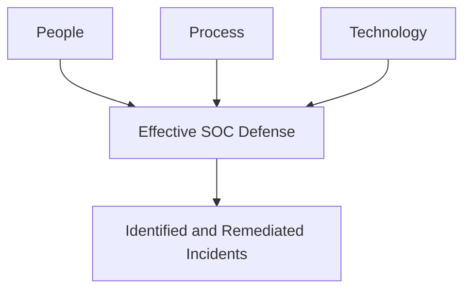
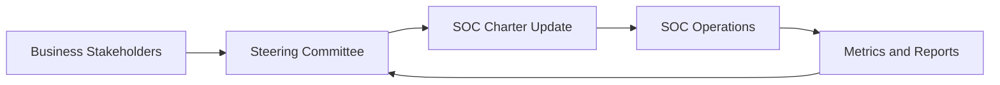
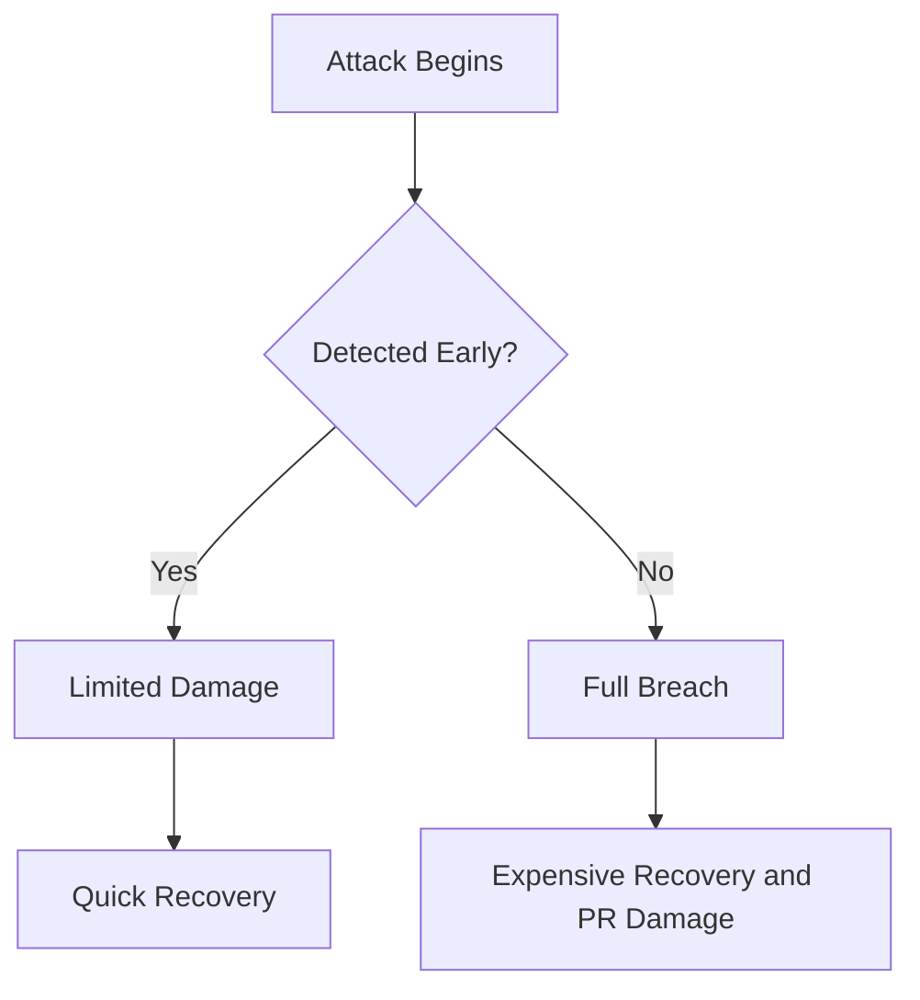
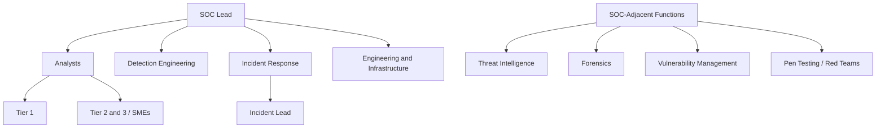
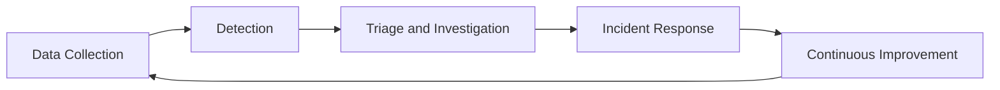
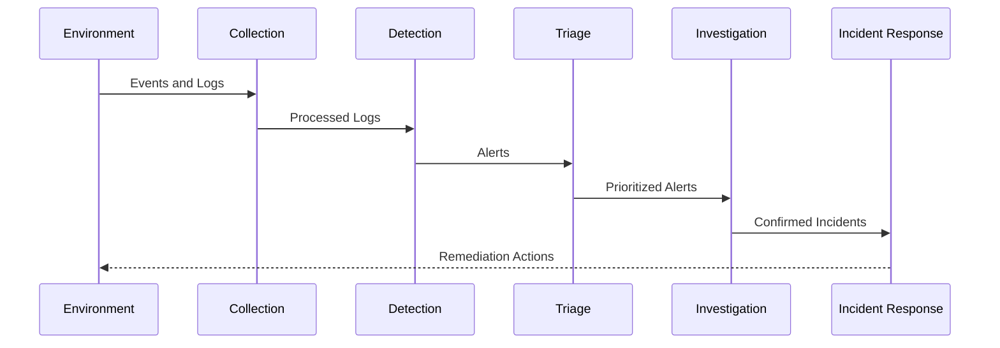
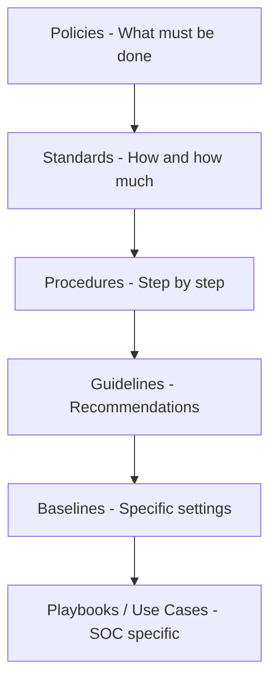
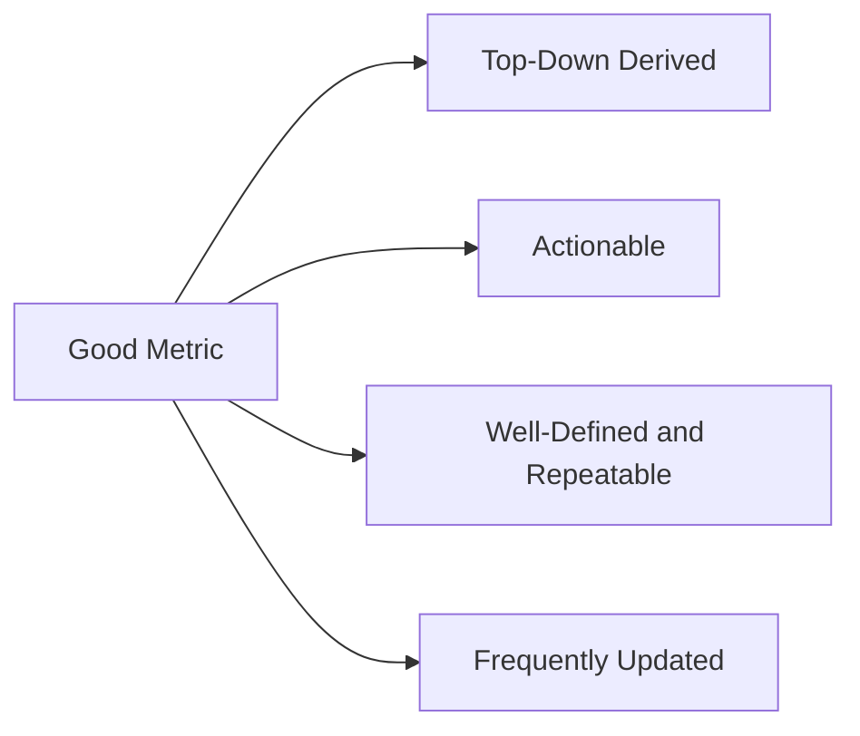

# SANS SEC450 | Blue Team Fundamentals
## Module 1 — SOC Overview: نظرة عامة على مركز عمليات الأمن

---

**SANS 450 | Blue Team Operations**
**Module 1 — SOC Overview**

| # | Topic | الموضوع |
|---|-------|---------|
| 1 | Components of Security Operations | مكونات عمليات الأمن: People, Process, Technology |
| 2 | Understanding the SOC Mission | فهم مهمة الـ SOC والأسئلة الأربعة الأساسية |
| 3 | SOC Charter & Steering Committee | الـ Charter والـ Steering Committee |
| 4 | Risk Appetite | مفهوم الـ Risk Appetite وكيفية التعامل معه |
| 5 | Blue Team Truths | الحقائق الأساسية للـ Blue Team |
| 6 | SOC Organizational Structure | الهيكل التنظيمي للـ SOC: Tiered vs Tierless |
| 7 | SOC Core Functions | الوظائف الأساسية للـ SOC |
| 8 | Critical SOC Documents | الوثائق المهمة التي يجب على المحلل معرفتها |
| 9 | SOC Metrics | قياس وإيصال أداء الـ SOC |

---

## Table of Contents
- [Introduction](#introduction)
- [The Three Pillars: People, Process, Technology](#the-three-pillars-people-process-technology)
- [The Four Core Questions](#the-four-core-questions)
- [SOC Charter and Steering Committee](#soc-charter-and-steering-committee)
- [Risk Appetite](#risk-appetite)
- [Blue Team Truths](#blue-team-truths)
- [SOC Organizational Structure](#soc-organizational-structure)
- [Tiered vs Tierless SOCs](#tiered-vs-tierless-socs)
- [SOC Core Functions](#soc-core-functions)
- [The SOC at a High Level](#the-soc-at-a-high-level)
- [Critical SOC Information](#critical-soc-information)
- [Documents Analysts Must Know](#documents-analysts-must-know)
- [SOC Metrics](#soc-metrics)
- [Summary and Exam Checklist](#summary-and-exam-checklist)

---

## Introduction

الـ SOC أو Security Operations Center هو قلب عمليات الأمن السيبراني في أي مؤسسة. في هذا الـ Module، هنتكلم عن الأساسيات اللي لازم كل محلل أمني يعرفها قبل ما يبدأ شغله اليومي.

الـ Blue Team — وهو الاسم الشائع للفريق الدفاعي — مهمته مش بس "بلوك الهاكرز". المهمة الحقيقية هي:

> **"Reduce the probability of material impact to my organization due to a cyber event."**
> — Rick Howard, CSO and Chief Analyst @ CyberWire

يعني: **قلّل احتمالية إن أي حدث سيبراني يأثر بشكل حقيقي على المؤسسة.**

---

## The Three Pillars: People, Process, Technology

أي SOC يحتاج 3 عناصر أساسية تشتغل مع بعض. تقدر تفكر فيهم زي "الكرسي ذو ثلاث أرجل" — لو واحدة وقعت، الكل وقع.

### الـ People (الناس)
الناس هم **قلب وروح** الـ Blue Team. من غير فريق متحمس ومدرب، ما فيش أداة أو عملية بتفيد. اختيار الناس الصح ممكن يفرق بين SOC ناجح وآخر فاشل.

- بيعملوا الـ Analysis والـ Investigation
- بيصمموا الـ Processes وبيشغلوها
- لو الـ Analysts مش سعداء = Revolving Door = ما فيش استقرار

### الـ Process (العملية)
الـ Process هو **التسلسل المحدد من الخطوات** اللي بتوصلك للنتيجة المطلوبة.

- بيحدد إيش بالضبط هيعمله الفريق وإزاي
- بيضمن إن الشغل يتعمل بطريقة قابلة للتكرار والقياس
- من غير Process واضح، كل محلل بيشتغل بطريقته الخاصة

### الـ Technology (التقنية)
التقنية هي **المُمكِّن** — مش البديل عن الإنسان.

- بتخلي الشغل اليدوي يتعمل على نطاق واسع (Scale)
- **Force Multiplier** — بتضاعف قدرات الفريق
- لو المحلل ممكن تستبدله بأداة، معناه كان بيعمل شغل Automation من الأصل!



> [!IMPORTANT]
> التقنية مش بديل عن الناس. لو الأدوات هي اللي بتحل كل المشاكل، إذن ما كانت تحتاج محلل من الأصل. الإنسان هو اللي بيفكر، يحلل، ويقرر.

---

## The Four Core Questions

قبل ما تبني SOC أو تقيّمه، لازم تقدر تجاوب على هذي الأسئلة الأربعة:

### السؤال 1: What are we trying to protect?
إيش اللي بنحاول نحميه؟
- البيانات الحساسة؟ الـ Intellectual Property؟ الـ Critical Infrastructure؟
- مش بس "بيانات الشركة" — لازم تكون محدد أكثر: أي بيانات، وين موجودة، ومين عنده وصول؟

### السؤال 2: What are the threats?
إيش التهديدات اللي تواجهنا؟
- Ransomware؟ APT؟ Insiders؟
- بتختلف حسب الصناعة والمنطقة الجغرافية
- الإجابة هنا بتبني الـ Threat Intelligence Program

### السؤال 3: How do we detect them?
كيف نكتشف هذي التهديدات؟
- SIEM Rules؟ IDS Signatures؟ EDR Alerts؟
- بتحتاج تفهم كيف تسوي Detection لكل نوع تهديد

### السؤال 4: How will we respond?
كيف هنرد على الحادثة؟
- Incident Response Plan
- Communication Plan
- Recovery Procedures

> [!NOTE]
> الأسئلة الأربعة دي مش بس للتأسيس — لازم تراجعها دوريًا لأن التهديدات والفريق والمؤسسة كلها بتتغير مع الوقت.

---

## SOC Charter and Steering Committee

### الـ SOC Charter
الـ Charter هو **الوثيقة التأسيسية** للـ SOC. فكر فيه زي "دستور الفريق".

**الـ Charter بيتضمن:**

| العنصر | الوصف |
|--------|--------|
| Constituency Served | مين هم العملاء الداخليين للـ SOC؟ |
| Services to be Delivered | إيش الخدمات اللي يقدمها الـ SOC؟ |
| Scope of Work | حدود عمل الفريق |
| Mission Statement | رسالة الفريق العليا |
| Organizational Structure | الهيكل التنظيمي |

- بيعطي الـ Blue Team **السلطة القانونية** لمراقبة الشبكة والتحقيق في الحوادث
- لازم يكون معتمد من الـ Management
- هو **Living Document** — يتحدث مع تطور المؤسسة

### الـ Steering Committee
الـ Steering Committee هو **اجتماع دوري** مع أصحاب المصلحة الرئيسيين في الـ SOC.

**دوره:**
- يضمن إن الـ SOC متوافق مع أهداف المؤسسة
- يطرح مخاوف الـ Risk من جانب الأعمال
- يربط أداء الـ SOC باحتياجات الشركة



---

## Risk Appetite

### مفهوم الـ Risk Appetite
الـ Risk Appetite هو **مقدار المخاطرة اللي المؤسسة مستعدة تتقبله**.

مثال من الحياة الواقعية:
- **حكومة أو عسكري:** Risk Appetite منخفض جدًا → ضوابط أمنية صارمة جدًا
- **Startup صغيرة:** Risk Appetite أعلى → تركيز على السرعة وليس الأمان
- **بنك:** وسط → توازن بين الأمان وراحة العميل

### المقياس

```
No Security ←————————————————→ Tight Security
             Reasonable Security
```

### حقيقة مهمة
> الشركات مش موجودة **عشان تكون آمنة** — موجودة عشان تحقق قيمة اقتصادية.
> الأمن هو **وظيفة منع الخسائر** (Loss Prevention Function).

فكر فيها زي حارس الأمن في متجر:
- ممكن تعمل تفتيش TSA على كل زبون → 0% سرقة لكن 100% عملاء يهربون
- لازم توازن بين الأمان واستمرار العمل

### مثال واقعي: Risk Appetite meets Reality
تخيل إنك بتشتغل في شركة أدوية، وعندهم ماكينة إنتاج بتشغّل Windows XP ولا يقدروا يغيروها:
- ما ينفع تثبت Antivirus عليها
- ما تقدر تحدث الـ OS
- محتاجة تبعت بيانات عبر FTP

**الحل الخاطئ:** "ما نستخدمها" → ستُطرد فورًا!

**الحل الصح:** Compensating Controls خارجية:
- Firewall خارجي يتحكم في الـ Traffic
- Web Application Firewall
- Network-level Antivirus Scanning
- Strict Allow-list للـ Communication

> [!WARNING]
> لما المؤسسة تقبل Risk معين بعد ما شرحت له المخاطر، وثّق ذلك كتابيًا. مهمتك إنك تعطيهم معلومات دقيقة، مش إنك تتخذ القرار عنهم.

---

## Blue Team Truths

### الحقيقة الأولى: Compromise Will Happen
**الاختراق سيحدث — مش السؤال هل بل متى.**

السؤال الحقيقي: **كيف هيأثر عليك؟**

| النتيجة | الوصف |
|--------|--------|
| Outcome 1 (Ideal) | المهاجم ينجح في الخطوات الأولى، لكن يُكتشف سريعًا ويفشل في تحقيق هدفه |
| Outcome 2 (Disaster) | المهاجم ما يتكشف، يتحرك بحرية، ويحقق أهدافه الكاملة |



**الهدف:** اكتشف بكير وقلل الضرر.

### الحقيقة الثانية: Your Company Doesn't Exist to Be Secure
**شركتك مش موجودة عشان تكون آمنة فقط.**

الـ Blue Team بيقدم **Loss Prevention Function** — زي حراس الأمن في المتجر.

- لازم يكون في توازن بين الأمان والإنتاجية
- القرار بمستوى الأمان يتحكم فيه الـ Management
- دورك تعطيهم معلومات دقيقة ليتخذوا قرار مبني على بيانات صحيحة

> [!TIP]
> لما تختلف مع قرار أمني، حاول تشرح السبب بأرقام وتأثير على الأعمال. الأرقام بتقنع الإدارة أكثر من الحجج التقنية المجردة.

---

## SOC Organizational Structure

### الهيكل التنظيمي النموذجي



> [!NOTE]
> ما في هيكل تنظيمي "صح" وحيد للـ SOC. يختلف حسب حجم المؤسسة ومتطلباتها. المهم إن الفرق كلها تتواصل بفعالية.

---

## Tiered vs Tierless SOCs

### الـ Tiered SOC (المتدرج)

| Tier | المستوى | المهام الرئيسية |
|------|--------|----------------|
| Tier 1 | مبتدئ | Initial Triage, Ticket Generation |
| Tier 2 | متوسط | Attack Scoping, Further Analysis, Remediation Support |
| Tier 3 | خبير | Deep Analysis, Methodology Development, Threat Hunting |

**المميزات:**
- أدوار واضحة ومسار ترقية محدد
- Processes منظمة وكفاءة في التسليم

**العيوب:**
- ممكن يكون مقيد للـ Tier 1
- بطء في التطور الوظيفي → Revolving Door Problem

### الـ Tierless SOC (غير المتدرج)

**المبدأ:** الكل بيشتغل مع بعض على كل شيء حسب قدراتهم.

**المميزات:**
- المحللين الجدد يتعلمون أسرع
- مستوى رضا أعلى عند الموظفين
- مرونة في التوزيع

**العيوب:**
- يحتاج Careful Alert Management
- لازم كل فرد يعرف حدوده

> [!IMPORTANT]
> مش "أيهما أفضل" — كل نموذج محسّن لظروف مختلفة. الـ Tiered أفضل للمؤسسات الكبيرة، والـ Tierless ممكن يكون أفضل للفرق الصغيرة.

---

## SOC Core Functions

### الوظائف الأساسية (Core SOC)



| الوظيفة | الوصف |
|---------|--------|
| Data Collection | جمع بيانات الأمن من الشبكة والـ Endpoints |
| Detection | تحديد الأنشطة المشبوهة من البيانات |
| Triage and Investigation | ترتيب الأولويات والتحقيق في الـ Alerts |
| Incident Response | الاستجابة لتقليل تأثير الهجوم |

### الوظائف المساعدة (Auxiliary)

| الوظيفة | الوصف |
|---------|--------|
| Threat Intelligence | جمع معلومات عن المهاجمين وتكتيكاتهم |
| Forensics | التحليل العميق لما حدث في الـ Breach |
| Self-Assessment | Vulnerability Assessment, Pen Testing, Red Team |

---

## The SOC at a High Level

### نظرة مبسطة: Input/Output

الـ SOC ببساطة هو **صندوق** يأخذ مدخلات ويطلع نتائج:

```
Input 1: Things that happened (Network Traffic, Endpoint Events)
Input 2: What attacks look like (Threat Intel, Signatures)
              ↓
         [  SOC  ]
              ↓
Output: Identified, Minimized, and Remediated Incidents
```

**المبدأ الذهبي:** Garbage In = Garbage Out

كلما كانت المدخلات أفضل (رؤية أوضح للشبكة + Intelligence أحسن)، كلما كانت النتائج أفضل.

### خطوات عمل الـ SOC اليومي



> [!NOTE]
> معظم المحللين في حياتهم اليومية بيعيشوا في خطوات Triage و Investigation و Incident Response. لكن المحلل المتميز يفهم كل الخطوات من Collection وحتى Remediation.

---

## Critical SOC Information

كل SOC لازم يكون عنده هذي المعلومات حاضرة دايمًا:

| المعلومة | الأهمية |
|---------|---------|
| Network Diagram | عشان تعرف وين الـ Traffic يمشي |
| Points of Visibility | وين عندك Taps و Span Ports و Full PCAP |
| Data Flow Diagram | كيف الـ Traffic يوصل للإنترنت |
| Log Flow Diagram | وين الـ Logs بتيجي وبتروح |
| Incident Response Plan | إيش تعمل لما الكوارث تحدث |
| Communication Plan | مين تتصل فيه ومتى |
| Critical Assets List | قائمة أهم Assets في المؤسسة |
| Disaster Recovery Plans | كيف ترجع للعمل بعد الحادثة |

> [!WARNING]
> من أكبر الأخطاء إن المحلل يبحث عن Logs ما يلاقيها ويستنتج إن الـ Attack ما صار — بدل ما يدرك إنه ما بيجمع هذا النوع من الـ Logs أصلًا.

---

## Documents Analysts Must Know

### هرم الوثائق



### تفاصيل كل نوع

| النوع | الإلزامية | المثال |
|-------|---------|--------|
| Policy | إلزامي | "جميع الأجهزة يجب أن يكون عليها Antivirus" |
| Standard | إلزامي | "إعدادات الـ Antivirus يجب أن تكون..." |
| Procedure | إلزامي | "خطوات تثبيت الـ Antivirus..." |
| Guideline | اختياري | "أفضل الممارسات لنشر الـ Antivirus..." |
| Baseline | مرجعي | CIS Benchmarks للأنظمة المختلفة |
| Playbook | خاص بـ SOC | "كيف تتعامل مع Phishing Alert..." |

> [!TIP]
> الـ Playbook هو وثيقتك كمحلل. هو اللي يحدد الخطوات الدقيقة لكل نوع حادثة. كلما كان أوضح وأشمل، كلما كان ردك على الحوادث أسرع وأدق.

---

## SOC Metrics

### لماذا نقيس؟
"That which gets measured, gets done" — اللي بيتقاس، بيتعمل.

الـ Metrics هي الطريقة الوحيدة لتوصيل قيمة الـ SOC لصانعي القرار.

### خصائص الـ Metric الجيد



| الخاصية | السؤال |
|--------|---------|
| Top-Down Derived | أي هدف تحديدًا يساعد هذا الـ Metric في تتبعه؟ |
| Actionable | إيش بتعمل لو الرقم كبر أو صغر؟ |
| Well-Defined | لو اثنين يجمعوا نفس الـ Metric، هيطلعوا نفس الرقم؟ |
| Frequently Updated | هل ممكن يتجمع أوتوماتيكيًا وبسرعة؟ |

### السؤال المهم دايمًا
> "لو هذا الـ Metric تحسّن، هل الأمان فعلًا تحسّن؟"

لو الإجابة "مش بالضرورة" → هذا Metric خاطئ.

**أمثلة على Metrics مفيدة:**
- متوسط وقت الاكتشاف (Mean Time to Detect - MTTD)
- متوسط وقت الاستجابة (Mean Time to Respond - MTTR)
- عدد الـ True Positives مقارنة بالـ False Positives
- عدد الحوادث المغلقة في الوقت المحدد

> [!IMPORTANT]
> لو بتُقاس بـ Metric لا تعتقد إنه مناسب، ناقش مديرك. الـ Metric الخاطئ ممكن يدفعك تعمل أشياء تحسّن الرقم لكن تضر الأمان الحقيقي.

---

## Summary and Exam Checklist

### ملخص النقاط الرئيسية

- **الـ SOC** يقوم على ثلاثة أعمدة: People و Process و Technology
- **الـ People** هم الأهم — بدونهم لا شيء يعمل
- **الأسئلة الأربعة** هي منطلق بناء أي SOC: ماذا نحمي، ما التهديدات، كيف نكتشف، كيف نستجيب
- **الـ Charter** يعطي الفريق الشرعية للعمل ويوضح حدوده
- **الـ Steering Committee** يضمن التوافق المستمر مع أهداف المؤسسة
- **الـ Risk Appetite** يختلف من مؤسسة لأخرى ويتغير مع الوقت
- **الاختراق سيحدث** — السؤال هو كيف نقلل تأثيره
- **الـ Tiered vs Tierless** كلاهما صحيح — كل واحد محسّن لظروف مختلفة
- **الوظائف الأساسية:** Collection → Detection → Triage → Investigation → Incident Response
- **الـ Metrics** لازم تكون Actionable وTop-Down وRepeatable

### Exam-Ready Checklist

- [ ] أعرف الفرق بين People و Process و Technology وأهمية كل منها
- [ ] أقدر أجاوب على الأسئلة الأربعة الأساسية لأي SOC
- [ ] أفهم الغرض من الـ SOC Charter ومن يعتمده
- [ ] أفهم ما هو الـ Steering Committee ودوره
- [ ] أفهم مفهوم الـ Risk Appetite وأعطي أمثلة عليه
- [ ] أعرف الـ Blue Team Truth #1: الاختراق سيحدث
- [ ] أعرف الـ Blue Team Truth #2: الشركة لا تعيش فقط لتكون آمنة
- [ ] أفهم الفرق بين الـ Tiered والـ Tierless SOC
- [ ] أعرف الوظائف الأساسية للـ SOC (Core Functions)
- [ ] أعرف الفرق بين Policy و Standard و Procedure و Guideline و Baseline و Playbook
- [ ] أفهم ما هو الـ Metric الجيد وخصائصه الأربعة
- [ ] أعرف المعلومات الحرجة التي يجب أن يمتلكها كل SOC

---

*SANS SEC450 — Blue Team Fundamentals: Security Operations and Analysis*
*Module 1: SOC Overview*
*© Notes prepared for educational purposes based on SANS course material*
