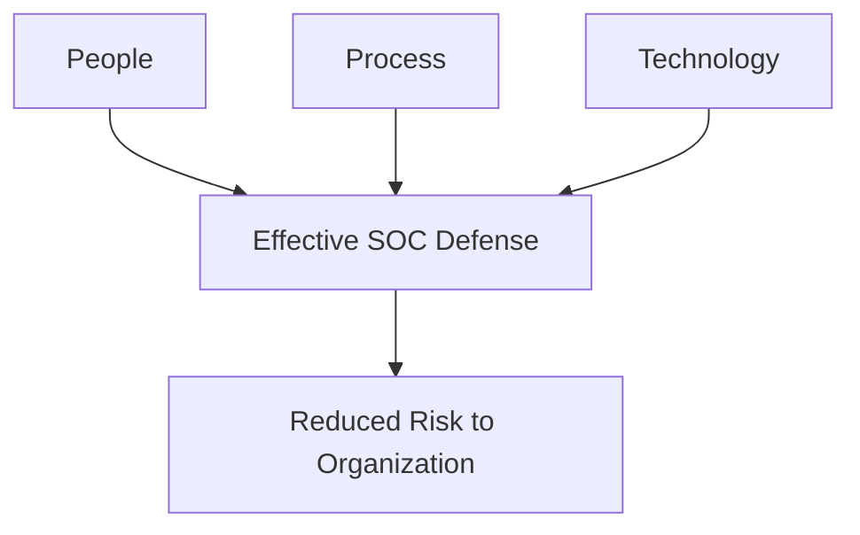
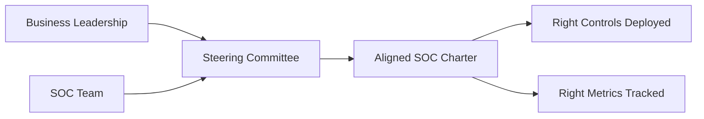
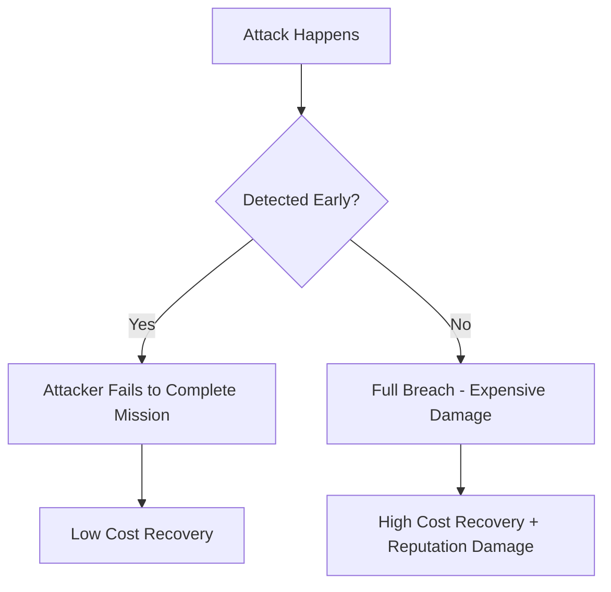
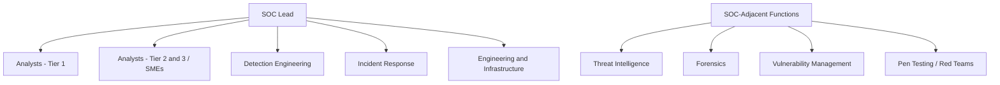
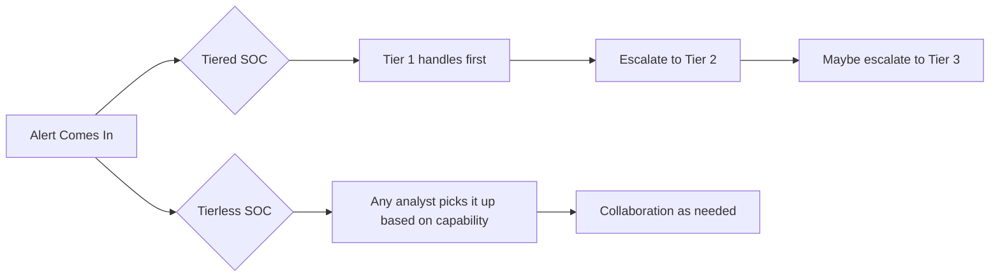
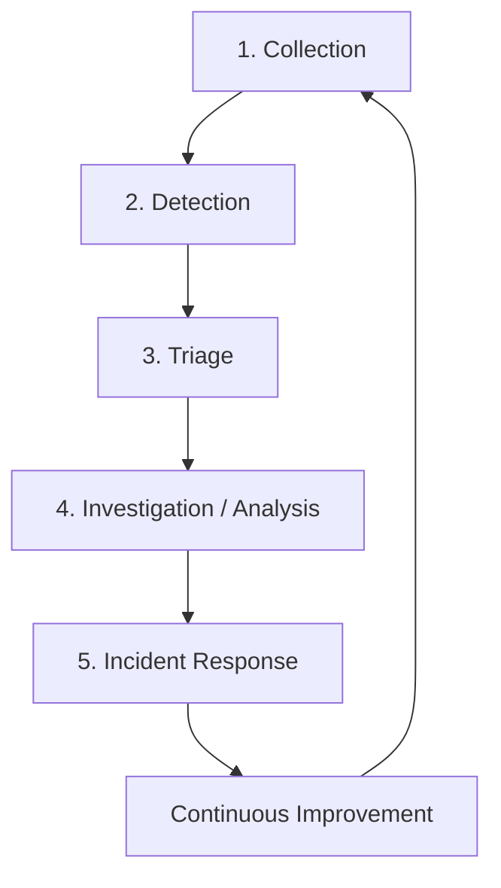
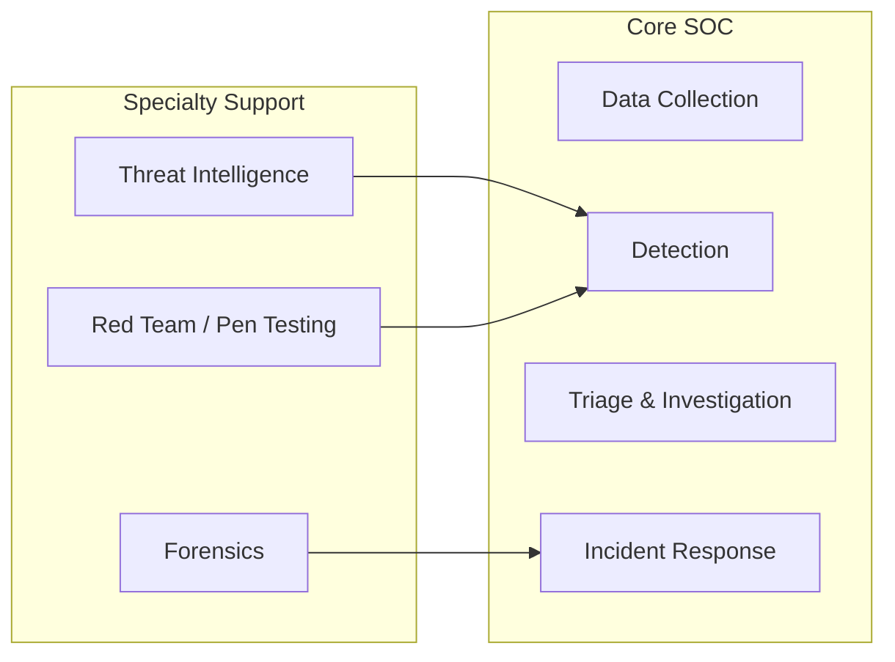
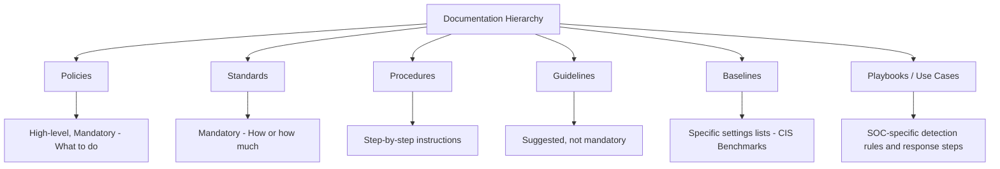

> **الهدف من الـ Section ده:**  
> هتفهم إيه هو الـ SOC (Security Operations Center) وإزاي بيشتغل، وإيه المكونات الأساسية اللي بتخليه يشتغل صح — من People وProcess وTechnology، وصولاً للـ Org Charts والـ Metrics.
---

## Table of Contents

- [Introduction](#introduction)
- [المكونات الثلاثة للـ SOC](#المكونات-الثلاثة-للـ-soc)
- [الأسئلة الأربعة لتحديد المهمة](#الأسئلة-الأربعة-لتحديد-المهمة)
- [SOC Charter والـ Steering Committee](#soc-charter-والـ-steering-committee)
- [Risk Appetite](#risk-appetite)
- [Blue Team Truths](#blue-team-truths)
- [هيكل الـ SOC والـ Org Chart](#هيكل-الـ-soc-والـ-org-chart)
- [Tiered vs Tierless SOCs](#tiered-vs-tierless-socs)
- [خطوات عمل الـ SOC](#خطوات-عمل-الـ-soc)
- [وظائف الـ SOC Core vs Specialty](#وظائف-الـ-soc-core-vs-specialty)
- [المعلومات الحيوية اللي لازم يكون عندك](#المعلومات-الحيوية-اللي-لازم-يكون-عندك)
- [أنواع الوثائق في الـ SOC](#أنواع-الوثائق-في-الـ-soc)
- [SOC Metrics](#soc-metrics)
- [Summary](#summary)
---

## Introduction

الـ SOC هو المركز اللي بيتم فيه مراقبة وتحليل والرد على التهديدات السيبرانية في المنظمة. مش مجرد غرفة بملشات وشاشات — ده نظام متكامل من الناس والأدوات والعمليات.

الهدف الرئيسي بيتلخص في جملة واحدة من الـ Cyberwire:

> **"Reduce the probability of material impact to my organization due to a cyber event."**

يعني مش هدفنا نعمل network مثالي مينفعش يتاخترق — ده مستحيل. هدفنا نقلل تأثير أي هجوم قد يحصل.

---

## المكونات الثلاثة للـ SOC

الـ SOC بيقوم على **3 أرجل** — لو واحدة وقعت، الكرسي وقع:

### 1. People (الناس)

الناس هم القلب النابض للـ SOC. مفيش Technology أو Process تعوض عن فريق مُدرَّب وسعيد ومتحفز. اختيار الناس الصح ممكن يصنع أو يدمر الفريق.

### 2. Process (العملية)

الـ Process هو التسلسل المحدد من الخطوات اللي بيعمله الناس. بيحدد **إيه** اللي بيتعمل و**إزاي** بيتعمل. بدون Process واضح، كل واحد بيشتغل بطريقته وبتلاقي نتائج مختلفة.

### 3. Technology (التكنولوجيا)

التكنولوجيا هي الـ Multiplier — بتخلي الناس أكثر قدرة وأسرع. لكن مهم تعرف: الـ Technology مش بديل للناس، هي أداة في إيد الناس.

> [!IMPORTANT]
> الـ Technology مش بتحل محل الـ People. لو الـ Analyst بيعمل شغل ممكن الـ Automation تعمله، يبقى الـ Analyst مش بيشتغل صح من الأساس.

---

## الأسئلة الأربعة لتحديد المهمة

من كتاب "Crafting the Infosec Playbook" — 4 أسئلة لازم كل SOC يجاوب عليهم:

| # | السؤال | الهدف منه |
|---|--------|-----------|
| 1 | **What are we trying to protect?** | تحديد الـ Assets الحيوية |
| 2 | **What are the threats?** | فهم المهاجمين وأساليبهم |
| 3 | **How do we detect them?** | اختيار الـ Tools والـ Sensors المناسبة |
| 4 | **How will we respond?** | تجهيز خطط الرد والـ Playbooks |

> [!TIP]
> مش كفاية تقول "بنحمي بيانات الشركة من APTs" — لازم تعرف **أي** APTs، **إزاي** بيهاجموا، **أي** بيانات بالظبط، **فين** بتتخزن. كلما زادت التفاصيل، زادت فرص النجاح.

---

## SOC Charter والـ Steering Committee

### SOC Charter

الـ Charter هو الوثيقة التأسيسية للـ SOC — زي الدستور. بيحدد:

- **Constituency**: مين اللي بنحميه؟
- **Services**: إيه الخدمات اللي بنقدمها؟
- **Scope**: إيه حدود صلاحياتنا؟
- **Mission Statement**: جملة مختصرة توضح هدف الفريق
- **Organizational Structure**: إزاي الفريق منظم؟

> [!NOTE]
> الـ Charter مش وثيقة جامدة — هي وثيقة حية (Living Document) لازم تتحدث مع تطور التهديدات والمنظمة.

### Steering Committee

الـ Steering Committee هو اجتماع دوري مع Stakeholders الأساسيين في المنظمة. هدفه:

- التأكد إن الـ SOC شاغل وقته في اللي يهم المنظمة فعلاً
- محاذاة قدرات الـ SOC مع احتياجات البيزنس
- مناقشة الـ Risk Priorities

---

## Risk Appetite

### إيه هو الـ Risk Appetite؟

الـ Risk Appetite هو مقدار المخاطرة اللي المنظمة مستعدة تتقبله. مش كل المنظمات زي بعض:

| نوع المنظمة | Risk Appetite | المتوقع |
|-------------|--------------|---------|
| Military / Government | منخفض جداً | Controls صارمة جداً |
| Hospital / Healthcare | منخفض | بيانات مرضى حساسة جداً |
| Enterprise Company | متوسط | Balance بين Security وProductivity |
| Startup جديد | مرتفع | السرعة أهم من الأمان في البداية |

### Risk Appetite Meets Reality — مثال عملي

تخيل بتشتغل في شركة أدوية. في ماكينة إنتاج بتشغل Windows XP ومش ممكن تتغير لأسباب قانونية. الماكينة دي بتستخدم FTP مش مشفر وبيها Web Server قديم.

**الحل المغلوط:** تقول للإدارة "الماكينة دي خطرة جداً، لازم نوقفها."  
← الرد: "الماكينة دي بتنتج X دولار في الساعة، لأ!"

**الحل الصح:** تطبّق **Compensating Controls** من برّة الجهاز:
- Network Firewall يقفل كل البورتات إلا اللي محتاجها
- Antivirus Network Appliance يفحص الـ Traffic
- Web Application Firewall للـ Web Server القديم

> [!WARNING]
> دورك كـ Blue Team مش إنك ترفض كل خطر — دورك إنك تفهم الخطر وتشرحه للإدارة وتقترح حلول عملية تتناسب مع متطلبات البيزنس.

---

## Blue Team Truths

### Blue Team Truth #1: الاختراق سيحصل

الحقيقة المرة: مفيش دفاع كامل 100%. اللي بيفرق بين SOC كويس وSOC مش كويس هو **سرعة الكشف والرد**.

### Blue Team Truth #2: الشركة مش موجودة عشان تكون آمنة

الـ Cybersecurity هي وظيفة "Loss Prevention" — زي الأمن في المحل. تخيل محل بيعمل تفتيش TSA عند الدخول والخروج — مش هيبيع حاجة!

اللي عليك تعمله:
- تفهم الـ Risk اللي الشركة مستعدة تتقبله
- توازن بين الأمان ومتطلبات الإنتاجية
- تبلّغ الإدارة بالمخاطر الحقيقية بشكل واضح

---

## هيكل الـ SOC والـ Org Chart

مفيش هيكل "مثالي" — كل منظمة بتختار الهيكل اللي بيناسبها. المهم إن الفريق كله يشتغل مع بعض بكفاءة.

---

## Tiered vs Tierless SOCs

### Tiered SOC (المستويات)

الـ Tiered SOC فيه مستويات محددة:

| المستوى | المسمى | المهام |
|---------|--------|--------|
| **Tier 1** | Entry Level Analyst | Initial Triage، فتح Tickets |
| **Tier 2** | Mid-Level Analyst | تحليل أعمق، تحديد نطاق الهجوم |
| **Tier 3** | Senior Analyst / SME | تحليل معقد، Threat Hunting، تطوير المنهجية |

**مميزات:** مسار واضح للترقي، عمليات منظمة.  
**عيوب:** ممكن يكون محدود للغاية ويؤدي لـ Burnout وارتفاع معدل الاستقالات.

### Tierless SOC (بدون مستويات)

الكل يشتغل مع بعض على كل حاجة — حسب قدراتهم.

**مميزات:** تعلم أسرع، محللين أكثر سعادة، Retention أحسن.  
**عيوب:** محتاج انضباط ذاتي أعلى وإدارة أذكى للـ Alerts.

> [!NOTE]
> استطلاعات الطلاب في SANS بتظهر إن أكتر من نص المنظمات بتشتغل بنموذج Tierless أو قريب منه.

---

## خطوات عمل الـ SOC

الـ SOC بيشتغل في 5 خطوات أساسية:

### شرح كل خطوة

**1. Collection (جمع البيانات)**
جمع الـ Logs والـ Network Traffic والـ Endpoint Events من كل مكان في الشبكة.

**2. Detection (الكشف)**
مراقبة البيانات المجموعة واكتشاف الأنشطة المشبوهة باستخدام SIEM، IDS، Threat Intelligence، وقواعد التحليل.

**3. Triage (الفرز والترتيب)**
ترتيب الـ Alerts حسب الأولوية — مين اللي أخطر ويحتاج تتعامل معاه الأول؟

**4. Investigation (التحقيق)**
التعمق في الـ Alert عشان تحدد: هل ده True Positive؟ إيه اللي حصل؟ ما مدى الضرر؟

**5. Incident Response (الرد على الحوادث)**
Contain الهجوم، Eradicate التهديد، Recover الأنظمة، وتوثيق كل حاجة للتعلم منها.

> [!TIP]
> معظم المحللين الجدد بيقضوا وقتهم في الـ Triage والـ Investigation. لكن المحللين المتميزين بيفهموا الـ Collection والـ Detection برضو — عشان يقدروا يحسّنوا العملية كلها.

---

## وظائف الـ SOC Core vs Specialty

### Core SOC Functions (الوظائف الأساسية)

| الوظيفة | الوصف |
|---------|--------|
| **Data Collection** | جمع بيانات الشبكة والـ Endpoints |
| **Detection** | تحديد الأنشطة المشبوهة من البيانات المجموعة |
| **Triage and Investigation** | فرز وتحقيق في الـ Alerts المكتشفة |
| **Incident Response** | الرد على الحوادث وتقليل الأضرار |

### Specialty Functions (الوظائف المتخصصة)

| الوظيفة | الوصف |
|---------|--------|
| **Threat Intelligence** | جمع وتحليل معلومات عن المهاجمين وأساليبهم |
| **Forensics** | تحليل جنائي دقيق بعد الحوادث |
| **Self-Assessment** | Vulnerability Assessment وRed Teaming وConfiguration Monitoring |

---

## المعلومات الحيوية اللي لازم يكون عندك

كل SOC لازم يكون عنده دايماً:

| المستند / المعلومة | الهدف |
|-------------------|-------|
| **Network Diagram** | فهم شكل الشبكة ونقاط الرؤية |
| **Points of Visibility** | تعرف فين ال Taps وSpan Ports والـ PCAP |
| **Data Flow Diagram** | فهم إزاي الـ Traffic بيتحرك |
| **Log Flow Diagram** | من فين الـ Logs بتيجي وفين بتروح |
| **Incident Response Plan** | خطوات الرد على الحوادث الكبيرة |
| **Communication Plan** | مين تتصل بيه وامتى |
| **Critical Assets List** | أهم الأصول اللي لازم تحميها |
| **Disaster Recovery Plan** | خطة الاستمرارية بعد الكوارث |

> [!WARNING]
> لو المحلل دور على Log ملقاهوش وقرر إن الهجوم ماحصلش — ده غلط! ممكن الـ Log موجود بس مش بتجمعه. لازم تعرف **أي** Logs بتجمع وأي مش بتجمع.

---

## أنواع الوثائق في الـ SOC

### الفرق بين الوثائق

| النوع | الإلزامية | مستوى التفصيل | مثال |
|-------|----------|--------------|-------|
| **Policy** | إلزامي | عالي المستوى | "كل الأجهزة لازم يكون عليها Antivirus" |
| **Standard** | إلزامي | متوسط | "إعدادات الـ Antivirus لازم تكون كالآتي..." |
| **Procedure** | إلزامي | تفصيلي جداً | "خطوات تنصيب الـ Antivirus: 1، 2، 3..." |
| **Guideline** | اختياري | متوسط | "Best Practices لنشر الـ Antivirus" |
| **Baseline** | مرجعي | تفصيلي جداً | CIS Benchmarks للـ Windows Server |
| **Playbook / Use Case** | SOC-specific | تشغيلي | "خطوات الرد على Phishing Attack" |

---

## SOC Metrics

### إيه الـ Metrics الكويسة؟

الـ Metrics هي الطريقة اللي بيتحاسب عليها الـ SOC. لكن مش أي رقم Metric كويسة!

**معايير الـ Metric الكويسة:**

| المعيار | السؤال |
|---------|--------|
| **Goal-Aligned** | بتساعد في تتبع هدف محدد؟ |
| **Actionable** | في threshold إذا تخطيته بتعمل إيه؟ |
| **Well-Defined** | لو اتنين حسبوها هيجوا بنفس الرقم؟ |
| **Frequently Updated** | بتتحدث تلقائياً وبسرعة كافية للرد؟ |

> [!WARNING]
> اسأل نفسك: "لو الـ Metric اتحسنت، هل الـ Security اتحسنت فعلاً؟" لو الإجابة "مش ضروري" — يبقى الـ Metric غلط.

### أمثلة على Metrics مفيدة

- متوسط وقت الكشف عن الهجوم (Mean Time to Detect - MTTD)
- متوسط وقت الرد (Mean Time to Respond - MTTR)  
- عدد الـ True Positives مقارنة بالـ False Positives
- حجم الـ Alert Queue بمرور الوقت
- نسبة تغطية الـ MITRE ATT&CK techniques

---

## summary
### النقاط الأساسية

- الـ SOC بيقوم على **People + Process + Technology** — الثلاثة مع بعض
- الأسئلة الأربعة (What to protect, Threats, Detection, Response) هي أساس تحديد Mission الـ SOC
- الـ SOC Charter هو الوثيقة التأسيسية — محتاج موافقة الإدارة
- الـ Steering Committee يضمن إن الـ SOC شايل وقته في الصح
- الـ Risk Appetite بيتحدد حسب طبيعة المنظمة — الـ SOC لازم يشتغل جوّاه
- الاختراق سيحصل — الهدف تقليل التأثير مش منع كل هجوم
- الـ Tiered vs Tierless — مفيش الأصح، كل واحد ليه مزاياه
- الخطوات: Collection → Detection → Triage → Investigation → IR → Improvement
- الوثائق مش كلها زي بعض: Policy ≠ Standard ≠ Procedure ≠ Guideline
- الـ Metrics لازم تكون Actionable ومرتبطة بأهداف حقيقية

