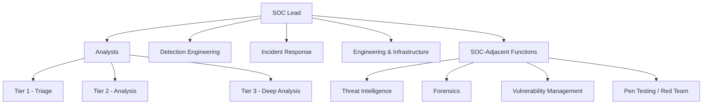
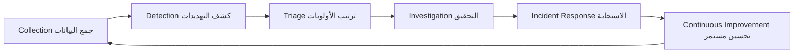

# نظرة عامة على مركز العمليات الأمنية (SOC Overview)

> **المصدر:** SANS SEC450 — Blue Team Fundamentals: Security Operations and Analysis (2022)
>
> **الهدف:** مادة تعليمية عربية لمحللي الأمن — مستوى مبتدئ ومتقدم

---

## Section Objective — هدف هذا القسم

هذا القسم يُجيب على سؤال جوهري واحد:

> **"كيف يُبنى فريق SOC بشكل صحيح، وكيف يعمل فعلاً يومياً؟"**

قبل أن تتعلم كيف تحلل الـ **logs** أو تتعامل مع **SIEM**، يجب أن تفهم الإطار الكامل الذي تعمل فيه.
بدون هذا الفهم، ستكون مجرد شخص يضغط على أزرار — لا محلل أمني حقيقي.

---

## Table of Contents

مكونات العمليات الأمنية  
مهمة الـ SOC والأسئلة الأربعة  
ميثاق الـ SOC ولجنة التوجيه  
مفهوم الـ Risk Appetite  
حقائق أساسية لفريق الـ Blue Team  
الهيكل التنظيمي للـ SOC  
نموذج Tiered vs Tierless  
خطوات عمل الـ SOC من البداية للنهاية  
وظائف الـ SOC الأساسية والمساندة  
المعلومات الحيوية التي يحتاجها كل SOC  
وثائق يجب على كل محلل معرفتها  
مقاييس الأداء (SOC Metrics)

---

## المكونات الأساسية لأي SOC

كل **SOC** ناجح يقوم على ثلاثة أركان — تسمى أحياناً "الكرسي ذو الثلاثة أرجل":

```
        ┌──────────────┐
        │    People    │ ← البشر
        └──────┬───────┘
               │
    ┌──────────┴──────────┐
    │                     │
┌───▼────┐           ┌────▼─────┐
│Process │           │Technology│
│العملية │           │التقنية   │
└────────┘           └──────────┘
```

### 1. People — الأشخاص

- هم **قلب** الـ Blue Team وروحها
- بدون فريق متفاعل ومُدرَّب، لا شيء يعمل
- اختيار الأشخاص الخطأ يُفشل حتى أفضل التقنيات

### 2. Process — العملية

- تُحدد **ماذا** يفعل الفريق و**كيف** يفعله
- بدون عملية محددة، يعمل كل شخص بطريقته الخاصة
- العملية تضمن الاتساق والتكرار والجودة

### 3. Technology — التقنية

- **مُضاعِف** للقوة، وليس بديلاً عن الإنسان
- إذا استطاعت التقنية أن تحل محل المحلل كلياً، فهذا يعني أنه كان يقوم بعمل آلي من البداية
- التقنية تُمكّن من مراقبة كميات ضخمة من البيانات بكفاءة

> **SOC CONTEXT – DERIVED FROM SOURCE:**
> الخطأ الشائع هو الاعتقاد بأن شراء أداة **SIEM** أو **EDR** باهظة الثمن سيحل كل المشاكل.
> الأدوات بدون أشخاص مُدرَّبين وعمليات واضحة = أموال ضائعة.

---

## مهمة الـ SOC — الأسئلة الأربعة الجوهرية

قبل أي شيء، يجب على كل **SOC** أن يُجيب على هذه الأسئلة بوضوح:

| السؤال | ما يعنيه فعلاً |
|--------|----------------|
| **ماذا نحمي؟** | البيانات؟ الأنظمة؟ الخوادم؟ المستخدمون؟ |
| **ما هي التهديدات؟** | مجموعات APT؟ Ransomware؟ Insider Threat؟ |
| **كيف نكشفها؟** | أي أدوات؟ أي logs؟ أي قواعد كشف؟ |
| **كيف نستجيب؟** | Playbooks؟ فرق IR؟ ترتيب الأولويات؟ |

**لماذا هذه الأسئلة مهمة للمحلل؟**

- إذا لم تعرف ماذا تحمي، لن تعرف ما هو الحادث "الخطير" فعلاً
- إذا لم تعرف التهديدات، ستتعامل مع كل تنبيه بنفس الطريقة
- راجع هذه الأسئلة **بشكل دوري** — التهديدات تتغير، والمنظمة تتغير

---

## ميثاق الـ SOC ولجنة التوجيه

### SOC Charter — الميثاق

وثيقة رسمية تُحدد:

- **من نحمي** (Constituency): المستخدمون؟ الشركة كلها؟ فروع معينة؟
- **ماذا نفعل** (Services): مراقبة، استجابة للحوادث، Threat Hunting؟
- **حدود العمل** (Scope): أي شبكات؟ أي أنظمة؟
- **هدفنا الكبير** (Mission): ما الذي يعتبر نجاحاً؟

> الميثاق يُعطي **الصلاحية القانونية** للـ Blue Team لمراقبة الشبكة والتحقيق في الحوادث.
> بدونه، قد تواجه مشاكل قانونية عند الوصول لبعض الأنظمة.

### Steering Committee — لجنة التوجيه

- اجتماع دوري مع أصحاب المصلحة الرئيسيين في المنظمة
- تضمن أن الـ SOC **يخدم أهداف الأعمال** وليس فقط الأهداف التقنية
- تُبقي قنوات التواصل مفتوحة بين الـ SOC والإدارة
- تساعد في تحديد **الأولويات** وتخصيص الموارد

---

## مفهوم Risk Appetite — الشهية للمخاطرة

### ما هو؟

مستوى المخاطرة الذي **تقبل** به المنظمة قبل أن تتحرك لمعالجتها.

| نوع المنظمة | مستوى الـ Risk Appetite |
|-------------|------------------------|
| الجيش والحكومة | منخفض جداً — أي خرق غير مقبول |
| المستشفيات والبنوك | منخفض — بيانات حساسة جداً |
| شركات متوسطة | متوسط — توازن بين الأمان والإنتاجية |
| Startups صغيرة | مرتفع — السرعة أهم من الأمان أحياناً |

### لماذا يهم المحلل؟

- يُحدد **أي تنبيهات تستحق وقتك** وأيها يمكن تجاهلها
- يُحدد **مستوى الضوابط** المطبقة (هل يوجد **EDR**؟ هل يوجد **Zero Trust**؟)
- إذا وجدت ثغرة وأبلغت عنها والإدارة قررت قبول المخاطرة — هذا قرارهم

### مثال عملي من المصدر

> شركة أدوية لديها جهاز يعمل بـ **Windows XP**، ولا يمكن تعديله، ويستخدم **FTP** غير مشفر.
> لا يمكنك إيقافه لأنه يُنتج دواء بقيمة X دولار في الساعة.

**الحل الصحيح:**
- لا تقل "يجب إيقاف هذا الجهاز" — ستُطرد
- طبّق **Compensating Controls** خارجية: جدار حماية خارجي، مراقبة الشبكة، عزل الجهاز
- وثّق المخاطرة وحصل على موافقة كتابية من الإدارة

---

## حقيقتان أساسيتان لكل محلل

### الحقيقة الأولى: الاختراق سيحدث

لا يوجد دفاع مثالي. المسألة ليست **إذا** سيحدث الاختراق، بل **متى** — وكيف ستتعامل معه.

```
النتيجة الجيدة:  المهاجم يدخل → نكشفه بسرعة → نُوقفه قبل تحقيق هدفه
النتيجة السيئة: المهاجم يدخل → لا أحد يلاحظه → يعمل لأشهر → كارثة
```

**ما يُميز الـ SOC الجيد:** القدرة على الكشف السريع وتقليل الضرر.

### الحقيقة الثانية: شركتك لا تعيش لتكون آمنة فقط

- وظيفة الـ SOC هي **منع الخسائر** — مثل حارس أمن المتجر
- الأمان الكامل = توقف الأعمال
- الهدف: **أقصى أمان ممكن بأقل تأثير على الإنتاجية**
- البلاغ عن المخاطر للإدارة مع **معلومات دقيقة وكاملة** = مسؤوليتك

---

## الهيكل التنظيمي للـ SOC



> لا يوجد هيكل "صحيح وحيد" — الأفضل هو ما يجعل الفرق تتواصل وتعمل معاً.

---

## Tiered vs Tierless — نموذجان لتنظيم المحللين

### Tiered SOC — النموذج الطبقي

| Tier | المسؤوليات |
|------|-----------|
| **Tier 1** | Triage أولي، فتح التذاكر، التحقق السريع من التنبيهات |
| **Tier 2** | تحليل عمق أكبر، تحديد نطاق الهجوم، دعم الاستجابة |
| **Tier 3** | تحليل معقد، Malware Reverse Engineering، Memory Forensics، Threat Hunting |

**المزايا:** مسار واضح للترقية، عملية منظمة  
**العيوب:** قد يُحبط المحللين الجدد، "باب دوّار" إذا كانت القيود مفرطة

### Tierless SOC — النموذج المسطح

- الجميع يعمل على كل شيء
- المحللون الجدد يتعلمون بشكل أسرع
- تعاون أقوى وتحفيز أعلى
- **لكن:** يتطلب أن يعرف الجميع حدوده وأن يطلب المساعدة عند الحاجة

> **SOC CONTEXT – DERIVED FROM SOURCE:**
> أكثر من نصف المحللين في الدورات التدريبية يصفون فرقهم كـ "Tierless" بشكل أو بآخر.
> كلا النموذجين صحيح — الاختيار يعتمد على احتياجات المنظمة.

---

## خطوات عمل الـ SOC يومياً



### شرح كل خطوة

**Collection — الجمع:**
استقبال البيانات الأمنية من **logs**، شبكة، **endpoints**

**Detection — الكشف:**
استخدام **SIEM**, **IDS**, **EDR** لرصد الأنشطة المشبوهة وتحويلها لتنبيهات

**Triage — الفرز:**
اختيار **أهم** التنبيهات للتعامل معها أولاً — حياة المحلل اليومية تبدأ هنا

**Investigation — التحقيق:**
التحقق هل هذا **False Positive** أم هجوم حقيقي؟ وما نطاقه؟

**Incident Response — الاستجابة:**
احتواء الهجوم، إزالة المهاجم، استعادة البيئة

**Continuous Improvement — التحسين:**
بعد كل حادث: ماذا تعلمنا؟ كيف نكتشف هذا بشكل أفضل في المستقبل؟

---

## وظائف الـ SOC: الأساسية والمساندة

### Core SOC Functions — الوظائف الأساسية

| الوظيفة | ما تفعله |
|---------|---------|
| **Data Collection** | مراقبة الشبكة والأجهزة وجمع الـ logs |
| **Detection** | رصد التهديدات عبر **SIEM**, **IDS**, **AV** |
| **Triage & Investigation** | ترتيب وتحقيق التنبيهات |
| **Incident Response** | الاستجابة للحوادث المؤكدة |

### Auxiliary Capabilities — القدرات المساندة

| القدرة | دورها |
|--------|-------|
| **Threat Intelligence** | معلومات استراتيجية وتكتيكية عن المهاجمين |
| **Forensics** | التحقيق العميق بعد الاختراق |
| **Self-Assessment** | اختبار نقاط الضعف، Red Team، Vuln Management |

> الفرق الصغيرة غالباً تجمع كل هذه الوظائف في شخص واحد أو فريق صغير.

---

## المعلومات الحيوية التي يجب أن يمتلكها كل SOC

قائمة المعلومات التي يجب أن تكون متاحة لكل محلل:

- **Network Diagram** — رسم مبسط للشبكة وأين تتدفق البيانات
- **Points of Visibility** — أين يمكن رؤية حركة المرور (Taps, SPAN Ports, Full PCAP)
- **Log Flow Diagram** — من أين تأتي الـ logs وإلى أين تذهب
- **Incident Response Plan** — ماذا نفعل عند وقوع حادث
- **Communication Plan** — من نُبلغ وكيف ومتى
- **Critical Assets List** — أي أنظمة تحوي أهم البيانات

> **لماذا مهم للمحلل؟**
> عندما يُطلق تنبيه، السؤال الأول هو: "هل كنا سنرى هذه الحركة أصلاً؟"
> بدون معرفة نقاط الرؤية، ستُجيب خطأ وقد تستنتج أن الاختراق لم يحدث لأنه لا توجد logs — بينما المشكلة أنك لا تجمعها أصلاً.

---

## الوثائق التي يجب أن يعرفها المحلل

| نوع الوثيقة | ما هي | إلزامية؟ |
|-------------|-------|---------|
| **Policy** | إرشادات عامة ("يجب تركيب Antivirus") | نعم |
| **Standard** | تفاصيل التطبيق ("إعدادات AV يجب أن تكون...") | نعم |
| **Procedure** | خطوات تنفيذية محددة | نعم |
| **Guideline** | اقتراحات وأفضل الممارسات | لا |
| **Baseline** | قائمة إعدادات دقيقة (مثل CIS Benchmarks) | نعم |
| **Playbook/Use Case** | منطق الكشف والاستجابة في الـ SIEM | خاص بالـ SOC |

> **الـ Playbook** هو الوثيقة الأكثر عملية للمحلل — يُحدد بالضبط ماذا تفعل عند كل نوع من التنبيهات.

---

## مقاييس الأداء — SOC Metrics

### لماذا تهمك كمحلل؟

**ستُحكَم** على عملك بناءً على مقاييس. إذا كانت المقاييس خاطئة، ستعمل بطريقة خاطئة.

### معايير المقياس الجيد

```
✅ مرتبط بهدف واضح — يجيب على سؤال محدد
✅ قابل للتنفيذ — يوجد عتبة تُحرك قراراً
✅ موحّد ومتكرر — نفس الشخصين يحسبانه = نفس الناتج
✅ محدَّث تلقائياً — لا يستغرق ساعات لحسابه
```

### السؤال الذهبي

> **"إذا تحسّن هذا المقياس، هل تحسّن الأمان فعلاً؟"**
> إذا كانت الإجابة "لا" — المقياس خاطئ.

**أمثلة على مقاييس مفيدة:**

- متوسط وقت الكشف عن الحوادث (Mean Time to Detect)
- متوسط وقت الاستجابة (Mean Time to Respond)
- عدد الحوادث الحرجة في الشهر
- نسبة الـ False Positives لكل قاعدة كشف

---

## 🧠 Key Takeaways — النقاط الأساسية

- **People, Process, Technology** هي الأركان الثلاثة التي يقوم عليها كل SOC ناجح
- الأسئلة الأربعة (ماذا نحمي؟ ما التهديدات؟ كيف نكشف؟ كيف نستجيب؟) تُحدد مهمة الـ SOC
- **SOC Charter** يعطي الفريق الصلاحية القانونية والتشغيلية للعمل
- **Risk Appetite** يُحدد مستوى الضوابط المطلوبة ولا يمكن تجاهله
- الاختراق **سيحدث** — الفارق هو مدى سرعة كشفك وتقليل الضرر
- فريق الـ SOC لا يعمل بمعزل — يجب التوافق مع أهداف الأعمال
- **Tiered** و**Tierless** كلاهما صحيح — الاختيار يعتمد على السياق
- الـ Metrics يجب أن تعكس الواقع الأمني الحقيقي، وليس أرقاماً تبدو جيدة فقط
- وجود خطة استجابة ومعلومات الشبكة مسبقاً يُنقذك في وسط الحوادث

---

## 👨‍💻 منظور محلل الـ SOC

**يومياً، المحلل يفكر هكذا:**

1. فتح قائمة التنبيهات → **الأهم أولاً** (الأنظمة الحيوية، الحسابات ذات الصلاحيات العالية)
2. قبل التحقيق: "هل لدي logs كافية لهذا الحادث؟ أين نقاط الرؤية؟"
3. عند التحقيق: "هل هذا False Positive أم هجوم حقيقي؟ ما نطاقه؟"
4. بعد الإغلاق: "ماذا تعلمنا؟ هل يجب تحديث الـ Playbook؟"

**متى تستخدم هذا القسم في التحقيق؟**

- عند السؤال "هل لدينا logs لهذا الحادث؟" → راجع خارطة نقاط الرؤية
- عند السؤال "من أُبلغ؟" → راجع خطة التواصل
- عند السؤال "ما مدى خطورة هذا الحادث؟" → راجع قائمة الأصول الحيوية وقارن بالـ Risk Appetite

---

## 🔍 Detection Mindset — عقلية الكشف

### مؤشرات تدل على مشكلة في الـ SOC

- تنبيهات كثيرة لا يُتعامل معها → مشكلة في الـ **Triage** أو كثرة **False Positives**
- محللون يتركون الفريق باستمرار → مشكلة في **People** أو هيكل العمل
- حوادث تُكتشف متأخراً → مشكلة في **Detection** أو **Collection**
- لا يوجد خطة استجابة واضحة → مشكلة في **Process**

### منطق الكشف الصحيح

```
بيانات جيدة (Input جيد)
    ↓
قواعد كشف صحيحة
    ↓
تنبيهات عالية الجودة (قليلة False Positives)
    ↓
محللون يُركزون على التهديدات الحقيقية
    ↓
Garbage In = Garbage Out
```

---

## ملاحظة ختامية

هذا القسم يُمثل **الأساس النظري** لكل ما سيأتي في رحلتك كمحلل SOC.
فهم هذه المفاهيم يجعلك تتعامل مع الأدوات والـ logs والتنبيهات بعقلية مختلفة —
عقلية **محلل يفهم السياق الكامل**، لا مجرد مشغّل أدوات.

---

*المصدر: SANS SEC450 — Blue Team Fundamentals: Security Operations and Analysis © 2022 SANS Institute*
*هذا المحتوى للأغراض التعليمية فقط*
