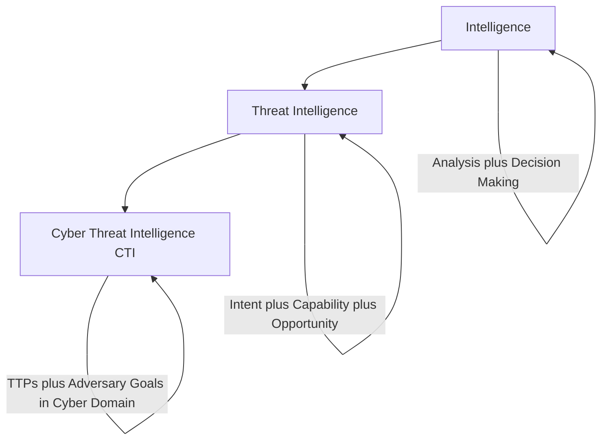
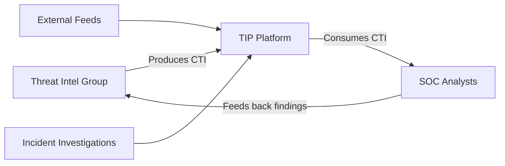
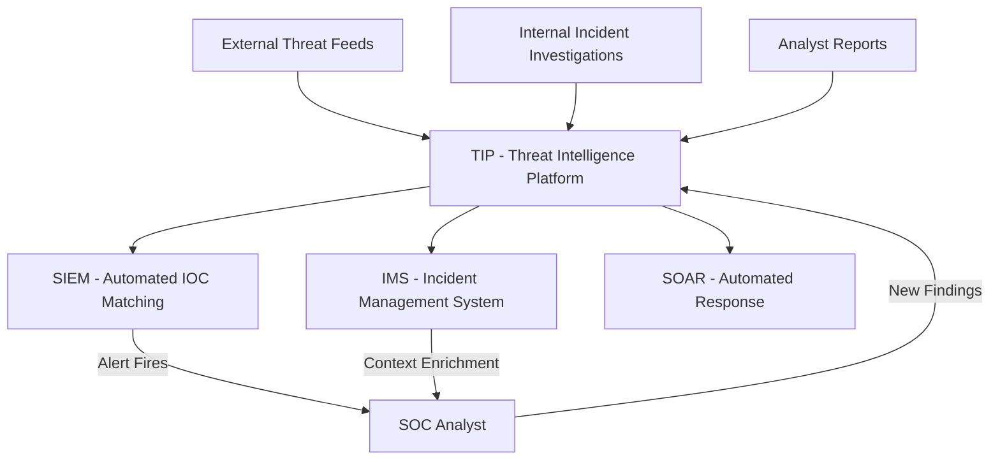
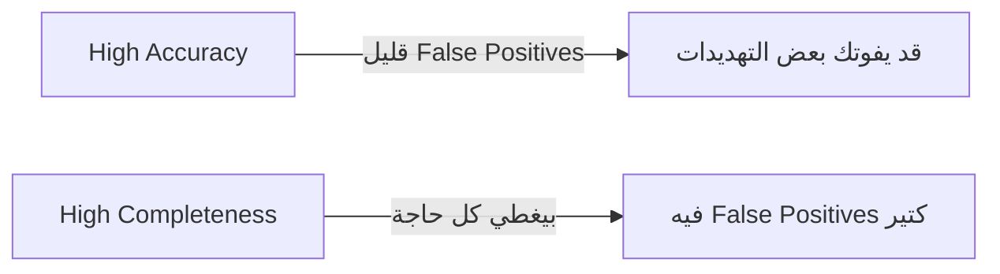
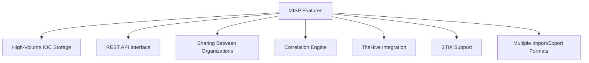
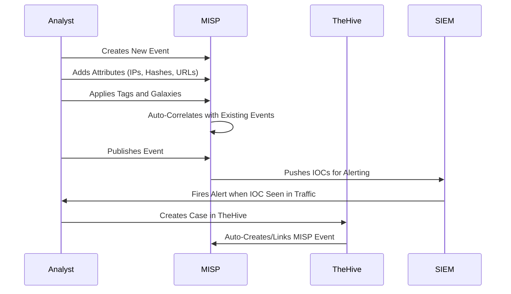
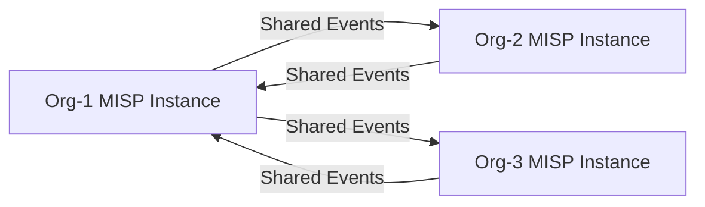

> **الهدف من الـ Section ده:**  
> هنفهم إيه هو الـ Cyber Threat Intelligence (CTI) وإزاي بيساعد الـ Blue Team إنهم يتفوقوا على المهاجمين، وهنتعلم إزاي نستخدم الـ Threat Intelligence Platforms (TIPs) زي MISP عشان نخزن ونشارك المعلومات دي بشكل فعّال.
---

## Table of Contents

- [Introduction](#introduction)
- [What Is Intelligence](#what-is-intelligence)
- [What Is a Threat](#what-is-a-threat)
- [What Is Cyber Threat Intelligence CTI](#what-is-cyber-threat-intelligence-cti)
- [Good vs Bad CTI](#good-vs-bad-cti)
- [Threat Intelligence Platforms TIP](#threat-intelligence-platforms-tip)
- [TIP Features and Requirements](#tip-features-and-requirements)
- [De-fanged Indicators](#de-fanged-indicators)
- [TIP Workflow](#tip-workflow)
- [Threat Intel Feeds and ISACs](#threat-intel-feeds-and-isacs)
- [MISP Platform](#misp-platform)
- [MISP Terminology](#misp-terminology)
- [MISP Workflow](#misp-workflow)
- [MISP Events and Correlation](#misp-events-and-correlation)
- [Summary](#summary)

---

## Introduction

الـ Cyber Threat Intelligence موضوع بيتكلم عنه كتير، بس كتير منا مش عارف تعريفه الصح. كتير ناس بتعتقد إن الـ CTI هو مجرد "قائمة بالـ IPs والـ Domains الخطرة"، بس ده تعريف ناقص جداً.

الـ CTI الحقيقي هو **معلومات محللة** بتديك ميزة استراتيجية وتكتيكية على المهاجمين. الهدف منه إنك تفهم:
- **مين** هو المهاجم؟
- **إزاي** بيهاجم؟
- **ليه** بيهاجم؟
- **إمتى** ممكن يهاجم؟

الفكرة الأساسية هي **"Offense informs defense"** — يعني اللي تعرفه عن طريقة هجوم الخصم بتستخدمه عشان تتحصن.

---

## What Is Intelligence

### التعريف الأساسي

> "Taking in external information from a variety of sources and analyzing it against existing requirements in order to provide an assessment that will affect decision making."
> — Scott J. Roberts & Rebekah Brown, *Intelligence-Driven Incident Response*

الـ Intelligence مش مجرد "جمع معلومات" — لازم يكون فيه:

1. **جمع المعلومات** من مصادر متعددة
2. **تحليل** المعلومات دي
3. **مقارنتها** باحتياجات محددة مسبقاً
4. **إنتاج تقييم** بيأثر على القرارات

### أمثلة من الحياة اليومية

| مثال | الـ Input | الـ Analysis | الـ Decision |
|------|-----------|--------------|--------------|
| تقرير الطقس | بيانات الجو | هل هتمطر؟ | هاخد شمسية؟ |
| تقرير المرور | كثافة السيارات | كام وقت في الطريق؟ | هخرج امتى؟ |
| CTI | بيانات المهاجمين | هل هيهاجموا؟ | هتحمي إيه؟ |

---

## What Is a Threat

### تعريف الـ Threat

Rob M. Lee من SANS بيقول إن الـ Threat هو **تركيبة من 3 عناصر**:

```
Threat = Intent + Capability + Opportunity
```

| العنصر | المعنى | مثال |
|--------|--------|------|
| **Intent** | رغبة المهاجم في استهدافك | مجموعة APT بتستهدف قطاع البنوك |
| **Capability** | قدرتهم على تنفيذ الهجوم | عندهم Malware متقدم وخبرة عالية |
| **Opportunity** | الفرصة المتاحة ليهم | عندك Vulnerability غير محدثة |

> [!IMPORTANT]
> لو أي عنصر من الـ 3 ده غايب، مفيش تهديد حقيقي. لو المهاجم عنده Intent وCapability بس مفيش Opportunity (يعني شبكتك محمية)، مش هيقدر يهاجمك.

---

## What Is Cyber Threat Intelligence CTI

### التعريف الكامل

> "Threat intelligence is the analysis of adversaries — their capabilities, motivations, and goals; and cyber threat intelligence (CTI) is the analysis of how adversaries use the cyber domain to accomplish their goals."
> — Scott J. Roberts & Rebekah Brown

### العلاقة بين المفاهيم الثلاثة



### خصائص الـ CTI الجيد

- **لازم يكون محلَّل** — مش مجرد raw data
- **لازم يحدد الـ TTPs** (Tactics, Techniques, and Procedures) للمهاجم
- **لازم يأثر على القرارات** — يعني actionable
- **لازم فيه human analysis** — الـ automation لوحده مش كفاية

---

## Good vs Bad CTI

### المشكلة الشائعة

كتير من الـ SOCs بتستلم Threat Intel مش كاملة، زي:

**CTI ضعيف (بدون Context):**
```
The IOC "hxxp://malwareC2[.]net" was associated with 
a Trojan.SuperMalware campaign in June 2020.
```

السؤال اللي بيطرحه المحلل: "طب أنا هعمل إيه بالمعلومة دي؟"

### الصيغة الصح

**CTI قوي (مع Context):**
```
On 6/10/2020 spoofed "email[@]spoofedomain[.]com" sent "Invoice" themed emails 
that included the malicious URL "hxxp://totallynotlegit[.]com/probablymalware[.]exe" 
[MD5: 32 characters] (T1566.002), which is detected as Trojan.SuperMalware.

When executed, "probablymalware[.]exe" creates a Scheduled Task named "DoingBadStuff" 
(T1053.005) and begins C2 over port 443 to "hxxp://malwareC2[.]net" (T1071.001).
```

### المعادلة الذهبية

```
IOC = Observable + Context
```

| المكوّن | المعنى | مثال |
|---------|--------|------|
| **Observable** | المؤشر الخام | IP عنوان: 1.2.3.4 |
| **Context** | السياق اللي بيشرحه | "ده كان C2 Server لـ APT28 في هجوم على قطاع الطاقة في مارس 2024" |

> [!WARNING]
> لو الـ TIP بتاعك مش بيخزن Context مع كل IOC، أنت مش عندك TIP — أنت عندك **Observable Aggregator** بس. ده مش كافي ويضيّع وقت المحللين.

---

## Threat Intelligence Platforms TIP

### إيه هو الـ TIP؟

الـ Threat Intelligence Platform هو نظام متخصص لـ:
- **تخزين** معلومات التهديدات والـ Indicators
- **البحث** السريع في البيانات
- **الربط** بين الأحداث المختلفة
- **المشاركة** مع منظمات تانية
- **التكامل** مع أدوات الـ SOC الأخرى

### Producers vs Consumers



> [!NOTE]
> الـ TIP **مش بينتج** الـ Intelligence لوحده. هو بس بيخزنه وبيتيحه. الـ Intelligence بييجي من تحليل البشر أو من External Feeds.

---

## TIP Features and Requirements

### الـ Features الأساسية

| Feature | الوصف | الأهمية |
|---------|--------|---------|
| **IOC Storage** | تخزين IPs, Domains, Hashes, URLs | ضرورية |
| **Context Recording** | تخزين التفاصيل مع كل IOC | ضرورية جداً |
| **API Integration** | الربط مع SIEM, IMS, SOAR | ضرورية |
| **Bulk Import/Export** | استيراد وتصدير كميات كبيرة | مهمة |
| **Correlation Engine** | الربط التلقائي بين الأحداث | مهمة جداً |
| **Sharing Capability** | مشاركة المعلومات مع منظمات أخرى | مفيدة |

### أسئلة قبل اختيار الـ TIP

قبل ما تختار الـ TIP المناسب، اسأل نفسك:

1. هل محتاج تخزن **Malware Configurations** وحقول غير تقليدية؟
2. إزاي هتربط بين الـ Events المخزنة؟
3. هل المشاركة مع منظمات خارجية مطلوبة؟
4. كام **حجم الـ Indicators** اللي هتخزنها؟

---

## De-fanged Indicators

### المشكلة

لما بتكتب URLs أو IPs في Reports أو Slack أو Excel، ممكن يتحولوا لـ **Links قابلة للضغط**، وده خطير جداً لو غلطاً حد ضغط عليهم.

### الحل: De-fanging

بدل ما تكتب الـ Indicator العادي، بتعمل تعديلات بسيطة عشان يبطل يكون clickable:

| النوع | الأصلي | De-fanged |
|-------|---------|-----------|
| **URL** | `http://evil.com/malware` | `hxxp://evil[.]com/malware` |
| **IP Address** | `1.2.3.4` | `1[.]2[.]3[.]4` |
| **Domain** | `evilsite.com` | `evilsite[.]com` |
| **Email** | `attacker@evil.com` | `attacker[@]evil[.]com` |

### أمثلة من Incidents حقيقية

```
hxxp://satkas.waw[.]pl/rainloop/forecast    -> TrailBlazer C2
vm-srv-1.gel.ulaval[.]ca                   -> GoldMax C2
156[.]96[.]46[.]116                         -> Threat Actor Infrastructure
188[.]34[.]185[.]85                         -> Threat Actor Infrastructure
```

> [!TIP]
> دايماً استخدم الـ De-fanging لما بتشارك IOCs في أي مكان — Reports, Tickets, Chat, Email. ده Standard متعارف عليه في الـ Security Community.

---

## TIP Workflow

### كيف يندمج الـ TIP مع بقية أدوات الـ SOC



### الـ Data Flow في الـ TIP

**الـ Input:**
- External Feeds (مجانية وتجارية)
- نتائج التحقيقات الداخلية
- تقارير المحللين
- مشاركة من منظمات تانية

**الـ Output:**
- IOC Lists للـ SIEM
- Context للـ IMS عند فتح Tickets
- Automated Actions عبر الـ SOAR
- Shared Events مع منظمات تانية

---

## Threat Intel Feeds and ISACs

### أنواع الـ Threat Feeds

| النوع | المزايا | العيوب |
|-------|---------|--------|
| **Open Source / Free** | مجانية، متاحة للكل | أقل دقة، تحتاج فلترة |
| **Commercial** | دقة عالية، Support | تكلفة عالية |
| **Industry-Specific (ISACs)** | ملائمة لقطاعك | محدودة بالأعضاء |

### معايير تقييم الـ Feed

**1. Relevance (الملاءمة)**
هل الـ Feed ده بيغطي التهديدات اللي بتواجهها في قطاعك؟

**2. Speed (السرعة)**
كام وقت بين ما يحصل الهجوم وما يظهر في الـ Feed؟

**3. Accuracy vs Completeness (الدقة مقابل الشمولية)**



> [!NOTE]
> مفيش Feed مثالي. محتاج توازن بين الدقة والشمولية حسب احتياجات منظمتك.

### الـ ISACs (Information Sharing and Analysis Centers)

الـ ISACs هي منظمات متخصصة بتجمع الشركات في نفس القطاع عشان يشاركوا معلومات التهديدات. الانضمام ليهم **مهم جداً** عشان تاخد intel ملائمة لقطاعك.

| الـ ISAC | القطاع |
|----------|---------|
| **H-ISAC** | الصحة (Health) |
| **FS-ISAC** | الخدمات المالية |
| **IT-ISAC** | تكنولوجيا المعلومات |
| **E-ISAC** | الطاقة |
| **MS-ISAC** | الحكومات المتعددة |
| **A-ISAC** | الطيران |

---

## MISP Platform

### إيه هو MISP؟

الـ **MISP (Malware Information Sharing Platform)** هو أشهر TIP مجاني ومفتوح المصدر. بيستخدمه منظمات كبيرة جداً وهو الـ de-facto standard في الـ Open Source Threat Intelligence.

### مميزاته الرئيسية



### الـ Products التانية في السوق

**مجانية (Open Source):**
- **MISP** — الأكثر شيوعاً
- **OpenCTI** — خيار حديث ومتطور

**تجارية (Commercial):**
- **Palo Alto XSOAR TIM**
- **ThreatConnect**
- **CrowdStrike Falcon X**
- **Recorded Future**
- **IBM X-Force Exchange**
- **Anomali ThreatStream**

> [!IMPORTANT]
> الـ TIP التجاري مش بيعمل Intelligence لك. هو بس بيخزن ويعرض اللي أنت بتجمعه. لو عايز Threat Intelligence vendor بيعمل تحليل، ده منتج تاني تماماً.

---

## MISP Terminology

### المصطلحات الأساسية في MISP

#### Events (الأحداث)

الـ **Event** هو الكيان الأساسي في MISP. كل تحقيق، malware sample، أو حادثة بتخلق ليها Event منفصل. كل Event بيحتوي على:
- **ID** فريد
- **Title** وصفي
- **Date** تاريخ الحادثة
- **Tags** تصنيفات
- **Attributes** التفاصيل

#### Attributes (السمات)

الـ **Attributes** هي البيانات الفعلية المرتبطة بالـ Event. ممكن تكون:

| نوع الـ Attribute | مثال |
|-------------------|------|
| **IP Address** | 192.168.1.100 |
| **Domain** | evilsite[.]com |
| **MD5 Hash** | d41d8cd98f00b204e9800998ecf8427e |
| **SHA256 Hash** | e3b0c44298fc1c149... |
| **URL** | hxxp://evil[.]com/payload |
| **Email Subject** | "Your Invoice is Ready" |
| **Filename** | invoice.doc |
| **User-Agent** | Mozilla/5.0 (compatible malware) |

#### Classification Features

| Feature | الوظيفة |
|---------|---------|
| **Sightings** | بيعدّ كام مرة شُفت الـ IOC ده (True/False Positives) |
| **Tags** | labels إضافية على الـ Events |
| **Taxonomies** | مجموعات جاهزة من الـ Tags (زي TLP, Kill Chain) |
| **Galaxies** | تصنيفات معقدة (Threat Actors, Malware Families, MITRE ATT&CK) |

### الـ TLP (Traffic Light Protocol)

الـ TLP هو نظام تصنيف لمشاركة المعلومات:

| التصنيف | اللون | المعنى |
|---------|-------|---------|
| **TLP:WHITE** | أبيض | ممكن تشاركه مع أي حد |
| **TLP:GREEN** | أخضر | تشاركه داخل المجتمع المهني |
| **TLP:AMBER** | برتقالي | محدود على المنظمة والعملاء |
| **TLP:RED** | أحمر | سري جداً، للمستلم بس |

---

## MISP Workflow

### الاستخدام اليدوي (Manual Usage)



### الاستخدام التلقائي (Automated Usage)

- الـ **SIEM** بيعمل API calls للـ MISP عشان يتحقق من الـ IOCs
- الـ **SOAR** بيسحب Context من الـ MISP أوتوماتيك لما Alert بيطلع
- الـ **Subscribed Feeds** بتنزل Events جديدة تلقائياً
- الـ **TheHive** بيعمل MISP Events تلقائياً من الـ Cases

---

## MISP Events and Correlation

### قوة الـ Correlation في MISP

فكرة الـ Correlation هي إن لما بتضيف IOC جديد، الـ MISP بيدور تلقائياً في كل الـ Events اللوقتها ويشوف لو نفس الـ IOC اتشاف قبل كده.

**مثال عملي:**

```
Event 1 (هجوم يناير):
  source_ip: 12.34.56.78
  domain: evilsite[.]com
  filename: shipment_received.xls
  hash: 298a736489bdfe869      <-- نفس الـ Hash!
  Tags: kill-chain:delivery, trojan
  Galaxy: APT99

Event 2 (هجوم مارس):
  source_ip: 100.200.55.66    <-- IP مختلف
  domain: goooogle[.]com      <-- Domain مختلف
  filename: invoice.doc        <-- اسم ملف مختلف
  hash: 298a736489bdfe869      <-- نفس الـ Hash!
  Tags: kill-chain:delivery
```

لما المحلل بيضيف الـ Event 2، الـ MISP بيلاحظ تلقائياً إن الـ Hash موجود في الـ Event 1، وبيربطهم ببعض.

**النتيجة:** المحلل بيعرف فوراً إن:
- الهجومين من نفس المجموعة (APT99)
- الاسنة المستخدمة هي نفسها
- domain الـ goooogle[.]com ده infrastructure جديد لـ APT99

### الـ Sharing بين المنظمات



كل منظمة بتحدد إيه الـ Events اللي هتشاركها، والـ MISP بيعمل Sync تلقائي.

---

## Summary

### النقاط الأساسية

- **الـ CTI** هو معلومات محللة (مش مجرد قائمة IOCs) بتديك ميزة على المهاجم
- **الـ Threat** = Intent + Capability + Opportunity — لو واحد غايب مفيش تهديد
- **الـ IOC الجيد** = Observable + Context — بدون Context الـ IOC بيضيع وقت المحللين
- **الـ TIP** هو أداة تخزين وإدارة، مش بيعمل Intelligence لوحده
- **الـ De-fanging** ضروري لأي IOC بتشاركه في أي وثيقة أو تطبيق
- **الـ MISP** هو أشهر TIP مجاني وبيدعم Correlation وSharing بين المنظمات
- **الـ ISACs** هي مصادر مهمة للـ Industry-Specific Threat Intel
