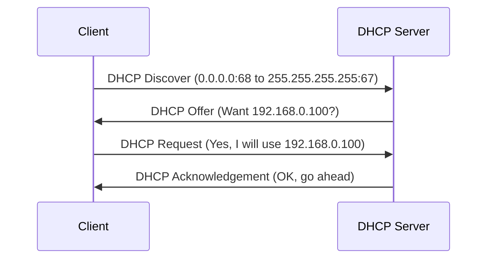
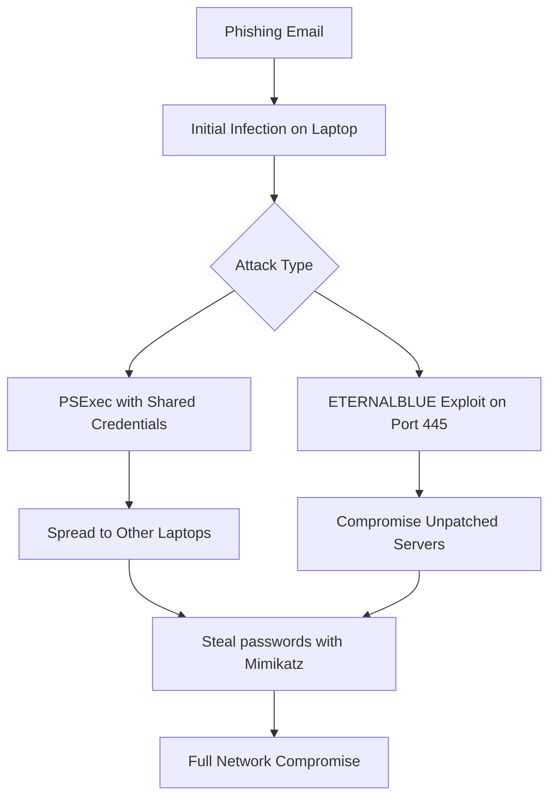
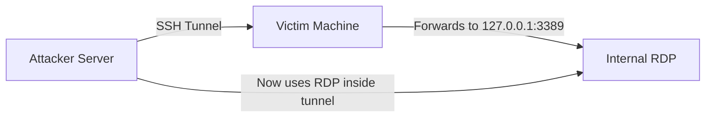
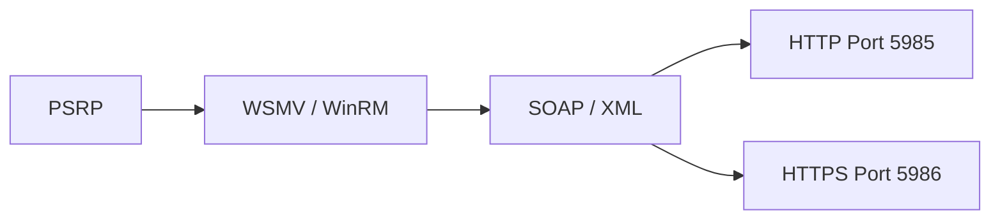
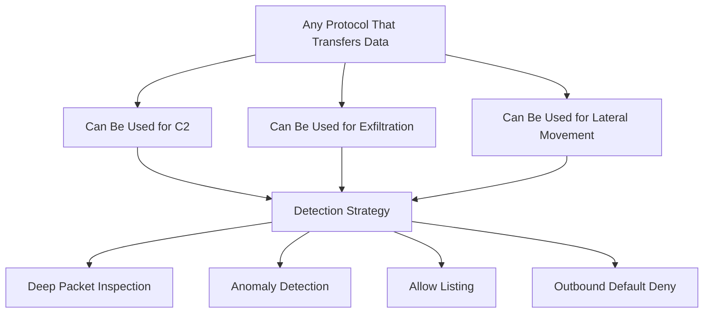

> **الهدف من الـ Section ده:**
> هنتعلم إزاي البروتوكولات الشائعة زي DHCP و SMB و SSH و RDP و FTP و ICMP ممكن تتحول من أدوات شغل يومي لأسلحة في إيد المهاجمين، وإزاي نراقبها ونحمي بيها الشبكة.

---

## Table of Contents
- [Introduction](#introduction)
- [DHCP for Defenders](#dhcp-for-defenders)
- [SMB - Server Message Block](#smb---server-message-block)
- [SSH - الصديق والعدو](#ssh---الصديق-والعدو)
- [RDP and VNC](#rdp-and-vnc)
- [PowerShell Remoting](#powershell-remoting)
- [FTP - Legacy Danger](#ftp---legacy-danger)
- [Evil ICMP](#evil-icmp)
- [Remote Access Tools](#remote-access-tools)
- [Is Any Protocol Safe](#is-any-protocol-safe)
- [Summary](#summary)

---

## Introduction

لما بنتكلم عن الـ Network Security، معظم الناس بيفكر في الـ Firewall والـ IDS والـ Antivirus. لكن الحقيقة إن الـ Protocols العادية اللي بنستخدمها كل يوم — زي الـ DHCP اللي بييدي IP، أو الـ SMB اللي بنشارك بيه الملفات — هي نفسها اللي المهاجمين بيستخدموها للـ Lateral Movement والـ Exfiltration.

الـ Blue Team لازم يفهم كل بروتوكول من ناحيتين:
1. **إيه وظيفته الأصلية؟**
2. **إزاي ممكن يتساء استخدامه؟**

---

## DHCP for Defenders

### إيه هو الـ DHCP؟

الـ DHCP (Dynamic Host Configuration Protocol) هو البروتوكول اللي بييدي كل Device على الشبكة IP Address أوتوماتيك. من غيره، كل واحد كان هيضطر يحط IP يدوياً.

### ليه الـ DHCP مهم للـ Analyst؟

لما يطلع Alert على IP معين، أول سؤال بيطرحه الـ Analyst: **"مين اللي كان شايل الـ IP ده وقت الحادثة؟"**

الـ DHCP Logs هي الوصلة بين:
```
IP Address  →  Hostname (Computer Name)  →  User/Owner
```

### استخدام الـ DHCP في كشف الـ Rogue Devices

الـ DHCP بيسجل ٣ معلومات مهمة لكل Device اتوصل بالشبكة:

| المعلومة | الاستخدام الأمني |
|----------|-----------------|
| Hostname | مطابقته مع نمط التسمية المعتمد في الشركة |
| IP Address | ربطه بالـ Logs التانية |
| MAC Address | تحديد المصنّع عن طريق الـ OUI |

### الـ MAC Address OUI

الـ OUI (Organizationally Unique Identifier) هو أول ٣ octets من الـ MAC Address. بيحدد مين صنع الـ Device.

**مثال:**
```
MAC Address: 11:22:33:44:55:66
OUI:         11:22:33  →  Dell, HP, Lenovo, etc.
```

لو الشركة بتستخدم Dell laptops بس، وطلع MAC بـ OUI خاص بـ Raspberry Pi — ده Alarm كبير!

### عملية الـ DHCP - الـ DORA Process



**الخطوات:**
1. **Discover** — الـ Client بيبعت Broadcast بيقول "أنا محتاج IP"
2. **Offer** — الـ Server بيعرض IP
3. **Request** — الـ Client بيقبل العرض
4. **Acknowledge** — الـ Server بيأكد ويدي الـ Lease

> [!NOTE]
> الـ DHCP بيشتغل على UDP. الـ Discover والـ Request بييجوا من Port 68، والـ Offer والـ Acknowledge بييجوا من Port 67.

> [!WARNING]
> الـ Hostname والـ MAC Address هما Self-Reported — يعني الـ Device هو اللي بيقولهم. المهاجم الذكي ممكن يعمل MAC Spoofing ويشبه Device موجود فعلاً.

---

## SMB - Server Message Block

### إيه هو الـ SMB؟

الـ SMB (Server Message Block) هو البروتوكول اللي بيمكن الـ Windows File Sharing. بيشتغل على **Port 445** بشكل افتراضي.

على Linux، نفس الوظيفة بتتعمل عن طريق **Samba**.

### ليه الـ SMB خطير جداً؟

> [!IMPORTANT]
> الـ SMB مش بس بيشارك الملفات. هو بيدي المهاجم القدرة إنه يـ Execute أي Command على الـ Remote Machine لو عنده Admin Credentials.

**المعادلة الخطيرة:**
```
Shared Admin Password + No Firewall Segmentation + Port 445 Open
= Full Network Compromise من Machine واحدة!
```

### إصدارات الـ SMB

| الإصدار | نظام التشغيل | الحالة |
|---------|-------------|--------|
| CIFS | Windows NT 4.0 | خطير جداً |
| SMB1 | Windows XP, Server 2000/2003 | يجب تعطيله فوراً |
| SMB2 | Windows Vista, Server 2008 | يفضل تعطيله |
| SMB2.1 | Windows 7, Server 2008 R2 | مقبول بحذر |
| SMB3.0/3.02 | Windows 8/8.1, Server 2012 | آمن نسبياً |
| SMB3.1 | Windows 10, Server 2016 | الأحدث والأكثر أماناً |

> [!WARNING]
> **SMB1 يجب تعطيله فوراً!** الـ WannaCry و NotPetya انتشرا بسرعة رهيبة بسبب SMB1. معظم الـ Equation Group exploits كانت تستهدفه.

### أنواع هجمات الـ SMB



**نوع ١ - PSExec مع Shared Credentials:**
لو الشركة بتستخدم نفس الـ Admin Password على كل الأجهزة، المهاجم بيستخدم PSExec يتحرك من جهاز لجهاز بدون أي استغلال.

**نوع ٢ - SMB Exploit:**
زي ETERNALBLUE اللي استخدمه WannaCry وNotPetya. لو الجهاز مش متحدّث والـ Port 445 مفتوح، الجهاز هيتسيطر عليه.

---

## SSH - الصديق والعدو

### إيه هو الـ SSH؟

الـ SSH (Secure Shell) هو بروتوكول بيخلي الـ Admin يدخل على الـ Remote Server بشكل مشفر وآمن. بيشتغل على **Port 22**.

### الـ SSH في إيد المهاجم

الـ SSH مش بس للـ Remote Login. هو بروتوكول قادر على:

| الاستخدام الشرير | الشرح |
|----------------|-------|
| Data Exfiltration | رفع ملفات مسروقة عبر SFTP - مشفر! |
| Poor Man's VPN | عمل Reverse Tunnel يخلي الـ External Machine كأنه جوا الشبكة |
| Port Forwarding | تمرير حركة بروتوكول تاني (زي RDP) داخل الـ SSH Tunnel |
| X11 Forwarding | فتح GUI Applications على الـ Victim Machine عن بُعد |

### حالة حقيقية: SSH Tunnel لـ RDP



**الخطوات:**
1. الـ Victim بيسمح بـ Outbound SSH لأي مكان
2. المهاجم بيقنع الـ Victim يعمل `plink` (PuTTY) لـ Server خارجي مع Port Forwarding
3. الـ Tunnel بيحول الـ Port 3389 على الـ Victim لـ External Server
4. المهاجم بيستخدم RDP عبر الـ Tunnel — الكل مشفر!

> [!IMPORTANT]
> الـ SSH Tunnel بيخفي كل حركة المرور. من برّه بيبان SSH فقط. جوّه ممكن يكون RDP أو SMB أو أي بروتوكول تاني.

### إزاي نحمي نفسنا من سوء استخدام الـ SSH؟

- **Allow Listing:** SSH يتسمح بس من Subnets معينة لـ Destinations محددة
- **Monitor:** مراقبة كل Traffic على Port 22
- **Restrict:** منع الـ Users العاديين من SSH Access

---

## RDP and VNC

### الـ RDP (Remote Desktop Protocol)

الـ RDP بييدي GUI Access لـ Windows Machines عن بُعد. بيشتغل على **Port 3389 TCP**.

**ليه المهاجم بيحبه؟**
- بيبان زي Legitimate Admin Activity
- بيدي Full Graphical Access
- متاح على معظم الـ Windows Machines

**إجراءات الحماية:**

| الإجراء | الوصف |
|---------|--------|
| Firewall Block | منع Port 3389 من الـ Internet وبين الـ Subnets |
| Account Restriction | تحديد مين يقدر يستخدم RDP |
| NetFlow Monitoring | مراقبة كل Traffic على Port 3389 |
| Windows Login Events | تحليل Event ID 4624/4625 لـ RDP Logons (LogonType 10) |

### الـ VNC (Virtual Network Computing)

الـ VNC بيشتغل على **Port 5900** بشكل افتراضي. هو Cross-Platform لكن معظم إصداراته غير آمنة.

> [!WARNING]
> الـ VNC يعتبر Legacy Technology. في ٢٠٢٤، استخدامه في بيئة Enterprise يعتبر Misconfiguration. يجب مراقبة Port 5900 وأي Traffic يتعرف عليه الـ NGFW كـ VNC.

---

## PowerShell Remoting

### إيه هو الـ PowerShell Remoting؟

هو نسخة Windows من الـ SSH. بيخلي الـ Admin يشغل PowerShell Commands على Remote Machine. بيُعرف كمان بـ **WinRM (Windows Remote Management)**.

### البنية التقنية



**الـ Stack من فوق لتحت:**
- **PSRP** = PowerShell Remoting Protocol (محتوى الأوامر)
- **WSMV** = WS-Management Extensions (بروتوكول الإدارة)
- **SOAP** = Simple Object Access Protocol (فورمات الـ XML)
- **HTTP/HTTPS** = النقل الفعلي

### لماذا هو خطير؟

- الـ Traffic بيبان كـ HTTP/HTTPS عادي
- ممكن يُستخدم للـ Lateral Movement
- ممكن يُستخدم لتثبيت Backdoors
- Off بشكل افتراضي على الـ Desktops، لكن **On على الـ Servers**

> [!TIP]
> راقب أي Traffic على Port 5985 أو 5986. لو جهاز Workstation بيتكلم مع Workstation تاني على الـ WinRM Ports، ده Anomaly واضح يستحق تحقيق.

### الأوامر المهمة

```powershell
# فتح جلسة Remote
Enter-PSSession -ComputerName TargetPC

# تنفيذ أمر على Remote Machine
Invoke-Command -ComputerName TargetPC -ScriptBlock { Get-Process }

# التحقق من حالة WinRM
Get-Service WinRM
```

---

## FTP - Legacy Danger

### إيه هو الـ FTP؟

الـ FTP (File Transfer Protocol) بروتوكول قديم لنقل الملفات. بيشتغل على **Port 21** (Control) و **Port 20** (Data).

### ليه الـ FTP خطير؟

| المشكلة | التفاصيل |
|---------|---------|
| No Encryption | الـ Passwords والـ Data بتتبعت Plain Text |
| Easy Exploitation | معظم FTP Servers قديمة ومليانة Vulnerabilities |
| Exfiltration Vector | Target data breach: بطاقات ائتمان اتسرّبت عن طريق FTP |
| Tamperability | ممكن تعديل الـ Data في Transit |

### مثال حقيقي: Target Data Breach

في سرقة بيانات Target الشهيرة، المهاجمون:
1. سرقوا بيانات بطاقات ائتمان الزبائن
2. حطوها على Internal Server عنده Internet Access
3. سرّبوها للخارج عبر FTP — بروتوكول قديم مسموح به!

> [!TIP]
> لو مش بتستخدم FTP، اعمل Alert على أي Traffic على Port 20 أو 21. الشبكة اللي مش محتاجة FTP ومالقتش FTP Traffic، هتلاقي فوراً أي محاولة استغلال.

---

## Evil ICMP

### إيه هو الـ ICMP؟

الـ ICMP (Internet Control Message Protocol) هو البروتوكول المسؤول عن رسائل الـ Ping وتشخيص الشبكة.

### إزاي بيتحول لسلاح؟

كل **ICMP Packet** فيه قسم اسمه **Payload** — مساحة بيانات حرة. في الـ Ping العادي، الـ Payload بيكون بيانات عشوائية. لكن المهاجم ممكن يحط فيه أي حاجة!

**أقصى حجم الـ ICMP Payload: 65,507 bytes**

```
ICMP Packet Structure:
┌─────────────┬─────────┬────────────────────────┐
│  Type (8)   │ Code(0) │   Checksum             │
├─────────────┴─────────┴────────────────────────┤
│  Identifier           │   Sequence Number       │
├────────────────────────────────────────────────┤
│  Payload (Data) ← هنا المهاجم بيحط الـ Data   │
└────────────────────────────────────────────────┘
```

**أدوات الـ ICMP Tunneling:**
- `scapy` — Python library لبناء Custom Packets
- `icmpsh` — ICMP Reverse Shell
- `ptunnel` — Tunnel TCP داخل ICMP

> [!WARNING]
> الـ ICMP Tunneling صعب جداً كشفه لأن معظم الـ Firewalls بتسمح بـ ICMP للـ Diagnostic. راقب ICMP Packets كبيرة الحجم أو كميات غير طبيعية.

---

## Remote Access Tools

### الأدوات التجارية كـ Attack Vector

حتى الأدوات الشرعية ممكن تتحول لسلاح. عصابة **Conti Ransomware** كانت بتستخدم:

| الأداة | الاستخدام |
|--------|-----------|
| AnyDesk | Persistence على الأجهزة الغير نشطة |
| Atera | Persistence على الأجهزة النشطة |
| TeamViewer | Remote Access مشفر |

**من Playbook عصابة Conti الحقيقي:**
```bash
# AnyDesk Persistence
$url = "http://download.anydesk.com/AnyDesk.exe"

# Atera Persistence  
shell AGENT_INSTALLER.msi
```

> [!IMPORTANT]
> أي Traffic بيوحي بـ Remote Administration — بغض النظر عن البروتوكول — لازم يتفحص بعناية. Remote Administration موجود في تقريباً كل هجمة متقدمة.

---

## Is Any Protocol Safe?

### الإجابة القصيرة: لأ



### استراتيجية الدفاع الشاملة

**١. Outbound Default Deny**
- كل حاجة ممنوعة بشكل افتراضي
- بس الـ Traffic المصرح بيه صراحة هو اللي بيعدي

**٢. Allow Listing للبروتوكولات**
- تحديد مين يقدر يستخدم أي بروتوكول من أي Subnet

**٣. Deep Packet Inspection**
- الـ NGFW بيفهم محتوى الـ Packets
- ممكن يكتشف SMB داخل HTTP مثلاً

**٤. Anomaly Detection**
- مراقبة الانحرافات عن الـ Baseline
- لو ICMP Packets اتضخمت فجأة، ده Anomaly

**٥. Allow Listing > Block Listing**

| المقارنة | Block Listing | Allow Listing |
|----------|--------------|--------------|
| الفكرة | نمنع المعروف الشرير | نسمح بالمعروف الآمن فقط |
| يكشف | Known attacks | Known + Unknown attacks |
| الصعوبة | سهل | أصعب في الإعداد |
| الفاعلية | أقل | أعلى بكثير |

---

## Summary

### ملخص البروتوكولات

| البروتوكول | Port | الخطر الرئيسي | إجراء الدفاع |
|-----------|------|--------------|-------------|
| DHCP | 67/68 UDP | Rogue Devices | مراقبة الـ OUI والـ Hostname |
| SMB | 445 TCP | Lateral Movement | تعطيل SMB1، عزل الـ Subnets |
| SSH | 22 TCP | Tunneling, Exfil | Allow Listing، مراقبة مكثفة |
| RDP | 3389 TCP | Unauthorized Access | Firewall Block، Login Monitoring |
| WinRM | 5985/5986 TCP | Lateral Movement | مراقبة Traffic غير المتوقع |
| FTP | 21/20 TCP | Exfiltration, Sniffing | Alert إذا لم يُستخدم، استبداله بـ SFTP |
| ICMP | N/A | Covert Tunneling | مراقبة Packet Size والكمية |

