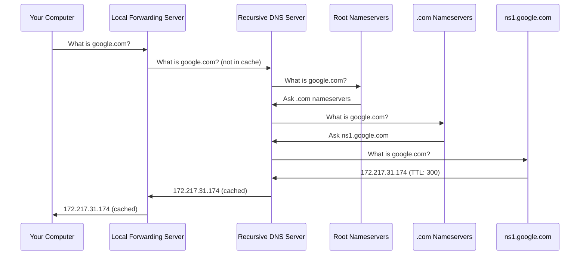
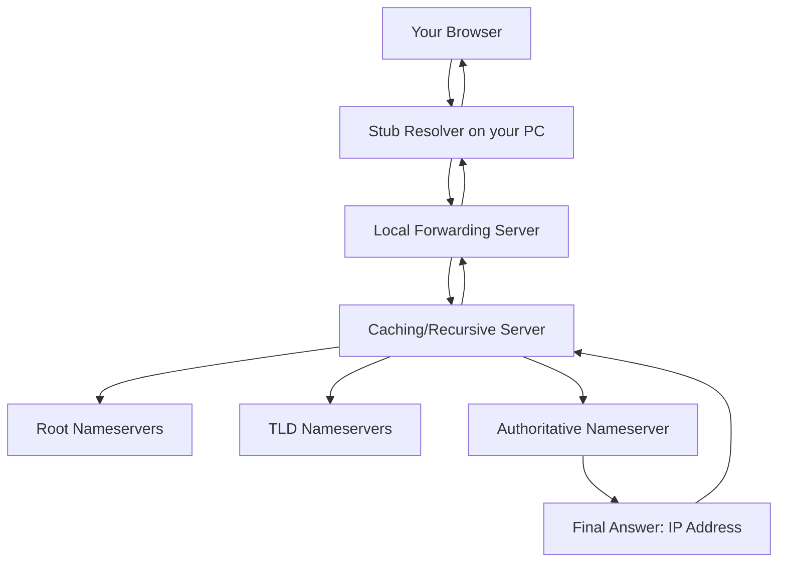
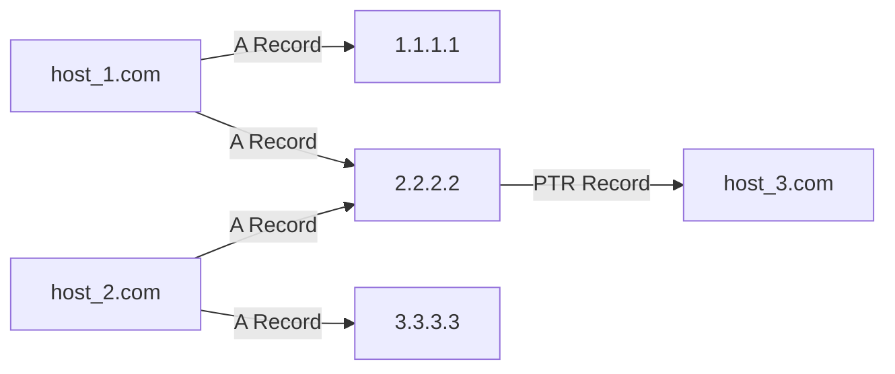
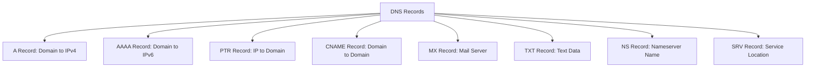

> **الهدف من الـ Section ده:**
> هتفهم إيه هو الـ DNS وليه بيهم كل SOC Analyst، وهتعرف أنواع الـ DNS Records المختلفة، وإزاي الـ DNS بيشتغل من أول ما تكتب اسم موقع لحد ما يتحول لـ IP Address، وإيه المخاطر اللي ممكن تتعمل باستخدام الـ DNS ضدك.

---

## Table of Contents


- [Introduction](#introduction)
- [why-dns-matters](#why-dns-matters)
- [dns-server-client-types)](#dns-server-client-types)
- [dns-lookup-route](#dns-lookup-route)
- [dns-record-types](#dns-record-types)
- [dns-many-to-many](#dns-many-to-many)
- [dns-misunderstanding-dangers](#dns-misunderstanding-dangers)
- [dns-diagrams](#dns-diagrams)
- [comparison-tables](#comparison-tables)
- [key-notes](#key-notes)
- [summary](#summary)


---

## Introduction

الـ DNS أو **Domain Name System** هو واحد من أهم البروتوكولات اللي لازم أي **SOC Analyst** يفهمه كويس. في الواقع، تقريباً كل **Incident** هتشتغل عليه هيحتاج منك إنك تربط بين الـ **IP Address** والـ **Domain Name**. الـ DNS مش بس بروتوكول عادي، هو كمان أداة ممكن المهاجمين يستغلوها بطرق كتيرة زي الـ **DNS Tunneling** والـ **DNS Spoofing**.

---

## why-dns-matters
### الفكرة الأساسية: دليل التليفون الرقمي

تخيل إنك عايز تتصل بـ John بس ما تعرفش رقمه، فبتدور في دليل التليفون على اسمه وبتلاقي الرقم. الـ DNS بيعمل نفس الموضوع بالضبط للإنترنت.

- **الاسم** = `google.com`
- **الرقم** = `172.217.31.174`
- **الـ DNS Server** = دليل التليفون

```
أنت بتكتب: google.com
    ↓
الـ DNS بيرجع: 172.217.31.174
    ↓
المتصفح بيبعت: HTTP GET Request على 172.217.31.174
```

### ليه ده مهم للـ Blue Team؟

1. **كل Incident** تقريباً بيحتاج ربط الـ IP بالـ Domain Name
2. الـ DNS ممكن يتستخدم لـ **Command & Control (C2)**
3. الـ DNS ممكن يتستخدم لـ **Data Exfiltration** عن طريق الـ **DNS Tunneling**
4. الـ DNS ممكن يتلاعب فيه عشان تحويل المستخدمين لمواقع مزيفة
5. بيمدك بـ **Threat Intelligence** مهم عن الـ Attacker Infrastructure

---

## dns-server-client-types

### 1. Stub Resolver

ده الـ **DNS Client** اللي بيشتغل على جهازك (اللابتوب أو المحمول).

- هو اللي بيبدأ الـ **DNS Query**
- ممكن يعمل **Cache** للإجابات اللي قبل كده شافها
- على Windows تقدر تشوف الـ Cache بالأمر ده:

```cmd
ipconfig /displaydns
```

> **ملاحظة:** Linux ما بيعملش Cache بشكل افتراضي.

### 2. Forwarding Server

ده عادةً بيكون الـ **Home Router** أو الـ **Domain Controller** في الشركة.

- بيحفظ الإجابات في الـ **Cache** عشان يردّ بسرعة
- ما بيعملش **Recursion** للـ Root Servers
- لو ما عندوش الإجابة، بيبعت السؤال لفوق للـ Caching Server

### 3. Caching/Recursive Server

ده الـ **ISP DNS** أو خدمات زي **8.8.8.8** (Google) أو **1.1.1.1** (Cloudflare).

- بيعمل **Recursion** كامل للـ Root Servers لو الإجابة مش موجودة في الـ Cache
- بيحفظ الإجابات للاستخدام التاني
- تقدر تعمل واحد في بيتك باستخدام **Pi-Hole**

### 4. Authoritative Nameserver

ده الـ Server اللي عنده الإجابات الأصلية والنهائية.

- **ما بيعملش Cache ولا Recursion**
- هو المصدر الحقيقي للمعلومات
- مثال: `ns1.google.com` عنده الإجابات الأصلية لكل حاجة في `google.com`

---

## dns-lookup-route
### الـ Flow الكامل

لما بتكتب `google.com` في المتصفح وما فيش حاجة في الـ Cache، الرحلة بتتم على النحو ده:

```
1. جهازك (Stub Resolver) بيسأل الـ Local Forwarding Server
2. الـ Forwarding Server ما عندوش الإجابة → بيسأل الـ Recursive Server
3. الـ Recursive Server بيسأل الـ Root Nameservers "."
4. الـ Root Server بيقول: "اسأل الـ .com Nameservers"
5. الـ Recursive Server بيسأل الـ .com Nameservers
6. الـ .com Server بيقول: "اسأل ns1.google.com"
7. الـ Recursive Server بيسأل ns1.google.com ويجيب الـ IP
8. الإجابة بتتحفظ في Cache وبترجع لجهازك
```

### مفهوم الـ TTL

كل إجابة DNS بيكون معاها **TTL (Time To Live)** بالثواني.

- لو الـ TTL = 300 ثانية (5 دقايق)
- أي حد يسأل عن نفس الـ Domain في الـ 5 دقايق دول هيجيب الإجابة من الـ Cache على طول
- بعد انتهاء الـ TTL، الـ Cache بينتهي وبيتم الـ Query من أوله

---

## dns-record-types

### A Record و AAAA Record

أهم نوع في الـ DNS وأكتر نوع هتشوفه.

| النوع | الاستخدام |
|-------|-----------|
| **A** | بيترجم Domain Name لـ IPv4 Address |
| **AAAA** | بيترجم Domain Name لـ IPv6 Address |

**أهم الـ Fields في الـ A Record:**

- **Question:** إيه الـ Domain اللي بيتسأل عنه؟
- **Answer:** إيه الـ IP Address؟ (ممكن يكون أكتر من IP!)
- **Transaction ID:** رقم بيربط الـ Request بالـ Response
- **TTL:** قد إيه الإجابة هتتحفظ في الـ Cache (بالثواني)
- **Source/Destination IP:** مين سأل؟ ومين اتسأل؟

> **مثال عملي:**
> زيارة واحدة لـ `aol.com` بتولّد أكتر من 60 A Record Query لـ 58 Domain مختلف!

### PTR Record

ده عكس الـ A Record، "الرقم العكسي" في الـ DNS.

- بتبعت الـ IP وبترجع الـ Domain Name
- **مهم جداً:** الـ IP بيتكتب بالعكس!
- مثال: لو عايز تعمل Reverse Lookup لـ `8.8.4.4` هتشوف في الـ Wireshark: `4.4.8.8.in-addr.arpa`

```bash
# في الـ Terminal
nslookup 8.8.4.4
```

> **تحذير:** لا تعتمد على الـ PTR Record! ممكن يكون مختلف عن الـ A Record ومش لازم يكون صحيح.

### TXT Record

بيخزن أي نص ASCII حتى 255 حرف.

**الاستخدامات الرئيسية:**

| الاستخدام | الشرح |
|-----------|-------|
| **SPF (Sender Policy Framework)** | قائمة بالـ Servers المسموح لها ترسل Email من الـ Domain ده |
| **DKIM** | Public Key بيستخدم للتحقق من توقيع الـ Email |
| **Domain Ownership** | إثبات ملكية الـ Domain لخدمات التحقق |

**مثال على SPF Record:**
```
v=spf1 include:_spf.google.com ~all
```

> **خطر أمني:** الـ TXT Records ممكن تتستخدم في الـ DNS Tunneling! هنتكلم عنه لاحقاً.

### CNAME Record

بيعمل Redirect من Domain لـ Domain تاني.

```
www.sec450.com  →  CNAME  →  sec450.com  →  1.2.3.4
```

**استخداماته:**
- تعدد الأسماء لنفس السيرفر (www, ftp, mail كلهم بيشيروا لنفس IP)
- تحويل `sans.org` لـ `www.sans.org` تلقائياً

> **تحذير:** ما تعملش CNAME يشير لـ CNAME تاني لأن ده ممكن يعمل Loop لا نهاية!

### MX Record

بيحدد الـ Mail Server المسؤول عن الـ Domain.

**رحلة إرسال Email:**
```
1. MX Record Query لـ sec450.com → mail.sec450.com
2. A Record Query لـ mail.sec450.com → 1.2.3.4
3. SMTP Connection على الـ IP ده
```

**قاعدة مهمة:** الـ Priority الأقل = أولوية أعلى (يتوجه إليه الـ Email أولاً)

### SRV Record

بيساعد الـ Clients يلاقوا Service معينة على الـ Network.

**الصيغة:**
```
_service._proto.name
```

**مثال:**
```
_ldap._tcp.sec450.com  →  LDAP service على TCP
```

هتشوفه كتير في بيئات الـ **Active Directory**.

### NS Record

بيحدد اسم الـ Authoritative DNS Server للـ Domain.

```
google.com  →  NS  →  ns1.google.com
```

بيتخزن في مكانين:
1. على الـ **TLD Nameserver** (مثلاً `.com`) للـ Delegation
2. على الـ **Domain's Own Nameservers** كـ Authority Records

---

## dns-many-to-many
### قواعد مهمة لازم تحفظها

هذه القواعد مهمة جداً في التحقيقات الأمنية:

1. **Domain واحد ممكن يشير لأكتر من IP (أو ولا IP)**
   - `host_1.com` → `1.1.1.1` و `2.2.2.2`

2. **أكتر من Domain ممكن يشيروا لنفس الـ IP**
   - `host_1.com` و `host_2.com` كلاهما → `2.2.2.2`

3. **الـ PTR Record ممكن يشير لأي Domain (أو ولا حاجة)**
   - مش لازم يكون نفس الـ Domain اللي طلبه

4. **أي حاجة من دي ممكن تتغير في أي وقت**
   - ده مهم جداً في الـ Investigations!

### تأثير ده على التحقيقات

```
سيناريو خطير:

1. Attacker بيشتري evilsite.com
2. بيوجّه evilsite.com لـ نفس IP بتاع google.com
3. نظام الـ Security بيلاحظ نشاط مشبوه على evilsite.com
4. أنت بتبلوك الـ IP
5. النتيجة: بلوكت Google بدل ما بلوكت الـ Attacker!
```

> **الدرس:** دايماً اعمل Check على الـ Logs قبل ما تبلوك أي IP!

---

## dns-misunderstanding-dangers

### PTR Records مش موثوق فيها

الـ RFC 1912 بيوصي بإن "كل host بيبتدي منه ألف أمر، لازم يكون ليه PTR Record"، بس في الواقع:

- الـ PTR مش دايماً موجود
- الـ PTR ممكن يشير لـ Domain غلط
- الـ PTR ممكن يتغير في أي وقت

**مثال حقيقي من Google:**
```
google.com  →  A Record  →  142.250.6.206
142.250.6.206  →  PTR Record  →  lga25s72-in-f14.1e100.net
```

لاحظ إن الـ PTR مش بيرجع `google.com` وده طبيعي جداً!

**ليه `1e100.net`؟**
ده من Google! الـ `1e100` هو الطريقة العلمية لكتابة رقم الـ Googol (10^100) اللي اشتقوا منه اسم الشركة.

---

## dns-diagrams
### مخطط رحلة الـ DNS Query



### مخطط أنواع الـ DNS Servers



### مخطط العلاقة المتعددة في الـ DNS



### مخطط أنواع الـ DNS Records



---

## comparison-tables
### جدول أنواع الـ DNS Records الكاملة

| النوع | الكود | الاستخدام | مثال |
|-------|-------|-----------|------|
| **A** | 1 | Domain → IPv4 | `google.com → 142.250.6.206` |
| **AAAA** | 28 | Domain → IPv6 | `google.com → 2607:f8b0:4004::200e` |
| **PTR** | 12 | IP → Domain | `206.6.250.142.in-addr.arpa → google.com` |
| **CNAME** | 5 | Domain → Domain | `www.example.com → example.com` |
| **MX** | 15 | Mail Server | `sec450.com → mail.sec450.com` |
| **TXT** | 16 | Text Data | `v=spf1 include:_spf.google.com ~all` |
| **NS** | 2 | Nameserver | `google.com → ns1.google.com` |
| **SRV** | 33 | Service Location | `_ldap._tcp.sec450.com → ldap.sec450.com:389` |

### مقارنة أنواع الـ DNS Servers

| النوع | Cache | Recursion | Authority | المثال |
|-------|-------|-----------|-----------|--------|
| **Stub Resolver** | أحياناً | لا | لا | جهازك الشخصي |
| **Forwarding Server** | نعم | لا | لا | Home Router, Domain Controller |
| **Caching/Recursive** | نعم | نعم | لا | 8.8.8.8, 1.1.1.1 |
| **Authoritative** | لا | لا | نعم | ns1.google.com |

### أوامر مفيدة للـ DNS Analysis

| الأمر | الاستخدام | المنصة |
|-------|-----------|--------|
| `nslookup google.com` | A Record Query | Windows/Linux |
| `nslookup -type=mx google.com` | MX Record Query | Windows/Linux |
| `nslookup 8.8.4.4` | PTR Record Query | Windows/Linux |
| `dig google.com A` | A Record Query تفصيلي | Linux |
| `dig -x 8.8.4.4` | Reverse DNS Lookup | Linux |
| `ipconfig /displaydns` | عرض الـ DNS Cache | Windows |
| `host -t txt google.com` | TXT Records | Linux |

---

## key-notes

> [!IMPORTANT]
> الـ **PTR Record** مش موثوق فيه! ما تبنيش قراراتك الأمنية عليه لوحده. دايماً اتحقق من الـ A Record مقارنةً بالـ PTR.

> [!WARNING]
> لو لاقيت Domain مشبوه بيشير لـ IP بتاع موقع موثوق (زي Google)، **لا تبلوك الـ IP دا فوراً!** هتبلوك الموقع الموثوق بالغلط! دايماً ابلوك الـ **Domain** مش الـ IP في الحالات دي.

> [!NOTE]
> الـ **Transaction ID** في الـ DNS مهم جداً. بيربط كل **Request** بـ **Response** بتاعته. مفيد جداً في الـ Analysis.

> [!TIP]
> لما تعمل تحقيق في Incident، دايماً اجمع الـ **Domain Name** والـ **IP Address** مع بعض. لو عندك الـ Domain بس أو الـ IP بس، هتفوتك معلومات مهمة جداً.

> [!IMPORTANT]
> الـ **TXT Records** ممكن تتستخدم لـ **DNS Tunneling** وهو تقنية بيستخدمها المهاجمين عشان يسرّبوا Data أو يتحكموا في Malware عبر بروتوكول الـ DNS. لازم تراقب الـ TXT Records غير العادية!

> [!NOTE]
> الـ **TTL** المنخفض جداً ممكن يكون مؤشر خطر! المهاجمين أحياناً بيستخدموا TTL قصير جداً عشان يقدروا يغيروا الـ IP بسرعة ويتهربوا من الـ Blocking.

---

## Summary
### النقاط الأساسية

- الـ **DNS** هو "دليل التليفون" للإنترنت، بيترجم الأسماء لأرقام
- في **4 أنواع** من DNS Servers: Stub Resolver, Forwarding, Caching/Recursive, Authoritative
- الـ **A Record** هو الأهم وبيترجم Domain لـ IPv4
- الـ **PTR Record** هو العكس ومش موثوق فيه
- الـ **CNAME** بيعمل Alias من Domain لـ Domain
- الـ **MX** للـ Email، **TXT** للنصوص (زي SPF وDKIM)
- علاقة الـ DNS **Many-to-Many**: Domain واحد → أكتر من IP، وأكتر من Domain → IP واحد
- دايماً ابلوك الـ **Domain** مش الـ **IP** لتجنب Collateral Damage
- الـ **TTL** بيحدد قد إيه الإجابة تتحفظ في الـ Cache
