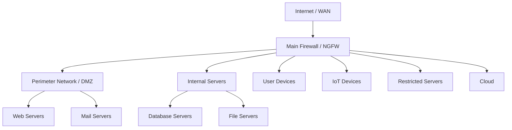
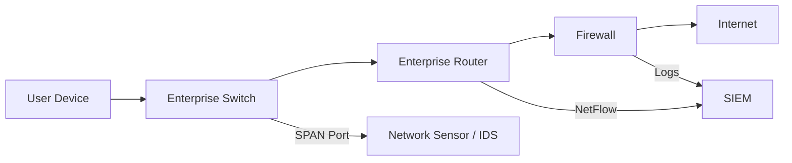
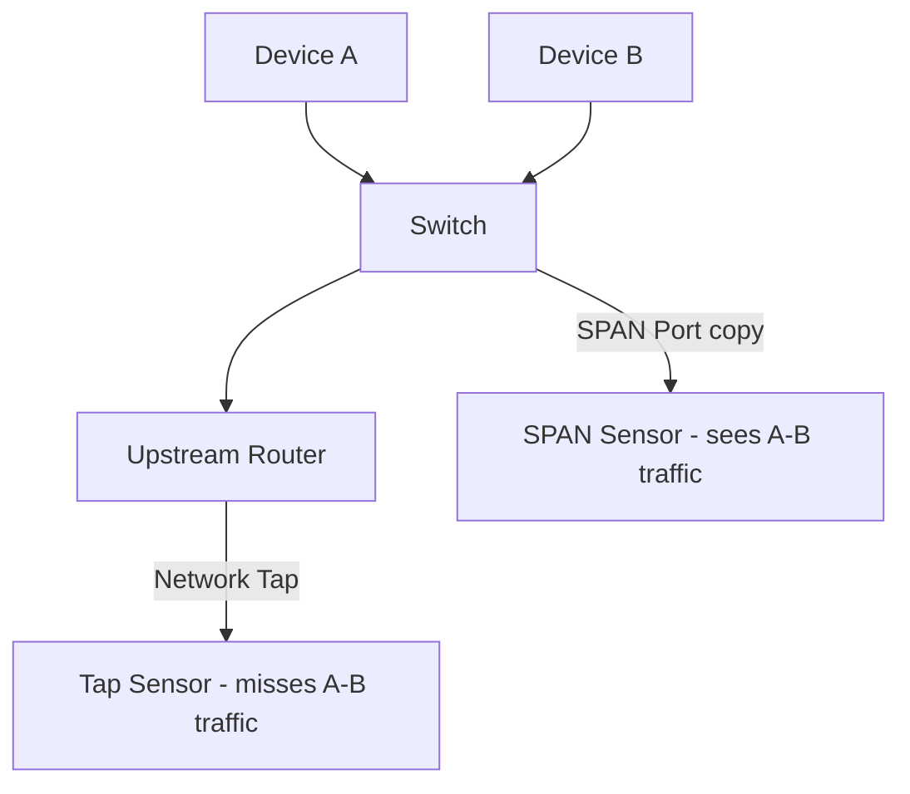
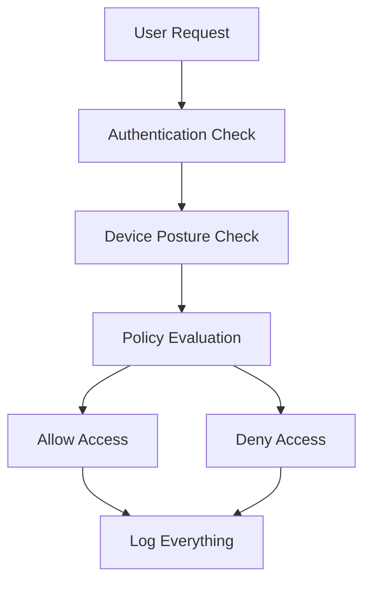

> **الهدف من الـ Section ده:**
> هتفهم إزاي الـ Network بتتبنى وإيه الأجهزة اللي بتتحكم في الـ Traffic، وإزاي تقدر كـ Defender تشوف اللي بيحصل على الشبكة وتوقف الـ Attackers.

---

## Table of Contents

- [Introduction](#introduction)
- [Network Architecture Overview](#network-architecture-overview)
- [Enterprise Routers](#enterprise-routers)
- [Network Zones](#network-zones)
- [Enterprise Switches](#enterprise-switches)
- [Visibility Points: SPAN vs Network Tap](#visibility-points-span-vs-network-tap)
- [Enterprise Firewalls](#enterprise-firewalls)
- [Next-Gen Firewalls (NGFW)](#next-gen-firewalls-ngfw)
- [Zero-Trust Architecture](#zero-trust-architecture)
- [Why Network Architecture Matters](#why-network-architecture-matters)
- [Defending a Flat Network](#defending-a-flat-network)
- [Diagrams](#diagrams)
- [Comparison Tables](#comparison-tables)
- [Key Notes](#key-notes)
- [Summary](#summary)

---

## Introduction

كـ Defender، لازم تفهم الشبكة اللي بتحميها زي ما الجراح بيفهم جسم الإنسان قبل ما يعمل عملية. لو مش عارف الـ Network Architecture، لما يجي Attacker مش هتعرف تمسك اللي بيحصل ولا تعرف تلاقي الـ Evidence.

الـ Network مش مجرد كابلات وأجهزة — ده نظام متكامل من الـ Zones والـ Segments والـ Firewalls اللي كل واحد فيهم بيلعب دور في الـ Defense.

---

## Network Architecture Overview

### ليه محتاجين نفهم الـ Architecture؟

لما يحصل Incident، أول سؤال بتسأله هو:
> "هل عندي بيانات عن اللي حصل ده؟"

لو مش عارف شبكتك كويس، ممكن تقول "مفيش Evidence" وهو في الحقيقة في Evidence بس مش عارف تلاقيها. ده بيخلي الـ Analyst يوصل لاستنتاجات غلط.

### المكونات الأساسية اللي لازم تفهمها:

- **Network Segments and Subnets** — مين ساكن فين على الشبكة؟
- **Traffic Flow** — التريفيك بيروح فين؟
- **Points of Visibility** — فين أقدر أشوف التريفيك ده؟

---

## Enterprise Routers

### الـ Router في البيت vs الـ Router في الشركة

الـ Router في البيت بسيط جداً:
- جهة واحدة للـ Internet (WAN)
- جهة واحدة للبيت (LAN)

أما الـ Router في الشركة (Enterprise Router):
- بيقسم الشبكة لـ Subnets متعددة
- بيشغل Routing بين كل الـ Segments
- ممكن يكون في أكتر من Router واحد (Border Routers + Internal Routers)

### إيه اللي يهمك كـ Blue Teamer في الـ Router؟

| الميزة | الفايدة الأمنية |
|--------|----------------|
| **NetFlow** | بيديك معلومات عن التريفيك اللي بيعدي (مين اتكلم مع مين، قد إيه data اتنقلت) |
| **ACLs (Access Control Lists)** | بتقدر تحجب تريفيك معين بناءً على Source/Destination IP أو Port |
| **802.1X** | بيمنع الأجهزة غير المصرح ليها من الاتصال بالشبكة |
| **VPN and IPSec** | Encrypted connections للمستخدمين البعيدين |
| **IPS** | Intrusion Prevention مدمج |

> [!TIP]
> لو مش بتجمع الـ NetFlow logs من الـ Routers، اطلب من الـ Networking Team نسخة منها. دي بيانات ذهبية للـ Security Team.

---

## Network Zones

### الـ Zone هو إيه؟

تخيل الشركة زي مبنى فيه غرف:
- كل غرفة ليها ناس معينين مسموح يدخلوها
- في حراسة على الأبواب بتتحقق من الهوية
- مش كل الناس يقدروا يدخلوا كل مكان

الـ Zone هو نفس الفكرة على الشبكة — مجموعة من الـ Devices بنفس طبيعة الاستخدام، والـ Firewall بيحرس التريفيك بينهم.

### أنواع الـ Zones الشائعة

| Zone | المحتوى | مستوى الخطورة |
|------|---------|---------------|
| **External / Internet** | كل حاجة برا الشبكة | عالي جداً |
| **Perimeter Network (DMZ)** | الـ Servers اللي بيتكلموا مع الإنترنت (Web Servers, Mail Servers) | عالي |
| **Internal Servers** | Servers داخلية (Database, File Servers) | متوسط |
| **User Devices (Desktops)** | اللاب توبات والكمبيوترات بتاعت الموظفين | متوسط |
| **IoT** | الكاميرات، الطابعات، أجهزة المصنع | عالي (غالباً ضعيفة) |
| **Guest Network** | الضيوف والزوار | عالي (Untrusted) |
| **Cloud** | AWS, Azure, GCP | متغير |
| **Restricted / Air-Gapped** | بيانات سرية جداً، مفصولة عن الإنترنت | أهم حاجة تحميها |

### ليه الـ Segmentation مهمة جداً؟

الـ Micro-Segmentation هو الحل المثالي — كل Device ليه Rules خاصة بيه. بس ده صعب التطبيق، فمعظم الشركات بتعمل Zone-based Segmentation.

---

## Enterprise Switches

### الـ Switch في الـ Security

الـ Switch بيشتغل على Layer 2 (Data Link Layer) وبيوصل الأجهزة اللي في نفس الـ Segment ببعض. اللي بيهم فيه من ناحية الـ Security:

| الميزة | الاستخدام الأمني |
|--------|----------------|
| **Traffic Mirror / SPAN Port** | بتبعت نسخة من كل التريفيك لـ Sensor عشان يحللها |
| **NetFlow** | نفس فكرة الـ Router لكن على مستوى الـ Segment الداخلي |
| **802.1X** | بيمنع الأجهزة اللي مش Authenticated من الاتصال |
| **ACLs** | بتعزل الأجهزة عن بعض داخل نفس الـ Switch |
| **VLANs** | بتقسم الشبكة بشكل منطقي حتى لو على نفس الـ Physical Infrastructure |

### الـ Switch vs الـ Router في الـ Visibility

الـ Router والـ Firewall شايفين التريفيك اللي بيعدي بينهم (Inter-Zone Traffic). لكن لو كمبيوترين في نفس الـ Zone اتكلموا مع بعض، الـ Router مش شايفهم — بس الـ Switch شايفهم!

---

## Visibility Points: SPAN vs Network Tap

### إيه الـ Visibility Point؟

عشان تشوف التريفيك، محتاج تعمل نسخة منه وتبعتها لـ Sensor. في طريقتين:

### 1. SPAN Port (Switch Port Analyzer) / Mirror Port

- الـ Switch بيعمل نسخة من التريفيك ويبعتها لـ Port معين
- **المميزات:** أرخص، مش محتاج Hardware إضافي
- **العيوب:**
  - بياخد من CPU الـ Switch
  - ممكن يحصل Packet Loss لو التريفيك كتير
  - بيشوف التريفيك اللي بيعدي على الـ Switch (بما فيه بين Devices في نفس الـ Segment)

### 2. Network Tap

- جهاز مادي بيتحط على الكابل ويعمل نسخة من التريفيك
- **المميزات:** Passive — مش بيأثر على الـ Network أبداً، بيشتغل على Layer 1/2
- **العيوب:** أغلى، محتاج Aggregation لو بيجمع الـ Traffic من الاتجاهين

### متى كل واحد يفضل؟

| الموقف | الأفضل |
|--------|--------|
| التريفيك بين كمبيوترين في نفس الـ Segment | SPAN Port (لأن الـ Tap مش هيشوفهم) |
| التريفيك عالي السرعة والشبكة مشغولة | Network Tap |
| الميزانية محدودة | SPAN Port |
| محتاج دقة عالية وما تفوتش Packets | Network Tap |

> [!WARNING]
> لو عندك Lateral Movement Attack (Attacker بيتحرك بين Devices في نفس الـ Segment)، الـ Network Tap اللي فوق الـ Switch مش هيشوفه! محتاج SPAN Port على الـ Switch نفسه.

---

## Enterprise Firewalls

### الـ Firewall في البيت vs الـ Enterprise

**Firewall البيت:**
- 2 Ports فقط (Inside + Outside)
- بيحجب التريفيك القادم من الـ Internet
- مش عارف يفرق بين Users أو Applications

**Enterprise Next-Gen Firewall (NGFW):**
- بيتحكم في التريفيك بين كل الـ Zones
- بيشتغل من Layer 2 لـ Layer 7
- بيفهم هوية المستخدم مش بس الـ IP
- بيفهم الـ Application مش بس الـ Port

### الـ NGFW والـ Deep Packet Inspection (DPI)

الـ NGFW بيفحص جوه الـ Packet (مش بس الـ Header) عشان يفهم:
- إيه الـ Application اللي بيستخدم الـ Connection ده
- إيه المستخدم اللي بيعمل ده
- إيه الـ Feature في الـ Application (مثلاً: Upload vs Download)

---

## Next-Gen Firewalls (NGFW)

### الفكرة المحورية: "Everything is an Application"

بدل ما تقول "حجب Port 22"، بتقول "حجب SSH إلا للـ IT Admins على الـ Servers المعتمدة."

### أمثلة على Rules في الـ NGFW

```
Rule 1: IT Admins فقط يقدروا يستخدموا SSH لـ Approved Locations
Rule 2: Gmail مسموح بيه لكن Upload و Download ممنوع
Rule 3: SMB ممنوع بين الـ User Devices
Rule 4: HR Department فقط يقدر يوصل لـ HR Database
```

### ليه NGFW هو أول خطوة نحو Zero-Trust؟

لأنه بيربط الـ Rules بالـ Identity مش بالـ IP Address. لو مستخدم اتنقل من مكان لتاني، الـ Rules بتتطبق عليه في أي مكان.

---

## Zero-Trust Architecture

### الفلسفة الأساسية

> "لا تثق في حاجة، اتحقق من كل حاجة"

### المبادئ الخمسة للـ Zero-Trust

| المبدأ | المعنى |
|--------|--------|
| **الشبكة دايماً Hostile** | حتى الـ Internal Traffic ممكن يكون Malicious |
| **External و Internal Threats موجودين** | الـ Attacker ممكن يكون جوا الشبكة بالفعل |
| **الموقع مش كافي للثقة** | مجرد إن الـ Request جاي من Inside مش معناه إنه Safe |
| **كل حاجة بتتـ Authenticate** | كل User، كل Device، كل Connection |
| **Policies ديناميكية** | بتتحسب بناءً على أكبر قدر من البيانات المتاحة |

### معظم الشبكات مش Zero-Trust

اللي المهم تعرفه إنك مش لازم تطبق Zero-Trust بشكل كامل — حتى لو طبقت 50% من المبادئ، شبكتك هتبقى أأمن بكتير.

---

## Why Network Architecture Matters

### الـ Flat Network كارثة

الـ Flat Network هو شبكة مفيهاش Segmentation — كل الأجهزة بتكلم بعض بحرية.

**السيناريو الكارثي:**
1. Attacker يخترق Laptop واحد عن طريق Phishing
2. في الـ Flat Network: يقدر يتحرك لأي جهاز تاني فوراً
3. يسرق Credentials من Domain Controller
4. يضرب الشبكة كلها في ساعات

**السيناريو المسيطر عليه (مع Segmentation):**
1. Attacker يخترق Laptop واحد
2. Firewall بيمنعه يتحرك لـ Segments تانية
3. الـ Blue Team عندها وقت تلاقيه وتوقفه

### مثال حقيقي: WannaCry و NotPetya (2017)

هجومين من أشهر التاريخ استغلوا بالظبط الـ Flat Networks:

- **الـ Exploit المستخدم:** MS17-010 ETERNALBLUE (من أدوات NSA المسربة)
- **الانتشار:** ثانية ما جهاز يتصاب بيجرب يصيب كل الأجهزة التانية على الشبكة
- **النتيجة في الـ Flat Networks:** شركات كاملة اتشالت خلال ساعات
- **النتيجة في الـ Segmented Networks:** الضرر اتحصر في Segments معينة

---

## Defending a Flat Network

### لو شبكتك Flat، مش بتموت — بس لازم تعوّض

لو مش عندك Segmentation، لازم تعوّض بـ:

| الحل البديل | الفايدة |
|-------------|---------|
| **Host-Based Firewalls** | كل جهاز بيحمي نفسه |
| **EDR (Endpoint Detection and Response)** | كشف مبكر على كل Endpoint |
| **Antivirus** | حماية أساسية لكل جهاز |
| **Anti-Exploitation (EMET / Exploit Guard)** | منع الـ Exploits من الاشتغال |
| **Better Monitoring** | لازم تشوف كل حاجة بسرعة أكبر |
| **Faster Response** | لو الـ Attack بيتسع بسرعة، ردك لازم أسرع |

> [!IMPORTANT]
> في الـ Flat Network، الـ Blue Team لازم تتحرك بسرعة أكبر من الـ Attacker. لو الـ Attacker بيتحرك بسرعة 100 في الـ Flat Network، انت لازم تتحرك بسرعة 101.

---

## Diagrams

### هيكل الـ Network Zones



### رحلة التريفيك عبر الـ Network



### SPAN Port vs Network Tap



### Zero-Trust Flow



---

## Comparison Tables

### مقارنة أجهزة الشبكة من منظور الـ Blue Team

| الجهاز | الوظيفة الأساسية | فايدة الـ Security | نقطة الضعف |
|--------|----------------|-------------------|------------|
| **Router** | ربط الـ Subnets ببعض | NetFlow, ACLs | مش شايف داخل الـ Segment |
| **Switch** | ربط الأجهزة في الـ Segment | SPAN, VLANs, 802.1X | محتاج Config صح |
| **NGFW** | تحكم متقدم في التريفيك | Layer 7 Inspection, Identity | غالي، معقد |
| **Traditional Firewall** | حجب الـ Ports والـ IPs | سهل | مش بيفهم الـ Applications |

### مقارنة أنواع الـ Firewalls

| المعيار | Traditional Firewall | NGFW |
|---------|---------------------|------|
| **Layers** | Layer 3-4 | Layer 2-7 |
| **يفهم الـ Application** | لا | نعم |
| **يفهم هوية المستخدم** | لا | نعم |
| **Deep Packet Inspection** | محدود | متقدم |
| **الثمن** | أرخص | أغلى |
| **الخطوة نحو Zero-Trust** | لا | نعم |

### SPAN Port vs Network Tap

| المعيار | SPAN Port | Network Tap |
|---------|-----------|-------------|
| **التكلفة** | رخيص (مدمج في الـ Switch) | أغلى (Hardware منفصل) |
| **التأثير على الشبكة** | بياخد CPU من الـ Switch | Passive، مفيش تأثير |
| **يشوف Traffic داخل الـ Segment** | نعم | لا |
| **Packet Loss** | ممكن لو مزدحم | نادر |
| **Bandwidth Limitations** | ممكن يحصل Overflow | بيعمل نسخة كاملة |

---

## Key Notes

> [!NOTE]
> الـ Router والـ Firewall بيشوفوا التريفيك اللي بيتنقل بين الـ Zones فقط. التريفيك الداخلي في نفس الـ Zone مش بيمر عليهم — بيمر على الـ Switch بس.

> [!WARNING]
> لو جهازين في نفس الـ Segment (نفس الـ VLAN) اتكلموا مع بعض وانت عندك Network Tap فوق الـ Switch، مش هتشوف التريفيك ده! دي نقطة عمياء مهمة جداً لما بتحقق في Lateral Movement.

> [!IMPORTANT]
> الـ Flat Network مش مجرد ضعف تقني — ده خطر وجودي على الشركة. WannaCry أثبت إن شركات كاملة ممكن تتشال في ساعات بسبب مفيش Segmentation.

> [!TIP]
> كـ SOC Analyst، لازم يكون عندك Diagram يوضح:
> 1. الـ Network Zones وإزاي التريفيك بيتدفق بينهم
> 2. مكان كل SPAN Port و Network Tap
> 3. مين بيبعت NetFlow ومين لأ
> هتحتاج ده كل ما يجي Incident وتحتاج تعرف من فين تجيب الـ Evidence.

> [!NOTE]
> الـ NGFW هو أول خطوة عملية نحو Zero-Trust لأنه بيربط الـ Rules بالهوية (Identity) مش بالـ IP Address — ومستخدم ممكن يغير مكانه، لكن هويته بتفضل نفسها.

---

## Summary

### المفاهيم الأساسية

- **Network Architecture** = فهم شكل الشبكة وإزاي التريفيك بيتدفق فيها
- **Network Zones** = تقسيم الشبكة لـ Segments بناءً على طبيعة الأجهزة وحساسيتها
- **Segmentation** = سلاح الـ Defender الأقوى لإبطاء الـ Attacker
- **SPAN Port** = Mirror للتريفيك على مستوى الـ Switch
- **Network Tap** = نسخة Passive للتريفيك على مستوى الـ Wire
- **NGFW** = Firewall بيفهم Layer 7 والـ Identity
- **Zero-Trust** = "لا تثق، اتحقق" — كل حاجة بتتـ Authenticate
- **Flat Network** = شبكة بدون Segmentation = خطر عالٍ جداً
- **NetFlow** = بيانات عن التريفيك (مين كلم مين، قد إيه) من الـ Routers والـ Switches


