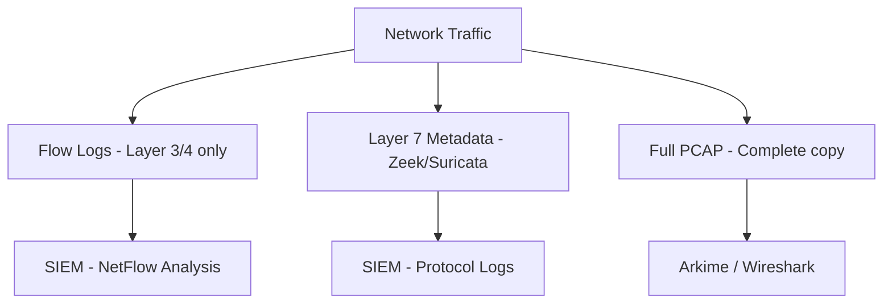
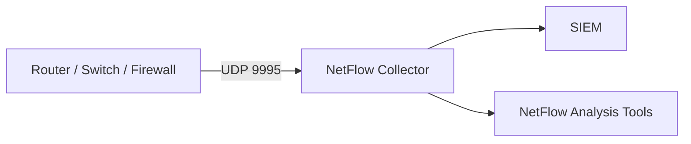
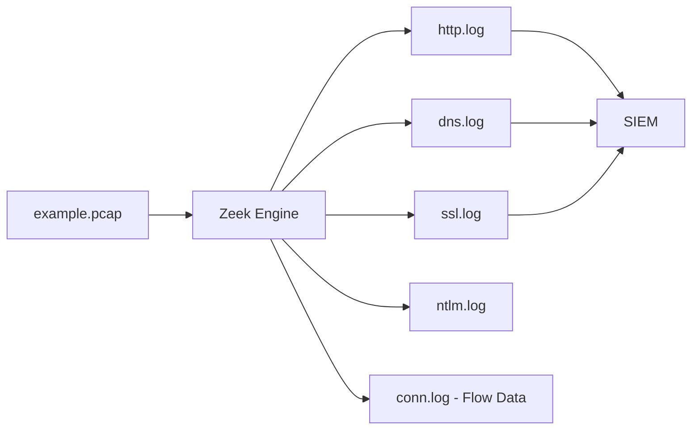
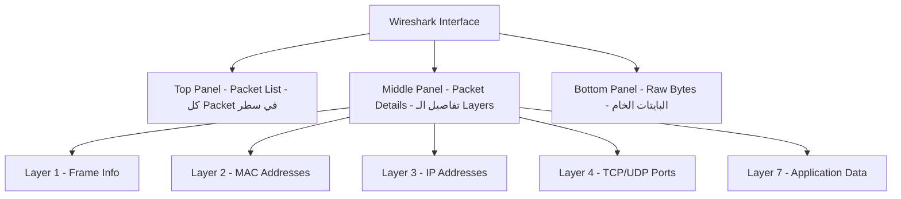
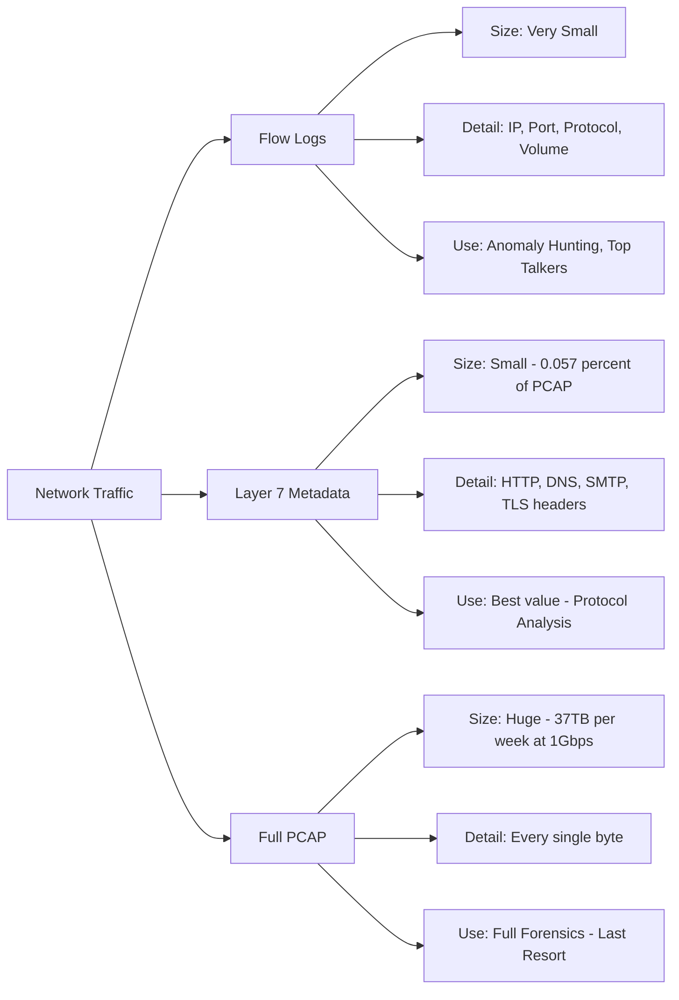

> **الهدف من الـ Section ده:**
> هنفهم إزاي بنجمع بيانات الـ Network Traffic وإيه الفرق بين الـ 3 طرق الأساسية (Flow Logs, Layer 7 Metadata, Full PCAP) — وامتى نستخدم كل واحدة في الـ SOC.

---

## Table of Contents

- [Introduction](#introduction)
- [Overview: The 3 Capture Formats](#overview-the-3-capture-formats)
- [Level 1: Flow Logs (NetFlow)](#level-1-flow-logs-netflow)
- [Level 2: Layer 7 Metadata (Zeek / Suricata)](#level-2-layer-7-metadata-zeek--suricata)
- [Level 3: Full Packet Capture (PCAP)](#level-3-full-packet-capture-pcap)
- [Wireshark: أداة تحليل الـ PCAP](#wireshark-أداة-تحليل-الـ-pcap)
- [Comparison Diagram](#comparison-diagram)
- [Comparison Table](#comparison-table)
- [Key Notes](#key-notes)
- [Summary](#summary)

---

## Introduction

لما بيحصل هجوم على الـ Network، أول سؤال بيتطرح:
**"إيه اللي عندنا من بيانات عن الـ Traffic اللي عدى؟"**

الإجابة دي بتتحدد بناءً على **إزاي** بتجمع بيانات الشبكة. في 3 مستويات للجمع:

1. **Flow Logs** — بيانات عالية المستوى (Layer 3 و 4 بس)
2. **Layer 7 Metadata** — بيانات تفصيلية على مستوى التطبيق
3. **Full PCAP** — نسخة كاملة من كل بايت عدى على الشبكة

كل واحدة ليها استخدامات ومميزات وعيوب. هنشرحهم واحد واحد.

---

## Overview: The 3 Capture Formats



---

## Level 1: Flow Logs (NetFlow)

### إيه هو الـ Flow Log؟

الـ Flow Log هو أخف أنواع البيانات اللي ممكن تجمعها عن الـ Network.
بيشتغل على **Layer 3 (IP)** و **Layer 4 (TCP/UDP)** بس — يعني مش بيشوف محتوى الـ Packets.

فكّر فيه زي **فاتورة التليفون** — بتعرف مين اتصل بمين، امتى، وكام دقيقة — بس مش بتعرف إيه اللي اتقال.

### إيه اللي بيتسجل في الـ Flow Log؟

- Source IP و Destination IP
- Source Port و Destination Port
- Protocol (TCP / UDP)
- حجم البيانات اللي اتبعتت في كل اتجاه
- وقت بدء الـ Session ومدتها

### NetFlow وأشقاؤه

| الاسم | الشركة |
|-------|--------|
| **NetFlow** | Cisco |
| **Jflow** | Juniper |
| **NetStream** | HP |
| **sFlow** | Sampled — للشبكات عالية السرعة |
| **IPFIX** | المعيار الموحد (v10) |

> **ملاحظة على الـ sFlow:** الـ sFlow مش بيسجّل كل الـ Packets، بيسجّل **عيّنة** منها (Sampled). يعني لو عندك sFlow، أنت شغال على بيانات ناقصة — خد بالك!

### إزاي بيتجمع؟

الـ Flow Logs بيتبعتوا من الـ Router أو Firewall أو Switch مباشرةً لـ **NetFlow Collector** على UDP Port 2055 أو 9995 أو 9996. بعدين بيروح للـ SIEM.



### امتى تستخدم الـ Flow Logs؟

- تحديد أكبر الـ Uploaders/Downloaders
- البحث عن الـ Lateral Movement داخل الشبكة
- مراقبة الـ Protocols زي RDP و SMB و PowerShell
- مطابقة IP Addresses مع الـ Threat Intelligence
- البحث عن Connections بمنافذ غريبة (Odd Ports)
- رصد الـ Long Running Connections اللي ممكن تكون C2

> **حقيقة مهمة:** كتير من الـ Breaches اتكشفت في البداية عن طريق الـ Flow Logs بس!

---

## Level 2: Layer 7 Metadata (Zeek / Suricata)

### إيه هو الـ Layer 7 Metadata؟

ده المستوى التاني، وهو **أفضل قيمة مقابل الحجم** في مجال الـ Network Monitoring.

بدل ما تسجّل كل بايت زي الـ PCAP، أو تسجّل بس الـ IPs والـ Ports زي الـ Flow Logs — الـ Layer 7 Metadata بيسجّل **معلومات تفصيلية عن كل Transaction على مستوى التطبيق**.

### أشهر الأدوات

| الأداة | الوصف |
|--------|--------|
| **Zeek** (اسمه القديم Bro) | بيحلّل الـ Traffic ويطلع Logs منظمة لكل Protocol |
| **Suricata** | IDS/IPS بيقدر يعمل نفس وظيفة الـ Zeek |

### Zeek: الـ Prism of PCAPs

فكّر في الـ Zeek زي **منشور الضوء (Prism)** — الـ PCAP بيدخل، وبيطلع منه:



### إيه اللي بيسجله Zeek؟

- **HTTP:** Method, URL, User-Agent, Status Code, Host
- **DNS:** Query, Response, Record Type, TTL
- **SMTP:** Sender, Receiver, Subject
- **TLS/SSL:** Certificate details, Cipher Suite
- **conn.log:** زي الـ Flow Logs بالظبط — يعني Zeek هو 2 in 1

### Zeek Output مثال

```json
{
  "ts": 1609459200.123,
  "uid": "CHhAvVGS1DHFjwGM9",
  "id.orig_h": "192.168.1.100",
  "id.orig_p": 54321,
  "id.resp_h": "93.184.216.34",
  "id.resp_p": 80,
  "method": "GET",
  "host": "example.com",
  "uri": "/malware.exe",
  "status_code": 200,
  "resp_mime_types": ["application/octet-stream"]
}
```

> لاحظ إن الـ Zeek بيطلع **structured JSON** — سهل يتبعت للـ SIEM ويتحلل.

### مقارنة الحجم

الـ Zeek data = **0.057%** من حجم الـ Full PCAP!
يعني لو عندك 1TB PCAP، الـ Zeek Logs هتبقى تقريباً **570 MB** بس.

---

## Level 3: Full Packet Capture (PCAP)

### إيه هو الـ PCAP؟

الـ PCAP (Packet Capture) هو الحل الأكبر والأثقل — بيسجّل **كل بايت** عدى على الشبكة.

لو مش متشفر، هتعرف **بالظبط** إيه اللي بعته ومين وامتى.

### الـ File Formats

| Format | التفاصيل |
|--------|----------|
| **.pcap** | الـ Format القديم، مدعوم من كل الأدوات |
| **.pcapng** | الـ Format الجديد، بيدعم معلومات إضافية زي Interface info وComments |

### أدوات الـ PCAP

**GUI Tools:**
- **Wireshark** — الأشهر، للتحليل اليدوي
- **Arkime** (اسمه القديم Moloch) — للـ PCAP على مستوى الـ Enterprise
- **NetworkMiner** — لاستخراج الملفات

**CLI Tools:**
- **tcpdump** — الـ Capture والـ Filtering
- **TShark** — النسخة الـ Command Line من Wireshark
- **Zeek** — لاستخراج الـ Metadata
- **Snort / Suricata** — كـ IDS على الـ PCAP
- **ngrep / strings** — للبحث في المحتوى
- **tcpxtract / foremost / scalpel** — لاستخراج الملفات

### عيب الـ PCAP: الحجم الهائل

لو عندك Connection بـ 1Gbps وهو مستخدم 50%:

```
1Gbps × 50% = 500Mbps
500Mbps × 60ثانية × 60دقيقة × 24ساعة × 7أيام = 37.8 TB في الأسبوع!
```

عشان كده كتير من الشركات بتعمل Full PCAP في نقطة واحدة بس (الـ Perimeter) وباقي الشبكة بتستخدم Zeek.

---

## Wireshark: أداة تحليل الـ PCAP

### الـ 3 Panels في Wireshark



### Wireshark Display Filters الأهم

**فلترة على البروتوكول:**

```
http          -- كل الـ HTTP Traffic
dns           -- كل الـ DNS Traffic
tls           -- كل الـ TLS Traffic
dns and tls   -- DNS over HTTPS
http or dns   -- نقطة بداية جيدة للتحقيق
```

**فلترة على الشبكة:**

```
ip.addr eq 1.2.3.4              -- كل Traffic من أو لـ IP معين
tcp.port eq 80                  -- كل Traffic على Port 80
ip.addr eq 1.2.3.4 && tcp.port eq 443  -- IP معين على Port محدد
frame contains "password"       -- أي Packet بيحتوي على كلمة معينة
```

### سيناريو عملي: HTTP Stream Follow

في Wireshark، لو عايز تشوف محتوى الـ HTTP:

1. Right Click على أي Packet
2. اختار **Follow** ثم **HTTP Stream**
3. هتشوف الـ Request باللون الأحمر والـ Response باللون الأزرق

**مثال حقيقي من الـ Course:**
```
GET /calc.exe HTTP/1.1
Host: fewfewfewfew.ibiz.cc
```
الـ Response كان ملف EXE خبيث! — ده مثال كلاسيكي على Malware Download.

> **ملاحظة:** Wireshark مش مناسب للـ Enterprise-scale Monitoring. لو عايز تحلل PCAP على مستوى المؤسسة، استخدم **Arkime**.

---

## Comparison Diagram



---

## Comparison Table

| الخاصية | Flow Logs | Layer 7 Metadata | Full PCAP |
|---------|-----------|-----------------|-----------|
| **الحجم** | صغير جداً | صغير نسبياً | ضخم جداً |
| **الـ Layer** | 3 و 4 فقط | حتى Layer 7 | كل الـ Layers |
| **المحتوى** | IP, Port, Protocol | HTTP, DNS, SMTP metadata | كل البايتات |
| **أمثلة الأدوات** | NetFlow, nfdump | Zeek, Suricata | Wireshark, Arkime, tcpdump |
| **الاستخدام الأمثل** | Top Talkers, Lateral Movement | Protocol Analysis, Threat Hunting | Forensics العميقة |
| **التكامل مع SIEM** | مباشر | مباشر (JSON Logs) | غير مباشر (Arkime + Link) |
| **الكلفة التخزينية** | منخفضة | منخفضة | عالية جداً |

---

## Key Notes

> [!IMPORTANT]
> الـ **sFlow** هو نوع من الـ Flow Logs بيعمل **Sampling** (يأخذ عيّنة). لو بتستخدمه، اعرف إنك شغال على بيانات ناقصة وليست كاملة.

> [!NOTE]
> الـ **Zeek** بيعمل `conn.log` تلقائياً — ده بيخلّيه بديل للـ Flow Logs في نفس الوقت. يعني Zeek = Flow Logs + Layer 7 Metadata معاً.

> [!TIP]
> أفضل استراتيجية هي امتلاك الـ 3 مستويات معاً:
> - الـ **Flow Logs** للـ History والـ Trends
> - الـ **Layer 7 Metadata** للـ Daily Analysis والـ Alerting
> - الـ **Full PCAP** على الـ Perimeter فقط لحالات الـ Forensics العميقة

> [!WARNING]
> لو عندك PCAP فقط بدون Flow Logs أو Zeek — ده تحدي تخزيني ضخم ومش Scalable. وعكسه، لو عندك Flow Logs فقط — هتفوتك تفاصيل اللي بيحصل على مستوى التطبيق.

> [!NOTE]
> الـ **Wireshark** مش الأداة المناسبة لتحليل الـ PCAP على مستوى الشبكة كلها. هو للتحليل اليدوي لـ PCAP محدودة الحجم. لتحليل الـ Enterprise، استخدم **Arkime**.

---

## Summary

### ملخص سريع

- **Flow Logs:** Layer 3/4 فقط — أخف حل — مناسب للـ History والـ Anomaly Detection
- **Layer 7 Metadata (Zeek):** أفضل قيمة — بيغطي الـ Application Layer — بيتبعت للـ SIEM
- **Full PCAP:** كل شيء — ثقيل جداً — للـ Forensics العميقة فقط
- **NetFlow:** بروتوكول Cisco الأشهر لإرسال الـ Flow Data على UDP 9995
- **sFlow:** Sampled Flow — بيانات ناقصة — خليه في بالك
- **Zeek:** الـ Prism للـ PCAP — يطلع Logs منظمة لكل Protocol
- **Wireshark:** أداة تحليل PCAP يدوية — 3 Panels — Display Filters

