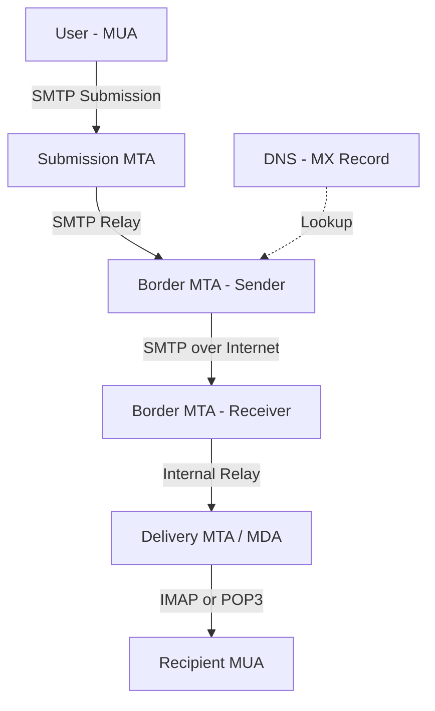
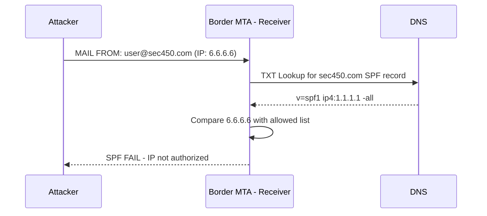
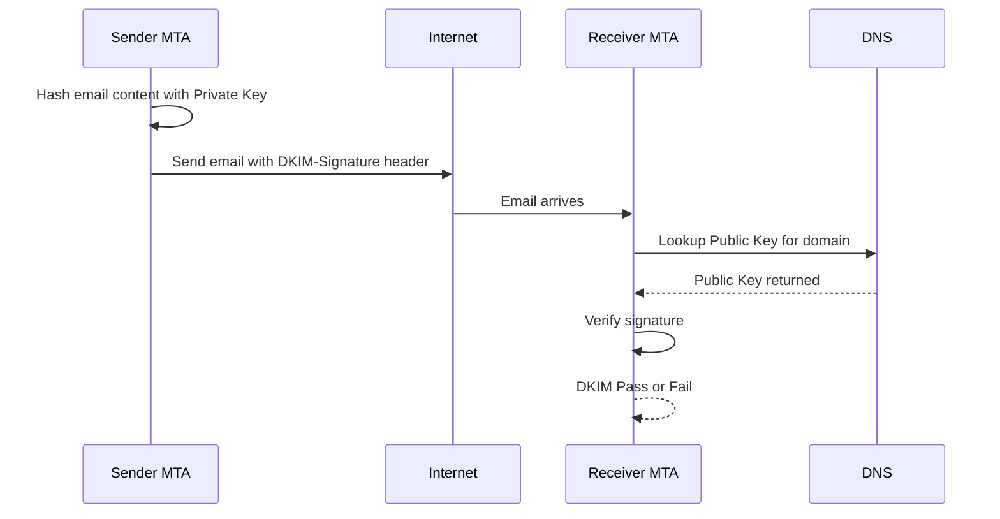
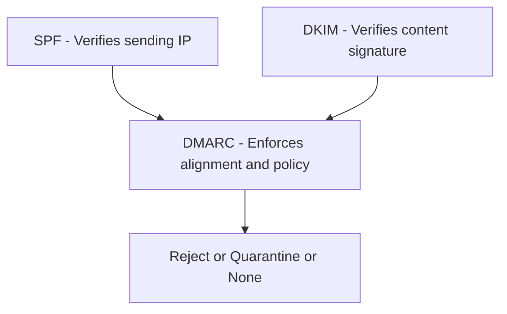

> **الهدف من الـ Section ده:**
> هنفهم إزاي الـ Email بيتبعت على الـ Internet من أول ما تكتبه لحد ما يوصل، وإزاي المهاجمين بيتلاعبوا في الـ Email بالـ Spoofing، وإزاي نحمي نفسنا بـ SPF وـ DKIM وـ DMARC.

---

## Table of Contents

- [Introduction](#introduction)
- [Email Delivery Infrastructure](#email-delivery-infrastructure)
- [MUA MTA MDA](#mua-mta-mda)
- [SMTP Protocol](#smtp-protocol)
- [Email Headers](#email-headers)
- [Tracing an Email](#tracing-an-email)
- [Email Spoofing](#email-spoofing)
- [SPF - Sender Policy Framework](#spf---sender-policy-framework)
- [DKIM - Domain Keys Identified Mail](#dkim---domain-keys-identified-mail)
- [DMARC](#dmarc)
- [Diagrams](#diagrams)
- [Comparison Tables](#comparison-tables)
- [Key Notes](#key-notes)
- [Summary](#summary)

---

## Introduction

الـ Email هو من أكتر الـ Protocols اللي بيتهاجم عليها، ومن أكتر الـ Vectors المستخدمة في الـ Phishing وـ Spam. عشان كده، لازم تفهم:

- إزاي الـ Email بيتبعت خطوة بخطوة
- مين المسؤول عن كل خطوة (MUA, MTA, MDA)
- إزاي تقرأ الـ Email Headers وتتتبع مصدر الإيميل
- ليه الـ SMTP سهل يتلاعب فيه
- إزاي الـ SPF وـ DKIM وـ DMARC بيحموا من الـ Spoofing

---

## Email Delivery Infrastructure

### الفكرة الأساسية

لما بتبعت إيميل، الموضوع مش بسيط زي ما بيبان. الإيميل بيمر بـ 3 مراحل أساسية:

1. **Submission** — إرسال الإيميل من جهازك لـ SMTP Server بتاع مزود الخدمة
2. **Relay** — تمرير الإيميل من Server للـ Server التاني على الـ Internet
3. **Receiving** — استلام الإيميل وتخزينه في صندوق الواصل

### تمثيل بسيط

تخيل إنك بتبعت جواب بالبريد العادي:
- **أنت** = الـ MUA (بتكتب وبتبعت)
- **مكتب البريد في مدينتك** = الـ MTA (بيستلم الجواب ويبعته)
- **مكتب البريد في مدينة المستلم** = الـ MTA التاني (بيستقبله)
- **ساعي البريد** = الـ MDA (بيوصله لصندوق البريد بتاع المستلم)

---

## MUA MTA MDA

### الـ MUA — Message User Agent

الـ MUA هو البرنامج اللي بتستخدمه أنت كـ User عشان تبعت وتستقبل الإيميل.

أمثلة:
- **Gmail** (Web Interface)
- **Microsoft Outlook** (Thick Client)
- **Thunderbird** (Open Source Client)

الـ MUA بيبعت الإيميل لـ SMTP Server باستخدام الـ SMTP Protocol (أو أحياناً Submission Port 587).

### الـ MTA — Message Transfer Agent

الـ MTA هو الـ Server المسؤول عن استقبال الإيميل من الـ MUA وتمريره على الـ Internet للـ Server التاني.

أنواع الـ MTA:
- **Submission MTA** — أول Server بيستقبل الإيميل من الـ MUA
- **Intermediate MTA** — Servers وسيطة داخل المؤسسة
- **Border MTA** — آخر Server في المؤسسة المرسلة (وأول واحد في المؤسسة المستقبلة)

الـ Border MTA مهم جداً لأنه:
- بيمثل حد الفاصل بين المؤسستين
- الـ IP بتاعه ما ينفعش يتزوّر لأن الاتصال بـ TCP
- هو اللي بيتحقق من الـ SPF records

### الـ MDA — Message Delivery Agent

الـ MDA هو الـ Server المسؤول عن تخزين الإيميل في صندوق الوارد بتاع المستلم.

بعد ما الـ MDA يخزن الإيميل، الـ MUA بتاع المستلم بيسحبه باستخدام IMAP أو POP3.

> **ملاحظة مهمة:** في الغالب الـ MTA الأخير والـ MDA بيشتغلوا على نفس الـ Server، بس في الـ Standards هم entities مختلفة.

---

## SMTP Protocol

### إيه هو الـ SMTP؟

الـ **SMTP (Simple Mail Transfer Protocol)** هو البروتوكول الأساسي لنقل الإيميل بين الـ Servers. هو بروتوكول نصي بسيط قائم على الـ ASCII، يعني ممكن تشتغل معه بـ telnet!

### الـ Commands الأساسية

```
EHLO mail.sec450.com          <-- تعريف الـ Server المرسل
MAIL FROM:<user@sec450.com>   <-- عنوان المرسل
RCPT TO:<student@gmail.com>   <-- عنوان المستلم
DATA                          <-- بداية محتوى الإيميل
To: student@gmail.com
From: user@sec450.com
Subject: Hello from SEC450
[email body here]
.                             <-- نقطة وحدها على سطر = نهاية الإيميل
```

### الـ Status Codes

الـ Server بيرد بأكواد من 3 أرقام زي الـ HTTP:
- **250** = Success
- **421** = Service temporarily unavailable
- **550** = Mailbox not found

### ليه الـ SMTP خطير؟

لأن الـ SMTP اتكتب سنة **1982** وماكانش في تفكير في الـ Security. النتيجة:
- ممكن تحط أي عنوان في الـ `MAIL FROM` من غير تحقق
- الـ Server التاني مش هيسأل "أنت مين؟"
- ده اللي بيخلي الـ Email Spoofing سهل جداً!

---

## Email Headers

### أنواع الـ Headers

الإيميل بيتكون من 3 أجزاء:

#### 1. Trace Headers
دي الـ Headers اللي كل MTA بيضيفها لما يمر عليها الإيميل. بتحتوي على:
- اسم الـ Server المرسل والمستقبل
- الـ IP Address
- التوقيت

#### 2. Message Headers
دي الـ Headers اللي المستخدم أو الـ MUA بيكتبها:
- `From:` عنوان المرسل
- `To:` عنوان المستلم
- `Subject:` موضوع الإيميل
- `Date:` التاريخ والوقت

#### 3. Email Body
المحتوى الفعلي للإيميل، ممكن يكون:
- Plaintext
- HTML
- Base64 Encoded Attachments

### مثال عملي على الـ Headers

```
Return-Path: <user1@gmail.com>
Received: from Lenovo ([10.20.30.40])
         by smtp.gmail.com;
         Tue, 27 Nov 2018 04:59:28 -0800 (PST)
From: <user1@gmail.com>
To: <user2@gmail.com>
Subject: Subject goes here
Date: Tue, 27 Nov 2018 07:59:26 -0500
X-Mailer: Microsoft Outlook 16.0
```

---

## Tracing an Email

### إزاي تتتبع مصدر الإيميل؟

الـ Received Headers بتكون مرتبة بـ **Reverse Chronological Order** — يعني:
- **أول سطر من تحت** = أول Server بعت منه الإيميل
- **آخر سطر من فوق** = آخر Server استلمه

### تنسيق الـ Received Header

```
Received: from [اسم الـ Server المرسل] ([IP Address])
          by [اسم الـ Server المستقبل]
          ; [التاريخ والوقت]
```

مثال حقيقي:
```
Received:
from zeus.colombiaredes.info (zeus.colombiaredes.info. [213.239.232.149])
by mx.google.com
with ESMTP id 922034ljg.134.2020.07.19.03.26.52
for <user1234@gmail.com>;
Sun, 19 Jul 2020 03:26:53 -0700 (PDT)
```

### قراءة الـ Received Header

| الجزء | المعنى |
|-------|--------|
| `from zeus.colombiaredes.info` | الـ EHLO string اللي الـ Server المرسل قدّم نفسه بيه |
| `[213.239.232.149]` | الـ IP الحقيقي اللي بعت — **مش ممكن يتزوّر** (TCP) |
| `by mx.google.com` | الـ Server اللي كتب الـ Header ده |
| `Sun, 19 Jul 2020` | التوقيت |

### ليه الـ IP مش ممكن يتزوّر؟

لأن الـ SMTP بيشتغل على الـ **TCP**، والـ TCP محتاج Handshake ثنائي الاتجاه (SYN → SYN-ACK → ACK). مش ممكن تعمل ده باستخدام IP مزوّر.

---

## Email Spoofing

### المشكلة الأساسية

الـ SMTP كتبه الـ RFC 821 سنة 1982 ومش محتاج Authentication أصلاً. أي حد يقدر يعمل:

```
MAIL FROM:<ceo@yourcompany.com>   <-- مزوّر تماماً!
RCPT TO:<employee@yourcompany.com>
DATA
From: CEO <ceo@yourcompany.com>
Subject: Urgent! Transfer $50,000 immediately!
...
```

والـ Server ممكن يقبله من غير سؤال!

### نوعين من الـ Spoofing

#### 1. Direct Injection
المهاجم بيتصل مباشرة بالـ Border MTA للمستلم ويبعت الإيميل بدون ما يمر بالـ SMTP Server الحقيقي للمرسل.

#### 2. From Address Manipulation
الـ RFC بيفرق بين **Envelope From** (اللي الـ SPF بيتحقق منه) وـ **Header From** (اللي المستخدم بيشوفه). المهاجم ممكن يخلي الاتنين مختلفين!

---

## SPF - Sender Policy Framework

### الفكرة

الـ **SPF** بيسمح لصاحب الـ Domain إنه ينشر في الـ DNS قائمة بالـ IP Addresses المسموح لها ترسل إيميل باسم الـ Domain ده.

### إزاي بيشتغل؟

1. صاحب الـ Domain يضيف **TXT Record** في الـ DNS زي ده:
   ```
   sec450.com IN TXT "v=spf1 ip4:1.1.1.1 -all"
   ```
2. لما الـ Receiving Border MTA يستلم إيميل من `user@sec450.com`
3. بيعمل DNS Lookup للـ TXT Record بتاع `sec450.com`
4. بيقارن الـ IP اللي جاء منه الإيميل بالقائمة
5. لو الـ IP مش في القائمة = **SPF Fail**

### نتائج الـ SPF Check

| النتيجة | المعنى |
|---------|--------|
| `Pass` | الـ IP في القائمة المسموح بيها |
| `Fail` | الـ IP مش مسموح له، إيميل مزوّر على الأرجح |
| `Softfail` | مش مسموح رسمياً، بس يُعامَل بشك وليس رفض قاطع |
| `Neutral` | مفيش policy واضحة |
| `None` | مفيش SPF Record أصلاً |

### مكان نتيجة الـ SPF في الـ Headers

**مكان 1:** `Authentication-Results` header
```
Authentication-Results: spf=pass (sender IP is 1.2.3.4)
smtp.mailfrom=sec450.com;
```

**مكان 2:** `Received-SPF` header
```
Received-SPF: Pass (protection.outlook.com: domain of
sec450.com designates 1.2.3.4 as permitted sender)
receiver=protection.outlook.com; client-ip=1.2.3.4;
```

---

## DKIM - Domain Keys Identified Mail

### ليه SPF مش كفاية؟

الـ SPF بيتحقق فقط من الـ **Envelope From** (مسار الإرسال)، لكن مش من محتوى الإيميل نفسه. لو المهاجم قدر يسرق IP مسموح له، SPF هيعدي!

### الفكرة

الـ **DKIM** بيستخدم **Digital Signature** عشان يثبت إن الإيميل فعلاً خرج من الـ MTA بتاع المؤسسة المرسلة ومتغيرش في الطريق.

### إزاي بيشتغل؟

**من طرف المرسل:**
1. صاحب الـ Domain بيعمل **Key Pair** (Private Key + Public Key)
2. الـ Public Key بينشره في الـ DNS كـ TXT Record
3. الـ Private Key بيتحفظ على الـ Border MTA
4. كل ما يتبعت إيميل، الـ MTA بيعمل Hash لجزء منه (الـ Selector) ويوقّع عليه بالـ Private Key
5. الـ Signature بتتضاف للإيميل في Header اسمه `DKIM-Signature`

**من طرف المستلم:**
1. الـ Receiving MTA يشوف الـ `DKIM-Signature` في الإيميل
2. يعمل DNS Lookup يجيب الـ Public Key
3. يعمل Hash لنفس الجزء
4. يفك تشفير الـ Signature بالـ Public Key
5. لو الـ Hash متطابق = **DKIM Pass**

### الـ Takeaway

دايماً دور في الـ `Authentication-Results` header على:
```
dkim=pass
```

لو `dkim=fail` أو `dkim=none` = في مشكلة!

---

## DMARC

### المشكلة اللي DMARC بيحلها

حتى لو الـ SPF والـ DKIM بيشتغلوا تمام، في ثغرة! في إيميل فيه **From Address تاني**:

- **RFC5321.MailFrom** (Envelope From) = اللي الـ SPF بيتحقق منه
- **RFC5322.From** (Header From) = اللي المستخدم بيشوفه في الـ Email Client

المهاجم ممكن يبعت الإيميل من `hacker@legit.com` (عشان يعدّي الـ SPF)، لكن يخلي الـ Header From يبان للمستخدم `ceo@yourcompany.com`!

### إزاي DMARC بيحل ده؟

الـ **DMARC** بيشترط **Alignment** — يعني الـ RFC5322.From لازم يكون متوافق مع:
- الـ RFC5321.MailFrom اللي الـ SPF اتحقق منه، **أو**
- الـ Domain اللي الـ DKIM وقّع منه

### الـ DMARC Policy Actions

لما الـ DMARC يفشل، صاحب الـ Domain يقدر يقول:
- `p=none` — اعمل تقرير بس، ماتعملش حاجة
- `p=quarantine` — حط الإيميل في الـ Spam Folder
- `p=reject` — ارفض الإيميل خالص

### ميزة إضافية: الـ Reporting

الـ DMARC بيدي إمكانية إن المستلمين يبعتوا **تقارير** لصاحب الـ Domain لما حد يحاول يزوّر إيميل باسمه — حاجة مش كانت ممكنة قبل كده!

---

## Diagrams

### رحلة الإيميل من المرسل للمستلم



### كيف يعمل الـ SPF



### كيف يعمل الـ DKIM



### مقارنة الـ Three Standards



---

## Comparison Tables

### مقارنة MUA vs MTA vs MDA

| المكوّن | الاسم الكامل | الدور | أمثلة |
|---------|-------------|-------|--------|
| MUA | Message User Agent | تكتب وتقرأ الإيميل | Gmail, Outlook, Thunderbird |
| MTA | Message Transfer Agent | ينقل الإيميل بين الـ Servers | Postfix, Exchange, Sendmail |
| MDA | Message Delivery Agent | يخزن الإيميل في الـ Mailbox | Dovecot, Exchange Store |

### مقارنة SPF vs DKIM vs DMARC

| المعيار | ما بيتحقق منه | أين يُنشر | ما بيحميش منه |
|---------|--------------|-----------|--------------|
| SPF | IP Address المرسل | DNS TXT Record | لا يتحقق من المحتوى |
| DKIM | توقيع المحتوى | DNS TXT Record (Public Key) | لا يتحقق من Header From |
| DMARC | Alignment بين SPF/DKIM والـ Header From | DNS TXT Record | لا يضمن إن الإيميل آمن المحتوى |

### نتائج SPF وتفسيرها

| النتيجة | التفسير | الإجراء المقترح |
|---------|---------|----------------|
| Pass | IP مسموح له رسمياً | قبول الإيميل |
| Fail | IP غير مسموح له | رفض أو وضع في Spam |
| Softfail | IP مش في القائمة، لكن Policy مش صارمة | معاملة بحذر |
| Neutral | مش محدد | قبول مع تحفظ |
| None | مفيش SPF Record | قبول مع تحفظ |

---

## Key Notes

> [!IMPORTANT]
> الـ Received Headers بتُكتب بـ **Reverse Chronological Order** — اقرأهم من **تحت لفوق** عشان تتبع مسار الإيميل من المصدر.

> [!WARNING]
> الـ SMTP مش بيتحقق من هوية المرسل بشكل أصيل. بدون SPF وـ DKIM وـ DMARC، أي حد يقدر يبعت إيميل باسمك!

> [!NOTE]
> الـ IP Address في الـ Received Header (اللي جوه الأقواس المربعة) مش ممكن يتزوّر لأن الـ SMTP بيشتغل على الـ TCP اللي محتاج Two-Way Handshake.

> [!TIP]
> لما تحلل إيميل مشبوه، أول حاجة دور في الـ `Authentication-Results` header. لو `spf=fail` أو `dkim=fail` — الإيميل على الأرجح مزوّر.

> [!WARNING]
> حتى لو SPF وـ DKIM وـ DMARC كلهم Pass — ده مش معناه إن الإيميل آمن المحتوى! لو حساب موظف اتاخد، المهاجم يقدر يبعت إيميل حقيقي يعدي كل الـ Checks.

> [!IMPORTANT]
> الـ `Return-Path` هو اللي الـ SPF بيتحقق منه، مش الـ `From` اللي بتشوفه في الـ Email Client. الفرق ده هو ثغرة DMARC جاي يحلها.

---

## Summary 

### أهم النقاط

- الإيميل بيمر بـ 3 مراحل: Submission → Relay → Receiving
- الـ MUA هو البرنامج اللي المستخدم بيشتغل عليه
- الـ MTA هو الـ Server اللي بينقل الإيميل
- الـ MDA هو الـ Server اللي بيخزن الإيميل
- الـ SMTP بروتوكول نصي بسيط اتكتب 1982 بدون Authentication
- الـ Received Headers بتتكتب من تحت لفوق (Reverse Chronological)
- الـ IP في الـ Received Header مش ممكن يتزوّر (TCP Protocol)
- الـ SPF بيتحقق من الـ IP Address ضد قائمة في الـ DNS
- الـ DKIM بيستخدم Digital Signature للتحقق من المحتوى
- الـ DMARC بيضيف Alignment بين Header From وـ SPF/DKIM
- الـ DMARC بيدي إمكانية Reporting لصاحب الـ Domain

