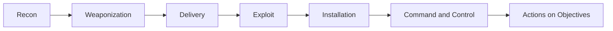
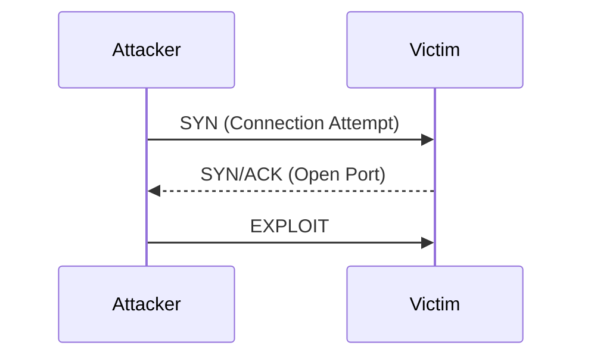
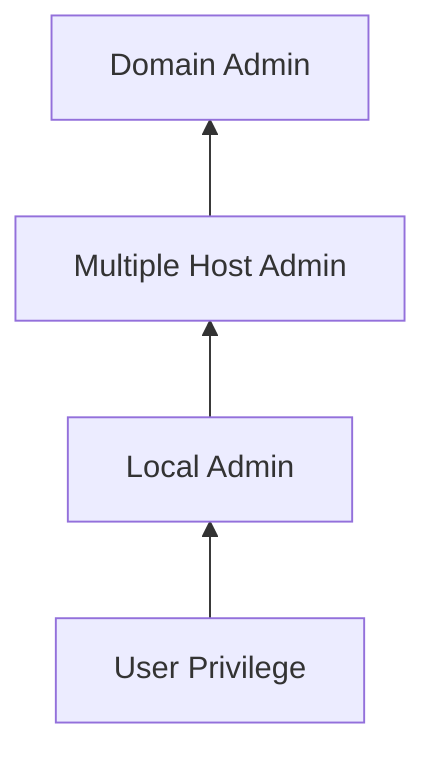
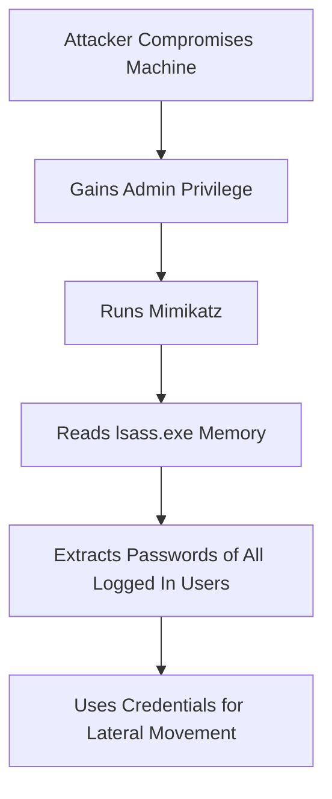
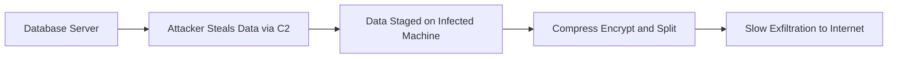

> **الهدف من الـ Section ده:**  
> هنفهم إزاي الـ Attacker بيتعامل مع الـ Endpoint بعد ما ينجح في الـ Exploitation، وإيه هي الـ Post-Exploitation Tactics اللي موجودة في MITRE ATT&CK matrix زي الـ Execution والـ Persistence والـ Privilege Escalation والـ Lateral Movement والـ Exfiltration، عشان نقدر كـ Blue Team نبني دفاع فعّال في كل مرحلة.

## Table of Contents
- [Introduction](#introduction)
- [Endpoint Centricity](#endpoint-centricity)
- [The Cyber Kill Chain و الـ Incoming Delivery](#the-cyber-kill-chain-و-الـ-incoming-delivery)
- [Initial Exploitation](#initial-exploitation)
- [Service-Side Exploits](#service-side-exploits)
- [Client-Side Exploits](#client-side-exploits)
- [Post-Exploitation Tactics و MITRE ATTCK](#post-exploitation-tactics-و-mitre-attck)
- [Tactic Execution](#tactic-execution)
- [Tactic Persistence](#tactic-persistence)
- [Tactic Discovery](#tactic-discovery)
- [Tactic Privilege Escalation](#tactic-privilege-escalation)
- [طرق الـ Privilege Escalation](#طرق-الـ-privilege-escalation)
- [Tactic Credential Access و Mimikatz](#tactic-credential-access-و-mimikatz)
- [Tactic Lateral Movement](#tactic-lateral-movement)
- [Tactic Collection](#tactic-collection)
- [Tactic Exfiltration](#tactic-exfiltration)
- [Summary](#summary)

## Introduction

في الـ Section دي بنتكلم عن أول جزء من SEC450.3 اللي اسمه "Understanding Endpoints, Logs, and Files"، وتحديدًا الجزء الخاص بـ **Endpoint Attack Tactics**.

الموضوع ده مهم جدًا في مجال الـ Cybersecurity لأن معظم المراحل المهمة في أي هجوم (زي الـ Code Execution والـ Persistence والـ Lateral Movement) بتحصل وبتسيب آثارها على الـ Endpoint نفسه، مش بس على الـ Network. يعني لو انت محلل SOC وعندك بس الـ Network Traffic، هتقدر تعرف الـ Domains والـ Protocols، لكن هتحتاج بيانات الـ Endpoint عشان تعرف مين الـ Process اللي عمل الاتصال، ومين الـ User المخترق، وإيه اللي كان بيتبعت جوه الـ Encrypted Tunnel.

## Endpoint Centricity

الفكرة هنا إن أهم خطوات أي هجوم بتكون مرتبطة بالـ Endpoint، زي:

- **Exploitation** (الاستغلال)
- **Code Execution** (تنفيذ الكود)
- **Persistence** (الاستمرارية)
- **Information Discovery**: زي الـ Accounts والـ Files والـ Privileges
- **Privilege Escalation** (تصعيد الصلاحيات)
- **Lateral Movement** (التنقل الجانبي)
- **Data Collection** استعدادًا للـ Exfiltration

### ليه الـ Endpoint أهم من الـ Network في التحقيق؟

لو فكرنا في الموضوع زي محقق جرايم: الـ Network بيديك معلومات عن "مين اتصل بمين"، لكن الـ Endpoint بيديك معلومات عن "مين اللي عمل الفعل نفسه". يعني الـ Endpoint هو المكان اللي هتلاقي فيه الـ Artifacts الحقيقية للـ Exploitation والـ Lateral Movement والـ Data Theft.

## The Cyber Kill Chain و الـ Incoming Delivery

الـ Lockheed Martin Cyber Kill Chain بيقسم الهجوم لمراحل:

1. Recon
2. Weaponization
3. Delivery
4. Exploit
5. Installation
6. Command & Control (C2)
7. Actions on Objectives

> [!NOTE]
> مراحل الـ Recon والـ Weaponization بتحصل على جهاز الـ Attacker نفسه، ومرحلة الـ Delivery غالبًا بتكون Network-centric (زي إيميل فيه Attachment أو موقع مخترق). لكن بعد الـ Delivery، الباقي بيبقى Host-centric يعني مرتبط بالـ Endpoint.

في الـ Section دي هنبدأ من مرحلة الـ **Exploitation** (المرحلة الرابعة) وهنكمل لحد آخر الـ Kill Chain، بافتراض إن الـ Delivery نجحت خلاص.

## Initial Exploitation

أول خطوة في الـ Exploitation إن الـ Attacker بيطلق Exploit على Process أو User معين. لو نجح، بقى هو نفسه بقى "هو" الـ Process/User ده، يعني عنده كل الصلاحيات اللي هو عنده.

السؤال المهم اللي لازم تسأله لنفسك كـ Analyst: **"إيه اللي اتخترق فعلاً؟"**

| الحالة | النتيجة |
|--------|---------|
| Service شغال بحساب محدود الصلاحيات | تقريبًا مفيش ضرر |
| Process شغال بصلاحية User عادي | صلاحية User |
| Webserver شغال بصلاحية Root | كارثة كاملة (Root) |

> [!IMPORTANT]
> ده السبب إن الشركات دايمًا بتحاول تقلل الصلاحيات (Privileges) اللي البرامج والـ Services شغالة بيها لأقل حد ممكن، عشان لو حصل اختراق يبقى الضرر محدود. الكلام ده بينطبق على الـ Users كمان — لو الـ User بيشتغل كـ Administrator وانخدع بإيميل Phishing، الكود اللي هيتنفذ هيبقى عنده صلاحيات Admin كاملة.

### Service-Side Exploits

الـ Exploits دي بتحتاج **Listening Port** مفتوح على الجهاز، زي Web أو SMB أو VNC أو RDP.

**مميزاتها بالنسبة للـ Attacker:**
- مش محتاجة أي تفاعل من الـ User
- ممكن تتكرر (Repeated Exploitation) بسهولة وبدون ما الضحية تلاحظ

**عيبها:**
- الـ Firewall ممكن يوقفها بسهولة لو الـ Port مقفول

### Client-Side Exploits

في النوع ده الـ Attacker بيحاول يخدع الـ User عشان يفتح ملف أو يزور موقع، زي:
- "افتح ملف الـ Word ده"
- "دوس على اللينك ده في إيميلي"

> [!TIP]
> الفرق الأساسي إن الـ Client-Side Exploits مش قابلة للتكرار بسهولة على نفس الشخص، لأنها بتعتمد على خداع الـ User، ومفيش ضمان إنه هيفتح نفس الملف أو يزور نفس الموقع تاني. لما الـ Service-Side Exploits متبقاش متاحة، الـ Attacker بيلجأ للطريقة دي غالبًا.

## Post-Exploitation Tactics و MITRE ATTCK

بمجرد ما الـ Exploit ينجح، طبيعة الاختراق بتتغير تمامًا — الـ Attacker بقى "يملك" الجهاز (owns the box). الأنشطة اللي بتحصل بعد كده اتقسمت بشكل ممتاز في مصفوفة **MITRE ATT&CK** (Attacker Tactics, Techniques, and Common Knowledge)، وهي:

- Execution
- Persistence
- Privilege Escalation
- Defense Evasion
- Credential Access
- Discovery
- Lateral Movement
- Collection
- Command and Control
- Exfiltration

> [!NOTE]
> كل Tactic في الـ ATT&CK matrix متقسمة لـ Techniques و Sub-Techniques، وكل واحدة فيهم موثقة مع أمثلة حقيقية من هجمات ومجموعات APT معروفة، وطرق للكشف عنها والوقاية منها. ده مصدر أساسي لأي حد شغال في الـ Blue Team.

كتير من فرق الأمان بقت تستخدم الـ ATT&CK matrix كقائمة أساسية للحاجات اللي المفروض يقدروا يكتشفوها كحد أدنى.

## Tactic Execution

بعد الـ Exploitation، بييجي دور تأسيس **Code Execution**. غالبًا بيتم فتح Command Shell عادي أو حتى Shell متطور زي الـ Meterpreter.

مثال مهم: لو الـ Attacker قدر يدخل على SQL Server، ممكن يستخدم الأمر `xp_cmdshell` اللي بياخد أمر من الـ SQL interpreter ويفتح بيه Command Shell حقيقي وينفذ فيه أوامر على النظام.

> [!WARNING]
> أدوات الـ Application Control فعّالة جدًا في إيقاف الـ Execution، لأن أي محاولة تشغيل كود مش موجود في الـ Allow List هتتوقف وهتنبه فريق الأمان فورًا.

## Tactic Persistence

الـ Persistence معناها إن الـ Attacker بيستخدم تقنية معينة عشان يضمن استمرارية دخوله للجهاز مع الوقت.

### ليه الـ Attacker بيخاطر بعمل Persistence؟

لأن من غير Persistence، أي مرة الـ User يعمل Reboot أو Logout، الـ Attacker هيضطر يعمل Exploit تاني، وده فيه مخاطرة من ناحية اكتشافه أو فشل الـ Exploit من الأساس. لكن في نفس الوقت، عمل Persistence بيحتاج تعديلات في النظام (زي Registry Key أو Scheduled Task) وده ممكن يلفت نظر أدوات الأمان.

> [!TIP]
> الـ Attacker ممكن يستخدم أكتر من طريقة Persistence في نفس الوقت (Registry Key + Scheduled Task) عشان لو فريق الأمان اكتشف واحدة، يفضل عنده مدخل تاني.

## Tactic Discovery

في المرحلة دي، الـ Attacker بيحتاج يستكشف البيئة اللي هو فيها عشان يقدر يكمل، زي:

- أسماء الـ Accounts والـ Groups
- صلاحيات الـ Users
- الملفات والمجلدات على النظام والشبكة
- الـ Services الشغالة محليًا وعلى الشبكة
- باقي الأجهزة على الشبكة
- البرامج المثبتة وإعداداتها

### تقنية Living Off the Land

الـ Attackers بيفضلوا يستخدموا أوامر الـ Operating System المدمجة (Built-in Commands) زي `netstat` وقوائم الـ Processes، لأن ده بيخليهم يمروا من غير ما يلفتوا الانتباه — أي Alert على الحاجات دي ممكن يغرق الـ SOC بـ False Positives.

## Tactic Privilege Escalation

بعد ما الـ Exploit ينجح، الـ Attacker بيكون عنده Foothold بس غالبًا بصلاحيات محدودة، فبيحاول يصعّد الصلاحيات دي.

### طرق الـ Privilege Escalation

الـ Hosts أصلاً متصممة إنها **ماتسمحش** بالـ Privilege Escalation، فإزاي بيحصل؟

1. **استغلال حد أو حاجة عندها صلاحية** إنها تنفذله المهمة (زي Admin User أو Service شغال كـ Root)
2. **استغلال ميزات الـ OS نفسها** (زي الـ File Permissions الغلط)
3. **استغلال ثغرات في الـ Software أو الـ Kernel**

#### أمثلة على إساءة استخدام الـ OS Permissions

- Hijacking admin startup items
- Modifying service executables
- Unquoted paths
- DLL search order hijacking
- Modifiable scheduled tasks

> [!TIP]
> فيه أداة اسمها **PowerUp** (جزء من إطار العمل PowerSploit) بتؤتمت اكتشاف الثغرات دي، وهي كود PowerShell بيشتغل بالكامل في الـ Memory وده بيصعّب اكتشافه.

#### Kernel Exploitation

استغلال ثغرات في الـ Kernel نفسه — الـ "برنامج" الأساسي في نظام التشغيل. مثال حقيقي: ثغرة **Dirty Pipe** (CVE-2022-0847) في 2022 اللي سمحت للـ Attacker يكتب فوق أي ملف يختاره، وده أدى لتصعيد صلاحيات خطير جدًا.

## Tactic Credential Access و Mimikatz

الـ Credential Dumping هي طريقة لعمل Privilege Escalation عن طريق قراءة كلمات المرور المخزنة في الـ Memory أو الـ Registry، لكنها بتتطلب إن الـ Attacker يكون وصل بالفعل لمستوى Admin.

### إزاي Mimikatz بيشتغل؟

Windows بيستخدم مفهوم **Single Sign-On**، يعني الـ Password بيتخزن في الـ Memory (في الـ Process اسمه `lsass.exe`) عشان مايطلبش من الـ User يكتبه كل مرة. أداة **Mimikatz** بتستغل ده وتروح تقرأ الـ Memory بتاع `lsass.exe` وتستخرج منه الـ Password Hash وأحيانًا الـ Plaintext Password.

> [!WARNING]
> لو أكتر من شخص Logged In على نفس الجهاز، Mimikatz ممكن يسرق كل الـ Passwords/Hashes بتاعتهم مش بس بتاع الضحية الأصلية، وده بيخليها أداة قوية جدًا للـ Lateral Movement.

## Tactic Lateral Movement

نادرًا ما يوصل الـ Attacker للبيانات اللي عايزها من أول جهاز يخترقه، فبيضطر ينتقل (Pivot) عبر البيئة عشان يجمع صلاحيات ووصول أكتر.

عشان يعمل Lateral Movement محتاج:
1. **وصول للجهاز** (عن طريق Exploit أو Credentials شرعية)
2. **الكود اللي عايز يشغله** (Built-in Commands أو Malware مخزّن)

### بروتوكولات الإدارة عن بُعد

| النوع | الأمثلة |
|-------|---------|
| CLI | SSH, SMB w/PSExec, PowerShell remoting, WMI |
| GUI | RDP, VNC, X11 forwarding |

## Tactic Collection

بمجرد نجاح الـ Lateral Movement، الـ Attacker بيبدأ يجمع معلومات مفيدة من كل جهاز بيوصله، زي:

- الملفات من الـ Local/Remote File Shares
- تصوير الشاشة والفيديو
- Key Logging
- سرقة الإيميلات
- تصدير قواعد البيانات

## Tactic Exfiltration

سرقة البيانات فعليًا أصعب بكتير من مجرد الوصول ليها. الـ Attacker لازم:

- ينقل كميات كبيرة من البيانات (Gigabytes) عبر الشبكة
- يجمع البيانات في مكان وسيط (Staging) لأن السيرفرات الداخلية عادة معندهاش وصول مباشر للإنترنت
- يلاقي Port مفتوح للإرسال للخارج
- يقسّم ويشفّر البيانات عشان يخفيها
- يرسلها ببطء عشان مايلفتش الانتباه

### إيجاد طريق للخروج

لو الشبكة معمولها **Default Deny Outbound Policy**، الـ Attacker هيلاقي إن معظم الـ Ports مقفولة، وممكن يضطر يستخدم بس الـ Ports المسموحة زي 25 (SMTP) أو 80/443 (HTTP/HTTPS)، وده غالبًا بيسيب أثر في الـ Firewall Deny Logs.

> [!IMPORTANT]
> غالبًا الـ Attacker هيستخدم البروتوكول الصحيح للـ Port بتاعه (زي HTTP على Port 80)، وده بيخلي الاكتشاف صعب ويعتمد بشكل أساسي على الـ Destination URL أو حجم/توقيت الرفع (Volume/Timing).

## Summary

- الهجوم بينقسم لمرحلتين أساسيتين: **Pre-Exploitation** (المراحل 1-4 من Kill Chain) و **Post-Exploitation** (المراحل 5-7، وهنا يركز MITRE ATT&CK)
- بعض المراحل Network-centric وبعضها Host-centric
- الـ Post-Exploitation Tactics الأساسية هي: Execution, Persistence, Discovery, Privilege Escalation, Credential Access, Lateral Movement, Collection, Exfiltration
- كل Tactic ليها Techniques كتير موثقة في MITRE ATT&CK matrix
- كل ما الـ Attacker يقرب من هدفه، اكتشافه على مستوى الـ Endpoint بيبقى أهم وأسهل
