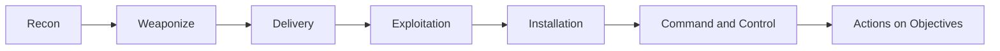
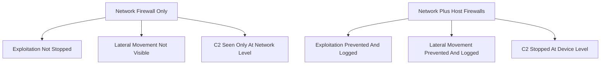

> **الهدف من الـ Section ده:**  
> هتفهم إزاي بنبني استراتيجية دفاع متعددة الطبقات (Defense in Depth) على الـ Endpoints، وهتتعرف على كل أداة دفاعية بتتماشى مع مراحل الـ Kill Chain، من منع الاستغلال الأولي لحد اكتشاف الأنشطة بعد الاختراق.

## Table of Contents
- [Introduction](#introduction)
- [Why One Layer Is Never Enough](#why-one-layer-is-never-enough)
- [Preventing Exploitation](#preventing-exploitation)
  - [Network Scanning and Software Inventory](#network-scanning-and-software-inventory)
  - [Continuous Vulnerability Scanning](#continuous-vulnerability-scanning)
  - [Patching](#patching)
  - [Anti-Exploitation](#anti-exploitation)
  - [Windows Defender Exploit Guard](#windows-defender-exploit-guard)
- [Virtualization-Based Security](#virtualization-based-security)
  - [Windows Credential Guard](#windows-credential-guard)
  - [Microsoft Defender Application Guard](#microsoft-defender-application-guard)
- [Host Firewalls](#host-firewalls)
- [Preventing Installation](#preventing-installation)
  - [Antivirus](#antivirus)
  - [Application Control](#application-control)
  - [Application Control Bypass Methods](#application-control-bypass-methods)
  - [File Integrity Monitoring](#file-integrity-monitoring)
  - [Catching Persistence](#catching-persistence)
  - [Privileged Access Workstations](#privileged-access-workstations)
  - [Windows Permissions and Privileges](#windows-permissions-and-privileges)
- [Command and Control Defenses](#command-and-control-defenses)
  - [EDR: Endpoint Detection and Response](#edr-endpoint-detection-and-response)
- [Actions on Objectives Defenses](#actions-on-objectives-defenses)
  - [Data Loss Prevention](#data-loss-prevention)
  - [User and Entity Behavior Analysis](#user-and-entity-behavior-analysis)
  - [Audit Policies and Logging](#audit-policies-and-logging)
- [Summary Table: Kill Chain vs Defenses](#summary-table-kill-chain-vs-defenses)
- [Key Notes](#key-notes)
- [Summary](#summary)

## Introduction

في الـ Section ده هنتكلم عن "Endpoint Defense In Depth"، يعني إزاي بنحمي الـ Endpoints (زي اللابتوبات، السيرفرات، الأجهزة) باستخدام أكتر من طبقة دفاعية في نفس الوقت. الفكرة الأساسية إن طبقة دفاع واحدة مش كفاية أبداً ضد مهاجم محترف. لازم يكون عندنا Layers متعددة، كل Layer بتغطي مرحلة معينة من مراحل الهجوم.

هنستخدم منظور الـ **Kill Chain** عشان نفهم كل أداة دفاعية بتشتغل فين بالظبط، وإيه نوع الهجوم اللي بتوقفه أو تكتشفه. الهدف النهائي إننا نخلي المهاجم يواجه "فخ" (Trap) في كل خطوة، وده بيبطّئه وبيدينا وقت أكتر عشان نمسكه قبل ما يوصل لهدفه.

## Why One Layer Is Never Enough

تخيل إن عندك بيت وعامل له باب واحد بس من غير أسوار أو كاميرات أو أنظمة إنذار. لو حد كسر الباب، خلاص دخل البيت كله بسهولة. نفس الكلام بينطبق على الـ Endpoint Security. لو معتمد بس على الـ Antivirus مثلاً، ولو المهاجم عرف يتخطاه، مفيش حاجة تانية توقفه.

عشان كده استراتيجية الـ **Defense in Depth** بتعتمد على مبدأ إن كل طبقة دفاعية بتغطي نقطة ضعف الطبقة اللي قبلها. لو حاجة فشلت في المنع (Prevention)، تكون فيه طبقة تانية بتكتشف (Detection) إن حاجة غلط حصلت.

كل مرحلة من المراحل دي ليها أدوات دفاعية مخصوصة، وهنشرحها واحدة واحدة.

## Preventing Exploitation

المرحلة دي بتركز على منع المهاجم من إنه يستغل أي ثغرة في السيستم من الأساس. فيه أربع أدوات أساسية هنا: الـ Network Scanning، الـ Vulnerability Scanning، الـ Patching، والـ Anti-Exploitation.

### Network Scanning and Software Inventory

أول خطوة في منع أي استغلال هي إنك تعرف إيه اللي شغال عندك أصلاً. مينفعش تحمي حاجة أنت مش عارف إنها موجودة! فيه طريقتين لجمع المعلومات دي:

- **Inventory Systems**: بتعمل Login دوري لكل جهاز وتعمل قايمة بالبرامج المثبتة، وتحفظها في قاعدة بيانات مركزية.
- **Network Scanning**: باستخدام أدوات زي **Nmap**، بتفحص الأجهزة عن طريق الشبكة نفسها، وتشوف إيه الـ Ports المفتوحة، وتجيب الـ Banners بتاعة الخدمات الشغالة، وتحاول تخمن نوع نظام التشغيل.

الجمع بين الطريقتين بيدّينا صورة كاملة عن الـ Attack Surface بتاعتنا عشان نقدر نقلله.

### Continuous Vulnerability Scanning

التهديدات السيبرانية بتتغير بسرعة رهيبة، وسيرفر آمن النهارده ممكن يبقى فيه ثغرة خطيرة بكرة! هنا بييجي دور الـ **Vulnerability Scanners**، اللي بتتابع نسخ البرامج على كل جهاز وتساعد في ترتيب أولويات الـ Patching.

فيه نوعين من الـ Scans:

1. **Unauthenticated Scans**: بتحاول تجمع معلومات عن طريق التفاعل مع الجهاز من غير Login، ومحدودة جداً في المعلومات اللي بتجيبها.
2. **Authenticated Scans**: بتعمل Login فعلي للجهاز عشان تعرف بالظبط إيه النسخ المثبتة، وده بيدّي دقة أعلى بكتير.

### Patching

الـ **Patching** هو الطريقة رقم واحد لمنع الاستغلال. حسب قايمة **CIS Top 20 Version 7**، معرفة البرامج (#2) والـ Continuous Patching (#3) من أهم البنود.

مهم نفهم إن الـ Patching مش بس للبرامج، لازم يشمل:
- تحديثات نظام التشغيل (Operating System)
- تحديثات برامج السيرفرات
- تحديثات لمنع الـ Client-Side Exploits كمان

> [!NOTE]
> بعض التحديثات بتحتاج Reboot، وده ممكن يسبب توقف مؤقت للخدمة. لازم يكون عندك سياسة واضحة لمتى يستاهل الأمر إيقاف العمل عشان يتم الـ Patch بسرعة، خصوصاً في حالة ثغرة خطيرة (Emergency Patch).

### Anti-Exploitation

لو حصل واستخدم مستخدم ملف فيه Exploit (زي ملف PDF خبيث)، إزاي هنعرف إن الحاجة دي حصلت أصلاً؟ هنا بييجي دور أدوات الـ **Anti-Exploitation** زي:

- **EMET** (Enhanced Mitigation Experience Toolkit): كان بيشتغل على Windows لحد إصدار 8.1 / Server 2012 R2.
- **Exploit Guard**: البديل الحديث في Windows 10 وما بعده.

الميزة الكبيرة في الأدوات دي إنها مش بس بتوقف الـ Exploit، لكن كمان بتعمل **Log** بمحاولة الاستغلال. يعني حتى لو الهجوم اتوقف، الفريق الأمني (SOC) بيعرف إن فيه محاولة هجوم حصلت.

### Windows Defender Exploit Guard

الـ Exploit Guard هو بديل EMET في Windows 10+ وبيتكون من 4 أجزاء أساسية:

| الميزة | الوظيفة | الترخيص المطلوب |
|--------|---------|------------------|
| Exploit Protection | حماية تفصيلية للتطبيقات وتسجيل أي محاولة استغلال | Home/Professional |
| Controlled Folder Access | منع الـ Ransomware من تشفير الملفات في "Protected Folders" | Home/Professional |
| Network Protection | منع الاتصال بمواقع خبيثة باستخدام SmartScreen | Enterprise E3 |
| Attack Surface Reduction | منع تكتيكات الهجوم الشائعة عبر البريد والـ Scripts والـ Office | Enterprise E5 |

## Virtualization-Based Security

### Windows Credential Guard

متاح في Windows 10+ Enterprise و Server 2016+. بيعزل الـ Credentials في الذاكرة باستخدام تقنية الـ Virtualization بتاعة الهارد وير نفسه. الهدف الأساسي إنه يمنع أدوات زي **Mimikatz** من الوصول للـ lsass.exe process الحقيقي وسرقة الباسورد.

يحتاج المتطلبات دي:
- UEFI Native Mode
- 64-bit Windows
- SLAT (Second Layer Address Translation)
- Virtualization (VT أو AMD-V)

> [!IMPORTANT]
> حتى لو المهاجم وصل لأعلى صلاحية ممكنة (Administrator)، Credential Guard بيمنعه من قراءة الـ LSA Process الحقيقي، وده بيرفع صعوبة الـ Credential Dumping بشكل كبير جداً.

### Microsoft Defender Application Guard

بيستخدم نفس فكرة الـ Hyper-V Isolation، لكن هنا بيتطبق على:

- **MS Edge Browser**: أي موقع غير موثوق فيه بيتفتح في بيئة معزولة.
- **Office Applications**: أي ملف Office جاي من الإنترنت أو مكان مشبوه بيتفتح جوه Virtual Machine منفصلة.

## Host Firewalls

الـ **Host Firewalls** ممكن يكونوا من أقوى أدوات اكتشاف ومنع الهجمات، رغم إنهم مش أكتر حاجة مثيرة تكنولوجياً. بيقدروا يمنعوا:

- الـ Exploitation
- الـ Lateral Movement
- الـ Command and Control (C2)
- الـ Exfiltration

المشكلة الأساسية فيهم إنهم بيولّدوا كمية بيانات هائلة، فلازم سياسة Logging دقيقة جداً تركز بس على الـ Ports الحساسة زي HTTP/HTTPS، SMB، SSH.

الفايدة الكبيرة من الـ Host Firewall إنه بيحول كل جهاز لـ "Security Sensor" بذاته، فلو جهاز حاول يتواصل مع جهاز تاني في نفس الـ Subnet عن طريق SMB بشكل غير طبيعي، هيتسجل Log واضح بيوصف المحاولة دي بالظبط.

## Preventing Installation

المرحلة دي بتركز على منع تثبيت الـ Malware، حتى لو المهاجم عدّى مرحلة الـ Exploitation.

### Antivirus

الـ **Antivirus** من أقدم أدوات الحماية. تقليدياً كان بيعتمد على الـ **Signatures**، يعني بيتعرف على الملفات الخبيثة المعروفة بس. المشكلة إنه بيفشل مع:

- Malware غير معروف (Zero-Day)
- Malware مموّه (Obfuscated)
- Malware متغيّر (Polymorphic)

المنتجات الحديثة بقت **Signatureless** وبتعتمد على الـ Machine Learning، يعني بتتعرف على خصائص الملف الخبيث بدل ما تدوّر على توقيع محدد.

> [!TIP]
> لو لقيت فيروس بإسم غريب مستني ما شفتوش قبل كده في بيئتك، أو موجود في مكان مش طبيعي، اعتبرها إشارة للتحقيق العميق حتى لو الاسم شكله عادي زي "trojan.generic".

### Application Control

من أفضل أدوات الـ Prevention والـ Detection. الفكرة الأساسية إنه بيشتغل بقايمة Allow List للبرامج المسموح بتشغيلها، وأي حاجة مش في القايمة بتتمنع أو على الأقل بيتعمل لها Log.

طرق التطبيق:
- **Name-based**: بالإسم
- **Path-based**: بالمسار
- **Signature-based**: بالتوقيع الرقمي
- **Hash-based**: بالـ Hash

أمثلة: **AppLocker/WDAC** في Windows، **Gatekeeper** في macOS، **AppArmor/SELinux** في Linux.

### Application Control Bypass Methods

للأسف الـ Application Control مش حل مثالي 100%. المهاجمين بيتخطوه بطرق زي:

| طريقة الـ Bypass | الشرح |
|------------------|-------|
| Malicious Scripts | بعض الحلول مش بتعتبر الـ Scripts "برامج" فبتتجاهلها |
| Living off the Land | استخدام أدوات موجودة أصلاً في السيستم زي rundll32.exe |
| Code Injection | حقن كود خبيث في Process شغال ومصرح له مسبقاً |
| Path-based Bypass | لو المهاجم قدر يكتب فوق ملف مسموح في نفس المسار |
| Hash/Signature Bypass | نظرياً ممكن، لكن يحتاج جهد ضخم جداً (Google استخدمت 6,610 سنة CPU Time عشان تعمل SHA1 Collision) |

### File Integrity Monitoring

الـ **FIM** بيراقب الملفات والمجلدات دورياً عشان يتأكد إنه مفيش تعديلات غير متوقعة. بيتابع:

- الـ Hash والحجم
- الـ Owner/Group
- الصلاحيات (Permissions)
- أي ملفات جديدة اتضافت

مثال عملي: لو مهاجم استغل موقع WordPress وحط ملف PHP خبيث (Web Shell) في `/var/www/html/`، الـ FIM هيكتشف الملف الجديد ده فوراً لأن ملفات الموقع مش المفروض تتغير كتير.

### Catching Persistence

الـ Persistence هي طريقة المهاجم للحفاظ على وصوله للسيستم. أشهر الـ **ASEPs** (Auto Start Extensibility Points):

- Autorun Items
- Malicious Services
- Scheduled Tasks
- Browser Extensions
- سرقة Credentials صالحة

> [!TIP]
> أداة **Sysinternals Autoruns** المجانية بتساعد كتير في اكتشاف الـ ASEPs المختلفة، وبتدعم التحقق من التوقيع الرقمي وربطها بـ VirusTotal.

### Privileged Access Workstations

مبدأ الـ **PAWS** بسيط: المستخدم صاحب الصلاحية العالية (زي الـ Admin) لازم يستخدم جهاز منفصل تماماً لمهامه الإدارية، وميستخدمش حسابه الإداري من جهازه العادي أبداً. ليه؟ لأن لو الجهاز العادي اتخرق، الهاكر هياخد الـ Credentials الإدارية كمان، وده بيدّيه أول خطوة في الـ Privilege Escalation.

### Windows Permissions and Privileges

**Permissions** بتتحكم في مين يقدر يقرأ/يكتب ملفات ومجلدات معينة، وده مهم جداً لمنع الـ Privilege Escalation عن طريق منع الكتابة فوق ملفات النظام الأساسية.

**Privileges** بتتحكم في إيه المستخدم يقدر يعمله بعد الـ Login، زي:
- تحميل الـ Drivers
- عمل Debug للـ Processes
- عمل Backup و Restore للملفات

## Command and Control Defenses

### EDR: Endpoint Detection and Response

الـ **EDR** زي "Flight Data Recorder" لكل Endpoint. بيسجل كل حاجة تقريباً: Processes، Services، DLLs، Files، Registry Keys، Network Connections. الميزة الأساسية إنه:

1. بيدّي Visibility ضخمة لكل نشاط على الجهاز
2. بيربط البيانات ببعضها ويعمل Timeline
3. **الـ "R" (Response)**: بيسمح للمحلل باتخاذ إجراء فوري زي عزل الجهاز، حذف ملفات، أو تشغيل Script للتحقيق

من أشهر المنتجات: Carbon Black, CrowdStrike, SentinelOne, Cybereason.

> [!NOTE]
> فيه فئة أحدث اسمها **XDR** بتضيف بيانات الشبكة كمان مع بيانات الـ Endpoint.

## Actions on Objectives Defenses

### Data Loss Prevention

الـ **DLP** بيركز على منع تسريب البيانات الحساسة في مراحل الـ Discovery والـ Collection والـ Exfiltration. بيستخدم Rules للتعرف على أنماط زي أرقام الـ Social Security أو بيانات بطاقات الائتمان.

3 حالات استخدام رئيسية:
1. **Non-malicious Insider**: منع الأخطاء غير المقصودة للموظفين
2. **Malicious Insider**: اكتشاف موظف بينوي يسرق أو يدمر بيانات
3. **Malicious Outsider**: منع المهاجم الخارجي من تصدير البيانات

### User and Entity Behavior Analysis

الـ **UEBA** بيعتمد على الـ Data Science والإحصاء لاكتشاف السلوك الشاذ (Anomalies). الفرضية الأساسية: الشيء الغريب أقرب للشر، لكن مش كل شيء غريب معناه شر بالضرورة، لازم خبرة بشرية عشان تفرق.

### Audit Policies and Logging

الـ **Logging** المركزي من أهم أدوات الدفاع على الإطلاق. بيشمل:

- **Event Logs**: سجل بكل الأحداث اللي حصلت
- **Audit Policies**: بتتحكم في إيه اللي بيتسجل وإيه اللي لأ

هنغطي الموضوع ده بتفصيل أكبر في الـ Modules الجاية.

## Summary Table: Kill Chain vs Defenses

| مرحلة الـ Kill Chain | الأدوات الدفاعية |
|----------------------|-------------------|
| Exploitation | Network Scanning, Vulnerability Scanning, Patching, Anti-Exploitation |
| Installation | Hardening, Antivirus, FIM, PAWS, Application Control |
| Command & Control | Host Firewalls, HIDS/HIPS, EDR |
| Actions on Objectives | Auditing, UEBA, Encryption, Logging, DLP |

## Key Notes

> [!WARNING]
> الـ Antivirus مش حل مثالي أبداً ضد مهاجمين محترفين، بس ده مش سبب إنك تلغيه — لسه بيوفر حماية قوية ضد الـ Commodity Malware اليومي.

> [!IMPORTANT]
> الـ Application Control بيمنع تنفيذ الملفات بس مش كتابتها على الهارد ديسك. يعني الملف الخبيث ممكن يتكتب على الجهاز لكن مش هيقدر يتشغل.

> [!TIP]
> كل ما زودت عدد الـ "Traps" في كل مرحلة من الـ Kill Chain، كل ما المهاجم اضطر يبطّئ، وده بيدّيك وقت أكتر عشان تمسكه.

## Summary

- الـ Defense in Depth معناها طبقات متعددة من الحماية، مش الاعتماد على أداة واحدة
- مرحلة الـ Exploitation بتتمنع بالـ Scanning, Patching, Anti-Exploitation
- مرحلة الـ Installation بتتمنع بالـ AV, Application Control, FIM, PAWS
- مرحلة الـ C2 بتتمنع/تتكتشف بالـ Host Firewalls و EDR
- مرحلة الـ Actions on Objectives بتتمنع بالـ DLP, UEBA, Logging
- كل أداة دفاعية ليها نقاط قوة وضعف، ومفيش أداة واحدة كفاية بمفردها

