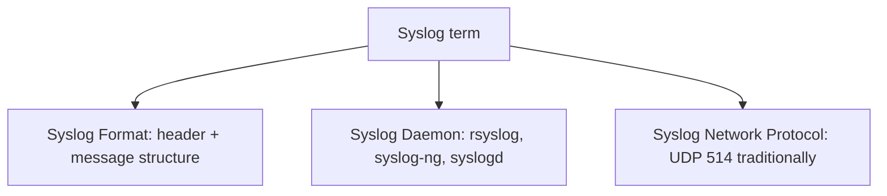
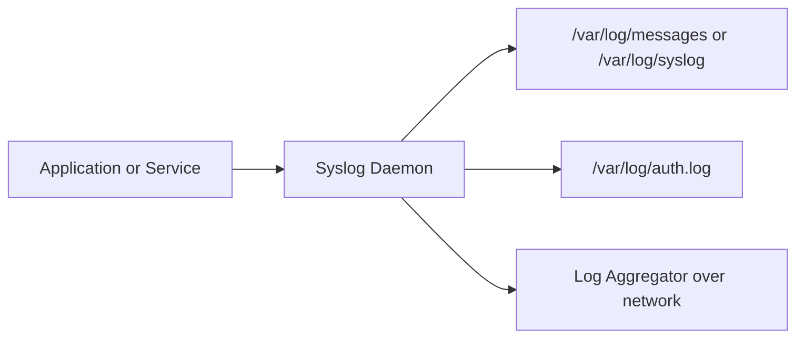

> **الهدف من الـ Section ده:**  
> هنفهم إزاي الـ Linux بيكتب الـ Logs بتاعته بشكل مختلف عن Windows، وهنفرّق بين الـ Syslog format والـ Syslog daemon والـ Syslog network protocol، وهنعرف معنى الـ Facility والـ Severity، وكمان هنتعرف على الـ Systemd Journal وأهم ملفات الـ Logs اللي لازم نجمعها في أي بيئة Linux.

## Table of Contents
- [Introduction](#introduction)
- [نظرة عامة على Linux Logging](#نظرة-عامة-على-linux-logging)
- [توضيح مصطلح Syslog](#توضيح-مصطلح-syslog)
- [صيغة الـ Syslog Log Format](#صيغة-الـ-syslog-log-format)
- [الـ Syslog Network Protocol](#الـ-syslog-network-protocol)
- [الـ Syslog Daemons](#الـ-syslog-daemons)
- [الـ Facility والـ Severity](#الـ-facility-والـ-severity)
- [مسار الـ Log التقليدي في Linux](#مسار-الـ-log-التقليدي-في-linux)
- [أهم ملفات الـ Logs في Linux](#أهم-ملفات-الـ-logs-في-linux)
- [الـ Systemd Journal](#الـ-systemd-journal)
- [أدوات تسجيل إضافية على مستوى الـ Command Line](#أدوات-تسجيل-إضافية-على-مستوى-الـ-command-line)
- [Summary](#Summary)

## Introduction

بعد ما فهمنا إزاي الـ Windows بيتعامل مع الـ Logging بطريقة معقدة ومنظمة عن طريق الـ XML والـ Channels، جينا دلوقتي لنظام مختلف تمامًا وهو **Linux**. الفكرة إن الـ Linux logging أبسط شكلًا، لكن البساطة دي ليها ثمن؛ لأن الـ Logs مش منظمة بنفس الطريقة، وده بيخلي عملية الـ Parsing واستخراج المعلومات منها أصعب بكتير وقت التحقيق.

## نظرة عامة على Linux Logging

من أول وهلة، بساطة الـ Linux logging بتبان مريحة جدًا مقارنة بتعقيد الـ Windows، لكن المفارقة إن نفس البساطة دي هي اللي بتخلي استخراج المعنى من الـ Logs أصعب.

النقط الأساسية اللي لازم تفهمها:

- الـ Logs اللي بيكتبها الـ OS بتكون بصيغة **Syslog format**.
- تقليديًا، الـ Logs دي كانت بتتخزن في ملفات **Plaintext** بدل الـ Channels اللي شفناها في Windows.
- فيه Service جديدة اسمها **journald** بقت بتستبدل الملفات الـ Plaintext في بعض الأنظمة بصيغة Binary منظمة أكتر، شبه اللي في Windows.
- الـ Linux **مش بيستخدم Event IDs** زي Windows، فمفيش توحيد قياسي (Standardization) للأحداث.
- بدل كده، بيتم تصنيف كل رسالة بواسطة **Facility** (مصدر الرسالة) و **Severity** (أهميتها).
- الـ Format بتاع كل رسالة ممكن يختلف تمامًا من برنامج للتاني.
- الرسائل ممكن تتبعت عبر **UDP** أو **TCP**، وممكن كمان تتشفر.

> [!NOTE]
> المفهوم ده بيتطبق مش بس على Linux لكن على كل أنظمة Unix-like بشكل عام، حتى لو استخدمنا كلمة "Linux logging" للتبسيط.

### ليه الـ Parsing صعب في Linux؟

المشكلة الأساسية إن محتوى الرسالة (Message) **مش منظم ومش معنون بـ Event ID** زي Windows، فأي محاولة لاستخراج الحقول بشكل أوتوماتيكي غالبًا بتعتمد على مجموعة معقدة من الـ **Regular Expressions**.

## توضيح مصطلح Syslog

من أكتر الحاجات اللي بتلخبط الناس إن كلمة **Syslog** بتُستخدم للإشارة لأكتر من حاجة في نفس الوقت. لازم نفرّق بين ثلاث معاني مختلفة:

1. **Syslog Format** — الطريقة اللي المفروض يتكتب بيها نص الـ Log نفسه.
2. **Syslog Daemon** — البرنامج اللي بيسهّل كتابة الملفات النصية أو تحويل (Forward) الـ Logs، زي **Rsyslog** أو **Syslog-ng** أو **Syslogd**.
3. **Syslog Network Protocol** — بروتوكول الشبكة اللي بيتبعت بيه الـ Traffic، وتقليديًا كان بيستخدم **UDP Port 514**.



> [!TIP]
> لما تسمع كلمة "Syslog" في أي كلام تقني، اسأل نفسك: هو ده معناه الـ Format ولا الـ Daemon ولا الـ Protocol؟ ده هيساعدك تفهم الكلام صح.

## صيغة الـ Syslog Log Format

الـ **Syslog** هو المعيار (Standard) القديم لتسجيل الـ Logs في أنظمة *nix، ومستخدم من الثمانينات.

الصيغة العامة:

```
<time> <hostname> <log_source> [<PID>]: <message>
```

مثال حقيقي:

```
Dec 11 16:41:40 ubuntu dhclient[64507]: DHCPACK of 192.168.42.147 from 192.168.42.254
```

لما نحلل المثال ده:

| الجزء | القيمة | الشرح |
|------|--------|---------|
| Timestamp | Dec 11 16:41:40 | لاحظ إن السنة مش موجودة |
| Hostname | ubuntu | اسم الجهاز اللي كتب الـ Log |
| Log Source | dhclient | اسم البرنامج |
| PID | 64507 | رقم الـ Process اللي كتب الرسالة |
| Message | DHCPACK of 192.168.42.147 from 192.168.42.254 | النص الحر بعد الـ Header |

### المشكلة الأساسية في الـ Format ده

المعيار بيحدد بس محتوى الـ **Header**، أما أي حاجة بعد الـ Colon (:) فهي حرة تمامًا وبتعتمد على البرنامج اللي كاتبها. النتيجة:

- النص الحر (Free Text) سهل القراءة للإنسان، لكن معناه لازم Regex عشان يتحلل.
- أحيانًا الرسالة بتيجي بصيغة منظمة زي **CSV** أو **Key-Value pairs** أو **JSON**، وده بيسهّل الـ Parsing الأوتوماتيكي جدًا.

### المعايير الرسمية للـ Syslog

- **RFC 3164** — النسخة القديمة على طراز BSD، وهي المستخدمة غالبًا حتى الآن.
- **RFC 5424** — نسخة أحدث بتضيف تفاصيل أكتر للـ Header، لكن استخدامها الفعلي نادر جدًا.

> [!IMPORTANT]
> رغم إن RFC 5424 هي الأحدث رسميًا، إلا إن أغلب الـ Syslog اللي هتشوفه في الواقع لسه متوافق مع الصيغة القديمة RFC 3164.

## الـ Syslog Network Protocol

لو النظام بيبعت الرسائل عبر الشبكة لـ Log Collector، فده بيحصل بمعايير محددة:

- بيتبعت افتراضيًا بدون تشفير عبر **UDP Port 514**.
- الحجم الأقصى النظري للرسالة عبر **UDP هو 1K**.
- الحجم الأقصى عبر **TCP هو 4K**.
- لو استخدمت **TCP**، تقدر كمان تستخدم **TLS Encryption** لتأمين الاتصال.

### المعايير المرتبطة بنقل الـ Syslog

| RFC | الوظيفة |
|------|--------|
| RFC 3195 | نقل الـ Syslog عبر TCP |
| RFC 5425 | TLS Transport Mapping للـ Syslog |
| RFC 5426 | إرسال رسائل الـ Syslog عبر UDP |
| RFC 5484 | توقيع رسائل الـ Syslog (Signed messages) |
| RFC 6012 | إرسال الـ Syslog عبر Datagram TLS (UDP مشفر) |

> [!WARNING]
> الطريقة الافتراضية والأكتر شيوعًا لسه بترسل الرسائل **من غير تشفير عبر UDP Port 514**، وده معناه إن أي حد على نفس الشبكة ممكن يشوف محتوى الـ Logs لو مفيش تشفير مُفعّل.

## الـ Syslog Daemons

الـ Daemon هو البرنامج المسؤول عن استقبال وكتابة وتحويل الـ Logs. فيه 3 خيارات أساسية:

### Syslogd
البرنامج الأصلي من سنة 1980، ولسه مستخدم في بعض التوزيعات.

### Syslog-ng
اتقدم سنة 1998 كتطوير لـ syslogd، بيقدم إعدادات فلترة أسهل، وليه نسخة مجانية ونسخة Premium.

### Rsyslog
اتقدم سنة 2004 كبديل لـ syslog-ng، النسخة الخاصة بـ Linux مجانية ومتاحة كمان Agent لـ Windows.

كل من **syslog-ng** و **rsyslog** بيدعموا:

- فلترة دقيقة جدًا (Granular Filtering).
- بروتوكولات نقل متعددة.
- تحويل الصيغة (Format Conversion).
- الإرسال المباشر لـ Log Brokers زي **RabbitMQ** أو **Kafka**.
- الإخراج المباشر لقواعد بيانات زي **MySQL**, **MongoDB**, **Elasticsearch**, أو حتى **Hadoop HDFS**.

## الـ Facility والـ Severity

بدل الاعتماد على Event IDs زي Windows، الـ Linux بيصنف الرسائل باستخدام **Facility** و **Severity**.

### Facility — مصدر الرسالة

الـ Facility بتوضح مصدر الرسالة (مش البرنامج بالضبط)، من أمثلتها:

| Facility | الرقم | الوصف |
|------|--------|---------|
| kern | 0 | رسائل الـ Kernel |
| user | 1 | رسائل مستوى المستخدم |
| mail | 2 | رسائل نظام البريد |
| daemon | 3 | رسائل الـ Daemons |
| auth | 4 | رسائل التصريح (Authorization) |
| authpriv | 10 | رسائل أمان/تصريح خاصة |
| local0 – local7 | 16-23 | مخصصة للاستخدامات المتنوعة زي خدمات مش موجودة أصلًا في القائمة |

### Severity — أهمية الرسالة

| Severity | الرقم | الوصف |
|------|--------|---------|
| emerg | 0 | طوارئ، النظام غير قابل للاستخدام |
| alert | 1 | لازم يتصرف فورًا |
| crit | 2 | حالة حرجة |
| err | 3 | حالة خطأ |
| warning | 4 | تحذير |
| notice | 5 | حالة عادية لكن مهمة |
| info | 6 | رسالة معلوماتية |
| debug | 7 | رسائل تصحيح الأخطاء |

### حساب الـ Priority

المعادلة:

```
Priority = Facility * 8 + Severity
```

أمثلة:

- `<0>` = kernel.emergency
- `<38>` = auth.info
- `<191>` = local7.debug

> [!NOTE]
> كل ما رقم الـ Priority أقل، كل ما الرسالة أهم. الـ Priority ده بيظهر بس لما الرسالة بتتبعت عبر الشبكة، لأن الـ Facility والـ Severity مش مكتوبين صراحة جوه نص الرسالة نفسها.

## مسار الـ Log التقليدي في Linux



الفكرة باختصار:

1. الرسائل بتتبعت من الـ Applications المختلفة للـ **Syslog Daemon** (زي rsyslog أو syslog-ng).
2. الـ Daemon بيستخدم الـ **Facility** و **Severity** عشان يقرر أي ملف هيتسجل فيه الرسالة، وعادةً بيكون جوه مجلد **/var/log**.
3. كل رسالة بتتكتب بالـ Header القياسي (الوقت، اسم الجهاز، البرنامج).
4. الـ Daemon كمان ممكن يبعت نسخة من نفس البيانات عبر الشبكة لأي Log Aggregator محدد في الإعدادات.

## أهم ملفات الـ Logs في Linux

### System Logs

| الملف | الوصف |
|------|--------|
| /var/log/auth.log (Ubuntu) أو /var/log/secure (Red Hat) | محاولات تسجيل الدخول (sshd, sudo, su) |
| /var/log/syslog (Ubuntu) أو /var/log/messages (Red Hat) | النشاط العام للنظام، أقرب حاجة لـ System log في Windows |
| /var/log/kern.log | رسائل الـ Kernel (كتير جدًا وضجيج عالي، قيمة أمنية منخفضة عادةً) |

### Application Logs

| الملف | الوصف |
|------|--------|
| /var/log/audit/audit.log | لوجات Auditd للقواعد المفعّلة |
| /var/log/audit/ufw.log | لوجات الـ Firewall لو مستخدم UFW |
| /var/log/apache2 أو httpd/access.log | تفاعلات Apache webserver |
| /var/log/httpd/mysqld.log | تفاعلات MySQL |

> [!TIP]
> كل توزيعة Linux بتتعامل مع الـ Logging بشكل مختلف شوية، فلازم تراجع الممارسات الخاصة بالتوزيعة اللي بتستخدمها بالتحديد.

## الـ Systemd Journal

طريقة أحدث لحل مشاكل الـ Syslog التقليدي:

- **systemd-journald** هي Service بتشتغل في الخلفية وبتستقبل الـ Logs بشكل آمن.
- بتخزن البيانات في `/var/log/journal/[machineid]/`.
- بتستخدم صيغة **Binary منظمة**، شبه الـ EVTX بتاع Windows.
- محتوى الـ Journal غالبًا نصي، لكن ممكن يحتوي على بيانات Binary كمان.
- بتسمح بحقول مخصصة (Custom fields) وبصيغة منظمة، على عكس الـ Syslog التقليدي.

### الأمر journalctl

عشان تشوف محتوى الـ Journal، بتستخدم:

```bash
journalctl
```

أو لو عايز تشوف لوجات Service معين بس، بتستخدم الـ `-u` (اختصار لـ unit):

```bash
journalctl -u suricata
```

مثال على الـ Output:

```
-- Logs begin at Sun 2018-06-03 11:39:37 PDT, end at Sun 2019-12-01 08:42:44 PST. --
Nov 23 22:15:09 ubuntu systemd[1]: Starting LSB: Next Generation IDS/IPS...
Nov 23 22:15:09 ubuntu suricata[34399]: Starting suricata in IDS (af-packet) mode... done.
```

> [!IMPORTANT]
> لو النظام اللي بتشتغل عليه بيدعم الـ Journal، لازم الـ Log Agent بتاعك يدعم استخراج الرسائل منه، عشان تضمن إنها هتوصل للـ SIEM.

## أدوات تسجيل إضافية على مستوى الـ Command Line

خيارات الـ Logging في Linux بتتقسم عمومًا لـ 3 فئات رئيسية:

### 1. Built-in Logging — auditd

**auditd** هي Service موجودة وجاهزة تقريبًا في كل توزيعة Linux/Unix. الميزة إنها مُثبّتة بالفعل، لكن العيب إن الـ Output بتاعها معقد شوية ويصعب تفسيره أو ضبط إعداداته مقارنة بحلول تانية.

### 2. Third-Party Tools — Sysmon for Linux

أداة **Sysmon** الشهيرة والمجانية بتاعة Windows بقت متاحة كمان لـ **Linux**، وبتوفر نفس مستوى التفاصيل تقريبًا.

### 3. Scripts and One-off Logging

سهل جدًا تكتب Script مخصص يستخدم خدمة الـ Logging بتاعة النظام. أمر **logger** بيسمحلك تبعت رسالة واحدة (One-off Message) مباشرة للـ Syslog:

```bash
logger "This is a custom log message"
```

## Summary

- الـ Linux logging أبسط ظاهريًا من Windows، لكن الـ Parsing أصعب لأن مفيش Event IDs ولا Structure ثابت.
- الرسائل بتتكتب بصيغة **Syslog** اللي فيها Header قياسي (وقت، اسم جهاز، مصدر) ومتبوع بنص حر.
- كلمة "Syslog" ليها 3 معاني: **Format**, **Daemon**, و **Network Protocol**، ولازم تفرّق بينهم.
- التصنيف بيعتمد على **Facility** (المصدر) و **Severity** (الأهمية)، والـ Priority بتُحسب بالمعادلة: Facility × 8 + Severity.
- المسار التقليدي: Application → Syslog Daemon → ملفات في /var/log أو إرسال عبر الشبكة.
- الـ **Systemd Journal** هو تطور حديث بيستخدم صيغة Binary منظمة زي Windows EVTX.
- أدوات زي **auditd**, **Sysmon for Linux**, والـ **logger command** بتوفر مرونة إضافية في التسجيل.
