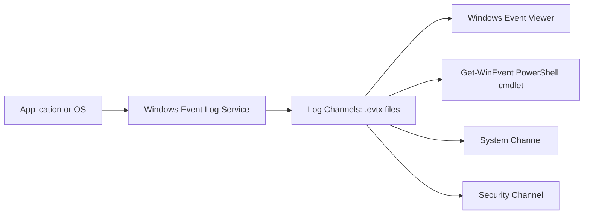
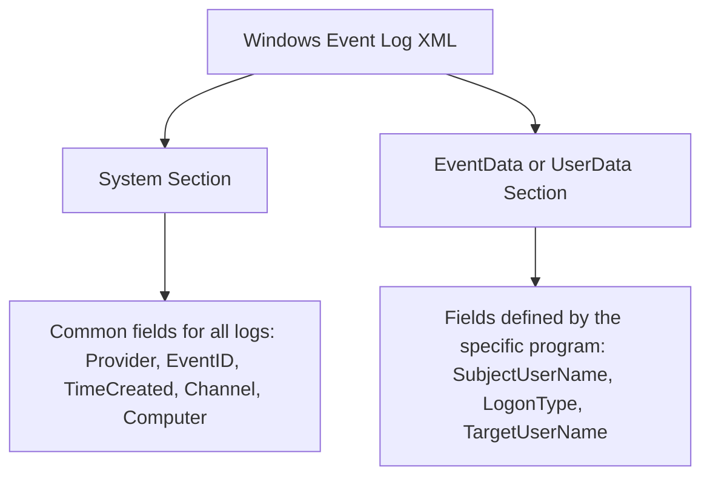
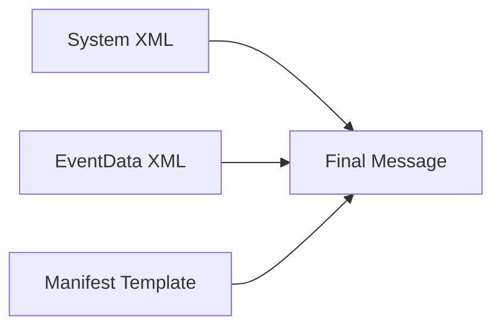

> **الهدف من الـ Section ده:**  
> هنفهم إزاي الـ Windows بيكتب الـ Logs بتاعته بشكل مختلف تمامًا عن Linux، وهنعرف إيه هو الـ Log Channel، وإزاي الـ XML structure بتاعت الـ Windows Events شغالة من جوه، وكمان هنعرف إيه هي أهم الـ Channels اللي لازم نجمعها كـ SOC Analyst.

## Table of Contents
- [Introduction](#introduction)
- [أهمية فهم Log Collection](#أهمية-فهم-log-collection)
- [إزاي الـ Windows Event Logging شغال](#إزاي-الـ-windows-event-logging-شغال)
- [مسار الـ Log في Windows](#مسار-الـ-log-في-windows)
- [إزاي بيتحدد إيه اللي هيتسجل](#إزاي-بيتحدد-إيه-اللي-هيتسجل)
- [تفاصيل الـ Windows Log Breakdown](#تفاصيل-الـ-windows-log-breakdown)
- [نفس الـ Log بأشكال مختلفة](#نفس-الـ-log-بأشكال-مختلفة)
- [الأقسام الأساسية لأي Windows Log](#الأقسام-الأساسية-لأي-windows-log)
- [Windows Event Templates](#windows-event-templates)
- [تجميع القطع مع بعض](#تجميع-القطع-مع-بعض)
- [الـ Channels المهمة اللي لازم نجمعها](#الـ-channels-المهمة-اللي-لازم-نجمعها)
- [ملخص الـ Section](#ملخص-الـ-section)

## Introduction

في الـ Section ده هنتكلم عن حاجة أساسية جدًا في شغل أي SOC Analyst وهي فهم إزاي الـ Logs بتتولد وبتتجمع من الـ Endpoints، وتحديدًا هنركز على نظام الـ Windows لأنه معقد شوية عن Linux. الموضوع ده مش تفصيلة صغيرة؛ لو مش فاهم إزاي الـ Log بيتكتب واصله منين، مش هتقدر تفسّره صح وقت التحقيق في حادثة أمنية (Incident)، وممكن كمان تفوّت معلومات مهمة لأن الـ Channel اللي فيها الدليل مش بتتجمع أصلاً.

## أهمية فهم Log Collection

كتير من المحللين بيفكروا إن موضوع جمع الـ Logs "شغل حد تاني" زي فريق الـ SIEM Engineering، لكن ده تفكير غلط. لما تفهم إزاي الـ Log اتكتب وايه المصدر بتاعه، هتقدر:

- تعمل Triage أسرع وقت الحادثة.
- تفهم الأدوات المتاحة قدامك صح.
- تفسّر أي Event تشوفه بثقة أكبر لأنك فاهم من فين جاي.

> [!NOTE]
> تفسير الـ Logs مش حاجة بتحصل مرة في الشهر... دي حاجة بتحصل كل يوم في شغل الـ SOC، فالاستثمار في فهمها هيفرق معاك على المدى الطويل.

## إزاي الـ Windows Event Logging شغال

الـ Windows بيستخدم طريقة مختلفة تمامًا عن Linux في تسجيل الـ Logs. الفكرة الأساسية:

- كل الـ OS والـ Applications بتكتب الـ Logs بتاعتها في حاجة اسمها **Log Channel**.
- كل Channel هي في الحقيقة ملف بصيغة **.evtx** وده format بيكون بصيغة **XML** لكن مُشفّر بشكل Binary.
- معنى كده إنك **مش هتقدر تفتح الملف بـ Text Editor عادي** زي ما بتعمل مع ملفات Linux اللي بتكون plain text.
- الأداة الأساسية لقراءة ملفات الـ .evtx هي **Windows Event Viewer**.
- في الـ Event Viewer، هتلاقي الـ Channels على الجنب الشمال، وأشهرها: **Application**, **Security**, **System**، لكن في Channels تانية كتير غير معروفة لكنها مفيدة جدًا للـ Security.

### تشبيه بسيط

تخيل إن كل Application في جهازك زي موظف بيبعت تقرير لمكتب مركزي (الـ Windows Event Log Service). المكتب ده بيفرز التقارير على حسب نوعها ويحطها في أدراج مختلفة (الـ Channels)، وكل درج ده ملف .evtx منفصل.

> [!IMPORTANT]
> مش كل الـ Applications بتكتب في الـ Windows Event Log. بعض البرامج بتفضل تكتب Logs بتاعتها في ملفات Text عادية أو في أماكن تانية خالص، فلازم تعرف طبيعة كل Application اللي بتراقبها.

## مسار الـ Log في Windows

في الـ Diagram التالي هنشوف رحلة الـ Log من لحظة ما اتكتب لحد ما يظهر لينا في أداة العرض:



الخطوات باختصار:

1. الرسالة بتتبعت من الـ Application أو الـ OS نفسه.
2. الرسالة بتوصل لـ **Windows Event Log Service**.
3. الـ Service ده بيستخدم الـ Metadata المرفقة عشان يقرر أي Channel هتستقبل الرسالة دي.
4. كل Channel بتتخزن في ملف .evtx منفصل جوه المسار: `C:\Windows\System32\winevt\Logs`.
5. تقدر تقرأ الملفات دي بـ Windows Event Viewer، أو بأداة **Get-WinEvent** في PowerShell، أو بأدوات Forensic تالتة.

## إزاي بيتحدد إيه اللي هيتسجل

مش كل حاجة بتتسجل تلقائيًا؛ فيه إعدادات بتتحكم في ده:

### الـ Windows Audit Policies

دي الطريقة الأساسية اللي بتتحكم في الـ Events اللي هتتسجل، زي:

- Logon/Logoff events.
- Object Access.
- إنشاء مستخدمين جدد أو تعديل مجموعات (Group Management).
- تحديد هل يتسجل عند النجاح (Success) ولا الفشل (Failure) ولا الاتنين.

### إضافات خارجية زي Sysmon

**Sysmon** هي أداة third-party بتضيف تفاصيل تسجيل تانية زي:

- Process Creation.
- Network Connections.
- تفاصيل تانية كتير مش موجودة في الـ Audit Policy الافتراضية.

### Custom Scripts

ممكن تكتب PowerShell Script يعمل Channel مخصص ويبعتله أي نص، وده بيسهّل على الـ Log Agent إنه يلتقط أي معلومة عايزها بشكل مباشر.

### الـ Applications نفسها

لو الـ Application مش بتكتب في الـ Windows Event Log، فالإعدادات بتعتمد بالكامل على قدرات البرنامج نفسه. مثلاً في خدمات الشبكة زي Web servers أو DNS servers، الأفضل تتأكد إن الـ Logging مفعّل بكل الحقول المهمة، أو تلتقط المعلومة من على الشبكة نفسها بأداة زي **Zeek** أو **Suricata**.

## تفاصيل الـ Windows Log Breakdown

كل Log جوه أي Channel بييجي معاه Metadata مهمة جدًا للتفسير:

| الحقل (Field) | المعنى | مثال |
|------|--------|---------|
| Level | مستوى أهمية الرسالة (Verbose, Informational, Warning, Error, Critical) | معظم الـ Logs بتكون Informational |
| Source (Provider) | البرنامج اللي كتب الـ Log | Microsoft-Windows-Security-Auditing |
| EventID | رقم فريد بيحدد نوع الحدث جوه نفس الـ Channel | 4624 = تسجيل دخول ناجح |
| Task Category | وصف إضافي للحدث بيحدده الـ Source بنفسه | Logon |

> [!TIP]
> الـ EventID مش فريد على مستوى الـ Windows كله، هو فريد بس جوه نفس الـ Channel. يعني ممكن EventID رقم 1 يكون له معنى مختلف تمامًا في Channel تانية غير اللي في Security.

## نفس الـ Log بأشكال مختلفة

من أهم الحاجات اللي لازم تفهمها: الـ Windows Event في الحقيقة هو **XML**، لكن ممكن يتعرض بأشكال مختلفة في الـ Event Viewer:

1. **General/Message View** — الشكل السهل للقراءة، ده اللي بيشوفه الـ Analyst عادةً.
2. **Friendly View** — بيشيل الـ XML Tags لكن يفضل قريب من الـ Structure الأصلي.
3. **XML View** — الشكل الحقيقي الكامل اللي فيه كل الـ Tags والبيانات الخام.

الفكرة إن الـ **Message** اللي بتشوفه في General Tab اتعمل من الـ XML Data باستخدام Text Template. المشكلة إن الـ Message View ده **صعب جدًا يتفسّر Automatically بواسطة الـ SIEM** لأنه Free Text مش منظم، على عكس الـ XML اللي بيكون منظم وسهل الـ Parsing.

> [!WARNING]
> لو الـ SIEM بيستقبل بس الـ Message View من غير الـ XML fields، هتواجه صعوبة كبيرة في الـ Parsing الأوتوماتيكي، وده ممكن يخليك تفوّت Alerts مهمة لأن الحقول مش متاحة للبحث السريع.

## الأقسام الأساسية لأي Windows Log

أي Windows Event لما تشوفه بصيغة XML بيتقسم لقسمين رئيسيين:

### System Section

ده الجزء المشترك بين كل الـ Windows Logs مهما كان نوعها، وبيحتوي على حاجات زي:

- Provider Name و Guid.
- EventID.
- TimeCreated.
- Channel و Computer.

### EventData / UserData Section

ده الجزء اللي بيحدده البرنامج اللي كاتب الـ Log نفسه، وممكن يختلف تمامًا من EventID للتاني، زي:

- SubjectUserSid, SubjectUserName.
- TargetUserName, TargetDomainName.
- LogonType.



## Windows Event Templates

عشان نفهم إزاي الـ Message اتبنت من الأساس، ممكن نستخدم PowerShell عشان نشوف الـ Template بتاع أي EventID:

```powershell
Get-WinEvent -ListProvider * | Select name
$provider = Get-WinEvent -ListProvider Microsoft-Windows-Security-Auditing
$provider.events | Where-Object {$_.id -eq 4624} | select id,template,description | fl
```

الأمر الأول بيسرد كل الـ Providers الموجودة في النظام. التاني بيحدد الـ Provider بتاع الـ Security Log. التالت بيطلع الـ Template والـ Description بتاعة الـ EventID رقم 4624 (تسجيل الدخول الناجح).

> [!NOTE]
> ممكن تلاقي أكتر من Output لنفس الأمر، وده لأن نفس الـ EventID ممكن يكون ليه أكتر من صيغة Message مختلفة على حسب الحقول المتاحة وقت الحدث.

## تجميع القطع مع بعض

الـ Message النهائي اللي بيظهرلك في General Tab بيتكوّن من ثلاث حاجات مع بعض:

1. **System XML** — البيانات المشتركة.
2. **EventData XML** — البيانات الخاصة بالحدث.
3. **Instrumentation Manifest Template** — القالب النصي اللي بيحول الأرقام (زي %1) لأسماء حقول مفهومة زي "Security ID" أو "Account Name".



الرسالة النهائية اللي هتشوفها في الـ General Tab سهلة القراءة للإنسان، لكن **مش مصممة أصلًا عشان الـ SIEM يعمل عليها Parsing أوتوماتيكي**. لو حاولت تكتب Regular Expression عشان تسحب الحقول من الـ Message، هتواجه مشاكل كتير بسبب الطبيعة الـ Conditional وغير المنظمة للـ Format ده.

## الـ Channels المهمة اللي لازم نجمعها

فيه Channels شائعة الكل بيجمعها، وفيه Channels تانية أقل شهرة لكنها مفيدة جدًا للـ Detection:

### Channels شائعة (Commonly Collected)

- **Application**
- **Security**
- **System**

### Channels أقل شهرة لكن مفيدة جدًا

| Channel | الفايدة |
|------|--------|
| PowerShell/Operational | تسجيل الأوامر المكتوبة في PowerShell، مهم جدًا لأن هجمات كتير بتستخدم PowerShell in-memory |
| Security-Mitigations (Kernel/User Mode) | لوجات EMET و Exploit Guard زي Attack Surface Reduction و Controlled Folder Access |
| Code Integrity/Operational | لوجات Windows Defender Application Control على الـ executables و dlls و drivers |
| AppLocker (EXE/DLL, MSI/Script) | تسجيل انتهاكات الـ Application Control |
| Windows Defender/Operational | لوجات الفيروسات اللي اكتشفها Windows Defender |
| Windows Firewall with Advanced Security/Firewall | تسجيل تغييرات الـ Firewall |
| Sysmon/Operational | لو عندك Sysmon مُثبّت، لازم تجمع الـ Channel دي فورًا |

> [!IMPORTANT]
> الاكتفاء بجمع Application و Security و System بس مش كافي أبدًا لبناء صورة كاملة عن أمان الـ Endpoint. أي Logging إضافي (زي Sysmon أو PowerShell logging) هيولّد بيانات في Channels تانية لازم تتجمع كمان.

## ملخص الـ Section

- الـ Windows Logging معقد أكتر بكتير من Linux لأنه بيعتمد على **Log Channels** و **XML structure** بصيغة **.evtx**.
- الـ Windows Event Log Service هو المسؤول عن توزيع الرسائل على الـ Channels المختلفة.
- الـ Audit Policy هي الأداة الأساسية اللي بتحدد إيه اللي هيتسجل، وممكن تتدعم بأدوات زي **Sysmon** أو Custom Scripts.
- كل Log بيتكون من قسمين: **System** (مشترك) و **EventData/UserData** (خاص بالحدث).
- الـ Message اللي بتشوفه في الـ Event Viewer اتبنى من XML + Template، وهو مش مناسب للـ Parsing الأوتوماتيكي.
- لازم تجمع أكتر من مجرد Application/Security/System عشان تغطي هجمات حديثة زي PowerShell-based attacks أو Application Control bypass.

