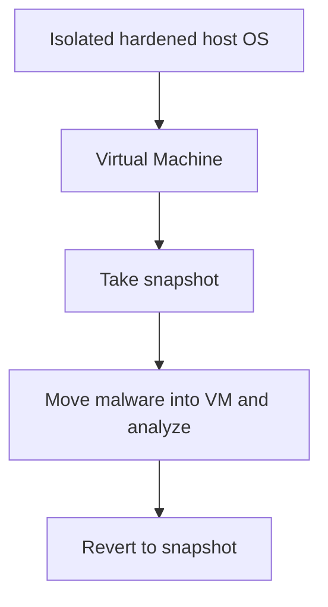
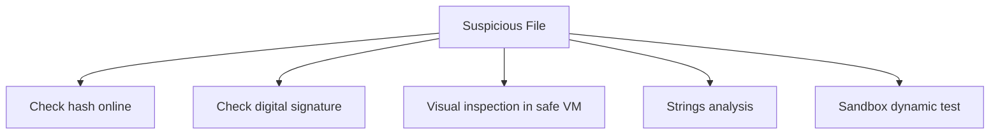

> **الهدف من الـ Section ده:**  
> هنفهم إزاي نتعامل مع الملفات المشبوهة بأمان، وأنهي بيئة تحليل آمنة نختارها، وإزاي ننقل الملفات الخبيثة من غير ما نعرّض حد للخطر، وهنعرف أشهر أنواع الملفات اللي بتتحول لسلاح (Weaponized)، وأخيرًا هنتعلم طرق سريعة نفرّق بيها بين الملف السليم والملف الخبيث زي الـ Hashing والـ Digital Signatures والـ Static/Dynamic Analysis.

## Table of Contents
- [Introduction](#introduction)
- [التعامل الآمن مع الملفات الخبيثة](#التعامل-الآمن-مع-الملفات-الخبيثة)
- [نقل الملفات الخبيثة بأمان](#نقل-الملفات-الخبيثة-بأمان)
- [أنهي أنواع الملفات ممكن تكون خطيرة؟](#أنهي-أنواع-الملفات-ممكن-تكون-خطيرة)
- [الملفات القابلة للتنفيذ (Executables)](#الملفات-القابلة-للتنفيذ-executables)
- [السكريبتات (Scripts)](#السكريبتات-scripts)
- [مستندات Microsoft Office](#مستندات-microsoft-office)
- [صيغة Rich Text Format (.rtf)](#صيغة-rich-text-format-rtf)
- [ملفات PDF](#ملفات-pdf)
- [ملفات متنوعة كوسيلة استغلال](#ملفات-متنوعة-كوسيلة-استغلال)
- [الفرز السريع بين الملف السليم والخبيث](#الفرز-السريع-بين-الملف-السليم-والخبيث)
- [الـ Hashing](#الـ-hashing)
- [التوقيعات الرقمية (Signatures)](#التوقيعات-الرقمية-signatures)
- [هل التوقيع الرقمي معناه أمان مضمون؟](#هل-التوقيع-الرقمي-معناه-أمان-مضمون)
- [الفحص البصري (Visual Inspection)](#الفحص-البصري-visual-inspection)
- [اكتشاف السكريبتات الخبيثة](#اكتشاف-السكريبتات-الخبيثة)
- [ملفات بتساهم في سلوك خبيث بشكل غير مباشر](#ملفات-بتساهم-في-سلوك-خبيث-بشكل-غير-مباشر)
- [ملخص الـ Section](#ملخص-الـ-section)

## Introduction

من أهم المهام اللي هتقابلها كعضو في الـ Blue Team إنك تقرر هل ملف معين خبيث ولا لا. في الـ Section اللي فاتت اتكلمنا عن إزاي نعرف نوع الملف، لكن دلوقتي هنعمق أكتر ونتكلم عن **الفرز السريع (Triage)** وإزاي نتعامل مع الملفات دي بأمان تام من غير ما نصيب نفسنا أو غيرنا.

## التعامل الآمن مع الملفات الخبيثة

### قواعد أساسية لتحليل الـ Malware

1. **مايستخدمش نظام معاك عليه بيانات مهمة** — أبدًا متستخدمش جهازك الأساسي.
2. **استخدم نظام مفصول عن الشبكة**، أو على الأقل شبكة منفصلة تمامًا عن أي حاجة تهمك.
3. **استخدم Host Operating System آمن ومُحصّن (Hardened)** — يُفضّل Linux لأنه هدف أقل شيوعًا من Windows.
4. **حلّل الـ Malware جوه Virtual Machine**:
   - اختار الـ VM بعناية! حاول تخلي نظام التشغيل **مش متوافق** مع الفيروس المفروض إنه بيهاجمه (مثال: حلّل فيروسات Windows على Linux) عشان تحصل على طبقة أمان إضافية.
   - خد **Snapshot** قبل ما تبدأ.
   - انقل الـ Malware جوه الـ VM وابدأ التحليل.
   - ارجع للـ Snapshot (Revert) بعد ما تخلص.



> [!IMPORTANT]
> الهدف الأساسي هو التحقيق في الملف من غير ما تتصاب بنفسك. أفضل إجابة على السؤال ده: استخدم نظام تشغيل **مش قادر أصلًا ينفّذ الكود** اللي بتحلله (إلا لو بتعمل Dynamic Analysis عن قصد).

### اختيار نظام التشغيل المناسب

| الملف المشبوه | نظام التحليل الموصى به | السبب |
|------|--------|---------|
| Windows Executable, PowerShell, VBS, Office docs, Batch files | Linux | الصيغ دي مش بتشتغل أصلًا في Linux |
| Bash Scripts, ELF Binaries | Windows | محتواها مالوش معنى بالنسبة لـ Windows |
| JavaScript, PDF (خطيرة على الاتنين) | Linux | غالبًا الإكسبلويت مصمم يفترض الضحية شغّال Windows |

> [!TIP]
> صعب (مش مستحيل) إن مهاجم يكتب إكسبلويت شغّال على أكتر من نظام تشغيل في نفس الوقت. لهذا حتى لو الصيغة (زي PDF) خطيرة على الاتنين، استخدام Linux للتحليل بيوفر طبقة حماية إضافية.

## نقل الملفات الخبيثة بأمان

### المشاكل اللي عايزين نتجنبها

1. الضغط بالخطأ على الملف (Accidental Clicking).
2. الـ AV يكتشفه ويحذفه قبل ما تخلص تحليل.
3. تعريض حد تاني للخطر لو لقى الملف بعدين ومعرفش إنه خطير.

### الحل: ضغط الملف بباسورد

الطريقة الصحيحة هي إنك تحط الملف في **ملف مضغوط (Zip) بباسورد "infected"**. الطريقة دي:

- بتمنع الضغط بالخطأ.
- الـ AV مش هيقدر يتعرف على المحتوى ويحذفه.
- أي حد يلاقي الملف بعدين هيعرف فورًا إنه خطير.

> [!WARNING]
> الطريقة الغلط هي إنك تنقل الملف بالـ Copy/Paste العادي أو Drag and Drop في حالته القابلة للتنفيذ. مهما كنت حريص، ممكن تعمل Tab Complete غلط أو حركة صغيرة تشغّل الملف بالخطأ وتنشر العدوى.

## أنهي أنواع الملفات ممكن تكون خطيرة؟

الحقيقة المؤسفة إن **أي نوع ملف تقريبًا ممكن يتحول لسلاح (Weaponized)**، لكن بعضها أسهل من غيره. أشهر الأنواع:

| النوع | أمثلة |
|------|--------|
| Executables | Windows/Linux programs, libraries, drivers |
| Scripts | Bash, batch, VBS, Office macros, JavaScript, Python, PowerShell |
| Documents | Office, RTF, PDF (سواء بإكسبلويت أو باستخدام "مميزات" الصيغة نفسها) |
| أخرى | Icons, pictures, video, fonts, email |

## الملفات القابلة للتنفيذ (Executables)

من أشهر أشكال الملفات الخبيثة، لكن **مش بس ملفات .exe**!

### صيغ الـ "PE" الأخرى

كل الصيغ دي بتشارك نفس الـ Format والـ Magic Bytes بتاعة ملف .exe:

```
.acm, .ax, .cpl, .dll, .drv, .efi, .mui, .ocx, .scr, .sys, .tsp
```

### صيغ أخرى

| النوع | أمثلة |
|------|--------|
| Installers | .msi, .msp |
| Self-Extracting Archives | .sfx, .sea |
| Java Applications | .jar |

> [!IMPORTANT]
> غالبًا عندك حظر على صيغة .exe في الإيميل والـ Proxy، لكن ده مش كافي. الصيغ الأقل شهرة دي بتُستخدم كبديل من قِبل المهاجمين تحديدًا عشان تتجاوز الفلاتر.

## السكريبتات (Scripts)

خطيرة زي أي Executable تمامًا، لكن أقل وضوحًا (Lower Profile) بالنسبة للـ Filters.

### الصيغ الشائعة

```
ps1, vbs, js, bat, wsf, hta, bash
```

وكمان لغات زي **Python, Ruby, Perl** بتُحسب هنا.

### مميزاتها للمهاجم

- الـ Windows بتشغّلها بشكل مباشر (Native) عن طريق **cscript.exe** و **wscript.exe**.
- **Application Control** نادرًا ما بيمنعها.
- سهل تختبيها جوه صيغ تانية زي Office أو PDF.

## مستندات Microsoft Office

من أشهر أساليب الهجوم، لأن الشركات بتستخدمها يوميًا فمش ممكن تتحظر بالكامل.

### النوعان الأساسيان

| النوع | الصيغة | ملاحظات |
|------|--------|---------|
| ما قبل Office 2007 | .doc, .xls | Binary Format، مُفضّل عند المهاجمين لأنه مفيهوش "x" في الاسم وأسهل في إخفاء الـ Macros |
| بعد Office 2007 | .docx, .xlsx | XML Format، لو فيها Macros بتنتهي بـ "m" زي .docm، .xlsm |

> [!NOTE]
> مستندات الـ Office post-2007 هي فعليًا **ملفات ZIP**، ممكن تغيّر الامتداد وتفك الضغط وتشوف مكوناتها الداخلية.

### طرق تحويل مستند Office لسلاح

1. **رابط خبيث (Malicious Link)** — أصعب حاجة تتكشف لأن مستندات كتير سليمة فيها Links.
2. **Embedded Object** — تضمين ملف خبيث (exe, script) جوه المستند نفسه.
3. **إكسبلويت مباشر ضد Office نفسه** — أندر لكن أخطر جدًا لما يحصل.
4. **الـ Macro** — بتشتغل تلقائيًا (Autorun) عند فتح المستند، لو المستخدم وافق يفعّلها.

> [!TIP]
> Microsoft أعلنت إنها هتحظر تشغيل الـ Macros تلقائيًا للمستندات النازلة من الإنترنت ابتداءً من إصدار **Office Version 2203**، وده خطوة كبيرة في الاتجاه الصحيح.

## صيغة Rich Text Format (.rtf)

كتير بيفتكروا إن RTF أقل خطورة من مستندات Office، لكن **ده مش صحيح إطلاقًا**.

### الخصائص

- بتقدر تحتوي ملفات متضمنة (Embedded files) وروابط.
- **مابتدعمش الـ Macros** — لكن ده مايعنيش إنها آمنة.
- ممكن تلاقي ملف .doc باسم .rtf والعكس صحيح؛ Word هيفتحهم بالطريقتين.

### إزاي تفرّق بينها بسهولة

بما إن صيغة RTF كلها نصوص قابلة للطباعة (Printable Text)، تقدر تتعرف عليها بسهولة بـ hexdump. الـ Magic Bytes بتاعتها هي **{\rtf1**، على عكس مستندات Office اللي بتبدأ بـ **PK** لأنها ملفات ZIP.

### أمثلة على إكسبلويت حقيقية

| CVE | الوصف |
|------|--------|
| CVE-2017-0199 | تشغيل سكريبت خبيث بمجرد فتح المستند، من غير أي تحذير للمستخدم |
| هجوم أبريل 2018 | استخدام 4 إكسبلويتات مختلفة داخل RTF واحد لتنزيل RAT, Keylogger, Trojan, أو Password Stealer |

> [!WARNING]
> لو شفت Magic Bytes بتاعة **Windows Executable** جوه ملف RTF، ده حاجة مش المفروض تشوفها أبدًا في مستند إيميل عادي، وده مؤشر خطر واضح جدًا.

## ملفات PDF

من أشهر صيغ الاستهداف لأن كل الشركات بتستخدمها.

### طرق تحويل الـ PDF لسلاح

- روابط لمواقع خبيثة.
- ملفات متضمنة (Embedded Files).
- **JavaScript** أو **Flash** ممكن يشتغلوا تلقائيًا عند فتح المستند.
- إكسبلويتات مباشرة ضد **Adobe Reader**.

> [!TIP]
> أغلب ملفات الـ PDF الخبيثة اللي هتقابلها في الواقع هي مجرد روابط لمواقع Phishing بتحاول تقلّد صفحات دخول Microsoft Office 365. أسرع طريقة تستخرج بيها الروابط دي **بدون فتح الملف** هي إنك تشغّل أمر **strings** وتعمل grep على كلمة "http".

## ملفات متنوعة كوسيلة استغلال

### هل ممكن صورة أو فيديو أو خط (Font) يكون خطير؟

نعم! رغم إنها أندر بكتير وأصعب في الاكتشاف. الطريقة الوحيدة هنا هي إيجاد ثغرة في **الـ Reader نفسه** (البرنامج اللي بيفتح الصيغة دي).

### أمثلة حقيقية

| CVE | الوصف |
|------|--------|
| CVE-2018-8475 | تنفيذ كود عن بُعد بمجرد ما المستخدم يشوف صورة |
| CVE-2018-1010 | تنفيذ كود عن بُعد بمجرد عرض خط (Font) معين |
| CVE-2010-2568 | ثغرة LNK استخدمها فيروس Stuxnet الشهير |
| CVE-2020-1349 | تنفيذ كود بمجرد معاينة إيميل في Outlook Preview Pane |

> [!IMPORTANT]
> ملفات الـ **Shortcut (.lnk)** كمان بتُستخدم كطريقة غير مباشرة لتشغيل سكريبت. المهاجم ممكن يحدد رابط لبرنامج زي cmd.exe أو PowerShell، ويمرّر له Arguments بأوامر مُشفّرة تُنزّل وتشغّل Malware.

## الفرز السريع بين الملف السليم والخبيث

### خطوات سريعة للفحص المبدئي

1. **البحث عن الـ Hash أونلاين** — زي VirusTotal.
2. **التحقق من التوقيع الرقمي (Digital Signature)** — لو موجود.
3. **الفحص البصري (Visual Inspection)** — فتح المستند في بيئة آمنة.
4. **فحص الـ Strings** — دور على أي حاجة مش في مكانها الطبيعي، زي:
   - عبارة "MZ...This program cannot be run in DOS mode" جوه ملف مش .exe.
   - سكريبت متخبي جوه صورة.
   - روابط غريبة جوه PDF.
5. **الـ Scripts** — هل فيه أسماء متغيرات مشوّشة/عشوائية (Obfuscated)؟
6. **الحل النهائي** — اختبار الملف في Sandbox، وتشوف إيه اللي بيحصل فعليًا.



## الـ Hashing

### الفكرة الأساسية

**Hashing** هي واحدة من أسرع الطرق لاكتشاف الخبيث. أي سلسلة Bytes، مهما كان طولها، تقدر تدخلها في خوارزمية Hash (زي **md5, sha1, sha256**) وتطلع منها "بصمة (Fingerprint)" فريدة.

### خصائص الـ Hash الجيد

- **One-way** — مايمكنش تستنتج الـ Input من الـ Output.
- صعب تلاقي **Collisions** (مدخلين مختلفين بيديوا نفس الـ Output).

### مثال

```
MD5    = 7E4E84B9D84E4AAD5B4AD4A5E6708C99
SHA1   = 002153184A13BCB7F7BF0EB8D4053D76DD442B16
SHA256 = 3AAD58CACA4CC2230FFED4F033317856D255C042F1ABD0D7E37229C2444BC1DD
```

### قيود التحقق بالـ Hash

| النتيجة | المعنى |
|------|--------|
| الـ Hash معروف ومحدد كـ "مش خبيث" | مش ضمانة قاطعة، ممكن الـ AV Vendors لسه ما اكتشفوش خطورته |
| الـ Hash غير معروف تمامًا | مش دليل على شر، لكن مريب في حد ذاته لأن أغلب البرامج الشائعة اترفعت على VirusTotal قبل كده |

> [!NOTE]
> لو الملف اترفع على VirusTotal من زمان ولسه محدد كـ "سليم"، ده أقوى مؤشر على إنه فعلًا سليم. أما لو حديث الرفع، فممكن يتغير الحكم عليه بعد 24-48 ساعة لما الـ Vendors يحدّثوا قواعدهم.

> [!TIP]
> تقدر تبعت الـ **Hash بس** (مش الملف الكامل) لـ VirusTotal بأمان تام، لأن ده مش هيسرّب أي معلومة حساسة عنك أو عن محتوى الملف — إلا لو حد سبق ورفع نفس الملف بيوزر معروف.

## التوقيعات الرقمية (Signatures)

### الفكرة

الـ **Code Signing** بيديك ضمان أقوى من الـ Hash بس، لأنه بيثبت:

1. **Integrity** — الملف ماتغيرش من وقت إنشائه.
2. **Authenticity** — هوية مين اللي أنشأ البرنامج.

### آلية عمل الـ Authenticode (خوارزمية Microsoft)

1. المطوّر بياخد شهادة (Certificate) من جهة إصدار موثوقة (Certificate Authority).
2. بيتولّد Hash للبرنامج، وبعدين بيتشفّر بالمفتاح الخاص (Private Key).
3. تفاصيل التوقيع والشهادة بتتلحق بآخر ملف البرنامج.
4. المستخدم بيتحقق باستخدام المفتاح العام (Public Key) الموجود في **Trusted Publisher Certificate Store**.

> [!IMPORTANT]
> أي تعديل على البرنامج أو التوقيع نفسه هيبطّل التوقيع تمامًا. لو ملف موقّع من Microsoft، احتمالية إنه خبيث منخفضة جدًا. لكن لو موقّع من شركة مجهولة، فده مش بيديك معلومة كبيرة غير نقطة بداية للتحقيق.

### أداة Sigcheck

من أفضل أدوات **Sysinternals** للتحقق من التوقيع بسرعة. بتديك:

- التحقق من التوقيع والـ Hash.
- تفاصيل المطوّر.
- عدة صيغ من الـ Hash.
- مقياس الـ Entropy.
- نتائج VirusTotal مباشرة.

> [!WARNING]
> حتى برنامج شرعي زي **calc.exe** ممكن يتصنّف "Unsafe" من فيندور واحد فقط بناءً على AI Detection. ده مثال حي على إن الـ AV مش مثالي، وممكن ينتج False Positives و False Negatives.

## هل التوقيع الرقمي معناه أمان مضمون؟

**لا إطلاقًا!** الطرق الرئيسية اللي بيقدر المهاجم يزوّر بيها توقيع صالح:

1. **الحصول على شهادة خاصة بيه وتوقيع الـ Malware بيها** — تفاصيل الموقّع هتكون شركة/شخص مش معروف.
2. **سرقة شهادة حد تاني** — مثال: **HermeticWiper** سنة 2022 كان موقّع بشهادة صالحة فعلًا لشركة Hermetica Digital Ltd.
3. **إنشاء Hash Collision** — نُفّذ عمليًا سنة 2009 على خوارزمية MD5 الضعيفة.

> [!NOTE]
> البحث أظهر إن 189 عينة من الـ Malware استخدمت 11 شهادة مختلفة موقّعة رقميًا، وإن التوقيع (حتى لو غير صالح) ممكن يخلي محركات الـ AV تصنّف برنامج معروف إنه خبيث بشكل خاطئ على إنه سليم.

## الفحص البصري (Visual Inspection)

أحيانًا كل اللي محتاجه هو **فتح الملف** في بيئة آمنة. المشكلة مش في "إيه اللي تعمله" لكن في "إزاي تعمله بأمان".

### الحل الآمن

بما إنك مش عارف لو المستند فيه إكسبلويت أو مجرد رابط/ماكرو محتاج تفعيل، الأفضل تفترض إنه هيصيبك فورًا، وتستخدم:

- **Malware Detonation Engine** بيولّد لك Screenshot.
- **Virtual Machine** قابلة للـ Revert بعد الفحص.
- أدوات أونلاين مجانية زي **malwr.com** أو **hybrid-analysis.com** لو مش قلقان من رفع العينة للعامة.

## اكتشاف السكريبتات الخبيثة

### علامات على سكريبت مشبوه

- المحتوى **بسيط جدًا وضئيل** — بيقتصر على تحميل وتشغيل كود إضافي من رابط، خصوصًا لو الدومين غريب.
- **Obfuscation شديد** — أسماء دوال ومتغيرات غير مفهومة تمامًا.

> [!TIP]
> السكريبتات الخبيثة عادةً بتكون Minimal عشان تفوّت أدوات الفحص الأوتوماتيكي، وسهل جدًا على العين البشرية إنها تلاحظ إن الكود اتعمله Obfuscation، حتى لو الأدوات الأوتوماتيكية اتفوّتت عليه.

## ملفات بتساهم في سلوك خبيث بشكل غير مباشر

### الفكرة

مش كل الملفات "الخبيثة" بتكون خبيثة بشكل مباشر؛ بعضها بيخفي **تعليمات لـ Malware شغّال بالفعل**. الصور مثلًا بتُستخدم لتمرير بيانات Configuration أو أوامر C2 (Command and Control).

### الطريقتان الأساسيتان

| الطريقة | الوصف |
|------|--------|
| Steganography | تشفير الرسالة داخل بيانات الصورة نفسها، صعب جدًا اكتشافه |
| Metadata Fields | تخزين نص عادي (URLs, IPs) في حقول الـ Metadata العادية للصورة (زي مكان الكاميرا أو الـ GPS) |

> [!IMPORTANT]
> مفيش سبب شرعي إن كود JavaScript أو Visual Basic يتخزن جوه Metadata الصورة، فلو اكتشفت حاجة زي كده بأمر **strings**، ده مؤشر فوري إن فيه حاجة غلط.

## ملخص الـ Section

- استخدم دايمًا **نظام معزول ومُحصّن** وVM قابلة لـ **Snapshot/Revert** عند تحليل أي ملف مشبوه.
- انقل الملفات الخبيثة في **ملف ZIP مضغوط بباسورد "infected"** عشان تحمي نفسك والآخرين.
- **الـ Executables** مش بس .exe؛ فيه صيغ PE كتير زي .cpl, .scr, .dll ممكن تكون خبيثة بنفس القدر.
- **Scripts** أقل وضوحًا من الـ Executables وبتتجاوز الـ Application Control غالبًا.
- **مستندات Office** بتُستغل عبر الروابط، الـ Embedded Objects، الإكسبلويتات، أو الـ Macros.
- **RTF** أقل شهرة لكن نفس خطورة Office documents، وبتتكشف بسهولة عن طريق Magic Bytes.
- **PDF** غالبًا بيحتوي روابط Phishing، وممكن يشغّل JavaScript أو Flash تلقائيًا.
- ملفات نادرة زي الصور والخطوط ممكن تكون خطيرة لو فيه ثغرة في الـ Reader نفسه.
- **Hashing** طريقة سريعة لكن مش مضمونة 100%؛ الـ Hash المعروف كـ "سليم" ممكن يتغيّر لاحقًا.
- **التوقيع الرقمي** بيديك ضمان أقوى، لكن مش مضمون بالكامل، لأن ممكن يُسرق أو يُزوّر أو يُنشأ Collision.
- الفحص البصري والـ Strings analysis والـ Sandbox testing كلهم أدوات أساسية للفرز السريع.

