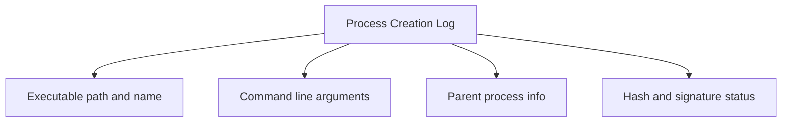
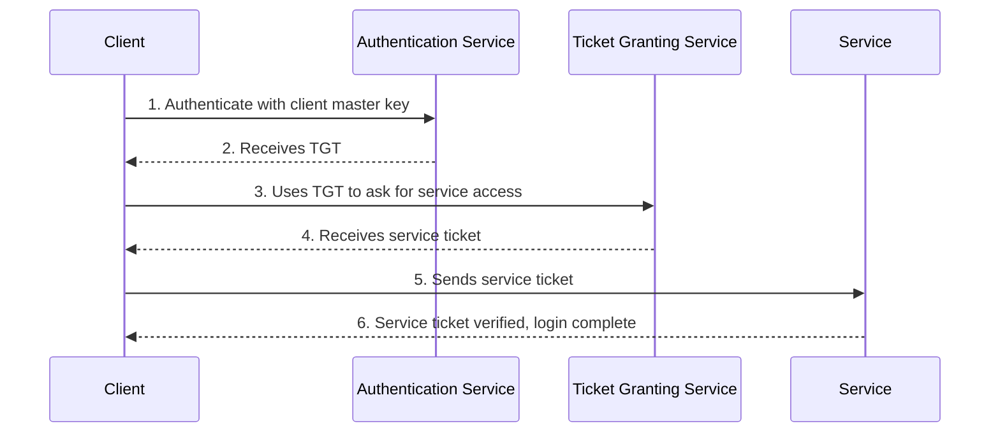

> **الهدف من الـ Section ده:**  
> هنعدي على أهم الـ Events اللي أي SOC Analyst لازم يعرفها بقلب إيده، من تسجيلات الدخول في Windows و Linux، لغاية الـ Process Creation, Firewall logs, Object Access, Services, Scheduled Tasks, USB events, User/Group management, Windows Defender, PowerShell logging، وأخيرًا بروتوكول Kerberos وكل الـ Event IDs المرتبطة بيه.


## Table of Contents
- [Introduction](#introduction)
- [تسجيلات الدخول في Windows: Event ID 4624/4625](#تسجيلات-الدخول-في-windows-event-id-46244625)
- [تسجيلات RunAs: Event ID 4648](#تسجيلات-runas-event-id-4648)
- [تسجيلات الدخول في Linux](#تسجيلات-الدخول-في-linux)
- [فشل تسجيل الدخول في Linux](#فشل-تسجيل-الدخول-في-linux)
- [لوجات إنشاء الـ Processes](#لوجات-إنشاء-الـ-processes)
- [لوجات الـ Process Creation في Windows](#لوجات-الـ-process-creation-في-windows)
- [لوجات الـ Process Creation في Linux: Auditd](#لوجات-الـ-process-creation-في-linux-auditd)
- [لوجات الـ Process Creation في Linux: Snoopy](#لوجات-الـ-process-creation-في-linux-snoopy)
- [Windows Firewall with Advanced Security](#windows-firewall-with-advanced-security)
- [تفسير لوجات Linux iptables Firewall](#تفسير-لوجات-linux-iptables-firewall)
- [Windows Object Access Auditing](#windows-object-access-auditing)
- [إنشاء الـ Services: Event ID 7045/4697](#إنشاء-الـ-services-event-id-70454697)
- [الـ Scheduled Tasks الجديدة: Event ID 4698](#الـ-scheduled-tasks-الجديدة-event-id-4698)
- [أحداث USB Plug and Play](#أحداث-usb-plug-and-play)
- [إنشاء مستخدمين جدد وإدارة المجموعات](#إنشاء-مستخدمين-جدد-وإدارة-المجموعات)
- [Windows Defender](#windows-defender)
- [PowerShell Logs](#powershell-logs)
- [بروتوكول Kerberos](#بروتوكول-kerberos)
- [Summary](#Summary)

## Introduction

في الـ Section ده هنتعرف على أهم الـ Events اللي بتظهر باستمرار في شغل الـ SOC، وهنفهم إزاي نفسّرها صح. المعرفة دي أساسية جدًا لأن نصف المعركة إنك تفهم إزاي الهجمات بتشتغل، والنص التاني إنك تعرف إيه هي الـ Logs اللي الهجمات دي بتسيبها وراها. الموضوع مش بسيط ومحتاج وقت ومجهود، لكن ده أساس شغل أي Analyst محترف.

## تسجيلات الدخول في Windows: Event ID 4624/4625

تسجيلات الدخول (Logins) من أكتر الأحداث اللي هتقابلها باستمرار. الأحداث دي بتتسجل في **Security log channel** تحت:

- **Event ID 4624** — تسجيل دخول ناجح.
- **Event ID 4625** — تسجيل دخول فاشل.

### الحقول الأهم في الـ Event

| الحقل | الشرح |
|------|--------|
| Account Name | الحساب اللي تم تسجيل الدخول بيه |
| Account Domain | لو حساب Active Directory، هيكون اسم الـ Domain. لو حساب Local، هيكون اسم الجهاز نفسه |
| Logon Type | نوع تسجيل الدخول (هنشرحه بالتفصيل تحت) |
| Network Info | معلومات عن الجهاز البعيد (لو تسجيل الدخول جه من الشبكة) |

### أنواع الـ Logon Type

مش كل عمليات تسجيل الدخول في Windows متشابهة، والفرق ده مهم جدًا وقت التحقيق:

| Logon Type | الرقم | الشرح |
|------|--------|---------|
| Interactive (حساب Local) | 2 | المستخدم قاعد فعليًا قدام الجهاز |
| Interactive (حساب Domain) | 11 | نفس الفكرة بس بحساب Domain |
| Network | 3 | زي الاتصال بـ File Share أو SMB Connection |
| Service | 5 | تسجيل دخول Service بحسابه الخاص |
| RDP | 10 | تسجيل دخول عن بُعد عبر Remote Desktop |

> [!IMPORTANT]
> لو شفت Logon Type رقم 2، ده معناه غالبًا إن الشخص عنده وصول فعلي (Physical Access) للجهاز. أما Logon Type رقم 10 فمعناه إن الدخول تم عبر الشبكة بس، وده فرق كبير وقت تحديد حجم الاختراق.

### الضجيج (Noise) في Event ID 4624

الـ Event ID 4624 من أكتر الأحداث اللي **لازم تعرفها كويس**، لكن فيها ضجيج كبير لأن مش بس الـ User Accounts بتظهر فيها، لكن كمان **Computer Accounts** بتسجل دخول للـ Domain Controllers.

> [!TIP]
> أول خطوة شائعة لتصفية الضجيج هي إنك تستبعد كل الـ 4624 events اللي فيها **Account Name بينتهي بعلامة $**، لأن دي طريقة الـ Active Directory في الإشارة للـ Computer Accounts، ونشاطها نادرًا ما يكون مهم أمنيًا رغم إنها ممكن تمثل أكبر حجم من الـ Logs.

## تسجيلات RunAs: Event ID 4648

الـ Event ID 4648 بيوثّق حاجة مختلفة تمامًا: أي حد استخدم أمر **runas** عشان يشغّل عملية بحساب مستخدم تاني.

### التشبيه

الفكرة دي زي أمر **sudo** في Linux، لكنها أقل شيوعًا في Windows، وده اللي بيخليها مؤشر قوي على إن حساب معين اتخرق.

### إيه اللي بيوضحه الـ Log

- **Subject** — مين اللي نفّذ العملية.
- **Account Whose Credentials Were Used** — الحساب اللي اتحول له.
- **Target** — فين تم استخدام الحساب ده.

### مثال عملي

لو مهاجم عنده باسورد "student" و"bob"، لكن الوصول بتاعه متاح بس من لابتوب "student"، وعايز يوصل لبيانات "bob" بس، هيستخدم أمر runas عشان "يبقى" bob. كـ Defender، لو تعرف إن مفيش سبب منطقي إن حساب bob يُستخدم من لابتوب student، بقيت عندك **حالة شاذة (Anomalous Condition)** تقدر تكتشفها عن طريق الـ Event ID 4648.

## تسجيلات الدخول في Linux

على عكس Windows، تسجيلات الدخول في Linux **بسيطة نظريًا** لكنها:

- غير متسقة (Inconsistent).
- بتتوزع على أكتر من سطر (Multi-line).
- غالبًا بتشير لـ **pam** (Pluggable Authentication Module).

### مثال SSH login بمفتاح

```
ubuntu sshd[459]: Connection from 123.45.67.89 port 57356 on 99.99.99.99 port 22
ubuntu sshd[459]: Postponed publickey for root from 123.45.67.89 port 57356 ssh2 [preauth]
ubuntu sshd[459]: Accepted publickey for root from 123.45.67.89 port 57356 ssh2: RSA SHA256:ao98RFOF9sdffaf09vijw877afsdlMfMFKLEe
ubuntu sshd[459]: pam_unix(sshd:session): session opened for user root by (uid=0)
ubuntu sshd[459]: Starting session: shell on pts/0 for root from 123.45.67.89 port 57356 id 0
```

المشكلة إن الرسائل بتتكتب بصيغة **Syslog** من غير أي Structure ثابت، وده بيصعّب الـ Parsing على الـ SIEM. عملية تسجيل الدخول نفسها بتتقسم على أكتر من سطر جزئي (Partial Info)، فلو عايز تفاصيل كاملة، لازم تقرأ كل الأسطر المرتبطة ببعض. الملف اللي بيسجل فيه ده غالبًا `/var/log/auth.log` أو `/var/log/secure`.

## فشل تسجيل الدخول في Linux

للأسف مفيش حاجة زي `Event ID = 4625` في Linux تجمع كل حالات الفشل في مكان واحد. لازم تدور على أكتر من نمط.

### أمثلة على أشكال الفشل المختلفة

| الحالة | مثال |
|------|--------|
| اسم مستخدم غلط | `Dec 29 17:15:36 ubuntu sshd[14771]: Invalid user pi from 174.194.132.127` |
| باسورد غلط عبر SSH | `Dec 29 09:13:23 ubuntu sshd[54117]: Failed password for root from 174.194.132.127 port 55646 ssh2` |
| باسورد غلط على الـ Desktop | `Dec 29 09:19:19 ubuntu lightdm: pam_unix(lightdm:auth): authentication failure; ... user=student` |

> [!NOTE]
> الفشل عن بُعد بييجي معاه IP المصدر واسم المستخدم اللي اتحاول، لكن الباسورد المستخدم **مايتكتبش أبدًا** في الـ Log لأن ده هيكون مخاطرة أمنية.

## لوجات إنشاء الـ Processes

**Process Creation Logs** من أهم الـ Logs اللي ممكن تجمعها في أي بيئة. لازم تسجل:

- مسار واسم الملف القابل للتنفيذ (Executable).
- الـ Arguments اللي استخدمها البرنامج وقت التشغيل.
- الـ Parent Process.
- الـ Metadata: الـ Hash، حالة التوقيع (Signature)، إلخ.

### المصادر

| النظام | المصادر |
|------|--------|
| Windows | Audit Policy, Sysmon, EDR |
| Linux | auditd, Snoopy, Sysdig, Auditbeat |

> [!IMPORTANT]
> تقريبًا كل الـ Malware هتسيب أثر في اللوج ده. الـ Arguments بتفرّق بين استخدام سليم لأداة زي PowerShell واستخدام خبيث بنفس الأداة، وده بيخلي هذا اللوج أداة قوية جدًا لكشف محاولات تجاوز الـ Application Control.



## لوجات الـ Process Creation في Windows

المصدرين الأساسيين:

### Event ID 4688 (Security Channel)

جزء من الـ Built-in Auditing، ميزته الأساسية إنه **مش محتاج أي Agent إضافي** وغالبًا شغال فورًا لأن أغلب المؤسسات أصلًا بتجمع الـ Security log.

### Sysmon Event ID 1 (Microsoft-Windows-Sysmon/Operational)

خيار أكتر تفصيلًا، محتاج تثبيت Driver و Service منفصلين. بيديك تفاصيل زيادة زي:

- وصف البرنامج، اسم المنتج، اسم الشركة (لو موقّع Digital signature).
- أكتر من نوع Hash داخل نفس الـ Log مباشرة.

> [!TIP]
> بفضل توفر الـ Hashes مباشرة في الـ Log، تقدر تبدأ فحص الـ Hash-based checks من غير ما تتفاعل مع الـ Endpoint أو الملف نفسه على الإطلاق. Sysmon في الحقيقة بيشتغل تقريبًا زي **EDR مصغّر**، لكن من غير قدرة على الاستجابة (Response).

## لوجات الـ Process Creation في Linux: Auditd

**auditd** هي الـ Linux Auditing Subsystem الأساسية، وهي موجودة تقريبًا في كل توزيعة.

- بتسجل: قراءة/كتابة الملفات، الـ System Calls، الأوامر المُنفّذة، محاولات تسجيل الدخول، وحركة الشبكة.
- أداة **aureport** بتولّد تقارير على كل الأحداث.
- **auditd مش بيمنع أي حاجة**، هو بس بيسجل المعلومة.

### قاعدة لمراقبة إنشاء الـ Processes

```bash
auditctl -a exit,always -F arch=b64 -S execve -k proc_create
```

القاعدة دي بتضيف Rule اسمها `proc_create` بتسجل دايمًا (always) عند خروج (exit) الـ System Call بتاعت `execve` للبرامج 64-bit.

### مثال Output من auditd

```
type=SYSCALL msg=audit(1546105134.866:8332): arch=c000003e syscall=59 success=yes exit=0 ... comm="whoami" exe="/usr/bin/whoami" key="procmon"
type=EXECVE msg=audit(1546105134.866:8332): argc=1 a0="whoami"
type=CWD msg=audit(1546105134.866:8332): cwd="/var/log"
type=PATH msg=audit(1546105134.866:8332): item=0 name="/usr/bin/whoami" ...
type=PROCTITLE msg=audit(1546105134.866:8332): proctitle="whoami"
```

| نوع السطر | الوظيفة |
|------|--------|
| SYSCALL | معلومات المستخدم والأمر المُنفّذ |
| EXECVE | سطر الأوامر والـ Arguments |
| CWD | مجلد العمل الحالي (Current Working Directory) |
| PATH | مسار الملف القابل للتنفيذ |
| PROCTITLE | عنوان الـ Process اللي اتعمل |

> [!WARNING]
> auditd قوي جدًا لدرجة إنه أحيانًا صعب تفهم منه إيه اللي حصل بالظبط، بسبب كثرة الأسطر والحقول لكل حدث واحد.

## لوجات الـ Process Creation في Linux: Snoopy

**Snoopy Logger** طريقة أسهل لتسجيل سطور الأوامر (Command Lines) في Linux.

- التثبيت سهل جدًا: `sudo apt install snoopy`
- افتراضيًا بيكتب في `/var/log/auth.log`.
- الـ Format بتاعه أبسط بكتير من auditd.

### مثال

```
Dec 20 10:05:33 ubuntu snoopy[4550]: [login:student ssh:(123.45.67.89 53123 10.0.0.1 22) sid:3907 tty:/dev/pts/1 (1000/student) uid:student(1000)/student(1000) cwd:/tmp]: git clone https://github.com/rebootuser/LinEnum.git
```

المثال ده بيوضح مهاجم بينزل أداة **LinEnum** المستخدمة عادةً لاستكشاف ثغرات الـ Privilege Escalation، وده مؤشر خطر واضح لازم يرفع Alert فورًا.

> [!NOTE]
> الأداة مش مضمونة 100%، وممكن يتم تجاوزها (Bypass)، لكن ده مايلغيش فايدتها. تذكّر "مبدأ الحل الكامل": مش لازم الأداة تكون مثالية عشان تكون مفيدة.

## Windows Firewall with Advanced Security

الـ **WFAS** ليها خياران للتسجيل:

1. **ملفات نصية (pfirewall.log)** — ملف منفصل لكل Profile، بحد أقصى 32MB.
2. **Windows Event Channel** — بيسجل معلومات الـ Process كمان، وده أسهل للتجميع.

### أهم الـ Event IDs

| Event ID | المعنى |
|------|--------|
| 5156 | Allowed (سُمح بالاتصال) |
| 5157 | Connection Block (تم منع الاتصال) |
| 5152 | Packet Block (تم منع الحزمة) |
| 5154 | Listening (استماع على منفذ) |

### حقول ملف pfirewall.log

```
[date] [time] [action] [protocol] [src-ip] [dst-ip] [src-port] [dst-port] [size] [tcpflags] [tcpsyn] [tcpack] [tcpwin] [icmptype] [icmpcode] [info] [path]
```

## تفسير لوجات Linux iptables Firewall

### مثال

```
Dec 20 07:32:33 ubuntu kernel: [ 945.682935] [UFW ALLOW] IN= OUT=ens33 SRC=192.168.42.155 DST=192.168.42.2 LEN=76 TOS=0x00 PREC=0x00 TTL=64 ID=61739 DF PROTO=UDP SPT=45469 DPT=53 LEN=56
```

الشكل بيتكون من **Syslog Header** في البداية، متبوع تقريبًا بالكامل بصيغة **Key=Value pairs**. بعض الحقول (زي `DF` أو `IN=`) مش Key=Value منظمة تمامًا، وده بيصعّب الـ Parsing.

| الحقل | المعنى |
|------|--------|
| Timestamp/Hostname | من الـ Syslog Header |
| Action (ALLOW/DENY) | القرار اللي اتخذه الـ Firewall |
| IN/OUT | الـ Interface الفيزيائي |
| SRC/DST | عنوان الـ IP المصدر والوجهة |
| PROTO | البروتوكول (TCP, UDP, ICMP) |
| SPT/DPT | منفذ المصدر والوجهة |

## Windows Object Access Auditing

بتغطي مراقبة الملفات والـ Registry، وتحديدًا:

- **Event ID 4657** — تم تعديل قيمة في الـ Registry.
- **Event ID 4663** — تمت محاولة الوصول لـ Object معين.
- **Event ID 4660** — تم حذف Object.

### أقسام الـ Log

| القسم | المعنى |
|------|--------|
| Subject | مين اللي لمس الملف/المفتاح |
| Object | إيه اللي اتلمس بالظبط |
| Process Info | البرنامج المسؤول عن الوصول |
| Access Request Info | نوع الوصول (قراءة/كتابة) |

> [!IMPORTANT]
> تفعيل الـ Object Access Auditing في الـ Security Policy بس **مش كافي**؛ لازم تحدد بالتحديد أي ملفات أو Registry Keys عايز تراقبها، وإلا مش هتوصلك أي Logs.

## إنشاء الـ Services: Event ID 7045/4697

الـ **Services** هي Processes بتشتغل بشكل صامت في الخلفية، والمهاجمين بيستخدموها كوسيلة **Persistence** شائعة.

| Channel | Event ID | ملاحظات |
|------|--------|---------|
| System | 7045 | مسجّل دايمًا عند إنشاء Service جديدة |
| Security | 4697 | متاح في Windows 10+ لو مفعّل "Audit Security System Extension" |

### علامات خطر (Red Flags)

- **Service File Name** — هل موجود في مكان غريب زي Temp Folder؟
- **Service Name** — اسم بريء زي "Google Updater" أو اسم عشوائي؟
- **Service Account** — أي حساب هيشغل بيه الـ Process؟

## الـ Scheduled Tasks الجديدة: Event ID 4698

الـ **Scheduled Task** بيسمح بتشغيل أمر في وقت مؤجل أو متكرر، محليًا أو على جهاز بعيد.

- بيُستخدم للـ **Persistence** و **Lateral Movement**.
- الـ Event ID المسؤول: **4698** في الـ Security Channel.
- لازم تفعيل **"Audit Other Object Access Events"** عشان تسجل الأحداث دي.

> [!NOTE]
> بيانات الـ Command الفعلية داخل الـ 4698 بتكون مسجلة في XML متداخل (Nested XML)، وده بيخلي الـ Parsing الأوتوماتيكي شوية أصعب.

## أحداث USB Plug and Play

الـ **Event ID 6416** في الـ Security Channel بيسجّل أي جهاز USB بيتوصل، ومحتاج تفعيل **"Audit PNP Activity"**.

### الحقول المهمة

| الحقل | المعنى |
|------|--------|
| Class | نوع الجهاز (Hub, Audio, Storage) |
| Vendor ID (VID) | شبه OUI بتاع MAC Address، بيحدد الشركة المصنّعة |
| Product ID (PID) | نوع المنتج |

> [!WARNING]
> هجمات USB الفعلية موجودة في الواقع، زي حادثة **DarkVishnya** اللي وثّقتها Kaspersky سنة 2018، واللي فيها مهاجمين ركّبوا أجهزة زي Bash Bunny جوه بنوك فعلية.

## إنشاء مستخدمين جدد وإدارة المجموعات

### إنشاء مستخدم جديد

**Event ID 4720** — بيوثّق إنشاء أي حساب مستخدم جديد.

### تعديل المجموعات (Group Membership)

| Event ID | المعنى |
|------|--------|
| 4732 | إضافة مستخدم لمجموعة محلية (Local Group) زي Administrators |
| 4728 | إضافة مستخدم لمجموعة عامة (Global Group) على مستوى Active Directory |

> [!IMPORTANT]
> إضافة مستخدم غير شرعي لمجموعة الـ Administrators معناها إن المهاجم غالبًا وصل بالفعل لمستوى صلاحيات إداري (Administrative-level Privilege).

## Windows Defender

اللوجات موجودة في Channel اسمها **Windows Defender/Operational**، وأهم الـ Event IDs:

| Event ID | المعنى |
|------|--------|
| 1116 | تم اكتشاف Malware |
| 1006 | تم اكتشاف Malware (بصيغة تانية) |

الحدث بيحتوي على اسم الفيروس المكتشف ومسار الملف المصاب.

## PowerShell Logs

**Event ID 4104 — Script Block Logging** في الـ PowerShell/Operational Channel.

- بيسجّل كل الأوامر المكتوبة في PowerShell (لو مفعّل في الـ Audit Policy).
- **ضجيج عالي جدًا (Noisy)**.
- ميزته الكبرى: بيسجل **النص الفعلي** اللي بينفذه الـ PowerShell Engine، فحتى لو الأمر كان مُشفّر بشكل معقّد (Obfuscated)، الـ Event هيديك النسخة المُفكّكة (Decoded).

> [!NOTE]
> الـ Output بتاع الأمر (النتيجة) **مش متسجل** في الـ Event ID 4104، وعشان تحصل عليه محتاج تستخدم حاجة زي **Transcription Logging**.

## بروتوكول Kerberos

### الفكرة العامة

**Kerberos** هو البروتوكول الأساسي للـ Authentication في Windows، وبيُستخدم افتراضيًا كل ما يكون متاح (وده الحال في أغلب بيئات Active Directory). النظام بيعتمد على **Tickets** مشفّرة بتتبادل بين 3 أطراف:

- **Client** — الجهاز اللي عايز يدخل على Service.
- **Server/Service** — الخدمة المطلوب الوصول ليها.
- **KDC (Key Distribution Center)** — وهو الـ Domain Controller.

### خطوات المصادقة



1. المستخدم بيطلب **Ticket Granting Ticket (TGT)** من الـ **Authentication Service (AS)** باستخدام الـ Client Master Key (Hash مشتق من الباسورد).
2. الـ KDC بيتحقق ويرجّع الـ TGT.
3. لما المستخدم يحتاج يوصل لخدمة، بيستخدم الـ TGT عشان يطلب **Service Ticket** من الـ **Ticket Granting Service (TGS)**.
4. الـ TGS بيديه الـ Service Ticket.
5. المستخدم بيبعت الـ Service Ticket للخدمة المطلوبة.
6. لو كل حاجة تمام، المستخدم بياخد الوصول للخدمة.

### أحداث Kerberos في الـ Security Channel

| Event ID | المعنى |
|------|--------|
| 4768 | تم طلب Kerberos Authentication Ticket (TGT) |
| 4769 | تم طلب Kerberos Service Ticket |
| 4770 | تم تجديد Kerberos Service Ticket |

### تفاصيل Event ID 4768

الحدث بيوضح: Account Name, Supplied Realm Name, User ID (SID), Client Address, و Result Code. اسم الـ Service بيكون **krbtgt** لأنها الخدمة المسؤولة عن إصدار الـ TGTs.

> [!TIP]
> لو شفت طلبات TGT جاية من جهاز مش المفروض إن المستخدم بيستخدمه، ده مؤشر قوي على إن الحساب اتخرق. الـ Result Code = 0x0 معناها نجاح، أي قيمة تانية معناها فشل ولازم تراجع كودها.

### تفاصيل Event ID 4769/4770

بتحتوي على نفس معلومات TGT لكن مع إضافة **Service Name** و **Service ID** — الخدمة اللي المستخدم طالب يوصلها (زي FILESHARE01).

> [!NOTE]
> Failure Code = `0x20` معناها إن التذكرة (Ticket) انتهت صلاحيتها بس، وده حدث معلوماتي عادي بدون قيمة أمنية كبيرة.

### إزاي تعرف لو الدخول كان عبر Kerberos أو لا

الحقل **Authentication Package** جوه الـ Event ID 4624 (على الجهاز المضيف مش على الـ Domain Controller) بيوضح:

| القيمة | المعنى |
|------|--------|
| Kerberos | تم استخدام Kerberos |
| NTLM | تم استخدام NTLM (وممكن يوضح نسخة v1/v2 أو LM) |
| Negotiate | يفضّل Kerberos، لكن بيرجع لـ NTLM لو مش متاح |

> [!WARNING]
> لما تشوف Authentication Package = NTLM، خصوصًا بنسخة NTLM v1 أو LM القديمة، ده مؤشر يستاهل التحقيق لأن أغلب الأجهزة الحديثة المفروض متعتمدش على البروتوكولات القديمة دي.

## Summary

- الـ **Event ID 4624/4625** هما أهم أحداث تسجيل الدخول في Windows، ولازم تفهم الـ Logon Types زي 2, 3, 10, 11.
- الـ **Event ID 4648** بيوضح استخدام RunAs، وهو مؤشر قوي على تنقل المهاجم (Lateral Movement) بين الحسابات.
- تسجيلات الدخول في Linux أقل تنظيمًا وبتتوزع على أسطر متعددة، ومفيش Event ID موحّد للفشل.
- **Process Creation Logs** (4688, Sysmon Event 1, auditd, Snoopy) من أقوى الأدوات لكشف الـ Malware.
- **Firewall Logs** (WFAS و iptables) بتديك رؤية على مستوى الجهاز نفسه، مش بس الشبكة.
- **Object Access Auditing** (4657/4663/4660) محتاج تفعيل يدوي لكل ملف أو Registry key عايز تراقبه.
- **Service Creation (7045/4697)** و **Scheduled Tasks (4698)** من أشهر تقنيات الـ Persistence.
- **USB Events (6416)** بتديك تفاصيل عن أي جهاز اتوصل بالجهاز.
- **New User/Group Management (4720/4732/4728)** بتكشف محاولات إنشاء Backdoor Accounts.
- **PowerShell Script Block Logging (4104)** بيفك تشفير الأوامر المُعقّدة تلقائيًا.
- **Kerberos** بيعتمد على 3 أطراف (Client, KDC, Service) وأحداثه الأساسية هي 4768, 4769, 4770.


