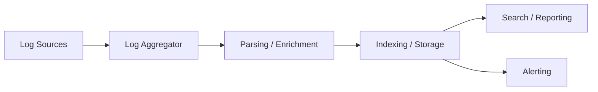
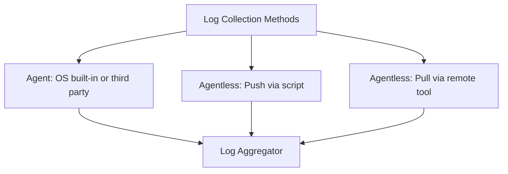
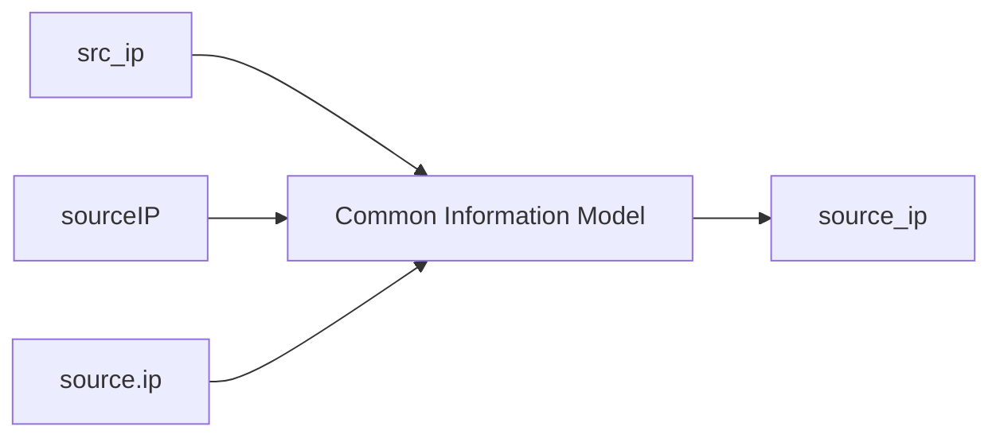

> **الهدف من الـ Section ده:**  
> هنفهم رحلة الـ Log الكاملة من لحظة إنشائه على الـ Endpoint لغاية ما يوصل يتخزن ويتفهرس في الـ SIEM، وهنتعرف على طرق الـ Collection المختلفة، وأنواع الـ Log Formats، وأهمية الـ Structure في الـ Parsing، ومفهومي الـ Enrichment و Normalization، وأخيرًا هنفهم دورة حياة الـ Log جوه الـ Storage.


## Table of Contents
- [Introduction](#introduction)
- [الـ Logging Pipeline](#الـ-logging-pipeline)
- [طرق جمع الـ Logs](#طرق-جمع-الـ-logs)
- [خيارات جمع الـ Logs في Windows](#خيارات-جمع-الـ-logs-في-windows)
- [خيارات جمع الـ Logs في Linux](#خيارات-جمع-الـ-logs-في-linux)
- [الـ Logs غير المنظمة (Unstructured)](#الـ-logs-غير-المنظمة-unstructured)
- [صيغ الـ Logs المنظمة (Structured)](#صيغ-الـ-logs-المنظمة-structured)
- [صيغ خاصة بالـ SIEM: CEF و LEEF](#صيغ-خاصة-بالـ-siem-cef-و-leef)
- [ليه الـ Structure مهم جدًا](#ليه-الـ-structure-مهم-جدًا)
- [الـ SIEM مش زي Google](#الـ-siem-مش-زي-google)
- [الـ Log Enrichment](#الـ-log-enrichment)
- [الـ Log Field Normalization](#الـ-log-field-normalization)
- [الـ Normalization عن طريق Categorization](#الـ-normalization-عن-طريق-categorization)
- [تخزين الـ Logs (Log Storage)](#تخزين-الـ-logs-log-storage)
- [دورة حياة الـ Log](#دورة-حياة-الـ-log)
- [أسئلة لازم تسألها لمهندس الـ SIEM بتاعك](#أسئلة-لازم-تسألها-لمهندس-الـ-siem-بتاعك)
- [ملخص الـ Section](#ملخص-الـ-section)

## Introduction

في الـ Module ده هندرس الـ **Logging Pipeline** بتفاصيل أكتر. حتى لو دورك الوظيفي مش شغل SIEM Engineering، فهمك لمصدر الـ Logs والمراحل اللي بتعديها مهم جدًا. هنشوف إزاي الـ Logs بتتجمع، بتتنقل، بتتحلل (Parsed)، بتتخزن، وبتتفهرس (Indexed)، وإزاي ده كله بيأثر على اللي بنشوفه في الـ SIEM.

كمان هندرس عمليتين مهمتين جدًا: **Normalization** و **Enrichment**. العمليتين دول بيضيفوا Context مهم للـ Logs، لكن ممكن يسببوا لخبطة لو مش فاهم ليه وإزاي بيحصلوا. كـ Analyst، لازم تفرّق بين المعلومة الأصلية (Original Source Info) والمعلومة اللي اتضافت بعد كده.

> [!NOTE]
> من غير فهم شامل لدورة حياة الـ Log، هتتلخبط بسهولة وقت التحقيق، أو هتفوّت فرصة تحسّن جودة الـ Logs بتاعتك، وده هيأدي لفقدان قدرات كشف مهمة (Detection Capabilities).

## الـ Logging Pipeline

بعد ما الـ Log بيتولد على الـ Host أو الـ Appliance، لازم ينتقل لـ **Log Aggregator**.

### دور الـ Aggregator

الـ Aggregator وظيفته الأساسية إنه يستقبل كميات كبيرة من الـ Logs بسرعة عالية وبصيغ (Formats) متعددة من أجهزة كتير في نفس الوقت. في بعض الـ SIEM Solutions، ممكن يكون فيه أكتر من Host بيقوم بدور الـ Aggregation، وده بيساعد على التوسع (Scaling) وتوزيع الحمل جغرافيًا.

بشكل عام، الـ Aggregator بيستقبل الـ Logs، وممكن يعمل:

- Parsing (تحليل).
- تنظيف (Cleaning).
- إثراء (Enrichment).
- فلترة (Filtering).

وبعدين بيخرّجها لنظام التخزين بصيغة موحدة أكتر.

### دور نظام التخزين والفهرسة

بعد الـ Aggregator، الـ Logs بتتحرك لـ Host مسؤول عن التخزين والفهرسة. النظام ده بيعمل معظم الشغل الشاق عشان يخلي الـ Logs متاحة للبحث بسهولة، وبيقوم بـ:

1. الـ Parsing والـ Enrichment والـ Normalization (لو الـ Aggregator ماعملهاش).
2. حفظ البيانات بشكل دائم.
3. فهرسة (Indexing) المحتوى في هيكل شبه قاعدة بيانات عشان يسهّل البحث والاسترجاع.

كمان ممكن نفس النظام يقوم بدور الـ **Reporting** و **Alerting**، لأن الاتنين في الأساس عبارة عن عمليات بحث في البيانات.



## طرق جمع الـ Logs

فيه طريقتان أساسيتان لجمع الـ Logs من أي Endpoint:

### Agent

برنامج منفصل بيشتغل بشكل مستمر في الخلفية، وظيفته الوحيدة إنه يجمع الـ Logs بشكل موثوق ويبعتها عبر الشبكة للـ Log Aggregator. مصادره:

- أدوات مدمجة في الـ Operating System.
- أدوات من الـ SIEM Vendor نفسه.
- أدوات Third-Party.

### مميزات استخدام الـ Agent

- بيقدر يلتقط أكتر من مصدر Log بسهولة.
- بيقدر يفلتر الرسائل حسب المحتوى.
- بيقدر يعمل Buffering للرسائل.
- بيبعت البيانات بشكل مضغوط (Compressed) ومشفّر (Encrypted).

### Agentless

مش محتاج تثبيت أي برنامج منفصل على الـ Endpoint، وبتتقسم لطريقتين:

- **Pull** — النظام المركزي بيعمل Login على الجهاز البعيد ويسحب البيانات بنفسه.
- **Push** — سكريبت مجدول (Scheduled Script) بيشتغل بشكل دوري على الـ Host ويبعت الـ Logs بره.



> [!TIP]
> فهم طريقة جمع الـ Logs عندك هي أول خطوة لفهم دورة حياة الـ Logging عندك، لأنها أول مرحلة ممكن تغيّر شكل الـ Log عن طريق تحويل الصيغة (Format Conversion) أو تطبيق قواعد فلترة.

## خيارات جمع الـ Logs في Windows

فيه عدة خيارات لجمع الـ Logs من أنظمة Windows:

### SIEM Vendor Agents

| الأداة | الملاحظة |
|------|--------|
| Elastic Beats | من Elastic |
| LogRhythm SysMon | من LogRhythm |
| McAfee SIEM Collector | من McAfee |
| QRadar WinCollect | من IBM QRadar |
| Splunk Universal Forwarder | من Splunk |

### الـ Built-in Windows Agent — Windows Event Forwarding (WEF)

- موجود على كل الأجهزة، ويتحكم فيه عن طريق **GPO**.
- بيدعم Push/Pull، ومشفّر ومضغوط.
- بيبعت الـ Events بصيغة الـ **XML الأصلية** لجهاز مخصص اسمه **Windows Event Collector**.
- الـ Events المُحوّلة بتظهر في Channel اسمها **Forwarded Events**، ولسه محتاجين Agent يجمعها من الـ Collector ويبعتها للـ SIEM.

### Third-Party Agents

مثل **NXLog**, **Fluentd**, **Snare** — بتُستخدم لو محتاج تخصيص (Customization) أكتر من اللي الـ Vendor Solution بيوفّره.

### Agentless

بيستخدم **PowerShell**, **WMI**, أو **MSRPC**. أسرع في النشر لكن أصعب في الضبط (Configuration) الصحيح، ومحتاج قواعد Firewall وحسابات تسمح بـ Remote Login.

> [!IMPORTANT]
> بما إن الـ Windows logs أصلًا XML منظم جدًا، **مش نصيحة** إنك تحوّلها لصيغة زي Syslog لأن ده ممكن يفقد جزء من الدقة (Fidelity). الأفضل هو التحويل لـ **JSON** لأنه بيدعم الحقول المتداخلة (Nested Fields) والـ Arrays زي الـ XML بالظبط.

## خيارات جمع الـ Logs في Linux

الخيارات شبه Windows، لكن مع اختلاف في الأداة الأكتر شيوعًا:

1. **Syslog Daemon المدمج** — زي **Rsyslog**, **Syslog-ng**, **syslogd**. أكتر خيار شائع لأنه موجود بالفعل على النظام، وسهل جدًا تضيف IP في سطر واحد بالإعدادات عشان تبعت الـ Logs بره.
2. **SIEM Vendor أو Third-Party Agents** — زي Beats, Universal Forwarder, NXLog, Fluentd, NiFi.
3. **Agentless** — Push/Pull بالسكريبتات أو الـ Remote Login.

> [!NOTE]
> على عكس Windows، حل الـ **WEF** معقّد جدًا في الإعداد (يحتاج Event Sources, Collectors, GPOs)، لكن في Linux مجرد تعديل سطر واحد في ملف الإعدادات بيخلي الـ Daemon يبعت الـ Logs بره، وده اللي بيخلي استخدام الـ Syslog Daemon المدمج أكتر شيوعًا بكتير من أي حل تاني.

## الـ Logs غير المنظمة (Unstructured)

من أهم العوامل اللي بتأثر على الـ Logging Pipeline هي **صيغة الـ Log (Format)**.

### المشكلة

كتير من الـ Logs بتبدأ بـ Syslog Header، لكن جزء الـ Message نفسه بيختلف بشكل كبير. أسوأ حالة هي الـ **Unstructured "Sentence" Type Log**.

### مثال

```
Dec 29 07:23:51 ubuntu dhclient[75879]: bound to 192.168.42.161 -- renewal in 703 seconds.
Dec 29 08:17:59 ubuntu CRON[55171]: pam_unix(cron:session): session opened for user root by (uid=0)
Dec 29 09:08:01 ubuntu sudo: student : TTY=pts/2 ; PWD=/var/log ; USER=root ; COMMAND=/usr/sbin/service sshd start
```

عشان تعمل Parser للمثال ده، لازم تعرف كل رسالة ممكنة يكتبها كل برنامج، وفين المعلومة المهمة، وإزاي تستخرجها بشكل موثوق، وتاخد بالك من الحقول الاختيارية (Optional Fields) وأي تغيير مستقبلي في شكل الـ Log. النتيجة النهائية غالبًا Parsing غير موثوق وفقدان بيانات مهمة.

> [!WARNING]
> لما أكتر من برنامج بيكتب Logs بصيغ مختلفة في نفس الملف، الرسائل بتختلط مع بعض زي المثال فوق، وده بيصعّب الـ Parsing بشكل كبير جدًا.

## صيغ الـ Logs المنظمة (Structured)

الصيغ المفضلة هي اللي بيكون فيها هيكل (Structure) متوقع. أشهر ثلاث صيغ:

### Comma Separated Value (CSV)

```
192.168.1.1,8.8.8.8,55001,53,udp
```

- الأكتر كفاءة (Efficient) لأنها أقل صيغة فيها Formatting.
- عيبها إنها **هشّة (Fragile)** لأي تغيير في ترتيب أو عدد الأعمدة.

### Key-Value Pairs

```
source_ip=192.168.1.1, destination_ip=8.8.8.8, source_port=55001, destination_port=53, protocol=udp
```

- أكتر مرونة، تقدر تضيف أو تشيل أو ترتّب الحقول من غير ما تأثر على الـ Parsing.
- حل وسط جيد بين الكفاءة والموثوقية.

### JSON

```json
{ "source_ip": "192.168.1.1", "destination_ip": "8.8.8.8", "source_port": "55001", "destination_port": "53", "protocol": "udp" }
```

- الأكتر موثوقية في الـ Parsing، وبيدعم الحقول المتداخلة (Nested Objects) والـ Arrays.
- الأقل كفاءة من ناحية الحجم، لكن ده مش مشكلة كبيرة مقارنة بالفايدة.

| الصيغة | الكفاءة | الموثوقية |
|------|--------|---------|
| CSV | الأعلى | الأقل (هش لأي تغيير) |
| Key-Value Pairs | متوسطة | جيدة |
| JSON | الأقل | الأعلى (يدعم Nested Data) |

> [!TIP]
> بما إن سهولة الـ Parsing لازم تكون الأولوية القصوى في أي نظام هدفه الـ Detection، فـ **JSON هو الخيار المفضل** بشكل عام.

## صيغ خاصة بالـ SIEM: CEF و LEEF

بعض الـ SIEMs عرّفوا صيغ خاصة عشان يضمنوا Structure موحد وينسبوا (Attribution) كل رسالة للنظام اللي كتبها.

### CEF — Common Event Format

صيغة مفتوحة بتُستخدم غالبًا مع **ArcSight**.

```
Header: CEF:Version|Device Vendor|Device Product|Device Version|Signature ID|Name|Severity|Extension
```

### LEEF — Log Event Extended Format

مستخدمة أساسًا مع **IBM QRadar**.

```
Header: LEEF:2.0|Vendor|Product|Version|EventID|Delimiter|Extension
```

الاتنين بيبدأوا بـ Syslog Header، متبوع بمجموعة حقول مفصولة بعلامة **Pipe (|)** بتحدد النظام المصدر، وبعد كده الرسالة نفسها بصيغة Key-Value.

## ليه الـ Structure مهم جدًا

الـ Structure مهم لسببين رئيسيين:

### 1. سرعة وموثوقية الـ Parsing

الـ SIEM مايعملش نسخة من كل Log ويدور فيه زي أمر **grep** كل مرة تبحث؛ ده بيتسمى **Full Text Search** وهو غير كفء جدًا. الطريقة الأفضل إن الـ SIEM يستخرج الحقول المهمة ويكتبها في قاعدة بيانات قابلة للاستعلام بسرعة عالية.

### 2. الـ Rule Matching

لو الحقول ماتقدرش تتفصل (Parsed) من الـ Log، فالقواعد (Rules) مش هتقدر تطابقها، وده معناه إن الـ Alert مش هيتفعّل، وده أسوأ نوع خطأ ممكن يحصل: **False Negative**.

> [!IMPORTANT]
> من غير Parsing سليم، القواعد مش هتشتغل والبحث هيفشل. لو مفيش سبب قوي لتوفير الـ Bandwidth، اختيار صيغة أكتر Structure دايمًا قرار أفضل.

## الـ SIEM مش زي Google

من أهم الدروس اللي لازم تتعلمها كـ Analyst: **البحث في الـ SIEM لازم يكون مُحدد النطاق (Scoped)**.

### مثال: عايز تدور على "Sara" في لوجات الـ Proxy

| البحث | الكفاءة | السبب |
|------|--------|---------|
| `sara` | الأسوأ | بحث Full Text في كل الحقول وكل أنواع الـ Logs |
| `logs = proxy AND sara` | متوسط | مُحدد بنوع الـ Log بس، لكن بيدور في كل الحقول (URL, HTTP method, إلخ) |
| `logs = proxy AND user=sara` | الأفضل | مُحدد بنوع الـ Log والحقل الصحيح، أسرع بحث ممكن |

> [!WARNING]
> مش كل الحقول بتتفهرس (Indexed) في بعض الـ SIEMs، لأن ده مكلّف جدًا من ناحية الموارد. لازم تعرف أنهي حقول متفهرسة عندك، وتحاول تبحث بيها بس عشان تضمن أسرع نتيجة.

## الـ Log Enrichment

### التعريف

الـ **Enrichment** هو إضافة معلومات للـ Log لم تكن موجودة أصلًا فيه، بهدف إعطاء Context بيساعد في تفسير الحدث.

### مثال

```
domain=xyzsite.com, query_type="A", source_ip=10.0.10.3
```

من المعلومة دي بس، صعب تحكم هل الموقع خطر ولا لا. لكن لو الـ SIEM أضاف المعلومات دي تلقائيًا:

- Status = newly observed domain
- Top1M rank = unranked
- Domain created = < 7 days ago
- System status = unpatched
- User = Kyle
- Role = Domain admin

بقيت الصورة أوضح بكتير، وقدرت تاخد قرار أسرع.

> [!TIP]
> الـ Enrichment من أكبر القيم المضافة (Value-adds) اللي الـ SIEM بيقدمها، لأنه بياخد المعلومة الأساسية القليلة ويحولها لصورة كاملة تسهّل عليك الـ Triage السريع. من غير Parsing سليم، الـ Enrichment أصلًا مش هيقدر يشتغل.

## الـ Log Field Normalization

### المشكلة

مصادر مختلفة للـ Logs بتستخدم أسماء مختلفة لنفس الحقل، زي:

- `src_ip`
- `sourceIP`
- `source.ip`

كل دول معناهم واحد، لكن مش هتقدر تدور عليهم مرة واحدة من غير Normalization.

### الحل: Common Information Model (CIM)



بدل ما تكتب بحث معقد زي:

```
src_ip=1.1.1.1 or sourceIP=1.1.1.1 or source.ip=1.1.1.1
```

الـ Normalization بيخلي كل المصادر تتوحد تحت اسم موحّد زي `source_ip`، فتقدر تكتب بحث واحد بس:

```
source_ip=1.1.1.1
```

> [!NOTE]
> لما تشوف اسم حقل في الـ SIEM، ده ممكن يكون مش نفس الاسم اللي كان مكتوب في الـ Log الخام (Raw Log) بسبب الـ Normalization. لو حاولت تدور على الاسم الموحد جوه الـ Raw Log ومكانش موجود، السبب غالبًا هو ده.

## الـ Normalization عن طريق Categorization

نوع تاني من الـ Normalization بياخد Log بيمثل حدث شائع زي "Login" ويحطله **Category** موحدة.

### مثال: عايز تدور على كل محاولات دخول "Mike"

**من غير Normalization:**

```
Windows: event_id=4624 or event_id=4625 AND user:mike
Linux: "Started session for" AND user:Mike AND process:sshd
```

وممكن كمان تحتاج تدور في Cloud logs, Appliance logs, وService logs بطرق مختلفة تمامًا.

**مع Normalization:**

```
category:login AND user:mike
```

وكل الأحداث من كل المصادر هتظهر فورًا، بغض النظر عن نوع الـ Log الأصلي.

> [!TIP]
> لو الـ SIEM بتاعك مش بيدعم الـ Categorization تلقائيًا، فيه طريقة بديلة اسمها **Tagging**: تتأكد إن كل حدث Login بييجي عليه Tag اسمه "login"، وبعدين تقدر تدور بـ `tag=login` بسهولة.

## تخزين الـ Logs (Log Storage)

المرحلة الأخيرة في الـ Pipeline. عمومًا، معظم الحلول بتخزن الـ Logs المتشابهة مع بعض (زي كل الـ Firewall logs في مكان، وكل الـ Windows logs في مكان تاني).

### مفهوم الـ Index

في Splunk مثلًا، بتستخدم مصطلح زي `index=ids_logs` أو `index=windows` عشان تحدد مكان البحث. لو ماحددتش، الـ SIEM هيدور في كل الأماكن الممكنة، وده بيبطّئ البحث جدًا.

### فترات الاحتفاظ (Retention Periods)

كل نوع Log ممكن يكون له فترة احتفاظ مختلفة على حسب متطلبات الـ Compliance، زي: "Firewall logs تتمسح بعد أسبوع" لكن "IDS logs تفضل شهر".

### مراحل التخزين (Hot/Warm/Cold)

| المرحلة | الوصف |
|------|--------|
| SSD (Hot) | تخزين سريع، بحث سريع جدًا |
| Spinning Disk (Warm) | تخزين أرخص، بحث أبطأ |
| Archive/Cold Storage | أرشفة، غالبًا محتاج إعادة تحميل قبل البحث |
| Deletion | الحذف النهائي |

## دورة حياة الـ Log

بمجرد إنشاء الـ Log، بيمر بدورة حياة شبه ثابتة:


1. الـ Log بيتكتب.
2. البيانات جديدة ومهمة جدًا للـ Alerting والـ Threat Hunting والـ Incident Response.
3. مع مرور الوقت، البيانات بتقل أهميتها وبتقل احتمالية البحث فيها.
4. البيانات جدًا قديمة، ممكن تتحول لأرشيف.
5. في النهاية، البيانات بتتمسح.

> [!IMPORTANT]
> كل ما الـ Log يكبر في العمر، كل ما هيكون أصعب تدور عليه بسرعة، وممكن محتاج خطوات إضافية عشان تسترجعه أصلًا (زي إعادة تحميله من الـ Archive).

## أسئلة لازم تسألها لمهندس الـ SIEM بتاعك

عشان تشتغل بأقصى كفاءة كـ Analyst، لازم تعرف إجابات الأسئلة دي:

### Data Collection
- إحنا بنجمع Logs من أنهي أنظمة؟ كلها ولا جزء منها؟
- أنهي Channels/Files اللي بنجمعها من كل نوع نظام؟
- إيه الفلاتر المطبّقة، وفين إعداداتها محفوظة؟

### Data Usage
- إيه الحقول المتاحة في الـ Common Information Model بتاع الـ SIEM؟
- أنهي حقول متفهرسة (Indexed) وأنهي لأ؟

### Data Storage
- إيه فترات الاحتفاظ (Retention Periods) لكل نوع بيانات؟
- إد إيه البيانات بتفضل على Hot Storage قبل ما تنتقل لـ Cold؟

> [!WARNING]
> واحدة من أخطر الأخطاء إنك تفتكر هجوم معين "ماحصلش" لمجرد إنك مالقيتش Log بيثبته، مع إن السبب الحقيقي إنك أصلًا مش بتجمع الـ Log ده بسبب إعدادات الـ Agent أو الفلترة.

## ملخص الـ Section

- الـ **Logging Pipeline** بيتكون من: Collection → Parsing/Enrichment → Indexing/Storage → Search/Reporting/Alerting.
- جمع الـ Logs بيتم إما بـ **Agent** أو **Agentless**، وكل طريقة ليها مميزات وعيوب.
- في Windows، أفضل صيغة للتحويل هي **JSON** للحفاظ على دقة البيانات، وأشهر أداة مدمجة هي **WEF**.
- في Linux، الطريقة الأكتر شيوعًا هي استخدام الـ **Syslog Daemon** المدمج زي rsyslog.
- الصيغ المنظمة (CSV, Key-Value, JSON) أفضل بكتير من الـ Unstructured logs، و **JSON هو الأفضل** للـ Parsing.
- **CEF** و **LEEF** صيغ خاصة بالـ SIEM بتوفر Attribution واضح للمصدر.
- الـ Structure الجيد هو أساس الـ **Indexing** والـ **Rule Matching**، ومن غيره هتحصل على **False Negatives**.
- البحث في الـ SIEM لازم يكون **مُحدد النطاق (Scoped)** بنوع الـ Log والحقل عشان يكون سريع وفعّال.
- **Enrichment** بيضيف Context للـ Log، و **Normalization** بيوحّد أسماء الحقول والفئات (Categories).
- الـ Logs بتمر بدورة حياة من New → Old → Archived → Deleted، وده بيأثر على سرعة البحث فيها.

