> **الهدف من الـ Section ده:**
> هتفهم إزاي المهاجمين بيستغلوا الـ DNS في هجماتهم، وإزاي تكتشف الـ DNS الخبيثة من خلال تحليل الـ Logs والـ Traffic، وكمان هتتعلم أساليب الهجوم الأكثر شيوعاً زي الـ DNS Tunneling والـ IDN Spoofing وإزاي تتعامل معاها.

---

## Table of Contents

- [Introduction](#introduction)
- [DNS Traffic Flow and Analysis Considerations](#dns-traffic-flow-and-analysis-considerations)
- [Connecting IP Addresses to Domains Safely](#connecting-ip-addresses-to-domains-safely)
- [Detection Technique in General](#detection-technique-in-general)
- [Detecting Malicious DNS - Normal DNS Abuse](#detecting-malicious-dns---normal-dns-abuse)
  - [TLD Analysis](#tld-analysis)
  - [Domain Reputation](#domain-reputation)
  - [Domain Age](#domain-age)
  - [Domain Randomness and Length](#domain-randomness-and-length)
  - [ASN Enrichment](#asn-enrichment)
  - [Geolocation Enrichment](#geolocation-enrichment)
- [DNS-Based Attacker Tricks](#dns-based-attacker-tricks)
  - [Unauthorized DNS Server Use](#unauthorized-dns-server-use)
  - [Shared Hosting Problem](#shared-hosting-problem)
  - [DNS Record Modification](#dns-record-modification)
  - [DNS Tunneling](#dns-tunneling)
  - [Blockchain DNS](#blockchain-dns)
  - [Internationalized Domain Names IDNs](#internationalized-domain-names-idns)
- [The Future of DNS - DoT DoH DNSSEC](#the-future-of-dns---dot-doh-dnssec)
- [Summary](#summary)

---

## Introduction

الـ DNS هو واحد من أكتر البروتوكولات اللي بيتم استغلالها في الهجمات السيبرانية. السبب بسيط: **كل حاجة على الإنترنت بتمر بالـ DNS**. المهاجمون عارفين كويس إن المنظمات لازم تسمح بالـ DNS Traffic عشان الشبكة تشتغل، فبيستغلوا ده لتحقيق أهدافهم.

في الـ Module ده هنتكلم عن **جزأين**:

1. **Normal DNS Abuse**: لما الـ DNS بيشتغل بشكل طبيعي، بس بيحل أسماء مواقع خبيثة — وإزاي نكتشف ده.
2. **Abnormal DNS Tricks**: لما المهاجمين بيحولوا الـ DNS نفسه لأداة هجوم — زي الـ Tunneling والـ IDN Spoofing.

---

## DNS Traffic Flow and Analysis Considerations

### فين بتجمع الـ DNS Logs؟

ده سؤال مهم جداً لأن مكان الـ Sensor بيحدد إيه اللي هتشوفه.

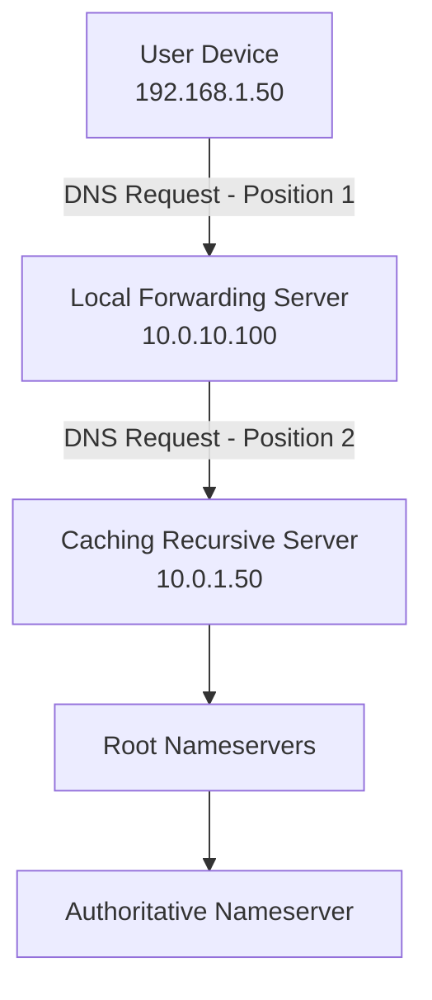

### المشكلة في اختيار نقطة الجمع

| نقطة الجمع | المعلومات المتاحة | المشكلة |
|------------|-----------------|---------|
| عند الـ Client (Position 1) | Source IP الحقيقي للجهاز | أحياناً صعب التطبيق |
| عند الـ Forwarding Server (Position 2) | Source IP هو الـ Forwarding Server، مش الجهاز الأصلي | **مش هتعرف الجهاز اللي عمل الـ Request** |
| عند الـ Caching Server | نفس مشكلة Position 2 | أسوأ |

> [!WARNING]
> لو بتجمع الـ DNS Logs من الـ Caching Server أو من نقطة بعيدة عن الـ Client، **مش هتقدر تعرف الجهاز المصاب الأصلي**. لأن الـ Forwarding Server بيعيد إرسال الـ Request بـ Source IP بتاعه هو.

### أسئلة لازم تجاوب عليها

1. **بتجمع إيه بالظبط؟** فقط الـ Requests ولا الـ Responses برضو؟
   - لو مجمعتش الـ Responses، **مش هتعرف الـ IP اللي الدومين اتحل عليه** — دي معلومة مهمة جداً.

2. **هل بتشوف الـ DNS اللي مش بيمر بسيرفراتك؟**
   - لو المالوير بيعمل DNS Requests مباشرة لسيرفر خارجي، ومش بتلوغ الـ Network Traffic، **مش هتشوفه**.

3. **هل عندك Passive DNS Database خاصة بيك؟**
   - تقدر تحتفظ بـ History من IP-to-Domain Mappings عشان تراجع عليها لو حصل حاجة.

> [!TIP]
> حتى لو مش عارف الجهاز اللي عمل الـ DNS Request، لو عندك الـ IP اللي الدومين اتحل عليه، ابحث في الـ Firewall والـ NetFlow Logs مين اتكلم مع الـ IP ده — على الأرجح هتلاقي الجهاز المصاب.

---

## Connecting IP Addresses to Domains Safely

لما بتحقق في حادثة وعايز تعرف الـ IP اللي Domain معين كان بيحل عليه (أو العكس)، عندك 3 خيارات:

### الخيار 1: استخدم Data عندك إنت

**ده الأفضل دايماً** — ارجع لـ Logs عندك (DNS Logs, Proxy Logs, EDR, Sysmon).

- **السبب**: بيديك الإجابة الصح **وقت الهجوم**، مش الإجابة الحالية اللي ممكن تغيرت.
- **الأمان**: مش بتخلي المهاجم يعرف إنك بتبحث.

### الخيار 2: استخدم Passive DNS من طرف تاني

مواقع زي VirusTotal بتحتفظ بـ History من الـ DNS Resolutions.

> [!WARNING]
> لو دخلت على VirusTotal وبحثت عن Domain أو IP خاص بالمهاجم، **VirusTotal هتسجل إن حد من IP بتاعك بحث عن الدومين ده**. ده ممكن يكشف إنك بتحقق.

### الخيار 3: اعمل DNS Request جديد

استخدم `dig` أو `nslookup` أو موقع زي `centralops.net`.

```bash
# على Linux
dig @8.8.8.8 malicious-domain.com

# أو
nslookup malicious-domain.com
```

> [!IMPORTANT]
> الـ DNS Request الجديد ممكن يفضل في Logs الـ Nameserver بتاع المهاجم. استخدم الخيار ده بس لو مش محتاج تبقى anonymous.

### المقارنة

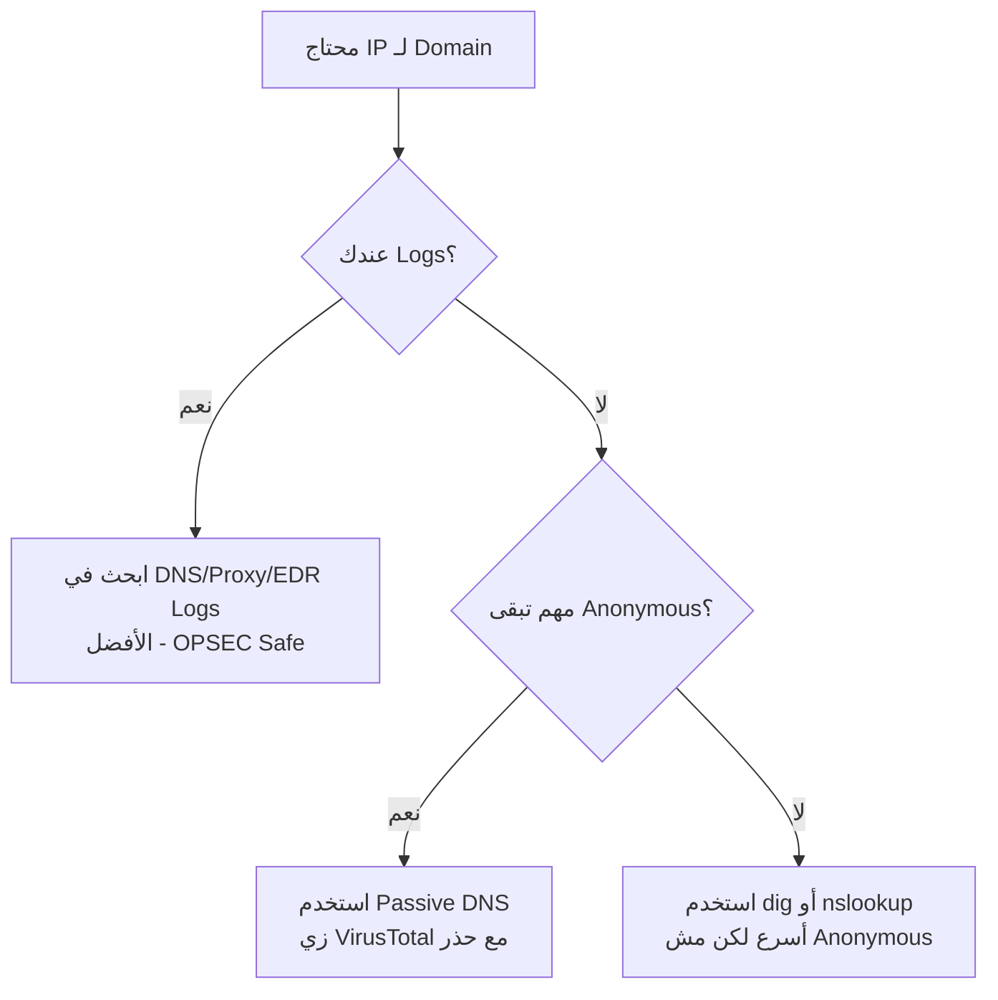

---

## Detection Technique in General

قبل ما نتكلم عن Detection بطرق معينة، في منهجية عامة لازم تفهمها:

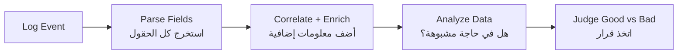

### المثال العملي

لو عندك DNS Log فيه:
```
domain = xyzsite.com
query_type = A
source_ip = 10.0.10.3
```

ده لوحده مش كافي. لو الـ SIEM أضاف عليه:
- **Status**: Newly observed domain (أول مرة شفناه)
- **Top 1M Rank**: Unranked (مش ضمن أشهر مليون موقع)
- **Domain Created**: Less than 7 days ago
- **User**: Kyle (Domain Admin)

فجأة الصورة اتغيرت تماماً — دي علامات خطر واضحة.

> [!NOTE]
> الـ Enrichment هو اللي بيحول الـ Log العادي لـ Alert مفيد. من غير Enrichment، هتغرق في Noise.

---

## Detecting Malicious DNS - Normal DNS Abuse

### TLD Analysis

الـ Top-Level Domain (الجزء الأخير من الدومين زي `.com` أو `.net`) ممكن يبقى مؤشر مهم.

**ليه المهاجمون بيحبوا بعض الـ TLDs؟**

- **مجانية**: زي `.tk`, `.ml`, `.ga`, `.cf` — المهاجم مش محتاج يدفع حاجة.
- **أقل رقابة**: بعض الـ TLDs اللي بتشرف عليها دول صغيرة مش عندها نفس مستوى التحقق.
- **يسهل عمل Lookalike Domains**: عشان يخدعوا الناس.

#### إيه اللي تعمله؟

1. **Alert فوري** على TLDs معروفة بالخطورة زي `.tk`, `.bazar`, `.bit`.
2. **Parse الـ TLD** كـ Field منفصل في الـ SIEM واستخدمه في Threat Hunting.

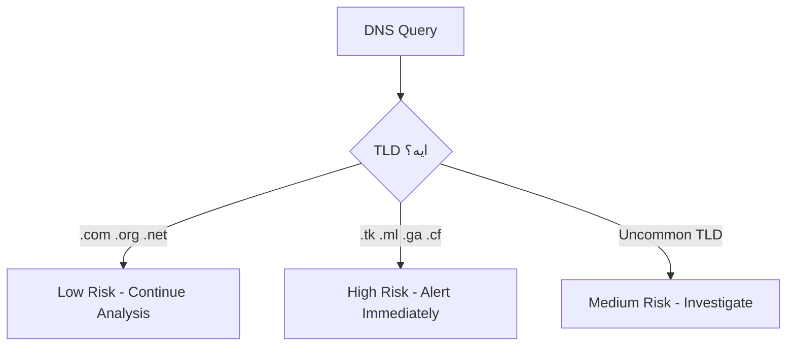

---

### Domain Reputation

**الـ Reputation** هو تقييم الموقع بناءً على سلوكه السابق.

#### أدوات الـ Reputation Check

| الأداة | المميزات |
|--------|---------|
| VirusTotal | يجمع نتائج من 70+ AV Engine |
| Google Safe Browsing | دقيق لمواقع الـ Phishing |
| Talos Intelligence | قوي جداً لـ Email Threats |
| RiskIQ Community | Passive DNS + Context |
| ThreatCrowd | Free Open Source Threat Intel |

#### الاستراتيجية

1. **بلوك فوري**: المواقع اللي عليها Rating خطر أو Medium+ Risk.
2. **Splash Page**: للمواقع Uncategorized — ورقة تحذير للمستخدم قبل ما يكمل.
3. **Visualization**: اعمل Dashboard مين عنده أكتر Hits على المواقع الخطرة.

> [!WARNING]
> **لا تثق بنتيجة الـ Reputation بشكل أعمى**. المهاجمون ممكن يعملوا موقع نظيف، يسجلوه في كل الـ Reputation Services، وبعدين يحولوه لموقع خبيث. الـ Reputation بتاخد وقت عشان تتحدث.

---

### Domain Age

**القاعدة البسيطة**: المواقع الجديدة أكتر احتمالية تكون خبيثة.

المهاجمون بيسجلوا الدومين قريب جداً من موعد الهجوم عشان:
- يقللوا الوقت اللي فيه الدومين ممكن يتم Report عليه.
- يتجنبوا الـ Reputation Databases.

#### إزاي تعرف عمر الدومين؟

```bash
# استخدم whois
$ whois sec450.com | grep -i creation
Creation Date: 2018-06-29T09:38:23Z
```

أو استخدم:
- **Centralops.net**
- **Who.is**
- **domain_stats tool** من Mark Baggett (بيعمله على Scale)

#### الاستراتيجيات

1. **Alert على الدومينات الجديدة**: حدد Threshold مثلاً "أقل من 30 يوم".
2. **New To You Domains**: حتى لو الدومين قديم على الإنترنت، ممكن يكون جديد على شبكتك — الـ SIEM يقدر يبقي History من كل الدومينات اللي زارتها الشبكة.

> [!TIP]
> الـ "New To You" Domains أحياناً أهم من عمر الدومين الفعلي. دومين عمره سنين بس ماحدش في شركتك زاره من قبل، وفجأة زاره أحمد في Finance — ده يستحق تحقيق.

---

### Domain Randomness and Length

**Domain Generation Algorithms (DGA)** هي تقنية بيستخدمها المالوير عشان يعمل اتصال بالـ Command and Control بدون ما يتم Block عليه.

#### كيف تشتغل الـ DGA؟

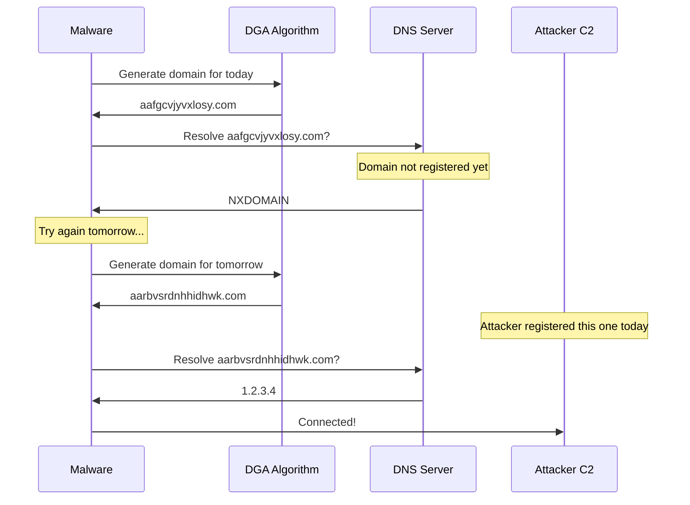

#### لماذا يصعب Block الـ DGA Domains؟

- كل يوم الدومين بيتغير.
- المهاجم بس بيعرف الخوارزمية، فبيسجل الدومين الصح في اليوم الصح.
- بدون ما تعرف الخوارزمية، مش تقدر تعمل Predict للدومين الجاي.

#### إزاي تكتشف الـ DGA؟

- الدومينات العشوائية الطويلة زي: `aafgcvjyvxlosy.com`, `aarbvsrdnhhidhwk.com`
- الـ SIEM يقدر يحسب **Entropy** (درجة العشوائية) للدومين وينبه لو عالية.

> [!NOTE]
> استثناء مهم: الـ CDN Subdomains وبعض الـ Cloud Services بيستخدموا Subdomains تبدو عشوائية، لكن الـ Parent Domain معروف (زي `*.cloudfront.net`). ركز على الـ Parent Domain مش الـ Subdomain.

---

### ASN Enrichment

الـ **Autonomous System Number (ASN)** هو رقم بيعرفك المنظمة اللي بتمتلك مجموعة من الـ IP Addresses.

#### مثال عملي

| الـ Alert | الـ IP | الـ ASN | الاستنتاج |
|---------|--------|---------|-----------|
| ChromeSetup.exe تم تحميله | 216.58.x.x | Google LLC | على الأرجح تحميل حقيقي |
| ChromeSetup.exe تم تحميله | 195.x.x.x | ASN4134 (Top Botnet ASN) | مالوير يتنكر كـ Chrome! |

#### الاستخدام في الـ SIEM

اضيف الـ ASN كـ Enrichment Field لكل الـ Logs اللي فيها External IP، وبعدين اعمل Rule زي:
```
IF file_download AND asn IN (top_10_malicious_asns) THEN Alert
```

---

### Geolocation Enrichment

**الـ Geolocation** بيخلي الـ SIEM يعرف البلد اللي جاي منه الـ Traffic أو رايح عليه.

#### متى يكون مفيد؟

- **المنظمات الإقليمية الصغيرة**: لو شركة محلية مصرية، مافيش سبب تجي منها Connections من روسيا أو كوريا الشمالية على الـ VPN Portal.
- **البروتوكولات الأقل شيوعاً**: Traffic على SSH أو FTP رايح لبلد غير متوقع.

#### متى يكون صعب الاستخدام؟

- الـ CDN Networks (زي Cloudflare وCloudfront) بيكون Traffic بتاعهم منتشر على العالم كله.
- الشركات الكبيرة بيكون عندها موظفين في كل مكان.

> [!NOTE]
> حتى لو الـ Geolocation مش مفيد في الـ Analytics، الـ Maps بيساعد في عرض شغل الـ SOC للإدارة بشكل مرئي ومقنع.

---

## DNS-Based Attacker Tricks

### Unauthorized DNS Server Use

بدلاً من استخدام الـ DNS Server بتاع الشركة (اللي بيتم مراقبته)، المهاجم أو المالوير بيستخدم DNS Server خارجي مباشرة.

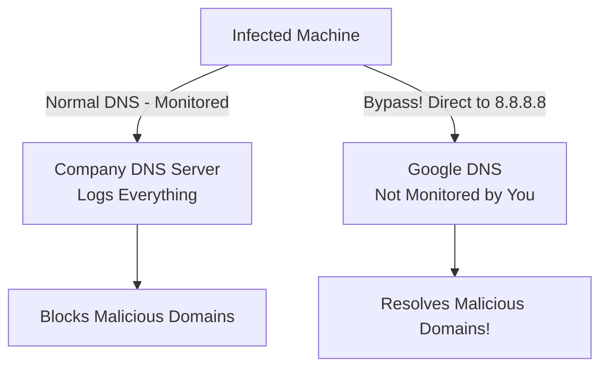

#### الحل

1. **Block**: استخدم الـ Firewall عشان تمنع أي UDP Port 53 Traffic لأي IP غير سيرفرات الـ DNS المعتمدة.
2. **Log**: سجل أي محاولة Outbound على Port 53 لـ IP خارجية.
3. **Alert**: لو في Firewall Deny لـ Port 53 Traffic، ده مشبوه جداً.

#### مصادر الـ Evidence

- **Firewall Logs**: الـ Block أو الـ Allow لحركة الـ DNS.
- **NetFlow/Network Metadata**: UDP Port 53 من داخل الشبكة لخارجها.
- **Host Firewall Logs**: نفس الفكرة لكن على مستوى الجهاز.
- **IDS Alerts**: ممكن عندك Rule للـ External DNS Usage.
- **EDR**: بيسجل كل الـ DNS Traffic بتاع كل Process على الجهاز.

> [!WARNING]
> الـ DoH (DNS over HTTPS) بيخلي الـ DNS Bypass أصعب اكتشافاً لأن الـ Traffic هيبدو زي HTTPS عادي على Port 443.

---

### Shared Hosting Problem

**السيناريو**: شفت Alert إن `cuzb.com` تم حل اسمها، وبعد بحث لقيت إن الـ IP بتاعها هو `91.195.240.79`، ولما بحثت مين تاني بيستضيف على نفس الـ IP لقيت **5,857 موقع تاني**.

**السؤال**: تعمل إيه؟ تبلوك الـ Domain فقط ولا الـ IP (واللي يضر 5,856 موقع تاني)؟

#### الإجابة العملية

1. **ابحث في الـ Logs الأولاً**: مين عندك بيتكلم مع الـ IP ده وعلى أنهي Domain؟
2. **Shared Hosting ≠ مواقع مهمة**: في الغالب المواقع الكبيرة والأعمال الحقيقية مش بتستخدم Shared Hosting.
3. **Block الاتنين**: في الغالب آمن تبلوك الـ Domain والـ IP مع بعض، بعد مراجعة الـ Logs.

> [!TIP]
> **دايماً افحص الـ Logs قبل ما تعمل Block**. جمل زي "هبلوك الـ IP ده دلوقتي" من غير مراجعة ممكن تكسر حاجة مهمة.

---

### DNS Record Modification

ده من أخطر الهجمات — لو المهاجم قدر يوصل للـ DNS Admin بتاعك.

#### هجوم 1: Domain Shadowing

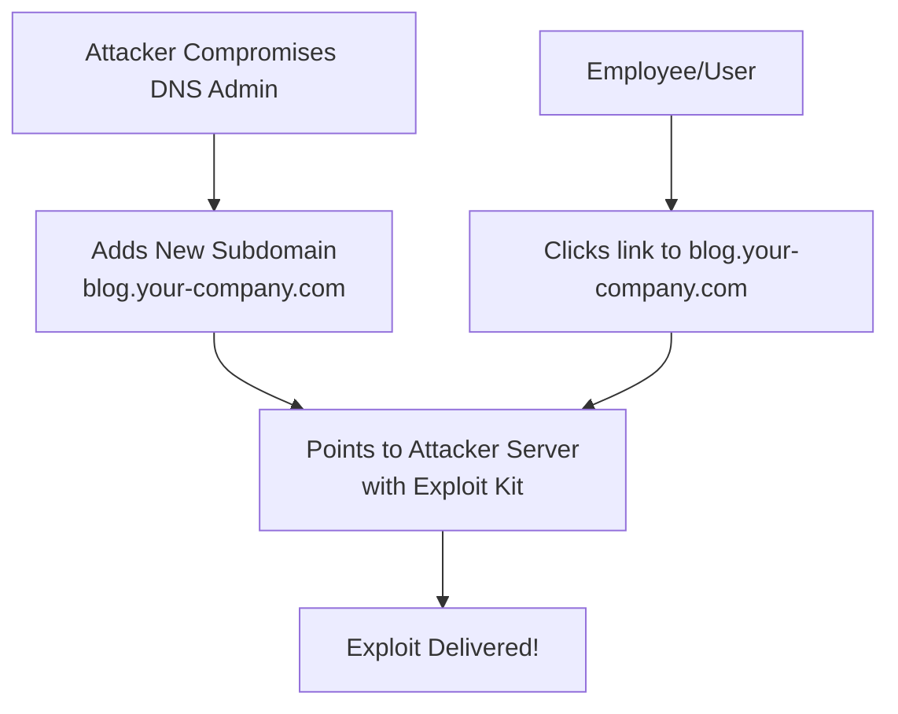

**ليه خطير؟**
- الدومين `blog.your-company.com` يبدو شرعي جداً.
- الموظفين والعملاء هيثقوا فيه أكتر.

#### هجوم 2: Traffic Interception (الأخطر)

1. المهاجم يعمل **Clone** لموقعك (VPN Portal مثلاً) على سيرفره.
2. يغير الـ **A Record** لدومين شركتك عشان يشاور على سيرفره.
3. الموظفين بيدخلوا Credentials على الموقع الوهمي — المهاجم بيوصلها للموقع الحقيقي (Transparent Proxy) فالـ Login بيشتغل.
4. المهاجم بيسرق الـ Credentials من غير ما حد يحس.

**لماذا صعب الاكتشاف؟**
- المهاجم يقدر يحصل على **TLS Certificate حقيقي** لدومينك لو هو مسيطر على الـ DNS (لأن الـ Certificate Authority بتتحقق عن طريق DNS TXT Record).

#### الحماية

- **Multi-Factor Authentication** لكل من يقدر يعدل الـ DNS Records.
- **DNS Change Detection** — Alert فوري لأي تغيير في الـ DNS Records.
- **DNS CAA Records** — تحديد الـ Certificate Authorities المسموح لها تصدر شهادات لدومينك.

---

### DNS Tunneling

**الفكرة الأساسية**: الـ DNS Protocol بيسمح بإرسال نص واستقبال نص. المهاجم ممكن يستخدم ده عشان يرسل Data مشفرة في الـ DNS Queries بدلاً من IP Addresses.

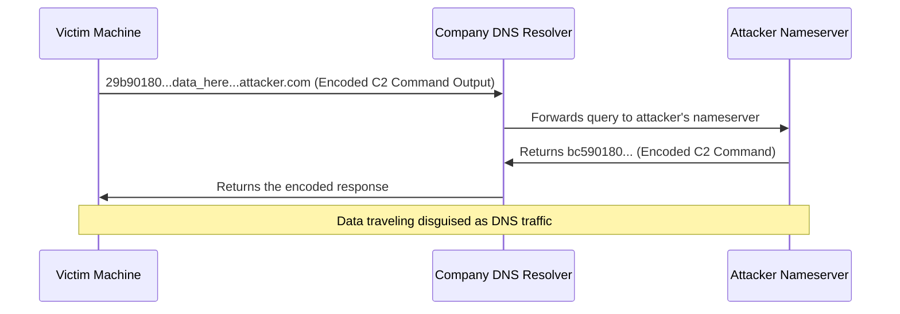

#### ليه خطير جداً؟

- **دايماً يشتغل**: كل شبكة لازم تسمح بالـ DNS Traffic — مش ممكن تبلوكه خالص.
- **حتى لو بلوكت External DNS**: الـ Tunneling يشتغل عن طريق الـ DNS Resolver بتاع شركتك اللي بيعمل recursion للـ Internet.

#### أنواع الـ DNS Tunneling

| النوع | الوصف |
|-------|-------|
| CNAME Tunneling | Data في الـ CNAME Query/Response |
| TXT Record Tunneling | بيستخدم TXT Records (الأكثر شيوعاً) |
| NULL Record Tunneling | يستخدم NULL query type (نادر ومشبوه جداً) |

#### كيف تكتشف الـ DNS Tunneling؟

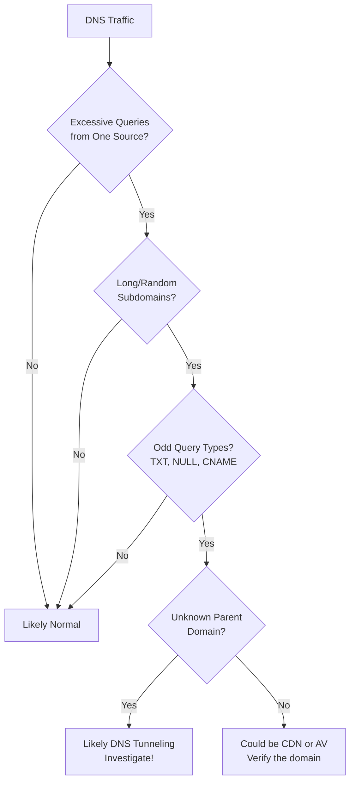

#### علامات الـ DNS Tunneling

- كميات كبيرة من الـ Queries لنفس الدومين من جهاز واحد.
- Subdomains طويلة وتبدو مشفرة (Base64, Hex).
- استخدام Query Types غير شائعة زي NULL.
- Encoded Data في الـ TXT Responses.

#### False Positives شائعة

- **Sophos AV**: بيستخدم DNS Tunneling لعمل File Reputation Checks.
- **CDN Services**: زي CloudFront عندها Subdomains تبدو عشوائية.
- **DNS Hijacking Tests**: أدوات الاختبار الأمني.

**الفرق**: الـ False Positives في الغالب Parent Domain معروف وحجم الـ Traffic معقول.

---

### Blockchain DNS

المهاجمون بيستخدموا الـ Blockchain DNS عشان يعملوا دومينات **مستحيل تتم إزالتها** من أي جهة رقابية.

#### المشكلة للمدافعين

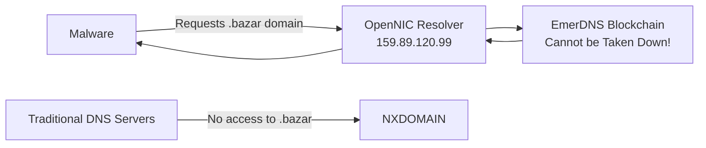

#### الـ TLDs الخاصة بالـ Blockchain DNS

| TLD | الهدف الأصلي |
|-----|------------|
| `.bazar` | Marketplace (كثير الاستخدام في المالوير) |
| `.coin` | Digital Currency |
| `.lib` | Knowledge and Freedom |
| `.emc` | Emercoin Project |

#### كيف تحمي نفسك؟

- راقب أي DNS Requests لـ TLDs غير معتادة زي `.bazar`.
- بلوك أي استخدام لـ OpenNIC Resolvers في شبكتك.
- ابحث عن Endpoints بتحاول تتصل بـ Non-standard DNS Servers.

---

### Internationalized Domain Names IDNs

**الهجوم**: بيستخدموا حروف من لغات تانية تشبه الحروف الإنجليزية بالظبط عشان يعملوا دومين يبدو زي دومين حقيقي.

#### المثال الكلاسيكي

| الدومين المرئي | الدومين الحقيقي | الحرف المختلف |
|--------------|---------------|-------------|
| `youtube.com` | `xn--yutube-wqf.com` | الـ "о" حرف Cyrillic مش English |
| `facebook.com` | `xn--fcebook-xxx.com` | الـ "a" ممكن يكون Cyrillic |

الحروف التلاتة تبدو متطابقة:
- **О** (Cyrillic)
- **O** (English)
- **Ο** (Greek)

ده بيتسمى **Homoglyph Attack**.

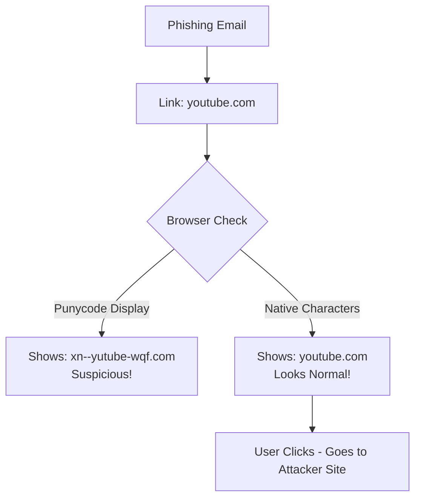

#### الـ Punycode

الـ DNS بيحول الـ IDN لـ Punycode (ASCII فقط) وده اللي بيظهر في الـ Logs.

**مميز الـ Punycode**: دايماً بيبدأ بـ `xn--`

```
xn--yutube-wqf.com
^   ^      ^ ^
|   |      | |
prefix      | Encoded non-ASCII chars
        ASCII chars
```

#### إزاي تكتشفه؟

ابحث في الـ DNS Logs على أي دومين بيبدأ بـ `xn--`:

```bash
# في SIEM Query
dns.query: "xn--*"
```

> [!WARNING]
> مش كل IDN Domain خبيث. ناس كتير بيستخدموا IDNs لأسباب شرعية (لغات غير إنجليزية). لكن لو الدومين يشبه Brand معروف زي `xn--yutube-xxx.com`، ده مريب.

---

## The Future of DNS - DoT DoH DNSSEC

الـ DNS بيتطور ومعاه مشاكل جديدة للـ Blue Team.

### المقارنة بين الأنواع

| البروتوكول | البورت | التشفير | سهل البلوك؟ | التأثير على SOC |
|-----------|--------|---------|------------|-----------------|
| DNS Classic | UDP 53 | لا | نعم | Full visibility |
| DNS over TLS (DoT) | TCP 853 | نعم | نعم | Hard to see content |
| DNS over HTTPS (DoH) | TCP 443 | نعم | صعب جداً | Invisible in HTTPS traffic |
| DNSSEC | أي | Integrity فقط | لا يُبلوك | لا يضيف visibility |

### DNS over HTTPS (DoH) - التحدي الأكبر

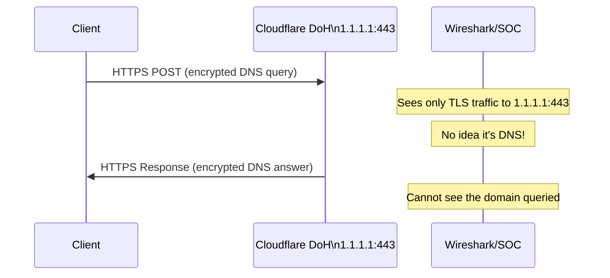

#### كيف تتعامل مع الـ DoH كـ Blue Team؟

1. **Decrypt (الأفضل)**: استخدم TLS Inspection عشان تشوف الـ DoH Traffic.
2. **Disable**: اعمل DNS Canary Domains — متصفحات زي Firefox بتفحصهم وبتوقف الـ DoH لو لقيت الـ Record ده.
3. **Log**: استخدم Internal DoH Resolver بيسجل كل الـ Requests.
4. **Block IPs**: بلوك الـ IPs المعروفة لخدمات الـ DoH زي `1.1.1.1`, `8.8.8.8`, `9.9.9.9` على Port 443.

> [!IMPORTANT]
> الـ DoH في TLS 1.3 يبقى أصعب بكتير في الاكتشاف لأن حتى الـ Certificate Details مش هيبانوا من غير Decryption. المستقبل بيتطلب TLS Inspection كـ Requirement مش Option.

### كيف يبدو الـ DoH في Wireshark؟

لو قدرت تعمل TLS Decryption، الـ DoH هيظهر كـ:
- **HTTP/2 POST Request** (مش UDP DNS).
- الـ MIME Type: `application/dns-message`.
- الـ Transaction ID: `0x0000` (مش زي الـ DNS العادي).
- Headers منفصلة عن الـ Data (خاصية الـ HTTP/2).

---

## Summary

### ملخص طرق اكتشاف الـ DNS الخبيثة

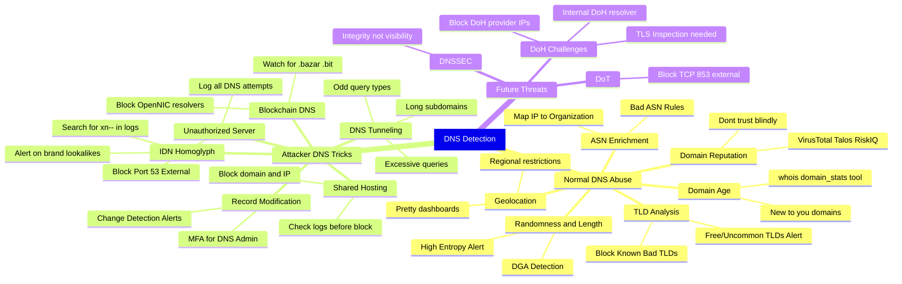

### المفاهيم الأساسية

| المفهوم | التعريف السريع |
|---------|--------------|
| Passive DNS | استخدام سجلات DNS موجودة مسبقاً بدلاً من عمل Queries جديدة |
| DGA | Domain Generation Algorithm - مالوير بيولد دومينات عشوائية يومياً |
| DNS Tunneling | تهريب Data خلال الـ DNS Protocol |
| IDN | Internationalized Domain Name - دومينات بحروف غير إنجليزية |
| Punycode | ترميز ASCII للـ IDN، بيبدأ بـ `xn--` |
| Homoglyph Attack | استخدام حروف من لغات تانية تشبه الإنجليزية للتضليل |
| DoH | DNS over HTTPS - DNS مشفر على Port 443 |
| DoT | DNS over TLS - DNS مشفر على Port 853 |
| DNSSEC | DNS Security Extensions - يضمن Integrity مش Confidentiality |
| ASN | Autonomous System Number - رقم يعرف مالك مجموعة IPs |

---

